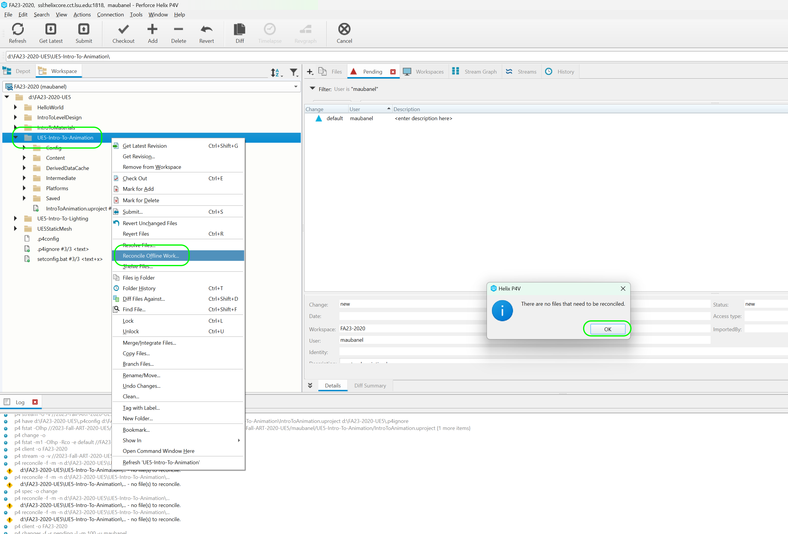

### Add Animations

[previous](../fixing-model/README.md#user-content-fixing-mixamo-models) • [home](../README.md#user-content-ue4-animations) • [next](../character-bp/README.md#user-content-setting-up-character-blueprint)

Lets add the animations we downloaded to the game and map them to the skeleton so that they drive the skeletal mesh.

---

##### `Step 1.`\|`ITA`|:small_blue_diamond:

Add to the Content Browser  a new sub-folder called `Content | Animations`. *Drag and drop* the 6 animations you downloaded to the new **Animations** folder. Now the **FBX Import Options** appear. *Select* the **Skeleton** tab and select the skeleton asset we just downloaded. There should only be one option.

Once you select the skeleton press the <kbd>Import All</kbd> button leaving all the other options at their default setting.

##### `Step 2.`\|`FHIU`|:small_blue_diamond: :small_blue_diamond: 

Now this will take a while as it is solving the animation to this skeleton.

##### `Step 3.`\|`ITA`|:small_blue_diamond: :small_blue_diamond: :small_blue_diamond:

Double click each animation then watch them. Rename the animation appropriately. I renamed the animations I selected to `CreepWalking`, `Idle`, `Running`, `SpecialIdle`, `Sprint` and `Walking`.

##### `Step 4.`\|`ITA`|:small_blue_diamond: :small_blue_diamond: :small_blue_diamond: :small_blue_diamond:

Right click on the **Animations** folder and select **Fix Up Redirectors** to clean up the work done.

##### `Step 5.`\|`ITA`| :small_orange_diamond:

Now the animation viewer has the new names that match the animation we are playing!

##### `Step 6.`\|`ITA`| :small_orange_diamond: :small_blue_diamond:

Select the **File | Save All** then press the <kbd>Revision Control</kbd> button and select **Submit Content**.  If you are prompted, select **Check Out** for all items that are not checked out of source control. Update the **Changelist Description** message and with the latest changes. Make sure all the files are correct and press the <kbd>Submit</kbd> button. A confirmation will pop up on the bottom right with a message about a changelist was submitted with a commit number. Quit Unreal and make sure your **Pending** tab in **P4V** is empty. **Submit** any work that is still in the editor.

##### `Step 7.`\|`ITA`| :small_orange_diamond: :small_blue_diamond: :small_blue_diamond:

Sometimes not all files get submitted to Unreal especially for files that don't show up in the editor.  It is good practice one you submit in **Unreal** and quit the game to right click on the top most project folder and select **Reconcile Offline Work...**.

This will either give a message saying ther is nothing to reconcile or bring up a tab.  Make sure that these are **NOT** files in the **Intermediate** and **Saved** folders as these should be ignored from the `.p4ignore`.

If the files are in **Content** or **Configuration** then press the <kbd>Reconcile</kbd> button.  Then submit the changes with a message and press the <kbd>Submit</kbd> button.

<!--  -->

| [previous](../fixing-model/README.md#user-content-fixing-mixamo-models)| [home](../README.md#user-content-ue4-animations) | [next](../character-bp/README.md#user-content-setting-up-character-blueprint)|
|---|---|---|
