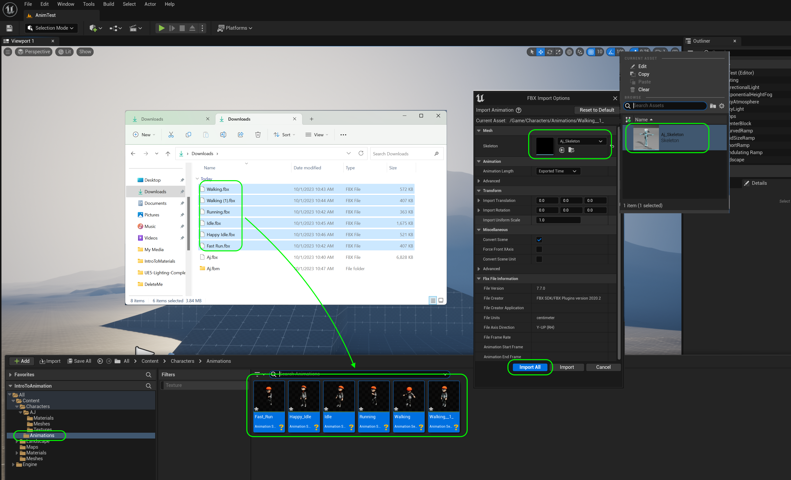
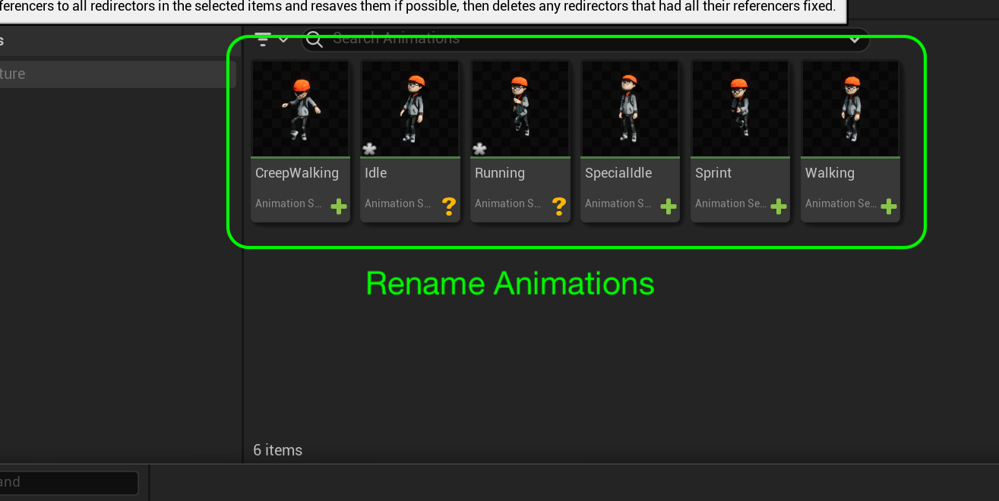

### Add Animations

[previous](../fixing-model/README.md#user-content-fixing-mixamo-models) • [home](../README.md#user-content-ue4-animations) • [next](../character-bp/README.md#user-content-setting-up-character-blueprint)

Lets add the animations we downloaded to the game and map them to the skeleton so that they drive the skeletal mesh.

---

##### `Step 1.`\|`ITA`|:small_blue_diamond:

Add to the Content Browser's Character | AJ folder, a new sub-folder called `Animations`. *Drag and drop* the 6 animations you downloaded to the new **Animations** folder. Now the **FBX Import Options** appear. *Select* the **Skeleton** tab and select the skeleton asset we just downloaded. There should only be one option.

Once you select the skeleton press the <kbd>Import All</kbd> button leaving all the other options at their default setting.

##### `Step 2.`\|`FHIU`|:small_blue_diamond: :small_blue_diamond: 

##### `Step 3.`\|`ITA`|:small_blue_diamond: :small_blue_diamond: :small_blue_diamond:

##### `Step 4.`\|`ITA`|:small_blue_diamond: :small_blue_diamond: :small_blue_diamond: :small_blue_diamond:

Now this will take a while as it is solving the animation to this skeleton.

##### `Step 5.`\|`ITA`| :small_orange_diamond:
Double click each animation then watch them. Rename the animation appropriately. I renamed the animations I selected to `CreepWalk`, `Idle`, `Run`, `SpecialIdle`, `Sprint` and `Walk`.

##### `Step 6.`\|`ITA`| :small_orange_diamond: :small_blue_diamond:

Now the animation viewer has the new names that match the animation we are playing!

##### `Step 7.`\|`ITA`| :small_orange_diamond: :small_blue_diamond: :small_blue_diamond:

Select the **File | Save All** then quit UE5.   Go to **P4V** and go the top project folder (the one that holds the `.uproject` file and **Content** folder) and press the <kbd>+Add</kbd> then <kbd>OK</kbd> button.  This makes sure any files that Unreal didn't add get added to source control. Press the <kbd>Submit</kbd> button and enter a message explaining the work done.  Press <kbd>Submit</kbd>.

<!--  -->

| [previous](../fixing-model/README.md#user-content-fixing-mixamo-models)| [home](../README.md#user-content-ue4-animations) | [next](../character-bp/README.md#user-content-setting-up-character-blueprint)|
|---|---|---|
