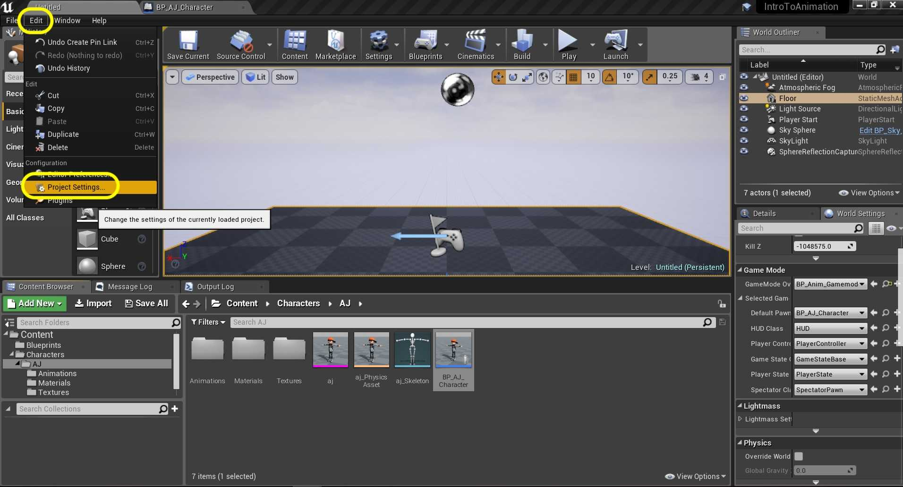

### Adding Controls

[previous](../character-bp/README.md#user-content-setting-up-character-blueprint) • [home](../README.md#user-content-ue4-animations) • [next](../animation-blend/README.md#user-content-animation-blend-space)

Lets add the ability to move the character using a special actor component.

 

---

##### `Step 1.`\|`ITA`|:small_blue_diamond:

Lets go to the **Edit | Project Settings** to add some controller input into our game. 

##### `Step 2.`\|`FHIU`|:small_blue_diamond: :small_blue_diamond: 

##### `Step 3.`\|`ITA`|:small_blue_diamond: :small_blue_diamond: :small_blue_diamond:

##### `Step 4.`\|`ITA`|:small_blue_diamond: :small_blue_diamond: :small_blue_diamond: :small_blue_diamond:

##### `Step 5.`\|`ITA`| :small_orange_diamond:

##### `Step 6.`\|`ITA`| :small_orange_diamond: :small_blue_diamond:

##### `Step 7.`\|`ITA`| :small_orange_diamond: :small_blue_diamond: :small_blue_diamond:

##### `Step 8.`\|`ITA`| :small_orange_diamond: :small_blue_diamond: :small_blue_diamond: :small_blue_diamond:

##### `Step 9.`\|`ITA`| :small_orange_diamond: :small_blue_diamond: :small_blue_diamond: :small_blue_diamond: :small_blue_diamond:

##### `Step 10.`\|`ITA`| :large_blue_diamond:

##### `Step 11.`\|`ITA`| :large_blue_diamond: :small_blue_diamond: 

##### `Step 12.`\|`ITA`| :large_blue_diamond: :small_blue_diamond: :small_blue_diamond: 

##### `Step 13.`\|`ITA`| :large_blue_diamond: :small_blue_diamond: :small_blue_diamond:  :small_blue_diamond: 

##### `Step 14.`\|`ITA`| :large_blue_diamond: :small_blue_diamond: :small_blue_diamond: :small_blue_diamond:  :small_blue_diamond: 

##### `Step 15.`\|`ITA`| :large_blue_diamond: :small_orange_diamond: 

##### `Step 16.`\|`ITA`| :large_blue_diamond: :small_orange_diamond:   :small_blue_diamond: 

##### `Step 17.`\|`ITA`| :large_blue_diamond: :small_orange_diamond: :small_blue_diamond: :small_blue_diamond:

##### `Step 18.`\|`ITA`| :large_blue_diamond: :small_orange_diamond: :small_blue_diamond: :small_blue_diamond: :small_blue_diamond:

##### `Step 19.`\|`ITA`| :large_blue_diamond: :small_orange_diamond: :small_blue_diamond: :small_blue_diamond: :small_blue_diamond: :small_blue_diamond:

##### `Step 20.`\|`ITA`| :large_blue_diamond: :large_blue_diamond:

##### `Step 21.`\|`ITA`| :large_blue_diamond: :large_blue_diamond: :small_blue_diamond:

___

| [previous](../character-bp/README.md#user-content-setting-up-character-blueprint)| [home](../README.md#user-content-ue4-animations) | [next](../animation-blend/README.md#user-content-animation-blend-space)|
|---|---|---|
