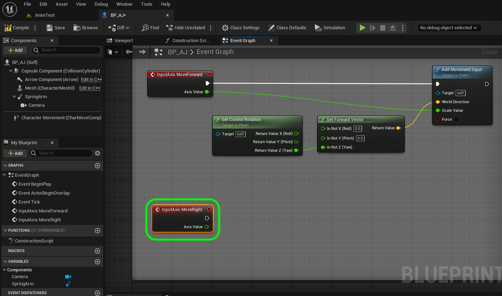
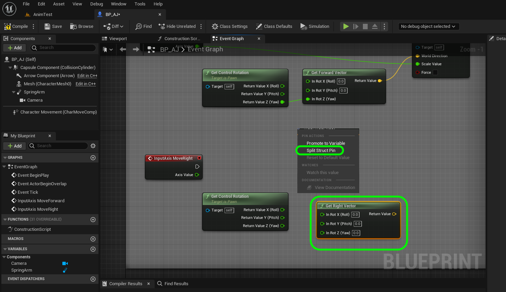

### Adding Controls

[previous](../character-bp/README.md#user-content-setting-up-character-blueprint) • [home](../README.md#user-content-ue4-animations) • [next](../animation-blend/README.md#user-content-animation-blend-space)

Lets add the ability to move the character using a special actor component.

 

---

##### `Step 1.`\|`ITA`|:small_blue_diamond:

Lets go to the **Edit | Project Settings** to add some controller input into our game. 

##### `Step 2.`\|`FHIU`|:small_blue_diamond: :small_blue_diamond: 

Fill in the appropriate **Description** information. Fill in the **Copyright Notice** section.  I am using [MIT License](https://opensource.org/licenses/MIT) and publishing it as Open Source.

##### `Step 3.`\|`ITA`|:small_blue_diamond: :small_blue_diamond: :small_blue_diamond:

Go to **Engine | Input** and press the <kbd>+</kbd> button next to **Axis Mappings**.

##### `Step 4.`\|`ITA`|:small_blue_diamond: :small_blue_diamond: :small_blue_diamond: :small_blue_diamond:

Call it `MoveForward` and press the **+** button next to it four times. Assign the following buttons by pressing **+** next to **MoveForward**: `Keyboard | W`, `Keyboard | Up`, `Keyboard | S`, `Keyboard | Down`. Set the **Scale** for **W** and **Up** at `1.0` and the **Scale** for **S** and **Down** to `-1.0`.

##### `Step 5.`\|`ITA`| :small_orange_diamond:

*Press* the **+** button next to **Axis Mappings** and call the second mapping `MoveRight`. Press the **+** button next to it three times. *Assign* the following buttons: `D`, `Right`, `A`, `Left`. Set the **Scale** for **D** and **Right** at `1.0` and the Scale for **A** and **Left** to `-1.0`.

##### `Step 6.`\|`ITA`| :small_orange_diamond: :small_blue_diamond:

Open **BP_AJ_Character** blueprint and go to the **Event Graph**. *Delete* the existing nodes. Add a **Axis Events | MoveForward** node so we can add physics when the up, down, W or S button are pressed on the keyboard.

##### `Step 7.`\|`ITA`| :small_orange_diamond: :small_blue_diamond: :small_blue_diamond:

Lets *add* a **Get Control Rotation** node to get the controller rotation for the player controlled pawn. This returns a rotator.

##### `Step 8.`\|`ITA`| :small_orange_diamond: :small_blue_diamond: :small_blue_diamond: :small_blue_diamond:

*Right click* on the **Return Value** pin and select **Split Struct Pin**. 

##### `Step 9.`\|`ITA`| :small_orange_diamond: :small_blue_diamond: :small_blue_diamond: :small_blue_diamond: :small_blue_diamond:

*Add* a **Get Forward Vector** pin to translate the rotator to a vector. Right click the **In Rot** input and select **Split Struct Pin**.  Then connect the **Return Value Z (Yaw)** to the **In Rot Z(Yaw)** of the **Get Forward Vector** pin.

##### `Step 10.`\|`ITA`| :large_blue_diamond:

*Pull off* of the **Return Value** pin and *select* the **Add Movement Input** node. *Connect* the output execution pin from the **InputAxis MoveForward** node to the input execution pin of the **Add Movement Input** node. Take the output of the **Get Forward Vector | Return Value** pin to the **Add Movement Input | World Direction** pin. *Connect* the **InputAxis MoveForward | Axis Value** pin to the **Scale Value** pin of the **Add Movement** Input node.

##### `Step 11.`\|`ITA`| :large_blue_diamond: :small_blue_diamond: 

*Add* a comment to all these nodes called `Core Movement` and press the <kbd>Compile</kbd> button:

##### `Step 12.`\|`ITA`| :large_blue_diamond: :small_blue_diamond: :small_blue_diamond: 

Now go into the game and press the up and down or W and S key. We should be moving forward and backwards!

https://user-images.githubusercontent.com/5504953/195997035-c84060cd-fd76-42c9-b672-fa3dca5c0e11.mp4

##### `Step 13.`\|`ITA`| :large_blue_diamond: :small_blue_diamond: :small_blue_diamond:  :small_blue_diamond: 

Return to **BP_AJ** and *add* a **Axis Events | MoveRight** node.

##### `Step 14.`\|`ITA`| :large_blue_diamond: :small_blue_diamond: :small_blue_diamond: :small_blue_diamond:  :small_blue_diamond: 

Copy and paste the **Get Control Rotation** node. and place it next to **Move Right**.

##### `Step 15.`\|`ITA`| :large_blue_diamond: :small_orange_diamond: 

Now *add* a **Get Right Vector** node.  Right click the **In Rot** input and select **Split Struct Pin**.

##### `Step 16.`\|`ITA`| :large_blue_diamond: :small_orange_diamond:   :small_blue_diamond: 

##### `Step 17.`\|`ITA`| :large_blue_diamond: :small_orange_diamond: :small_blue_diamond: :small_blue_diamond:

##### `Step 18.`\|`ITA`| :large_blue_diamond: :small_orange_diamond: :small_blue_diamond: :small_blue_diamond: :small_blue_diamond:

Now lets add the movement for going left and right in the game. Go back to the **BP_AJ_Character** blueprint and go to the **Event Graph**. *Pull off* the **Make Rotator | Return Value** pin and now *select* **Get Right Vector** node. We will use this vector to turn left and right.

##### `Step 19.`\|`ITA`| :large_blue_diamond: :small_orange_diamond: :small_blue_diamond: :small_blue_diamond: :small_blue_diamond: :small_blue_diamond:

*Pull off* the **Return Value** pin and select another **Add Movement Input** node.

##### `Step 20.`\|`ITA`| :large_blue_diamond: :large_blue_diamond:

##### `Step 21.`\|`ITA`| :large_blue_diamond: :large_blue_diamond: :small_blue_diamond:

*Connect* the output execution pin to the newly created **Add Movement Input** node.

##### `Step 22.`\|`ITA`| :large_blue_diamond: :large_blue_diamond: :small_blue_diamond: :small_blue_diamond:

*Connect* the **Axis Value** output pin from the **InputAxis MoveRight** node to the **Scale Value** input pin on the new **Add Movement Input** node:

##### `Step 23.`\|`ITA`| :large_blue_diamond: :large_blue_diamond: :small_blue_diamond: :small_blue_diamond: :small_blue_diamond:

Now *press* the <kbd>Compile</kbd> button and *play* the game. The character should now move in four directions. Now all we are doing in the game is moving this **Capsule** component around the screen. The player animation is just an animation blueprint that runs based on the vector of the motion of the player.

https://user-images.githubusercontent.com/5504953/132963054-4d3cac78-d095-4adb-9056-79e24404dba3.mp4

##### `Step 24.`\|`ITA`| :large_blue_diamond: :large_blue_diamond: :small_blue_diamond: :small_blue_diamond: :small_blue_diamond: :small_blue_diamond:

Now go back and forth between the player blueprint and the game and adjust the spring arm so you can see the entire player and that the camera is above the player looking down. I *adjusted* the **Target Arm Length** to `550.0`.

##### `Step 25.`\|`ITA`| :large_blue_diamond: :large_blue_diamond: :small_orange_diamond:

Now your game should look like this. Next up we will create a blend space to have the character move from idle to running.

https://user-images.githubusercontent.com/5504953/132963088-80c197e7-9901-4d1f-8737-ca08454be213.mp4

##### `Step 26.`\|`ITA`| :large_blue_diamond: :large_blue_diamond: :small_orange_diamond: :small_blue_diamond:

Select the **File | Save All** then press the <kbd>Source Control</kbd> button and select **Submit to Source Control...**.  Enter a **Changelist Description** and then press <kbd>Submit</kbd>.  Open up **GitHub Desktop** and select **Push origin** to update the server with the latest changes.

___

<!--  -->

| [previous](../character-bp/README.md#user-content-setting-up-character-blueprint)| [home](../README.md#user-content-ue4-animations) | [next](../animation-blend/README.md#user-content-animation-blend-space)|
|---|---|---|
