### Adding Controls

[previous](../character-bp/README.md#user-content-setting-up-character-blueprint) • [home](../README.md#user-content-ue4-animations) • [next](../animation-blend/README.md#user-content-animation-blend-space)

Lets add the ability to move the character using a special actor component.

 

---

##### `Step 1.`\|`ITA`|:small_blue_diamond:

Lets go to the **Edit | Project Settings** to add some controller input into our game. 

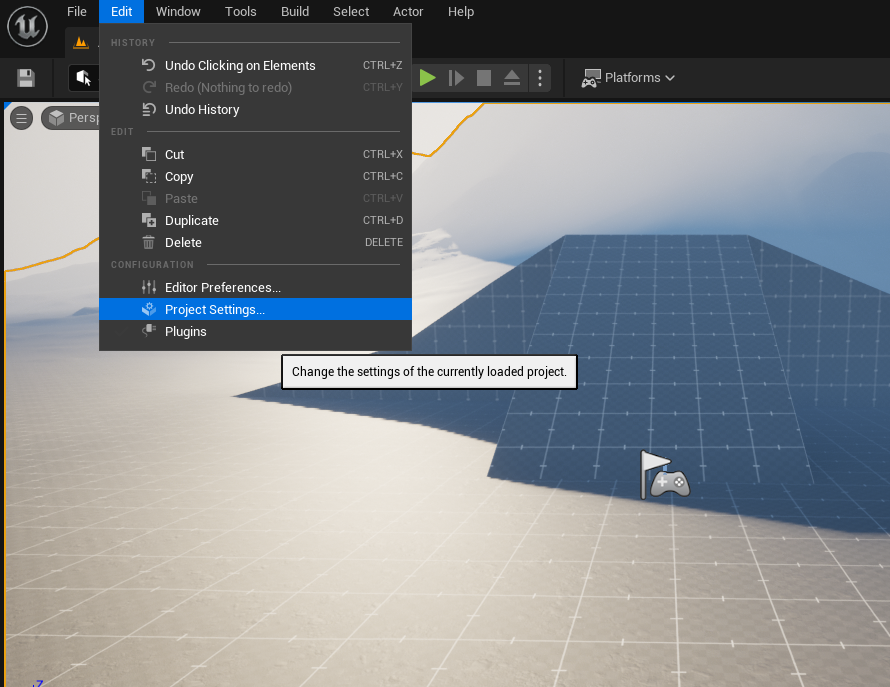

##### `Step 2.`\|`FHIU`|:small_blue_diamond: :small_blue_diamond: 

Fill in the appropriate **Description** information. Fill in the **Copyright Notice** section.  I am using [MIT License](https://opensource.org/licenses/MIT) and publishing it as Open Source.

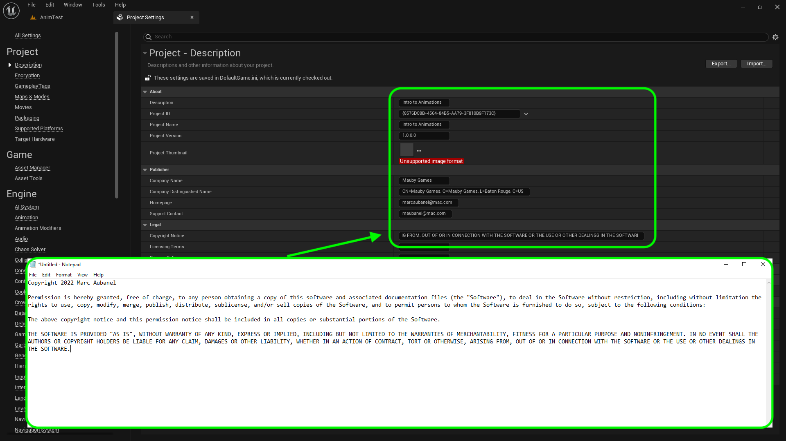

##### `Step 3.`\|`ITA`|:small_blue_diamond: :small_blue_diamond: :small_blue_diamond:

Go to **Engine | Input** and press the <kbd>+</kbd> button next to **Axis Mappings**.

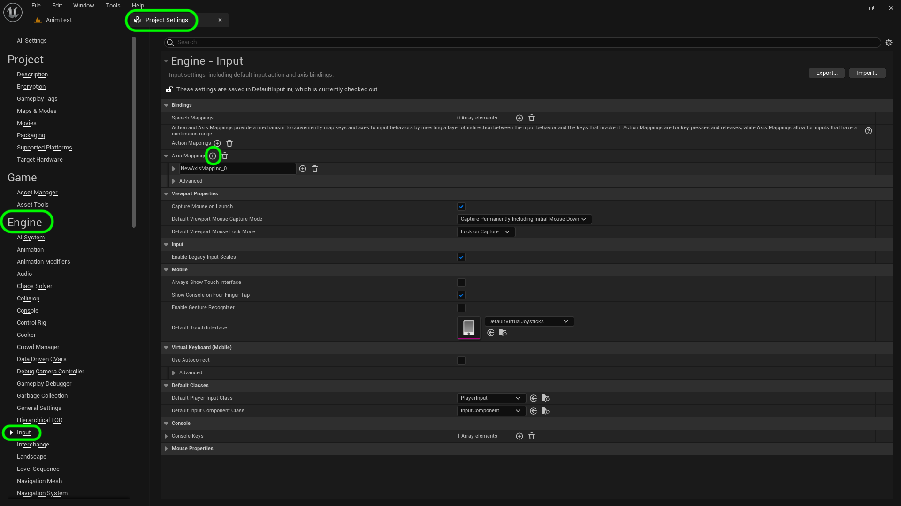

##### `Step 4.`\|`ITA`|:small_blue_diamond: :small_blue_diamond: :small_blue_diamond: :small_blue_diamond:

Call it `MoveForward` and press the **+** button next to it four times. Assign the following buttons by pressing **+** next to **MoveForward**: `Keyboard | W`, `Keyboard | Up`, `Keyboard | S`, `Keyboard | Down`. Set the **Scale** for **W** and **Up** at `1.0` and the **Scale** for **S** and **Down** to `-1.0`.

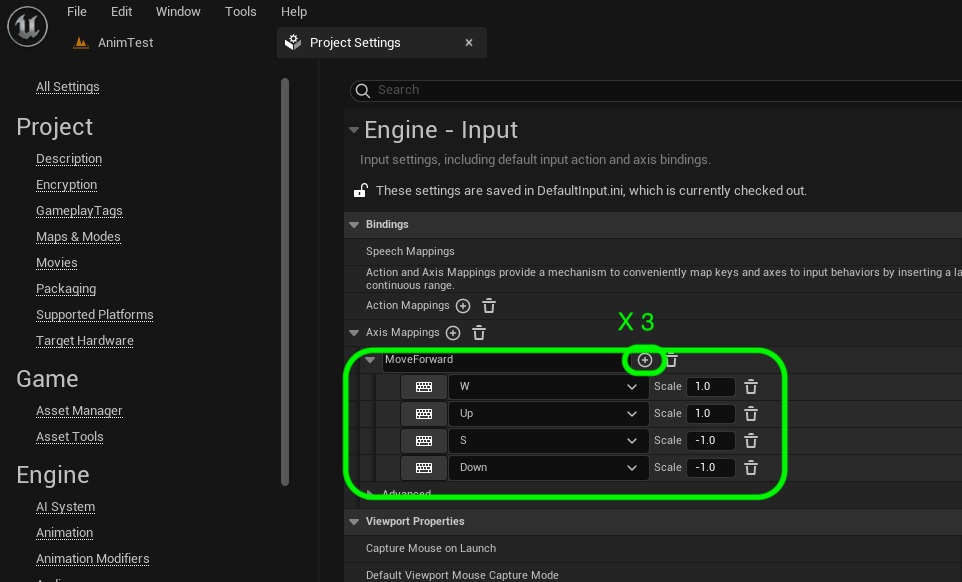

##### `Step 5.`\|`ITA`| :small_orange_diamond:

*Press* the **+** button next to **Axis Mappings** and call the second mapping `MoveRight`. Press the **+** button next to it four times. *Assign* the following buttons: `D`, `Right`, `A`, `Left`. Set the **Scale** for **D** and **Right** at `1.0` and the Scale for **A** and **Left** to `-1.0`.

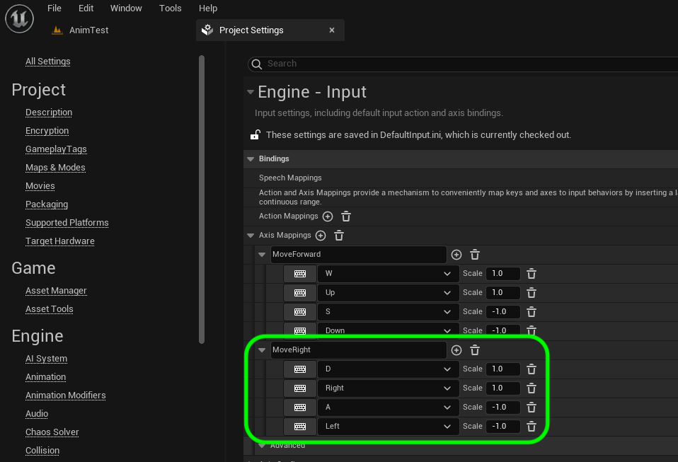

##### `Step 6.`\|`ITA`| :small_orange_diamond: :small_blue_diamond:

Open **BP_AJ_Character** blueprint and go to the **Event Graph**. *Delete* the existing nodes. Add a **Axis Events | MoveForward** node so we can add physics when the up, down, W or S button are pressed on the keyboard.

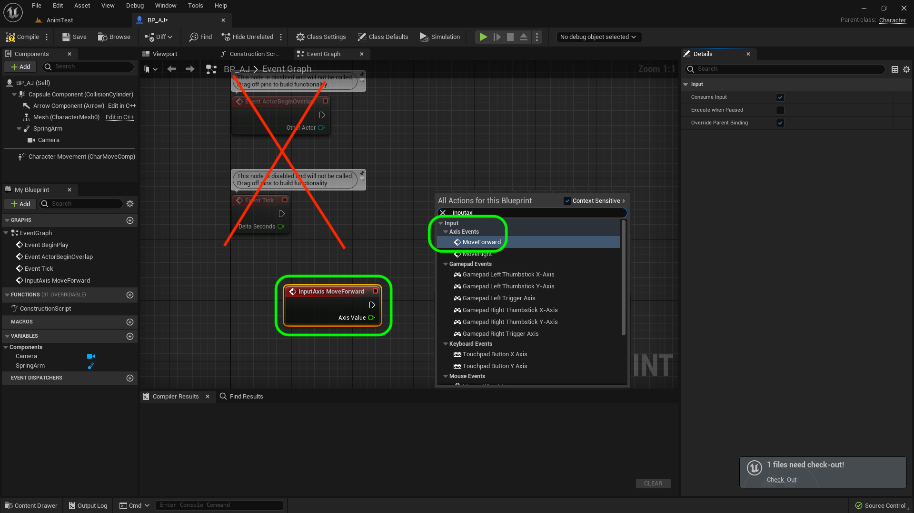

##### `Step 7.`\|`ITA`| :small_orange_diamond: :small_blue_diamond: :small_blue_diamond:

Lets *add* a **Get Control Rotation** node to get the controller rotation for the player controlled pawn. This returns a vector (X, Y, Z).

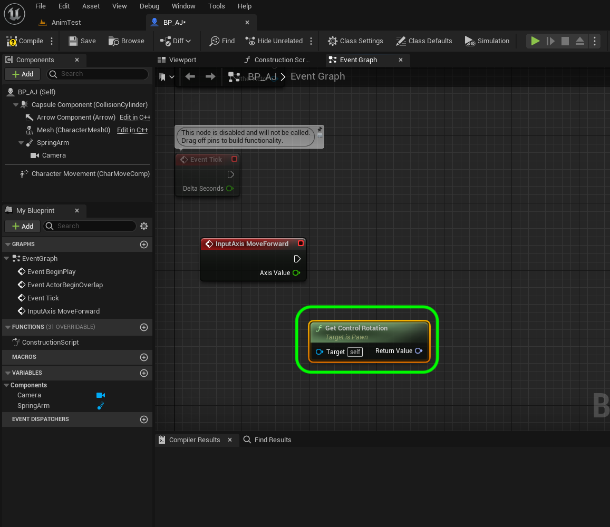

##### `Step 8.`\|`ITA`| :small_orange_diamond: :small_blue_diamond: :small_blue_diamond: :small_blue_diamond:

*Right click* on the **Return Value** pin and select **Split Struct Pin**. We are going to be controlling the player rotating around the **Z** axis or **Yaw**. *Pull* from the **Return Value Z(Yaw)** pin and select a **Make Rotator** node:

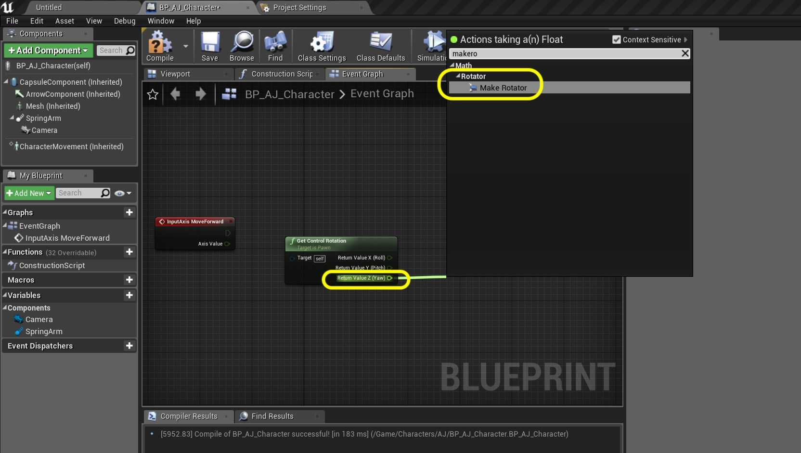

##### `Step 9.`\|`ITA`| :small_orange_diamond: :small_blue_diamond: :small_blue_diamond: :small_blue_diamond: :small_blue_diamond:

Now we want to move the player forward based on his facing angle. *Pull off* of the **Return Value** pin and *select* a **Get Forward Vector** node.

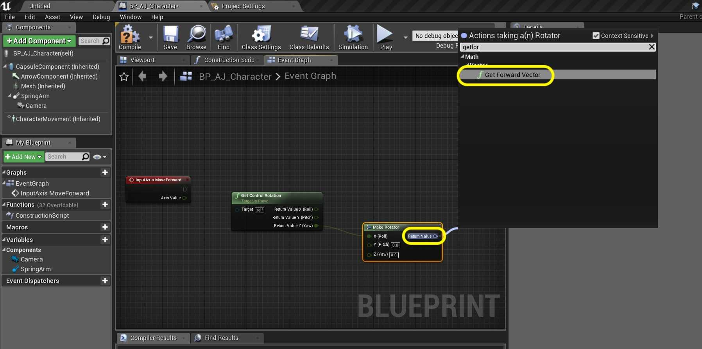

##### `Step 10.`\|`ITA`| :large_blue_diamond:

*Pull off* of the **Return Value** pin and *select* the **Add Movement Input** node.

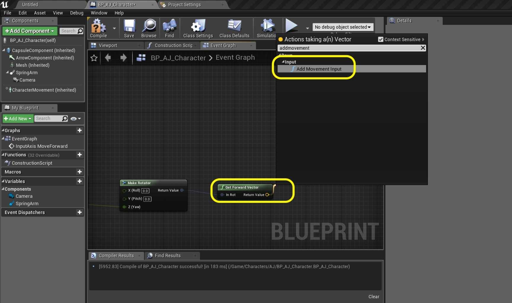

##### `Step 11.`\|`ITA`| :large_blue_diamond: :small_blue_diamond: 

Connect the output execution pin from the **InputAxis MoveForward** node to the input execution pin of the **Add Movement Input** node:

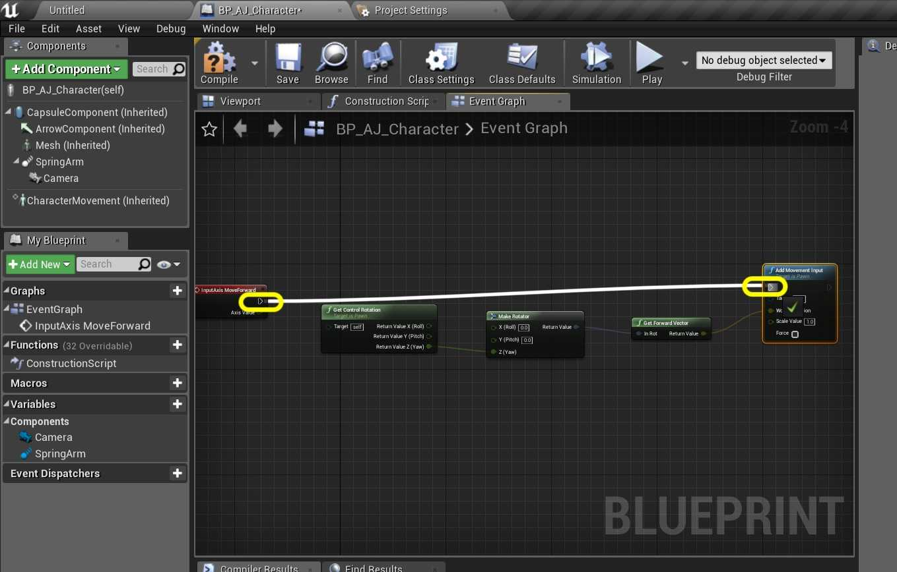

##### `Step 12.`\|`ITA`| :large_blue_diamond: :small_blue_diamond: :small_blue_diamond: 

Take the output of the **InputAxis MovementForward** pin **Axis Value** and connect it to the **Scale Value** pin of the **Add Movement** Input node:

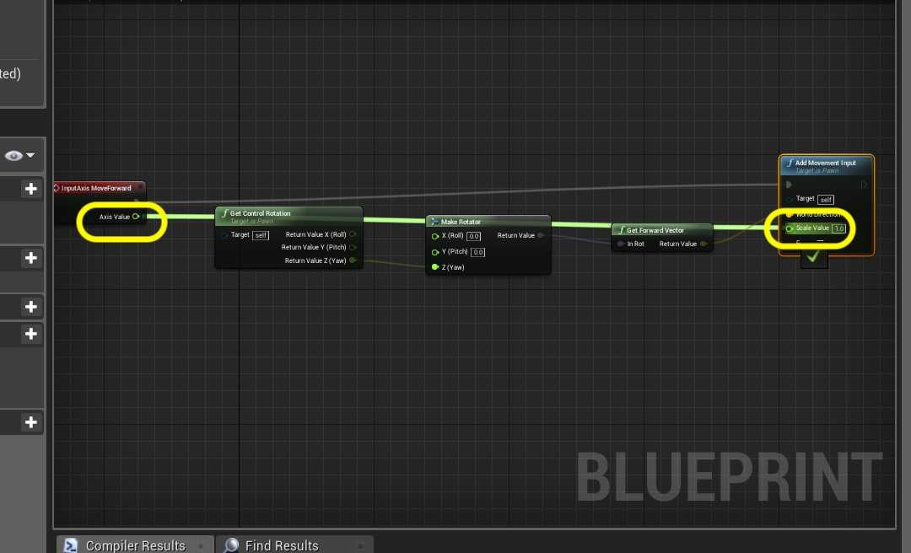

##### `Step 13.`\|`ITA`| :large_blue_diamond: :small_blue_diamond: :small_blue_diamond:  :small_blue_diamond: 

*Add* a comment to all these nodes called `Core Movement` and press the <kbd>Compile</kbd> button:

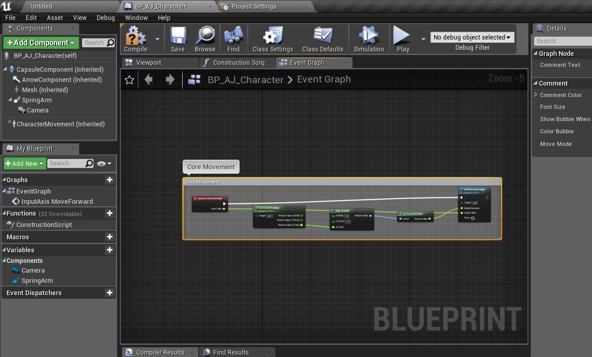

##### `Step 14.`\|`ITA`| :large_blue_diamond: :small_blue_diamond: :small_blue_diamond: :small_blue_diamond:  :small_blue_diamond: 

Now go into the game and press the up and down or W and S key. We are moving left to right instead of forward and backwards. Go back to the **BP_AJ_Character** blueprint and click on the **Arrow** component. This is the forward facing vector for the player and it is at the wrong angle.

https://user-images.githubusercontent.com/5504953/132613486-bfbbbf6c-084a-4cb0-a63f-9c57e945ee6d.mp4

##### `Step 15.`\|`ITA`| :large_blue_diamond: :small_orange_diamond: 

The blue arrow indicates what the game *knows* as the forward direction of the player.  Notice is off by ninety degrees? *Click* on the **Mesh** component and change the **Rotation** on **Z** to `-90.0`:

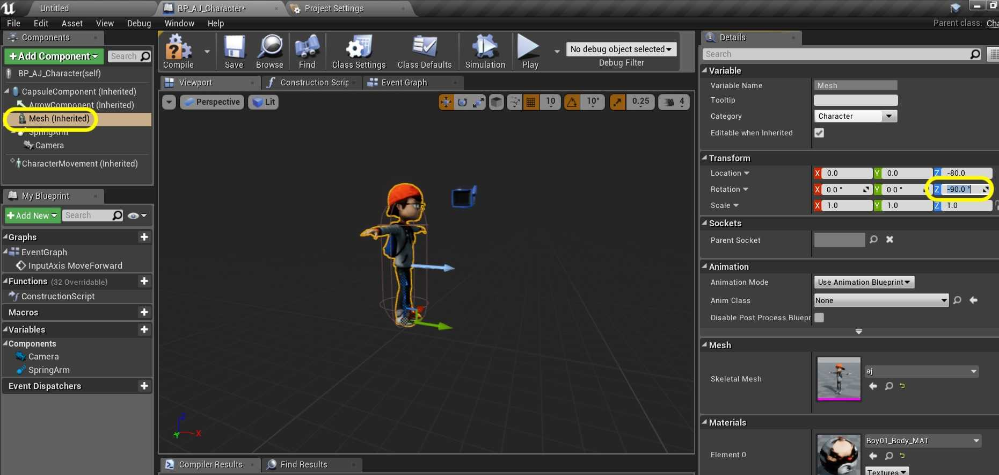

##### `Step 16.`\|`ITA`| :large_blue_diamond: :small_orange_diamond:   :small_blue_diamond: 

Now the camera is in the wrong position. Go to the **Spring Arm** *component* and *change* the **Rotation** on the **Z** axis back to `0.0`.

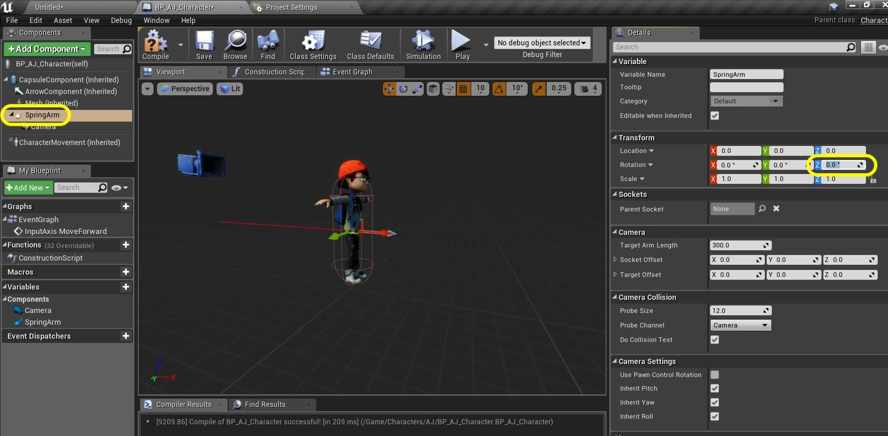

##### `Step 17.`\|`ITA`| :large_blue_diamond: :small_orange_diamond: :small_blue_diamond: :small_blue_diamond:

Now play the game and the player should move backwards and forwards. Lets add left and right turning motion on the next page.

https://user-images.githubusercontent.com/5504953/132962900-942c62d5-63a4-483f-bca5-71c72d52b103.mp4

##### `Step 18.`\|`ITA`| :large_blue_diamond: :small_orange_diamond: :small_blue_diamond: :small_blue_diamond: :small_blue_diamond:

Now lets add the movement for going left and right in the game. Go back to the **BP_AJ_Character** blueprint and go to the **Event Graph**. *Pull off* the **Make Rotator | Return Value** pin and now *select* **Get Right Vector** node. We will use this vector to turn left and right.

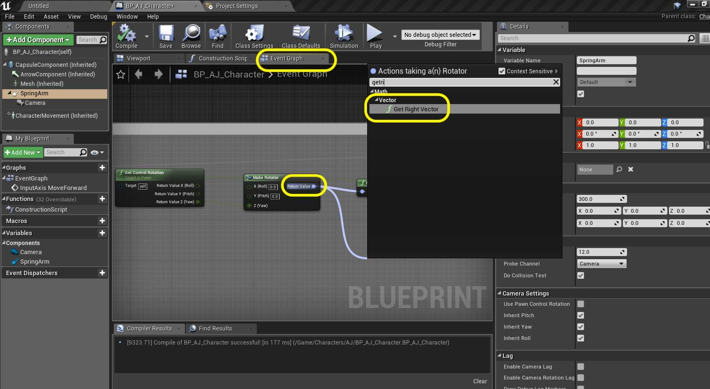

##### `Step 19.`\|`ITA`| :large_blue_diamond: :small_orange_diamond: :small_blue_diamond: :small_blue_diamond: :small_blue_diamond: :small_blue_diamond:

*Pull off* the **Return Value** pin and select another **Add Movement Input** node.

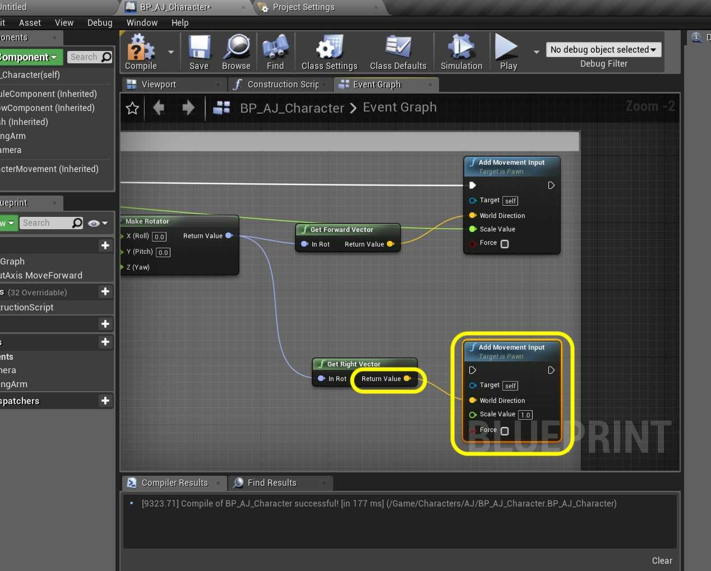

##### `Step 20.`\|`ITA`| :large_blue_diamond: :large_blue_diamond:

Add a **Axis Events | MoveRight** node.

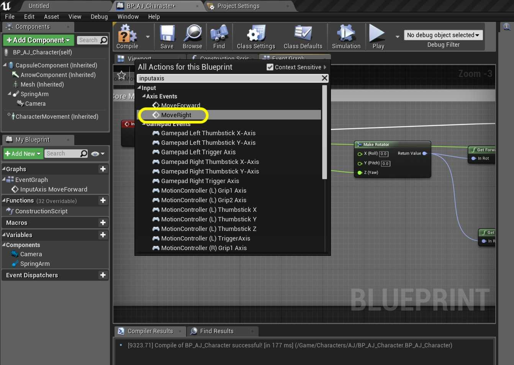

##### `Step 21.`\|`ITA`| :large_blue_diamond: :large_blue_diamond: :small_blue_diamond:

*Connect* the output execution pin to the newly created **Add Movement Input** node.

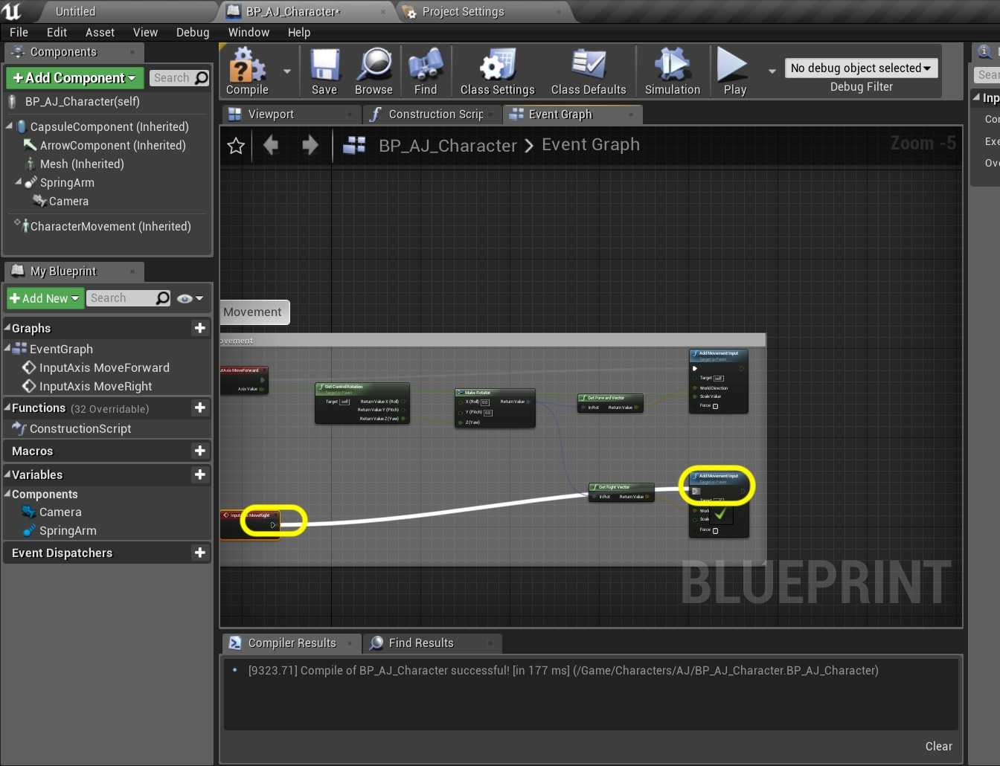

##### `Step 22.`\|`ITA`| :large_blue_diamond: :large_blue_diamond: :small_blue_diamond: :small_blue_diamond:

*Connect* the **Axis Value** output pin from the **InputAxis MoveRight** node to the **Scale Value** input pin on the new **Add Movement Input** node:

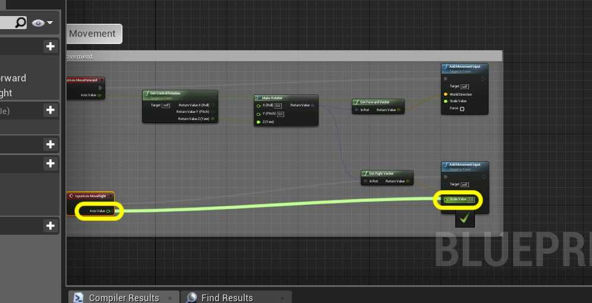

##### `Step 23.`\|`ITA`| :large_blue_diamond: :large_blue_diamond: :small_blue_diamond: :small_blue_diamond: :small_blue_diamond:

Now *press* the <kbd>Compile</kbd> button and *play* the game. The character should now move in four directions. Now all we are doing in the game is moving this **Capsule** component around the screen. The player animation is just an animation blueprint that runs based on the vector of the motion of the player.

https://user-images.githubusercontent.com/5504953/132963054-4d3cac78-d095-4adb-9056-79e24404dba3.mp4

##### `Step 24.`\|`ITA`| :large_blue_diamond: :large_blue_diamond: :small_blue_diamond: :small_blue_diamond: :small_blue_diamond: :small_blue_diamond:

Now go back and forth between the player blueprint and the game and adjust the spring arm so you can see the entire player and that the camera is above the player looking down. I *adjusted* the **Target Arm Length** to `550.0`.
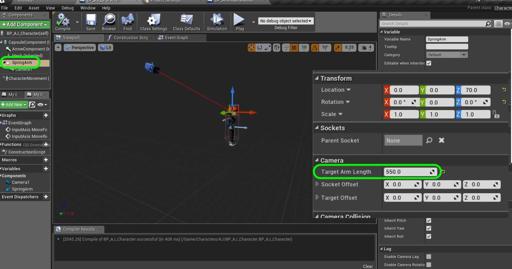

##### `Step 25.`\|`ITA`| :large_blue_diamond: :large_blue_diamond: :small_orange_diamond:

Now your game should look like this. Next up we will create a blend space to have the character move from idle to running.

https://user-images.githubusercontent.com/5504953/132963088-80c197e7-9901-4d1f-8737-ca08454be213.mp4

##### `Step 26.`\|`ITA`| :large_blue_diamond: :large_blue_diamond: :small_orange_diamond: :small_blue_diamond:

Select the **File | Save All** then press the <kbd>Source Control</kbd> button and select **Submit to Source Control...**.  Enter a **Changelist Description** and then press <kbd>Submit</kbd>.  Open up **GitHub Desktop** and select **Push origin** to update the server with the latest changes.

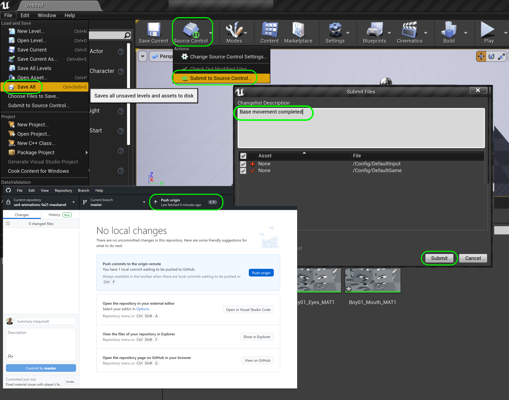

___

<!--  -->

| [previous](../character-bp/README.md#user-content-setting-up-character-blueprint)| [home](../README.md#user-content-ue4-animations) | [next](../animation-blend/README.md#user-content-animation-blend-space)|
|---|---|---|
