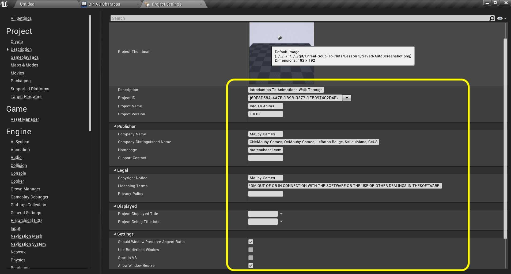
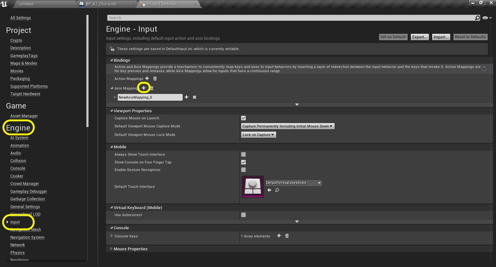
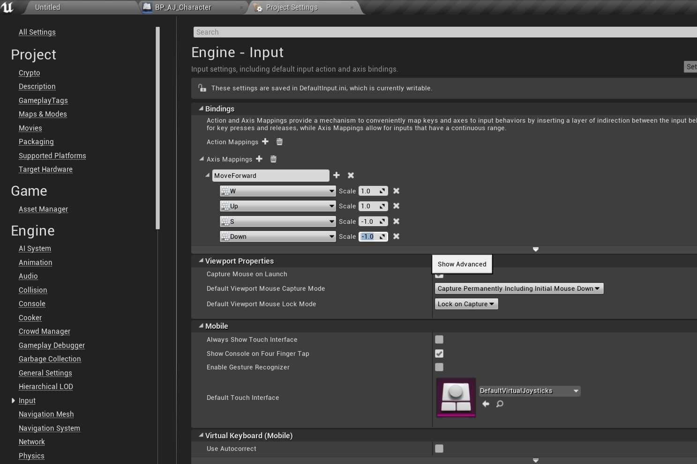
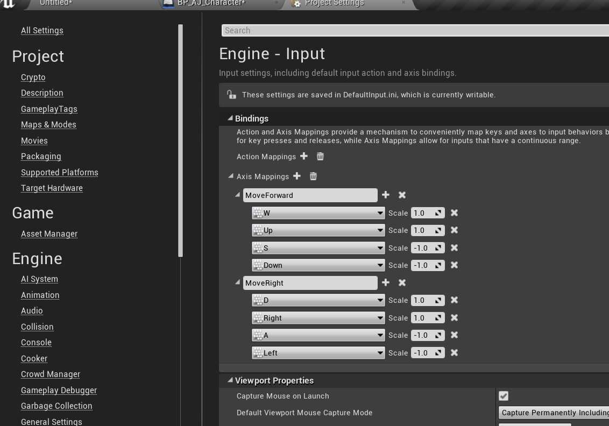
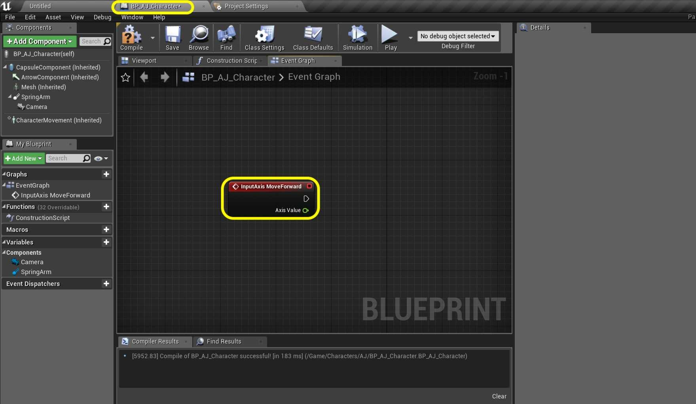
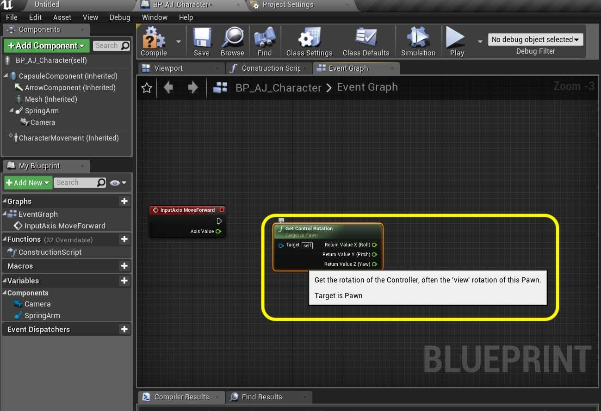

### Adding Controls

[previous](../character-bp/README.md#user-content-setting-up-character-blueprint) • [home](../README.md#user-content-ue4-animations) • [next](../animation-blend/README.md#user-content-animation-blend-space)

Lets add the ability to move the character using a special actor component.

 

---

##### `Step 1.`\|`ITA`|:small_blue_diamond:

Lets go to the **Edit | Project Settings** to add some controller input into our game. 

##### `Step 2.`\|`FHIU`|:small_blue_diamond: :small_blue_diamond: 

Fill in the appropriate Description information.

##### `Step 3.`\|`ITA`|:small_blue_diamond: :small_blue_diamond: :small_blue_diamond:

Go to **Engine | Input** and press the <kbd>+</kbd> button next to **Axis Mappings**.

##### `Step 4.`\|`ITA`|:small_blue_diamond: :small_blue_diamond: :small_blue_diamond: :small_blue_diamond:

Call it `MoveForward` and press the **+** button next to it four times. Assign the following buttons by pressing **+** next to **MoveForward**: `Keyboard | W`, `Keyboard | Up`, `Keyboard | S`, `Keyboard | Down`. Set the **Scale** for **W** and **Up** at `1.0` and the **Scale** for **S** and **Down** to `-1.0`.

##### `Step 5.`\|`ITA`| :small_orange_diamond:

*Press* the **+** button next to **Axis Mappings** and call the second mapping `MoveRight`. Press the **+** button next to it four times. *Assign* the following buttons: `D`, `Right`, `A`, `Left`. Set the **Scale** for **D** and **Right** at `1.0` and the Scale for **A** and **Left** to `-1.0`.

##### `Step 6.`\|`ITA`| :small_orange_diamond: :small_blue_diamond:

Open **BP_AJ_Character** blueprint and go to the **Event Graph**. *Delete* the existing nodes. Add a **Axis Events | MoveForward** node so we can add physics when the up, down, W or S button are pressed on the keyboard.

##### `Step 7.`\|`ITA`| :small_orange_diamond: :small_blue_diamond: :small_blue_diamond:

Lets *add* a **Get Control Rotation** node to get the controller rotation for the player controlled pawn.

##### `Step 8.`\|`ITA`| :small_orange_diamond: :small_blue_diamond: :small_blue_diamond: :small_blue_diamond:

*Right click* on the** Return Value** pin and select **Split Struct Pin**. We are going to be controlling the player rotating around the **Z** axis or **Yaw**. *Pull* from the **Return Value Z(Yaw)** pin and select a **Make Rotator** node:

##### `Step 9.`\|`ITA`| :small_orange_diamond: :small_blue_diamond: :small_blue_diamond: :small_blue_diamond: :small_blue_diamond:

Now we want to move the player forward based on his facing angle. *Pull off* of the **Return Value** pin and *select* a **Get Forward Vector** node.

##### `Step 10.`\|`ITA`| :large_blue_diamond:

*Pull off* of the **Return Value** pin and *select* the **Add Movement Input** node.

##### `Step 11.`\|`ITA`| :large_blue_diamond: :small_blue_diamond: 

Connect the output execution pin from the **InputAxis MoveForward** node to the input execution pin of the **Add Movement Input** node:

##### `Step 12.`\|`ITA`| :large_blue_diamond: :small_blue_diamond: :small_blue_diamond: 

Take the output of the **InputAxis MovementForward** pin **Axis Value** and connect it to the **Scale Value** pin of the **Add Movement** Input node:

##### `Step 13.`\|`ITA`| :large_blue_diamond: :small_blue_diamond: :small_blue_diamond:  :small_blue_diamond: 

*Add* a comment to all these nodes called `Core Movement` and press the <kbd>Compile</kbd> button:

##### `Step 14.`\|`ITA`| :large_blue_diamond: :small_blue_diamond: :small_blue_diamond: :small_blue_diamond:  :small_blue_diamond: 

Now go into the game and press the up and down or W and S key. We are moving left to right instead of forward and backwards. Go back to the **BP_AJ_Character** blueprint and click on the **Arrow** component. This is the forward facing vector for the player and it is at the wrong angle.

https://user-images.githubusercontent.com/5504953/132613486-bfbbbf6c-084a-4cb0-a63f-9c57e945ee6d.mp4

##### `Step 15.`\|`ITA`| :large_blue_diamond: :small_orange_diamond: 

*Click* on the **Mesh** component and change the **Rotation** on **Z** to `-90.0`:

##### `Step 16.`\|`ITA`| :large_blue_diamond: :small_orange_diamond:   :small_blue_diamond: 

Now the camera is in the wrong position. Go to the **Spring Arm** *component* and *change* the **Rotation** on the **Z** axis back to `0.0`.

##### `Step 17.`\|`ITA`| :large_blue_diamond: :small_orange_diamond: :small_blue_diamond: :small_blue_diamond:

Now play the game and the player should move backwards and forwards. Lets add left and right turning motion on the next page.

##### `Step 18.`\|`ITA`| :large_blue_diamond: :small_orange_diamond: :small_blue_diamond: :small_blue_diamond: :small_blue_diamond:

##### `Step 19.`\|`ITA`| :large_blue_diamond: :small_orange_diamond: :small_blue_diamond: :small_blue_diamond: :small_blue_diamond: :small_blue_diamond:

##### `Step 20.`\|`ITA`| :large_blue_diamond: :large_blue_diamond:

##### `Step 21.`\|`ITA`| :large_blue_diamond: :large_blue_diamond: :small_blue_diamond:

___

| [previous](../character-bp/README.md#user-content-setting-up-character-blueprint)| [home](../README.md#user-content-ue4-animations) | [next](../animation-blend/README.md#user-content-animation-blend-space)|
|---|---|---|
