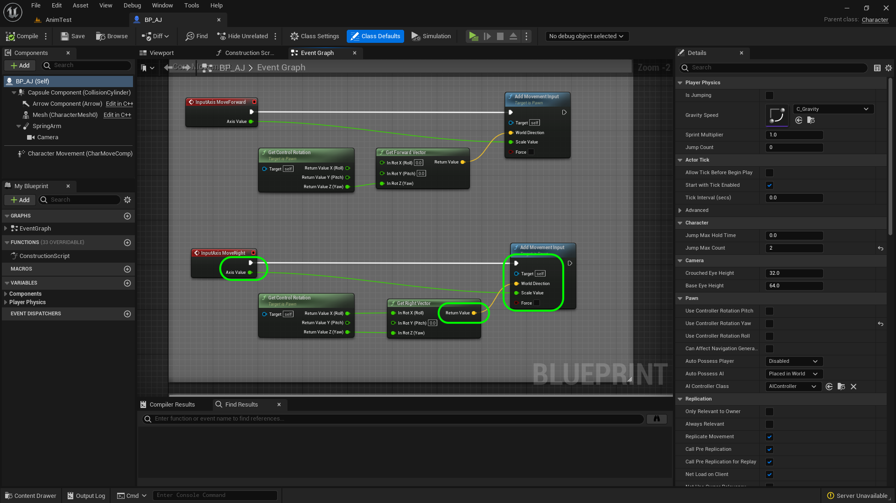

### Adding Controls

[previous](../character-bp/README.md#user-content-setting-up-character-blueprint) • [home](../README.md#user-content-ue4-animations) • [next](../animation-blend/README.md#user-content-animation-blend-space)

Lets add the ability to move the character using a special actor component.

 

---

##### `Step 1.`\|`ITA`|:small_blue_diamond:

We start by adding an [input action](https://docs.unrealengine.com/5.2/en-US/enhanced-input-in-unreal-engine/).

>Input Actions are the communication link between the Enhanced Input system and your project's code. Input Actions are the conceptual equivalent to Action and Axis mapping names, except they are data assets. Each Input Action should represent something that the user can do, like "Crouch" or "Fire Weapon". You can add Input Listeners in either Blueprints or C++ when the Input Action's state changes.

In this case we will create a folder called **Content | Input | Action** and right click and add an **Input | Input Action**.  We will call it `IA_Move`.  This will create an action for moving the player left and right and forwards and backwards.

##### `Step 2.`\|`FHIU`|:small_blue_diamond: :small_blue_diamond: 

Fill in the appropriate **Description** information. Fill in the **Copyright Notice** section.  I am using [MIT License](https://opensource.org/licenses/MIT) and publishing it as Open Source.

##### `Step 3.`\|`ITA`|:small_blue_diamond: :small_blue_diamond: :small_blue_diamond:

Go to **Engine | Input** and press the <kbd>+</kbd> button next to **Axis Mappings**.

##### `Step 4.`\|`ITA`|:small_blue_diamond: :small_blue_diamond: :small_blue_diamond: :small_blue_diamond:

Call it `MoveForward` and press the **+** button next to it four times. Assign the following buttons by pressing **+** next to **MoveForward**: `Keyboard | W`, `Keyboard | Up`, `Keyboard | S`, `Keyboard | Down`. Set the **Scale** for **W** and **Up** at `1.0` and the **Scale** for **S** and **Down** to `-1.0`.

##### `Step 5.`\|`ITA`| :small_orange_diamond:

*Press* the **+** button next to **Axis Mappings** and call the second mapping `MoveRight`. Press the **+** button next to it three times. *Assign* the following buttons: `D`, `Right`, `A`, `Left`. Set the **Scale** for **D** and **Right** at `1.0` and the Scale for **A** and **Left** to `-1.0`.

##### `Step 6.`\|`ITA`| :small_orange_diamond: :small_blue_diamond:

Open **BP_AJ_Character** blueprint and go to the **Event Graph**. *Delete* the existing nodes. Add a **Axis Events | MoveForward** node so we can add physics when the up, down, W or S button are pressed on the keyboard.

##### `Step 7.`\|`ITA`| :small_orange_diamond: :small_blue_diamond: :small_blue_diamond:

Lets *add* a **Get Control Rotation** node to get the controller rotation for the player controlled pawn. This returns a rotator.

##### `Step 8.`\|`ITA`| :small_orange_diamond: :small_blue_diamond: :small_blue_diamond: :small_blue_diamond:

*Right click* on the **Return Value** pin and select **Split Struct Pin**. 

##### `Step 9.`\|`ITA`| :small_orange_diamond: :small_blue_diamond: :small_blue_diamond: :small_blue_diamond: :small_blue_diamond:

*Add* a **Get Forward Vector** pin to translate the rotator to a vector. Right click the **In Rot** input and select **Split Struct Pin**.  Then connect the **Return Value Z (Yaw)** to the **In Rot Z(Yaw)** of the **Get Forward Vector** pin.

##### `Step 10.`\|`ITA`| :large_blue_diamond:

*Pull off* of the **Return Value** pin and *select* the **Add Movement Input** node. *Connect* the output execution pin from the **InputAxis MoveForward** node to the input execution pin of the **Add Movement Input** node. Take the output of the **Get Forward Vector | Return Value** pin to the **Add Movement Input | World Direction** pin. *Connect* the **InputAxis MoveForward | Axis Value** pin to the **Scale Value** pin of the **Add Movement** Input node.

##### `Step 11.`\|`ITA`| :large_blue_diamond: :small_blue_diamond: 

*Add* a comment to all these nodes called `Core Movement` and press the <kbd>Compile</kbd> button:

##### `Step 12.`\|`ITA`| :large_blue_diamond: :small_blue_diamond: :small_blue_diamond: 

Now go into the game and press the up and down or W and S key. We should be moving forward and backwards!

https://user-images.githubusercontent.com/5504953/195997035-c84060cd-fd76-42c9-b672-fa3dca5c0e11.mp4

##### `Step 13.`\|`ITA`| :large_blue_diamond: :small_blue_diamond: :small_blue_diamond:  :small_blue_diamond: 

Return to **BP_AJ** and *add* a **Axis Events | MoveRight** node.

##### `Step 14.`\|`ITA`| :large_blue_diamond: :small_blue_diamond: :small_blue_diamond: :small_blue_diamond:  :small_blue_diamond: 

Copy and paste the **Get Control Rotation** node. and place it next to **Move Right**.

##### `Step 15.`\|`ITA`| :large_blue_diamond: :small_orange_diamond: 

Now *add* a **Get Right Vector** node.  Right click the **In Rot** input and select **Split Struct Pin**.

##### `Step 16.`\|`ITA`| :large_blue_diamond: :small_orange_diamond:   :small_blue_diamond: 

Connect the **Get Control Rotation | In Rot X (Roll)** and **Get Control Rotation | In Rot Z (Yaw)** to the corresponding pins in **Get Right Vector**. *Pull* from the **InputAxis MoveRight** node and add another **Add Movement Input** node.

##### `Step 17.`\|`ITA`| :large_blue_diamond: :small_orange_diamond: :small_blue_diamond: :small_blue_diamond:

Take the output of the **Get Right Vector | Return Value** pin to the **Add Movement Input | World Direction** pin. *Connect* the **InputAxis MoveRight | Axis Value** pin to the **Scale Value** pin of the **Add Movement** Input node.

##### `Step 18.`\|`ITA`| :large_blue_diamond: :small_orange_diamond: :small_blue_diamond: :small_blue_diamond: :small_blue_diamond:

Now *press* the <kbd>Compile</kbd> button and *play* the game. The character should now move in four directions. Now all we are doing in the game is moving this **Capsule** component around the screen. The player animation is just an animation blueprint that runs based on the vector of the motion of the player.

https://user-images.githubusercontent.com/5504953/195998505-dae9ffec-7e52-4d5e-a40b-5d5b89ae9c33.mp4

##### `Step 19.`\|`ITA`| :large_blue_diamond: :small_orange_diamond: :small_blue_diamond: :small_blue_diamond: :small_blue_diamond: :small_blue_diamond:

Select the **File | Save All** then quit UE5.   Go to **P4V** and go the top project folder (the one that holds the `.uproject` file and **Content** folder) and press the <kbd>+Add</kbd> then <kbd>OK</kbd> button.  This makes sure any files that Unreal didn't add get added to source control. Press the <kbd>Submit</kbd> button and enter a message explaining the work done.  Press <kbd>Submit</kbd>.

<!--  -->

| [previous](../character-bp/README.md#user-content-setting-up-character-blueprint)| [home](../README.md#user-content-ue4-animations) | [next](../animation-blend/README.md#user-content-animation-blend-space)|
|---|---|---|
