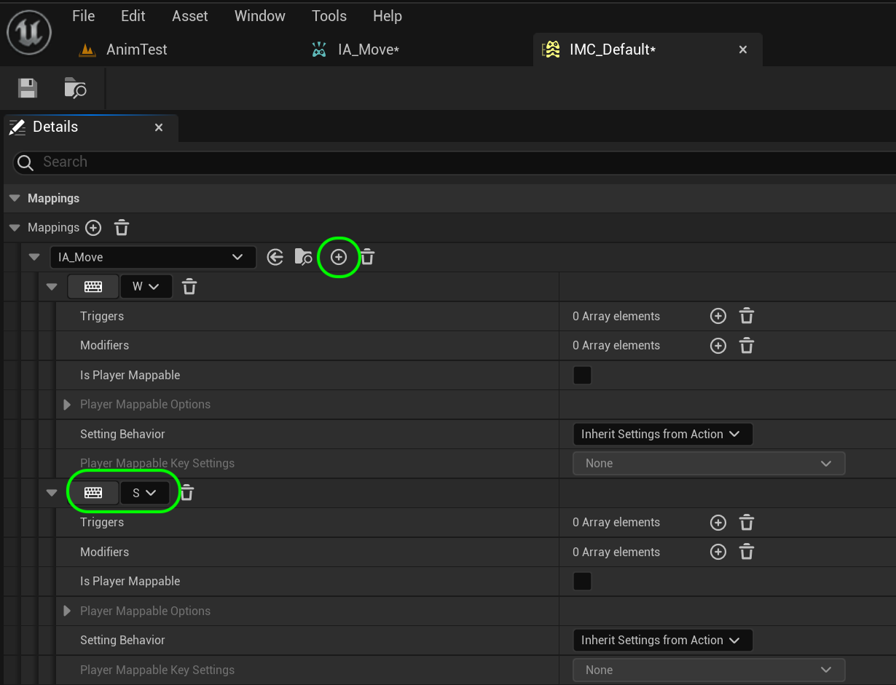
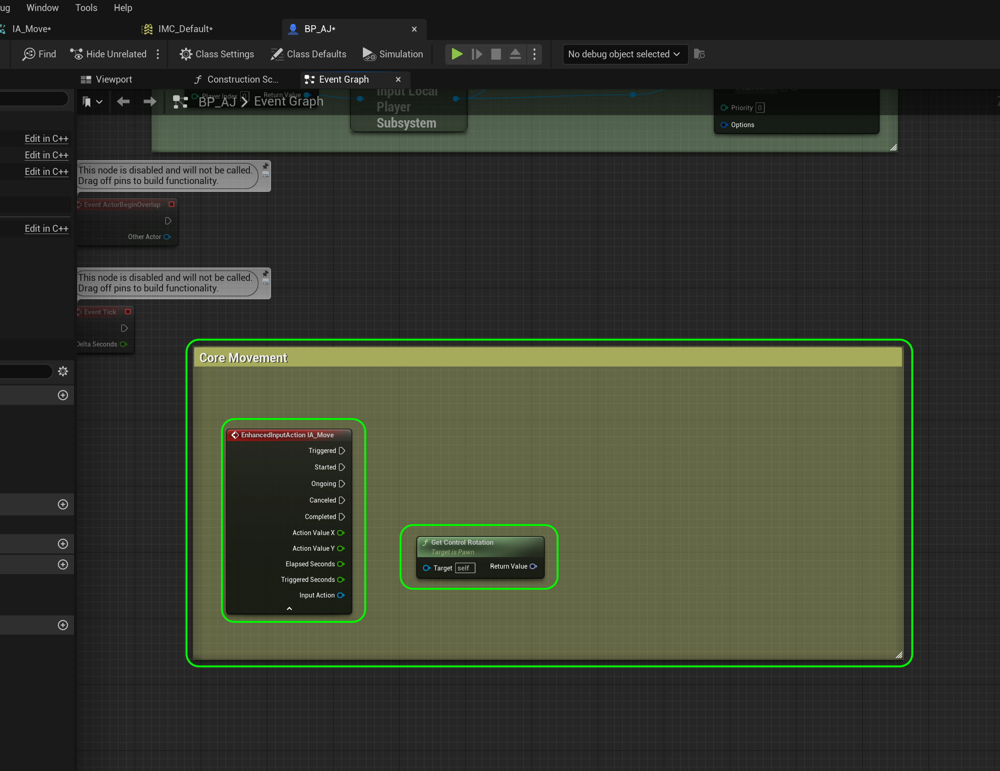

### Adding Controls

[previous](../character-bp/README.md#user-content-setting-up-character-blueprint) • [home](../README.md#user-content-ue4-animations) • [next](../animation-blend/README.md#user-content-animation-blend-space)

Lets add the ability to move the character using a special actor component.

 

---

##### `Step 1.`\|`ITA`|:small_blue_diamond:

We start by adding an [input action](https://docs.unrealengine.com/5.2/en-US/enhanced-input-in-unreal-engine/).

>Input Actions are the communication link between the Enhanced Input system and your project's code. Input Actions are the conceptual equivalent to Action and Axis mapping names, except they are data assets. Each Input Action should represent something that the user can do, like "Crouch" or "Fire Weapon". You can add Input Listeners in either Blueprints or C++ when the Input Action's state changes.

In this case we will create a folder called **Content | Input | Action** and right click and add an **Input | Input Action**.  We will call it `IA_Move`.  This will create an action for moving the player left and right and forwards and backwards.

##### `Step 2.`\|`FHIU`|:small_blue_diamond: :small_blue_diamond: 

Now open up **IA_Move** and the only thing we need to adjust is the **Value Type**.  If it is a boolean button then boolean is best.  This is for a controller or for *AWSD* or *Left | Right | Up | Down* arrows on the keyboard.  This event can handle all these inputs. So set it to `Axis2D (Vector2D)`.  This represents the forward and rightward motion.

##### `Step 3.`\|`ITA`|:small_blue_diamond: :small_blue_diamond: :small_blue_diamond:

Each state of the player (we have a single one) uses potentially many **Input Actions**.  This is done in a **Input Mapping Context**.

> Input Mapping Contexts are a collection of Input Actions that represents a certain context that the player can be in. They describe the rules for what triggers a given Input Action. Mapping Contexts can be dynamically added, removed, or prioritized for each user.

Select the **Input** folder and right click and add a **Input | Input Mapping Context** file to the game.

##### `Step 4.`\|`ITA`|:small_blue_diamond: :small_blue_diamond: :small_blue_diamond: :small_blue_diamond:

Press the <kbd>+</kbd> button after **Mappings** to add an input action.  Select our only **Input Action** to map which is `IA_Move`.  Open up the triangle below where you are going to assign the controller or button press.

##### `Step 5.`\|`ITA`| :small_orange_diamond:

Press the <kbd>Keyboard</kbd> button and select the `W` key.

##### `Step 6.`\|`ITA`| :small_orange_diamond: :small_blue_diamond:

*We will use **W** for forward and **D** for backwards movement, press the <kbd>+</kbd> button next to **IA_Move** to add another input and press the <kbd>Keyboard</kbd> button and select the `E` key.

##### `Step 7.`\|`ITA`| :small_orange_diamond: :small_blue_diamond: :small_blue_diamond:

Repeat this for left and right movement with **A** and **D**.  Also, don't forget left hand controls with the **Up**, **Down**, **Left** and **Right** keyboard keys.  Also lets add support for **Gamepad Left Thumbstick 2D - Axis**.  This will allow a gamepad to control the player.

##### `Step 8.`\|`ITA`| :small_orange_diamond: :small_blue_diamond: :small_blue_diamond: :small_blue_diamond:

First we need to initialize the new input system. Open **BP_AJ_Character** blueprint and go to the **Event Graph**. *Delete* the existing nodes. *Right click* next to the **Begin Play** node on the empty graph and select a **Get Player Controller** node.  Pull off of the blue pin on this node and select a **Get Enhanced Input Local Player Subsystem**. Please note that you can only access this node **FROM** the player controller so you will only see this option come up if you pull off of the **Return Value** of the **Player Controller** node.

##### `Step 9.`\|`ITA`| :small_orange_diamond: :small_blue_diamond: :small_blue_diamond: :small_blue_diamond: :small_blue_diamond:

Now when loading a reference to a module or any object is always best to make sure that it exists and you get a pointer to balid memory (null pointer check).  Do this by pulling the pin from the **Enhnaded Input Local Player** node and select a **? Is Valid** node.  Make sure it is the one with a **?** question mark.  This will give us an execution pin.  Also pull of of the **Enhnaded Input Local Player** node and select a **Add Mapping Context** node. Select `IMC_Default` as the **Mapping Context** needed.  Connect the execution pins from **Begin Play** to **? Is Valid** to **Add Mappng Content** nodes.

##### `Step 10.`\|`ITA`| :large_blue_diamond:

Mouse click all of the nodes next to **Begin Play** and press the <kbd>C</kbd> key to add a comment.  Give it a color and a title of `Set Up Player Input`.

##### `Step 11.`\|`ITA`| :large_blue_diamond: :small_blue_diamond: 

Under all the nodes right click on the open graph and add a Add a **Axis Events | EnhancedInputAction IA_Move** node so we can add physics when the movement or gamepad keys and joysticks are used. Lets *add* a **Get Control Rotation** node to get the controller rotation for the player controlled pawn. This returns a rotator which gives us a direction (angle).

##### `Step 12.`\|`ITA`| :large_blue_diamond: :small_blue_diamond: :small_blue_diamond: 

*Right click* on the **Return Value** pin and select **Split Struct Pin**. We need to get separate access to the three rotation axis (X, Y & Z).

##### `Step 13.`\|`ITA`| :large_blue_diamond: :small_blue_diamond: :small_blue_diamond:  :small_blue_diamond: 

*Add* a **Get Right Vector** pin to translate the rotator to a vector. Right click the **In Rot** input and select **Split Struct Pin**.  Then connect the **Return Value X (Roll)** to the **In Rot X(Roll)** and **Return Value Z(Yaw)** to the **In rot Z(Yaw)** of the **Get Right Vector** node.

##### `Step 14.`\|`ITA`| :large_blue_diamond: :small_blue_diamond: :small_blue_diamond: :small_blue_diamond:  :small_blue_diamond: 

Right click on **IA Move | Input Axis** pin and separate the X and Y axis by selecting **Split Struct Pin** to create an **Action Value X** and **Action Value Y**. 

*Pull off* of the **Return Value** pin of the **Get Right Vector** node and *select* the **Add Movement Input** node. *Connect* the output execution pin from the **IA_Move | Triggered** node to the input execution pin of the **Add Movement Input** node. Take the output of the **Get Right Vector | Return Value** pin to the **Add Movement Input | World Direction** pin. *Connect* the **IA_Move | Action Value X** pin to the **Scale Value** pin of the **Add Movement** Input node.

##### `Step 15.`\|`ITA`| :large_blue_diamond: :small_orange_diamond: 

Press the <kbd>Play</kbd> button and press the **A** and **D** key to move right and left.  Now we are only moving right.  Which means that the **Action Value X** pin is always returning a positive one when being pressed.  The **A** key should be `-1.0`.  Lets fix that.

https://github.com/maubanel/UE5-Animations/assets/5504953/d23d6fa6-4801-41ba-a935-7c96a0bd5de3

##### `Step 16.`\|`ITA`| :large_blue_diamond: :small_orange_diamond:   :small_blue_diamond: 

Open up **IMC_Default** and on the **A** and **Left** actions press the <kbd>+</kbd> button next to **Modifiers** and select a `Negate` modifier.  Press the <kbd>Save</kbd> button.

##### `Step 17.`\|`ITA`| :large_blue_diamond: :small_orange_diamond: :small_blue_diamond: :small_blue_diamond:

Press the <kbd>Play</kbd> button and press the **A** and **D** key to move right and left.  It should now work.  Make sure the **Left** and **Right** arrow keys work as well!

https://github.com/maubanel/UE5-Animations/assets/5504953/78a8939a-ee7f-4ea5-b9e8-4e5b6ac0440a

##### `Step 18.`\|`ITA`| :large_blue_diamond: :small_orange_diamond: :small_blue_diamond: :small_blue_diamond: :small_blue_diamond:

Copy and paste the **Get Control Rotation** node. and place it next to the left and right movement nodes. 
Now *add* a **Get Forward Vector** node.  Right click the **In Rot** input and select **Split Struct Pin**.

##### `Step 19.`\|`ITA`| :large_blue_diamond: :small_orange_diamond: :small_blue_diamond: :small_blue_diamond: :small_blue_diamond: :small_blue_diamond:

Connect the **Get Control Rotation | In Rot X (Roll)** and **Get Control Rotation | In Rot Z (Yaw)** to the corresponding pins in **Get Right Vector**. *Pull* from the **InputAxis MoveRight** node and add another **Add Movement Input** node. Take the output of the **Get Right Vector | Return Value** pin to the **Add Movement Input | World Direction** pin. *Connect* the **InputAxis MoveRight | Axis Value** pin to the **Scale Value** pin of the **Add Movement** Input node. *Add* a comment to all these nodes called `Core Movement` and press the <kbd>Compile</kbd> button.

##### `Step 20.`\|`ITA`| :large_blue_diamond: :large_blue_diamond:

Press the <kbd>Play</kbd> button and press forward and backwards and you are only moving right!  Why is that?

https://github.com/maubanel/UE5-Animations/assets/5504953/49abb9ac-301c-4202-b406-5c9eecbac010

##### `Step 21.`\|`ITA`| :large_blue_diamond: :large_blue_diamond: :small_blue_diamond:

First we did not negate the negative direction.  So forward is positive and backwards is negative.  Also we have a 2D vector and we are accessing only the **X** component.  For the keyboard we can *swizzle* the **Y** component.  

> Swizzle axis components of an input value. Useful to map a 1D input onto the Y axis of a 2D action.

So for the up movement add a **Modifier** to **UP** and **W** and then set the modifier to `Swizzle INput Axis Values`.  Do the same for **Down** and **S** but not only will add a `Swizzle INput Axis Values` modifier but also a `Negate` to move backwards.

Now *press* the <kbd>Compile</kbd> button and *play* the game. The character should now move in four directions. Now all we are doing in the game is moving this **Capsule** component around the screen. The player animation is just an animation blueprint that runs based on the vector of the motion of the player.

https://user-images.githubusercontent.com/5504953/195998505-dae9ffec-7e52-4d5e-a40b-5d5b89ae9c33.mp4

Select the **File | Save All** then quit UE5.   Go to **P4V** and go the top project folder (the one that holds the `.uproject` file and **Content** folder) and press the <kbd>+Add</kbd> then <kbd>OK</kbd> button.  This makes sure any files that Unreal didn't add get added to source control. Press the <kbd>Submit</kbd> button and enter a message explaining the work done.  Press <kbd>Submit</kbd>.

<!--  -->

| [previous](../character-bp/README.md#user-content-setting-up-character-blueprint)| [home](../README.md#user-content-ue4-animations) | [next](../animation-blend/README.md#user-content-animation-blend-space)|
|---|---|---|
