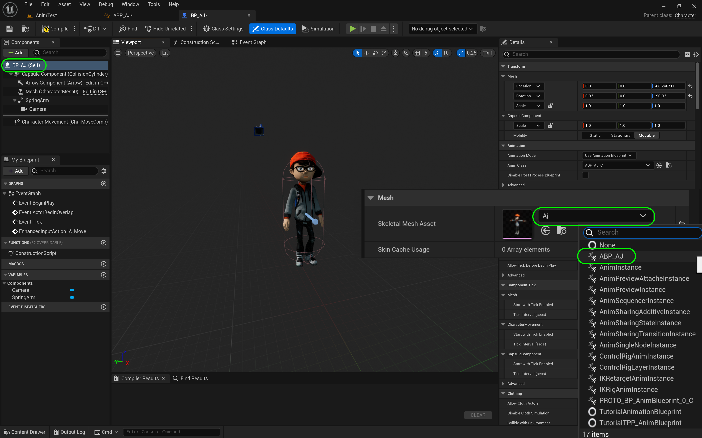
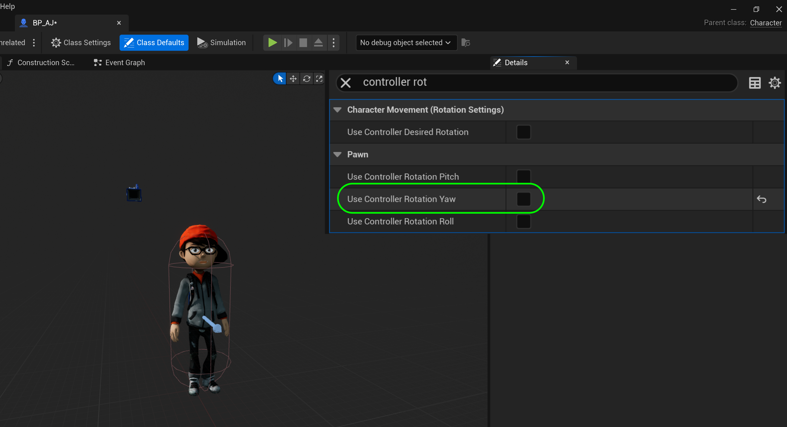

### Our First Animation Blueprint II

[previous](../anim-bp/README.md#user-content-our-first-animation-blueprint) • [home](../README.md#user-content-ue4-animations) • [next](../second-idle/README.md#user-content-time-out-for-second-idle)

Lets finish up the first part of the animation blueprint.

 

---

##### `Step 1.`\|`ITA`|:small_blue_diamond:

Now we need to assign this animation blueprint to our skeletal mesh. *Open* the **BP_AJ_Character** blueprint. *Go* to the **Viewport** tab. We notice our character is in a *T-Pose*. *Select* the **Animation Class** on the Details panel and pick the animation blueprint we just made **AJ_AnimBlueprint**. You will notice that the player should enter the idle state. *Press* the <kbd>Compile</kbd> button.

##### `Step 2.`\|`ITA`|:small_blue_diamond: :small_blue_diamond: 

We want the player to face the direction we are moving in as opposed to always looking forward. Go to the top level component on the blueprint and under **Pawn** *set* the **Use Controller Rotation Yaw** to `false`.

##### `Step 3.`\|`ITA`|:small_blue_diamond: :small_blue_diamond: :small_blue_diamond:

Now *select* the **Spring Arm** component and in **Camera Settings** *set* **Use Pawn Control Rotation** to `true`.

##### `Step 4.`\|`ITA`|:small_blue_diamond: :small_blue_diamond: :small_blue_diamond: :small_blue_diamond:

Press the <kbd>Play</kbd> button and you will notice that the player does animate but doesn't change directions.

https://user-images.githubusercontent.com/5504953/196080751-359be9c8-710d-440e-91e1-3b82f0b7e5df.mp4

##### `Step 5.`\|`ITA`| :small_orange_diamond:

##### `Step 6.`\|`ITA`| :small_orange_diamond: :small_blue_diamond:

Now go back to the **BP_AJ_Character** blueprint and *select* the **CharacterMovement** component. *Scroll* in the **Details** panel down to *Character Movement (Rotation Settings)** tab. Open it up and look for **Orient Rotation to Movement**. Set this to *true*.

##### `Step 7.`\|`ITA`| :small_orange_diamond: :small_blue_diamond: :small_blue_diamond:

Now press the <kbd>Compile</kbd> button and go back into the game. Now the player should animate and turn correctly. 

https://user-images.githubusercontent.com/5504953/196080902-9a2d4181-6eb7-4eeb-bb5a-4fb3415a47a4.mp4

##### `Step 8.`\|`ITA`| :small_orange_diamond: :small_blue_diamond: :small_blue_diamond: :small_blue_diamond:

Select the **File | Save All** then quit UE5.   Go to **P4V** and go the top project folder (the one that holds the `.uproject` file and **Content** folder) and press the <kbd>+Add</kbd> then <kbd>OK</kbd> button.  This makes sure any files that Unreal didn't add get added to source control. Press the <kbd>Submit</kbd> button and enter a message explaining the work done.  Press <kbd>Submit</kbd>.

<!--  -->

| [previous](../anim-bp/README.md#user-content-our-first-animation-blueprint)| [home](../README.md#user-content-ue4-animations) | [next](../second-idle/README.md#user-content-time-out-for-second-idle)|
|---|---|---|
