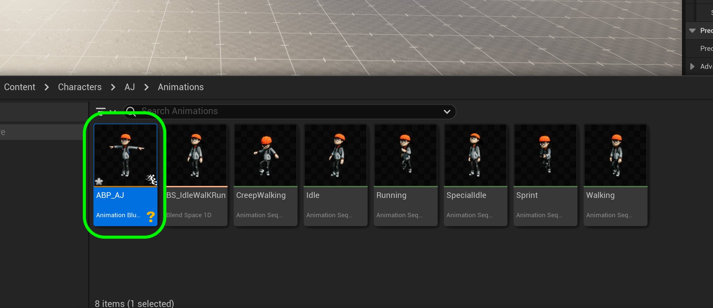
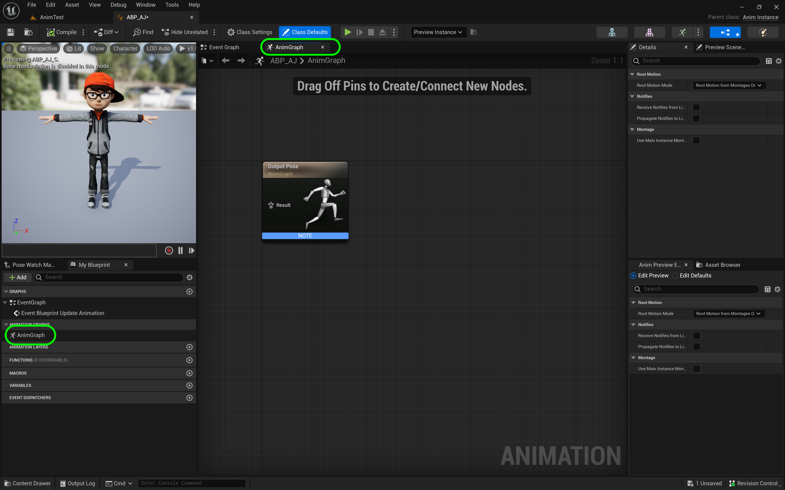
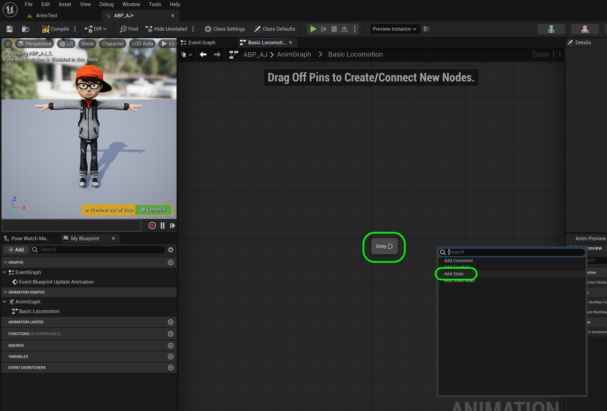
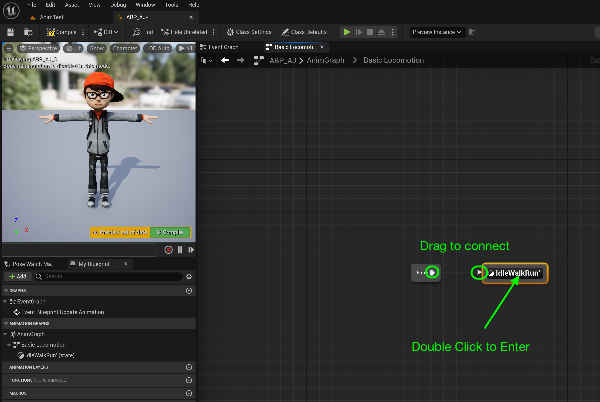
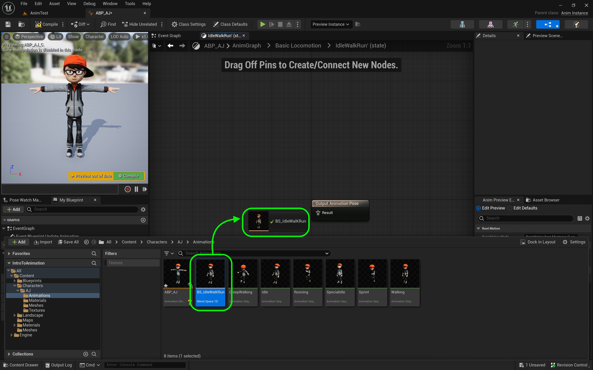
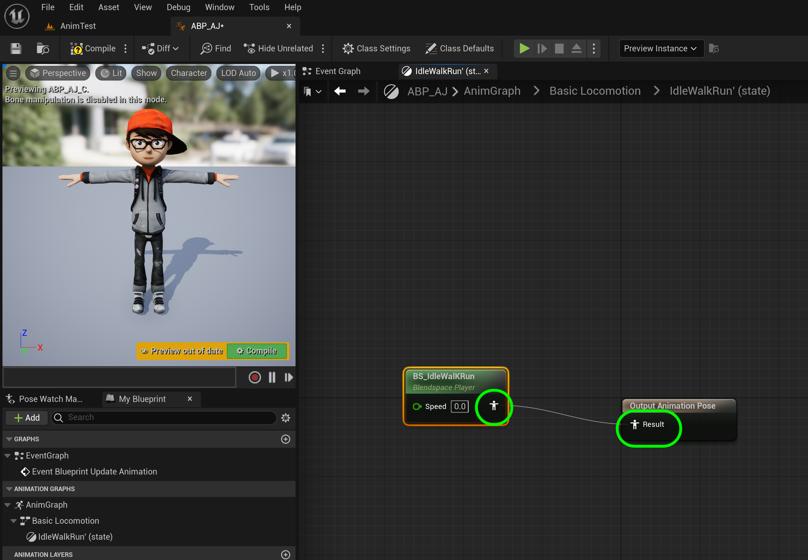
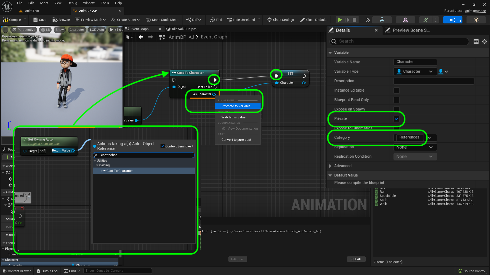
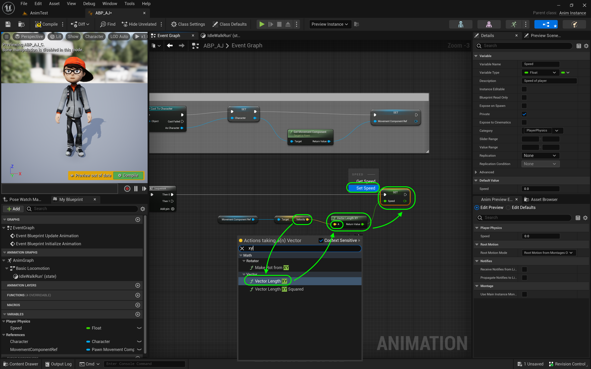

### Our First Animation Blueprint

[previous](../animation-blend/README.md#user-content-animation-blend-space) • [home](../README.md#user-content-ue4-animations) • [next](../anim-bp-ii/README.md#user-content-our-first-animation-blueprint-ii)

There is a special kind of blueprint used as a state machine for animations. It is an animation blueprint. Lets create one for our character.

---

##### `Step 1.`\|`ITA`|:small_blue_diamond:

We are now going to start to set up a state machine for our character. Go to the **AJ** folder and *press* the <kbd>Add/Import</kbd> button and *select* **Animation | Animation Blueprint**. Make sure it is of type **AnimInstance** and the correct skeleton is selected. Press the <kbd>Create</kbd> button.

##### `Step 2.`\|`FHIU`|:small_blue_diamond: :small_blue_diamond: 

Name it `ABP_AJ`.

##### `Step 3.`\|`ITA`|:small_blue_diamond: :small_blue_diamond: :small_blue_diamond:

Open the animation blueprint and go to the **AnimGraph** tab. If it is not there you can double click it in the **AnimGraph** menu item on the left hand side.

##### `Step 4.`\|`ITA`|:small_blue_diamond: :small_blue_diamond: :small_blue_diamond: :small_blue_diamond:

*Right click* on the anim graph and *add* a **State Machine** node.

##### `Step 5.`\|`ITA`| :small_orange_diamond:

Name this node `BasicLocomotion`. *Connect* the animation pins from the **Basic Locomotion** node to the **Final Animation Pose** node.

##### `Step 6.`\|`ITA`| :small_orange_diamond: :small_blue_diamond:

 *Double click* on the **Basic Locomotion** node to enter its state machine. This gets us to the entrance of the Basic Locomotion animation tree. It has an **Entry** node that is what it plays when it enters this state (the only state we are calling for the moment). *Right click* on the anim graph and select **Add State.**

##### `Step 7.`\|`ITA`| :small_orange_diamond: :small_blue_diamond: :small_blue_diamond:

*Name* this state **IdleWalkRun** and *attach* the node from **Entry** to this new **State**. *Double click* on **IdleWalkRun** to enter this state.

##### `Step 8.`\|`ITA`| :small_orange_diamond: :small_blue_diamond: :small_blue_diamond: :small_blue_diamond:

Now we need to play the blend space we created. Drag and drop the **IdleWalkRun_BlendSpace** onto the graph.

##### `Step 9.`\|`ITA`| :small_orange_diamond: :small_blue_diamond: :small_blue_diamond: :small_blue_diamond: :small_blue_diamond:

*Connect* the animation pins so that this **blendspace** runs and gets sent to the **state machine**.

##### `Step 10.`\|`ITA`| :large_blue_diamond:

Now this blend space requires an input float to represent the speed of the player. *Right click* on **None** and select **Promote to Variable**.

##### `Step 11.`\|`ITA`| :large_blue_diamond: :small_blue_diamond: 

Leave the name this variable `Speed` and **Type** as `Float`. set **Private** to `true` and add a **Category** of `PlayerPhysics`. *Press* the <kbd>Compile</kbd> button.

##### `Step 12.`\|`ITA`| :large_blue_diamond: :small_blue_diamond: :small_blue_diamond: 

Press the **Event Graph** tab at the top to go the logic nodes.  Here we will communicate with the animation bluprint and pass it variables from the player we are controlling.  

Now there is no **Begin Play** in animation blueprints but there is a **Event Blueprint Initialize Animation** which runs once when adding an animation to the game.  Lets add this event type by right clicking on the graph and selecting **Event Blueprint Initialize Animation**.  Next we need access to the blueprint that holds our playable character **BP_AJ** so we will add a **Get Owning Actor** node which gets access to the current playable character.

##### `Step 13.`\|`ITA`| :large_blue_diamond: :small_blue_diamond: :small_blue_diamond:  :small_blue_diamond: 

Pull off of the **Get Owning Actor** pin and select a **Cast to Character** node.  This will cast the class from **Pawn** to **Character**.  Right click on the **As Character** and select **Promote to Variable**.  Connect the execution pin from **Cast to Character** to **Set Character** node. Set **Private** to `true` and add a **Category** `References` to the animation blueprint.

##### `Step 14.`\|`ITA`| :large_blue_diamond: :small_blue_diamond: :small_blue_diamond: :small_blue_diamond:  :small_blue_diamond: 

Connect the execution pin from **EventBlueprint Initialize Annimation** to **Cast to Character**.

##### `Step 15.`\|`ITA`| :large_blue_diamond: :small_orange_diamond: 

##### `Step 16.`\|`ITA`| :large_blue_diamond: :small_orange_diamond:   :small_blue_diamond: 

Now drag a **Get** for the **Character** variable next to the **EventBlueprint Update Animation** which will tick every frame like the tick node in a normal blueprint as long as this animation is active.  Now we need to make sure that the character still exists in the game (could have died for example and have been remoted) so we *right click* on the node and select **Convert to Validated Get** which will stop the game from crashing if we access a null reference.

*Drag* off the **GET | Is Valid** execution pin and select a **Sequence** node. the *Drag off* of the **Character** from the **GET** node and select **Get Velocity** to get the velocity vector of the player pawn. 

##### `Step 17.`\|`ITA`| :large_blue_diamond: :small_orange_diamond: :small_blue_diamond: :small_blue_diamond:

We forgot to clean up above so go back to the **Intialize Animation** and place a comment box around the nodes saying `Get Reference`.

##### `Step 18.`\|`ITA`| :large_blue_diamond: :small_orange_diamond: :small_blue_diamond: :small_blue_diamond: :small_blue_diamond:

*Drag* a **Set Speed** variable onto the chart. Now if you try and connect the output of velocity it will not connect to speed. Now a **Velocity** (or any vector for that matter) has a *direction* and a *magnitude*. 

##### `Step 19.`\|`ITA`| :large_blue_diamond: :small_orange_diamond: :small_blue_diamond: :small_blue_diamond: :small_blue_diamond: :small_blue_diamond:

All we care about here is the *magnitude*. *Drag off* of the **Return Value** pin from the **Get Velocity** node and select **Vector Length** (I typed in Magnitude in the search window and it still points to this node!). This returns a float with the length of the vector (magnitude).

##### `Step 20.`\|`ITA`| :large_blue_diamond: :large_blue_diamond:

##### `Step 21.`\|`ITA`| :large_blue_diamond: :large_blue_diamond: :small_blue_diamond:

<!--  -->

| [previous](../animation-blend/README.md#user-content-animation-blend-space)| [home](../README.md#user-content-ue4-animations) | [next](../anim-bp-ii/README.md#user-content-our-first-animation-blueprint-ii)|
|---|---|---|
