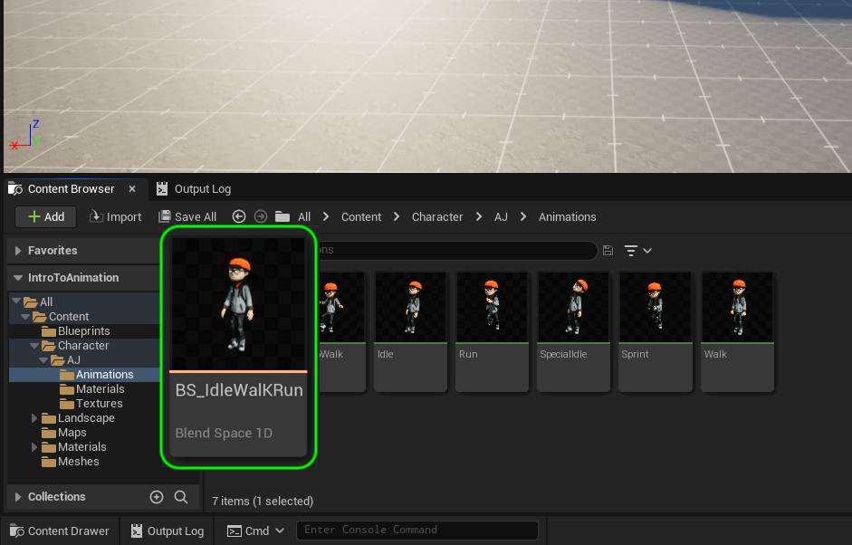
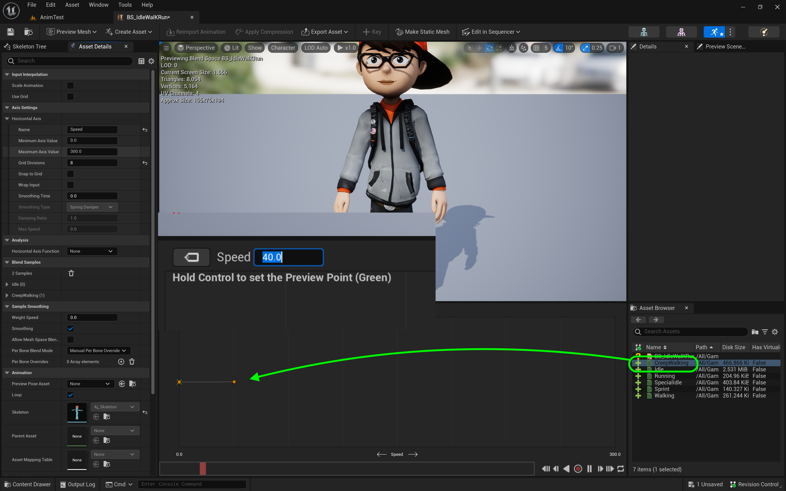
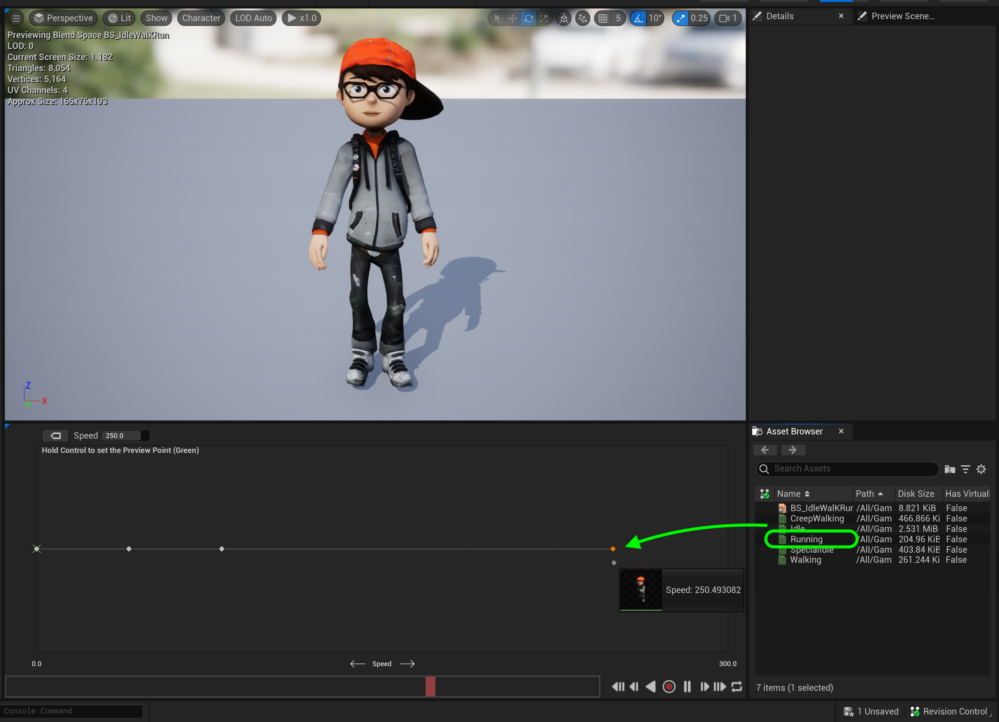

### Animation Blend Space

[previous](../adding-controls/README.md#user-content-adding-controls) • [home](../README.md#user-content-ue4-animations) • [next](../anim-bp/README.md#user-content-our-first-animation-blueprint)

To go between stand, creep walk, walk, run and fast run that can adopt to any speed will blend between our animations. We need to create an animation blend space to achieve this.

---

##### `Step 1.`\|`ITA`|:small_blue_diamond:

The first thing we will implement is our player movement. The player will go from idle to creep walk to walk to run to speed run. We will be blending between these 5 animations. Go to the **Animations** folder and *press* the <kbd>+ Add</kbd> button. *Select* **Animation | Legacy | Blend Space 1D**. This will be a 1 dimensional blend.

##### `Step 2.`\|`FHIU`|:small_blue_diamond: :small_blue_diamond: 

This brings up a **Pick Skeleton** overlay. Pick the skeleton you imported.

##### `Step 3.`\|`ITA`|:small_blue_diamond: :small_blue_diamond: :small_blue_diamond:

Call it `BS_IdleWalkRun`.

##### `Step 4.`\|`ITA`|:small_blue_diamond: :small_blue_diamond: :small_blue_diamond: :small_blue_diamond:

*Double click* the blend space you just created. Open up the **Axis Settings** tab on the **Asset Details** and *change* the **Number of Grid Divisions** to `8`. *Change* the name of this **Horizontal Axis | Name** to `Speed` and **Maximum Axis Value** to `300`.

##### `Step 5.`\|`ITA`| :small_orange_diamond:

Make sure on the right hand side you are on the **Asset Browser** tab and *drag and drop* the **Idle** animation (the breathing idle that loops and not the fancier one) to the far left side of the blend space. It should be at location `0`.

##### `Step 6.`\|`ITA`| :small_orange_diamond: :small_blue_diamond:

Drag and drop the **CreepWalk** animation and put it close to `40.0` on the **1D blend space**.

##### `Step 7.`\|`ITA`| :small_orange_diamond: :small_blue_diamond: :small_blue_diamond:

*Drag and drop* the **Walk** animation to around `80` on the **blend space**.

##### `Step 8.`\|`ITA`| :small_orange_diamond: :small_blue_diamond: :small_blue_diamond: :small_blue_diamond:

*Drag and drop* **Run** around `250.0` on **blend space**.

##### `Step 9.`\|`ITA`| :small_orange_diamond: :small_blue_diamond: :small_blue_diamond: :small_blue_diamond: :small_blue_diamond:

Finally *place* the **Sprint** animation at the end of the *timeline* at `350`.

##### `Step 10.`\|`ITA`| :large_blue_diamond:

Scrub along the timeline and watch animation states blend. In this case I am happy with the results and can leave the blend defaults as they stand. The animation will be selected based on the speed of the character.

https://user-images.githubusercontent.com/5504953/196059260-aa3292ba-848e-41b7-bf9f-5d991eac75f6.mp4

##### `Step 11.`\|`ITA`| :large_blue_diamond: :small_blue_diamond: 

Select the **File | Save All** then quit UE5.   Go to **P4V** and go the top project folder (the one that holds the `.uproject` file and **Content** folder) and press the <kbd>+Add</kbd> then <kbd>OK</kbd> button.  This makes sure any files that Unreal didn't add get added to source control. Press the <kbd>Submit</kbd> button and enter a message explaining the work done.  Press <kbd>Submit</kbd>.

___

<!--  -->

| [previous](../adding-controls/README.md#user-content-adding-controls)| [home](../README.md#user-content-ue4-animations) | [next](../anim-bp/README.md#user-content-our-first-animation-blueprint)|
|---|---|---|
