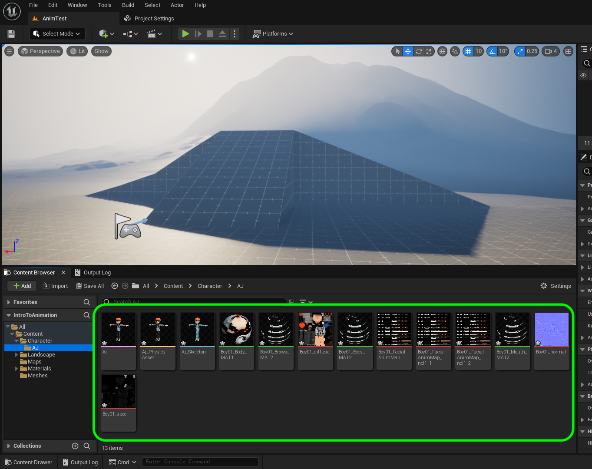
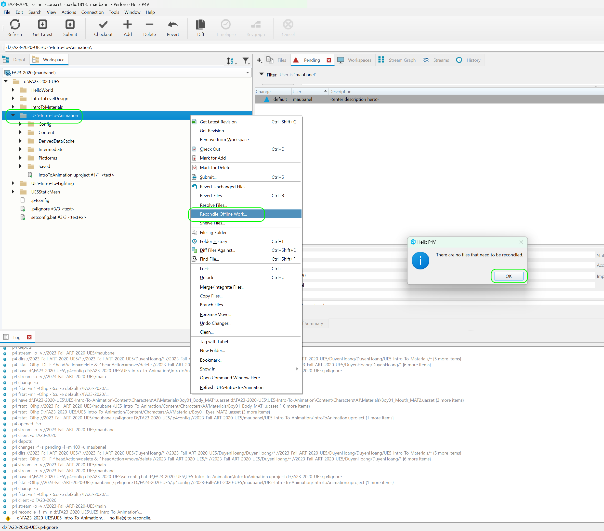

### Download Character & Animations

[previous](../setting-up/README.md#user-content-setting-up) • [home](../README.md#user-content-ue4-animations) • [next](../fixing-model/README.md#user-content-fixing-mixamo-models)

There are many options available to us, but lets use a non UE4 solution to see just how easy it is to import an FBX file with animations. We will start by selecting a character then downloading some animations.

 

---

##### `Step 1.`\|`ITA`|:small_blue_diamond:

Navigate in a web browser to [mixamo.com](https://www.mixamo.com/#/) and you can sign in with your **Adobe** credentials (they are run by Adobe) or create a new account (it is free to use).

##### `Step 2.`\|`FHIU`|:small_blue_diamond: :small_blue_diamond: 

*Press* the **Characters** tab and *scroll* through their selection of character models. I will select **AJ** but you can pick the one of your choice. Once you have chosen press the <kbd>Download</kbd> button.

##### `Step 3.`\|`ITA`|:small_blue_diamond: :small_blue_diamond: :small_blue_diamond:

You will now get a **Download Settings** menu. We will leave the **Format** as `FBX` and the **Pose** as `T-pose`. Press the <kbd>Download</kbd> button to get the model.

##### `Step 4.`\|`ITA`|:small_blue_diamond: :small_blue_diamond: :small_blue_diamond: :small_blue_diamond:

*Press* on the **Animations** tab. Lets find some animations. Lets start with the regular run speed. *Type* `Run` in the **Search** menu and *click* through various runs. Pick a moderate speed run that you like. Now adjust the various settings to make it as you would like. Make sure the arms don't swing into the body polygons.

##### `Step 5.`\|`ITA`| :small_orange_diamond:

Now the unreal engine will be propelling the player forward and backward. So we do not want the animation to translate through space. When you find an animation you like make sure you press the **In Place** toggle so that the player runs on the spot. *Make sure you do this for ALL your animations that are controlled by player or AI*. Make all adjustments then press the <kbd>Download</kbd> button.

https://user-images.githubusercontent.com/5504953/132144425-3b043aff-a8a6-4de0-a65c-7435a532e222.mp4

##### `Step 6.`\|`ITA`| :small_orange_diamond: :small_blue_diamond:

In the Download Settings you will need to make a change. We do not need the model every time, and now only need animation data that is solved to this model. Select the **Skin** drop down menu and change it to `Without Skin`. Press the <kbd>Download</kbd> button.

##### `Step 7.`\|`ITA`| :small_orange_diamond: :small_blue_diamond: :small_blue_diamond:

Repeat this process for a fast run. Make sure you select **In Place** and download this new animation as you did previously.

##### `Step 8.`\|`ITA`| :small_orange_diamond: :small_blue_diamond: :small_blue_diamond: :small_blue_diamond:

Repeat for a slow walk animation. I found one that looks like he is sneaking up on someone.

##### `Step 9.`\|`ITA`| :small_orange_diamond: :small_blue_diamond: :small_blue_diamond: :small_blue_diamond: :small_blue_diamond:

Download a normal speed walk.

##### `Step 10.`\|`ITA`| :large_blue_diamond:

Pick two idle animations. One that is just breathing and another one that we can cut to after a timer to give the animation some personality. My second animation is **Happy Idle**. Make sure you pick an idle that starts and stops in the same position and doesn't move around too much (so they don't collide with objects accidentally when they are triggered).

##### `Step 11.`\|`ITA`| :large_blue_diamond: :small_blue_diamond: 

Double click the **IntroToAnimation.uproject** from **P4V** to open up the game editor. Create two new folders called `Characters | AJ`. You can call the name of the second folder by the character you picked for the game (I picked AJ). Go to your **Downloads** folder and drag the file that has the characters name on it into the **AJ** character folder. As a hint, it will be the largest file (model is bigger than the animations, but they are all .fbx format).

Now in a production game we want to share the same base skeleton where we can. To learn more about this go to this [Skeletal Assets Unreal Training Video](https://www.youtube.com/watch?v=JkcJ5bjGPsg) to find out more. For us we will use the skeleton that is provided with this geometry. So make sure you leave **Skeleton** blank and you can leave all the other settings as default. It should set **Skeletal Mesh** and **Import Mesh** to `true` as it should detect the skeleton automatically.  If it doesn't set these to `true`.

##### `Step 12.`\|`ITA`| :large_blue_diamond: :small_blue_diamond: :small_blue_diamond: 

With the AJ model I got a few errors.  It looks like it had an issue with the facial textures. Now this imports a lot of files into the project. You should see a **Skeletal Mesh**, a **Physics Asset**, a **Skeleton**, a group of **Materials** and finally a group of **Textures**. If you picked a different character then your folder will have different files.

##### `Step 13.`\|`ITA`| :large_blue_diamond: :small_blue_diamond: :small_blue_diamond:  :small_blue_diamond: 

In importing the mesh an error popped up telling me it had to duplicate textures.  It created three copies of `Boy01_FacialAnimMap`.  Right click the two copies and select the <kbd>Delete</kbd> button and then select the original file press the <kbd>Replace References</kbd> button to replace the refences with the one original file.  In my case I did not get this menu. If you can't replace the textures then we will manually fix them.

##### `Step 14.`\|`ITA`| :large_blue_diamond: :small_blue_diamond: :small_blue_diamond: :small_blue_diamond:  :small_blue_diamond: 

Now open up **Boy01_Eyes_MAT2**, **Boy01_Brow_MAT2** and **Boy01_Mouth_MAT2**.  Make sure all textures are pointing to the texture sheet with all the small images. There should be no compile errors in any of these three materials.

##### `Step 15.`\|`ITA`| :large_blue_diamond: :small_orange_diamond: 

Create a new folder under **AJ** called `Materials`. *Drag and drop* to *move* the materials into this folder. The materials have the green line in their icon.

Create a new folder under **AJ** called `Textures`. *Drag and drop* to move the textures into this folder.

##### `Step 16.`\|`ITA`| :large_blue_diamond: :small_orange_diamond:   :small_blue_diamond: 

Right click on the **Characters** folder and select **Fix Up Redirectors in Folder**. This will fix all the links to the files we moved around.  

Open the **skeletal mesh**. Look at the left-hand side and you will see a list of bones that are on the skeleton. You will notice that the face is not rendered correctly.  If you picked a different character there may be this or other problems to fix. We will look at this next.

##### `Step 17.`\|`ITA`| :large_blue_diamond: :small_orange_diamond: :small_blue_diamond: :small_blue_diamond:

*Double click* the **Physics** asset and look at it. You can see that this has the collision volumes that move with the mesh. The default settings should be fine. Notice that is has a simplified collision shape around each bone (a bone is a line between two joints in a skeleton).

##### `Step 18.`\|`ITA`| :large_blue_diamond: :small_orange_diamond: :small_blue_diamond: :small_blue_diamond: :small_blue_diamond:

Select the **File | Save All** then press the <kbd>Revision Control</kbd> button and select **Submit Content**.  If you are prompted, select **Check Out** for all items that are not checked out of source control. Update the **Changelist Description** message and with the latest changes. Make sure all the files are correct and press the <kbd>Submit</kbd> button. A confirmation will pop up on the bottom right with a message about a changelist was submitted with a commit number. Quit Unreal and make sure your **Pending** tab in **P4V** is empty. **Submit** any work that is still in the editor.

##### `Step 19.`\|`ITA`| :large_blue_diamond: :small_orange_diamond: :small_blue_diamond: :small_blue_diamond: :small_blue_diamond: :small_blue_diamond:

Sometimes not all files get submitted to Unreal especially for files that don't show up in the editor.  It is good practice one you submit in **Unreal** and quit the game to right click on the top most project folder and select **Reconcile Offline Work...**.

This will either give a message saying ther is nothing to reconcile or bring up a tab.  Make sure that these are **NOT** files in the **Intermediate** and **Saved** folders as these should be ignored from the `.p4ignore`.

If the files are in **Content** or **Configuration** then press the <kbd>Reconcile</kbd> button.  Then submit the changes with a message and press the <kbd>Submit</kbd> button.

<!--  -->

| [previous](../setting-up/README.md#user-content-setting-up)| [home](../README.md#user-content-ue4-animations) | [next](../fixing-model/README.md#user-content-fixing-mixamo-models)|
|---|---|---|
