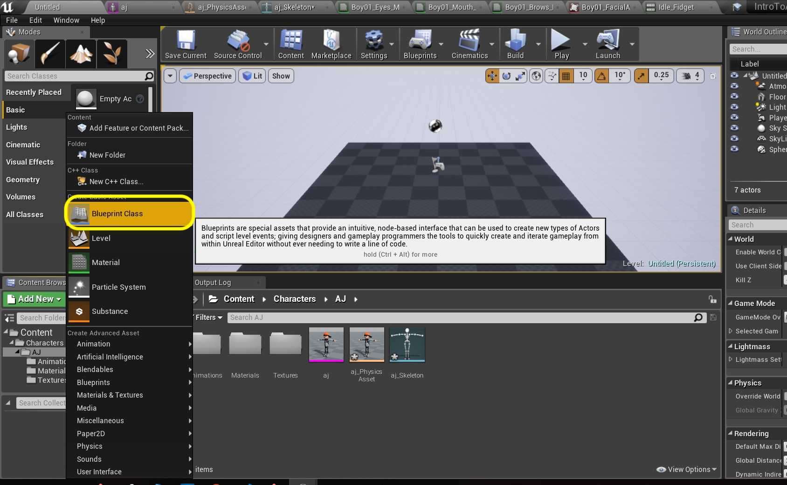
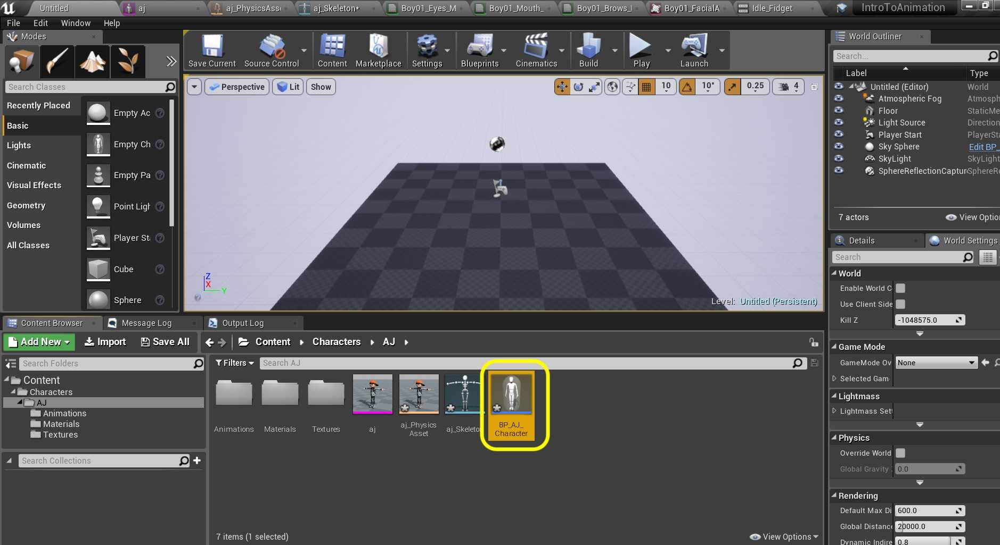
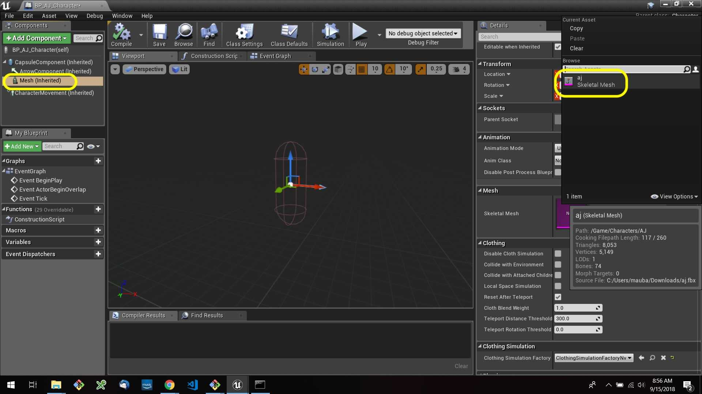
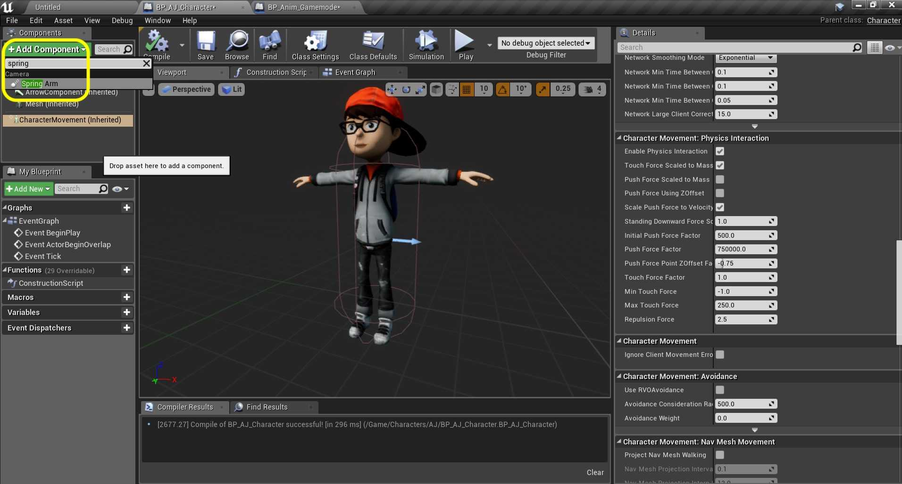

### Setting Up Character Blueprint

[previous](../add-animations/README.md#user-content-add-animations) • [home](../README.md#user-content-ue4-animations) • [next](../adding-controls/README.md#user-content-adding-controls)

There is a special kind of blueprint used for a bipedal character that we can control. It has the majority of the hard work to get this running done for us.

 

---

##### `Step 1.`\|`ITA`|:small_blue_diamond:

Go to the **AJ** folder and press the <kbd>Add New</kbd> button and select **Blueprint Class**.

##### `Step 2.`\|`FHIU`|:small_blue_diamond: :small_blue_diamond: 

*Select* a **Character** class to inherit from (not Actor). *Call it* `BP_AJCharacter`.

##### `Step 3.`\|`ITA`|:small_blue_diamond: :small_blue_diamond: :small_blue_diamond:

Open the blueprint and select the **Mesh** component. *Select* the `AJ Skeletal Mesh` from the menu on the right.

##### `Step 4.`\|`ITA`|:small_blue_diamond: :small_blue_diamond: :small_blue_diamond: :small_blue_diamond:

Make sure the character's feet are at the bottom of the collision volume. Now we need to attach a camera to the player that will follow them around the level. It needs to be attached to a spring arm. This allows the camera to deal with colliding with walls, ceilings or other surfaces. Press **Add Component** and look for a `Spring Arm`. Add it to the character:

##### `Step 5.`\|`ITA`| :small_orange_diamond:

Add a another component and this time it will be a `Camera`.

##### `Step 6.`\|`ITA`| :small_orange_diamond: :small_blue_diamond:

Make sure the **Camera** is a *child* of the **Spring Arm** component. Make sure that **Spring Arm** is not a child of any other component except for the root **Capsule Component**.

##### `Step 7.`\|`ITA`| :small_orange_diamond: :small_blue_diamond: :small_blue_diamond:

Select the **Spring Arm** component. Notice that it is to the left of the player. Rotate it 90° on **Z** until it is behind the player. Lets raise the target of the camera to above the player's head by adjusing the **Target Offset | Z** to `260.0` and make the arm a bit longer to `400.0` units.

##### `Step 8.`\|`ITA`| :small_orange_diamond: :small_blue_diamond: :small_blue_diamond: :small_blue_diamond:

Now the camera should be *rotated* to be angled correctly by altering the **Camera** component in **Rotation | Y** by about `334.0`.

##### `Step 9.`\|`ITA`| :small_orange_diamond: :small_blue_diamond: :small_blue_diamond: :small_blue_diamond: :small_blue_diamond:

Now lets add a new gamemode blueprint to select this character when the level starts. Go to the Content Browser and add a new folder called `Blueprints`.

##### `Step 10.`\|`ITA`| :large_blue_diamond:

Press the <kbe>Add New</kbd> button and *select* a **Blueprint Class** of **Game Mode Base**.

##### `Step 11.`\|`ITA`| :large_blue_diamond: :small_blue_diamond: 

Call it `BP_AnimGamemode`.

##### `Step 12.`\|`ITA`| :large_blue_diamond: :small_blue_diamond: :small_blue_diamond: 

Double click the blueprint and set the **Default Pawn** Class to the newly created `BP_AJCharacter`.

##### `Step 13.`\|`ITA`| :large_blue_diamond: :small_blue_diamond: :small_blue_diamond:  :small_blue_diamond: 

Go back to the game window. Now select the **Settings | World Settings** to bring up the **World Settings** tab. Go to **Game Mode** in the **World Settings** and then *select* the newly created `BP_AnimGamemode`. Make sure that the correct pawn is selected underneath.

##### `Step 14.`\|`ITA`| :large_blue_diamond: :small_blue_diamond: :small_blue_diamond: :small_blue_diamond:  :small_blue_diamond: 

##### `Step 15.`\|`ITA`| :large_blue_diamond: :small_orange_diamond: 

##### `Step 16.`\|`ITA`| :large_blue_diamond: :small_orange_diamond:   :small_blue_diamond: 

##### `Step 17.`\|`ITA`| :large_blue_diamond: :small_orange_diamond: :small_blue_diamond: :small_blue_diamond:

##### `Step 18.`\|`ITA`| :large_blue_diamond: :small_orange_diamond: :small_blue_diamond: :small_blue_diamond: :small_blue_diamond:

##### `Step 19.`\|`ITA`| :large_blue_diamond: :small_orange_diamond: :small_blue_diamond: :small_blue_diamond: :small_blue_diamond: :small_blue_diamond:

##### `Step 20.`\|`ITA`| :large_blue_diamond: :large_blue_diamond:

##### `Step 21.`\|`ITA`| :large_blue_diamond: :large_blue_diamond: :small_blue_diamond:

___

| [previous](../add-animations/README.md#user-content-add-animations)| [home](../README.md#user-content-ue4-animations) | [next](../adding-controls/README.md#user-content-adding-controls)|
|---|---|---|
