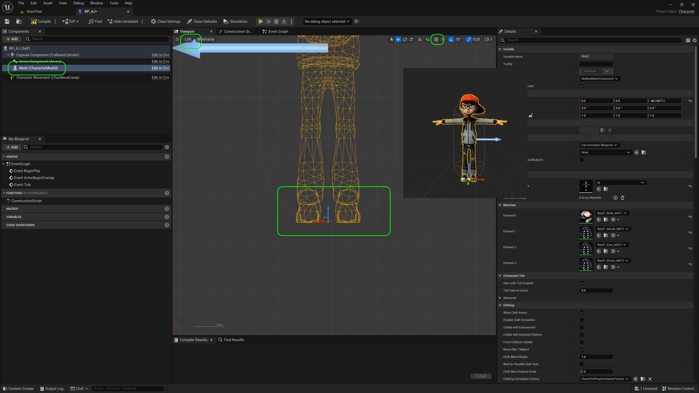
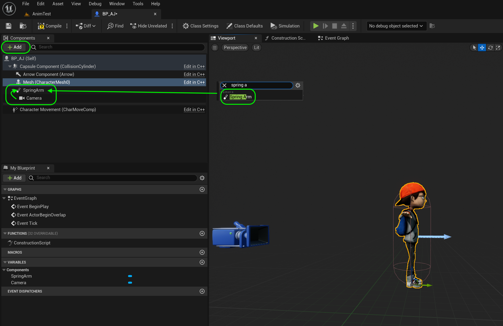
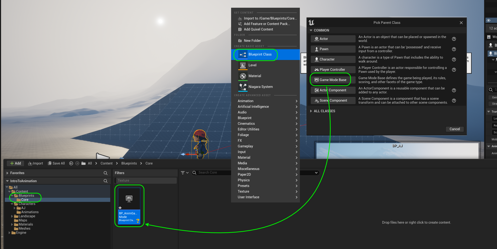

### Setting Up Character Blueprint

[previous](../add-animations/README.md#user-content-add-animations) • [home](../README.md#user-content-ue4-animations) • [next](../adding-controls/README.md#user-content-adding-controls)

There is a special kind of blueprint used for a bipedal character that we can control. It has the majority of the hard work to getting all the locomotion in the game. Although it is quick for us, there is a lot of work done by the engine to enable all of this functionality.  We are just playing with the tip of the iceberg in terms of code and prcoesses.

---

##### `Step 1.`\|`ITA`|:small_blue_diamond:

Go to the **AJ** folder and press the <kbd>+ Add</kbd> button and select **Blueprint Class**. *Select* a **Character** class to inherit from (not Actor).

##### `Step 2.`\|`FHIU`|:small_blue_diamond: :small_blue_diamond: 

 *Call it* `BP_AJ` or basaed on the character you downloaded.

##### `Step 3.`\|`ITA`|:small_blue_diamond: :small_blue_diamond: :small_blue_diamond:

Open the blueprint and select the **Mesh** component. *Select* the `AJ Skeletal Mesh` from the menu on the right.

##### `Step 4.`\|`ITA`|:small_blue_diamond: :small_blue_diamond: :small_blue_diamond: :small_blue_diamond:

Make sure the character's feet are at the bottom of the collision volume. Do this by selecting the **Mesh** component and moving the skeletal mesh to the correct position relative to the collider volume. Undo the snap to grid and pick an orthogal view like **Left** and zoom in to the feet and have hte bottom of the foot one pixel below the very bottom of the collision volume.

##### `Step 5.`\|`ITA`| :small_orange_diamond:

Now we need to attach a camera to the player that will follow them around the level. Press the <kbd>+ Add</kbd> button and add a camera component.

##### `Step 6.`\|`ITA`| :small_orange_diamond: :small_blue_diamond:

The camera needs to be attached to a spring arm. This allows the camera to deal with colliding with walls, ceilings or other surfaces. Press **+ Add** component and look for a `Spring Arm`. Add it to the character.

Now take the **Camera** and drag it on top of the **Spring Arm** component to make it a *child*. Make sure that **Spring Arm** a *child* of the root **Capsule Component**. This way when the spring arm moves the camera moves with it (as it tries to avoid obstacles).

##### `Step 7.`\|`ITA`| :small_orange_diamond: :small_blue_diamond: :small_blue_diamond:

Now the player is not facing the direction of the white arrow (or forward).  We will select the **Mesh** component and rotate the **Z** axis by `90.0`°. 

##### `Step 8.`\|`ITA`| :small_orange_diamond: :small_blue_diamond: :small_blue_diamond: :small_blue_diamond:

Select the **Spring Arm** component. Lets raise the target of the camera to above the player's head by adjusing the **Socket Offset | Z** to `218.0` and make the **Target Arm Length** a bit longer to `750.0` units.

##### `Step 9.`\|`ITA`| :small_orange_diamond: :small_blue_diamond: :small_blue_diamond: :small_blue_diamond: :small_blue_diamond:

Now the camera should be *rotated* to be angled correctly by altering the **Camera** component in **Rotation | Y** by about `350.0`.

##### `Step 10.`\|`ITA`| :large_blue_diamond:

Now lets test our work.  Go back to the editor and drag **BP_AJ** to the level.  Select the character in the **Outliner** and a preview window of the camera view will pop up.  Make changes to the spring arm and camera angle to frame up the player to your liking. When you are done remove the player from the game as we will load the player with a **Player Start** actor and a custom **Game Mode** blueprint.

##### `Step 11.`\|`ITA`| :large_blue_diamond: :small_blue_diamond: 

Add a new set of folders called `Blueprints | Core`. Press the <kbd>+ Add</kbd> button and *select* a **Blueprint Class** of **Game Mode Base**. Call it `BP_AnimGamemode`.

##### `Step 12.`\|`ITA`| :large_blue_diamond: :small_blue_diamond: :small_blue_diamond: 

Double click the blueprint and set the **Default Pawn** Class to the newly created `BP_AJ`. This will launch this blueprint when we start the game if we select the game mode.

##### `Step 13.`\|`ITA`| :large_blue_diamond: :small_blue_diamond: :small_blue_diamond:  :small_blue_diamond: 

We can assign the gamemode to the entire game or just the single level.  We do it for the entire game in the **Project Settings | Maps & Modes**.   Go to **Default GameMode** and assign `BP_AnimGamemode`.  Open up the arrow to expand the settings and you should see the correct pawn being used.

##### `Step 14.`\|`ITA`| :large_blue_diamond: :small_blue_diamond: :small_blue_diamond: :small_blue_diamond:  :small_blue_diamond: 

You set it for a single level in the **World Settings** in the editor. If it is not on the bottom right go to **Winddows | World Settings** to access this window.  Go to the **World Settings** and then *select* the newly created `BP_AnimGamemode`. Make sure that the correct pawn is selected underneath. This way it is the default and you are overriding it with the same game mode in the level.

##### `Step 15.`\|`ITA`| :large_blue_diamond: :small_orange_diamond:

Delete the player from the level leaving just the **Player Start**.  The pawn will automatically take the position of the player start. *Press* **Play** and we should have a character being rendered with no physics. Now you have the player being launched with the aid of the game mode blueprint. 

##### `Step 16.`\|`ITA`| :large_blue_diamond: :small_orange_diamond: :small_blue_diamond:

Select the **File | Save All** then press the <kbd>Revision Control</kbd> button and select **Submit Content**.  If you are prompted, select **Check Out** for all items that are not checked out of source control. Update the **Changelist Description** message and with the latest changes. Make sure all the files are correct and press the <kbd>Submit</kbd> button. A confirmation will pop up on the bottom right with a message about a changelist was submitted with a commit number. Quit Unreal and make sure your **Pending** tab in **P4V** is empty. **Submit** any work that is still in the editor.

##### `Step 17.`\|`ITA`| :large_blue_diamond: :small_orange_diamond: :small_blue_diamond: :small_blue_diamond:

Sometimes not all files get submitted to Unreal especially for files that don't show up in the editor.  It is good practice one you submit in **Unreal** and quit the game to right click on the top most project folder and select **Reconcile Offline Work...**.

This will either give a message saying ther is nothing to reconcile or bring up a tab.  Make sure that these are **NOT** files in the **Intermediate** and **Saved** folders as these should be ignored from the `.p4ignore`.

If the files are in **Content** or **Configuration** then press the <kbd>Reconcile</kbd> button.  Then submit the changes with a message and press the <kbd>Submit</kbd> button.

##### `Step 18.`\|`ITA`| :large_blue_diamond: :small_orange_diamond: :small_blue_diamond: :small_blue_diamond: :small_blue_diamond:

<!--  -->

| [previous](../add-animations/README.md#user-content-add-animations)| [home](../README.md#user-content-ue4-animations) | [next](../adding-controls/README.md#user-content-adding-controls)|
|---|---|---|
