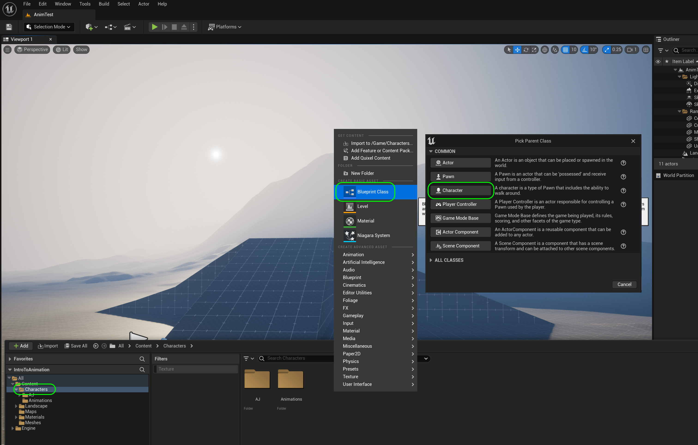

### Setting Up Character Blueprint

[previous](../add-animations/README.md#user-content-add-animations) • [home](../README.md#user-content-ue4-animations) • [next](../adding-controls/README.md#user-content-adding-controls)

There is a special kind of blueprint used for a bipedal character that we can control. It has the majority of the hard work to getting all the locomotion in the game. Although it is quick for us, there is a lot of work done by the engine to enable all of this functionality.  We are just playing with the tip of the iceberg in terms of code and prcoesses.

 

---

##### `Step 1.`\|`ITA`|:small_blue_diamond:

Go to the **AJ** folder and press the <kbd>+ Add</kbd> button and select **Blueprint Class**.

##### `Step 2.`\|`FHIU`|:small_blue_diamond: :small_blue_diamond: 

*Select* a **Character** class to inherit from (not Actor). *Call it* `BP_AJ`.

##### `Step 3.`\|`ITA`|:small_blue_diamond: :small_blue_diamond: :small_blue_diamond:

Open the blueprint and select the **Mesh** component. *Select* the `AJ Skeletal Mesh` from the menu on the right.

##### `Step 4.`\|`ITA`|:small_blue_diamond: :small_blue_diamond: :small_blue_diamond: :small_blue_diamond:

Make sure the character's feet are at the bottom of the collision volume. Now we need to attach a camera to the player that will follow them around the level. It needs to be attached to a spring arm. This allows the camera to deal with colliding with walls, ceilings or other surfaces. Press **+ Add** component and look for a `Spring Arm`. Add it to the character:

##### `Step 5.`\|`ITA`| :small_orange_diamond:

Add a another component and this time it will be a `Camera`.

##### `Step 6.`\|`ITA`| :small_orange_diamond: :small_blue_diamond:

Make sure the **Camera** is a *child* of the **Spring Arm** component. Make sure that **Spring Arm** a *child* of the root **Capsule Component**.

##### `Step 7.`\|`ITA`| :small_orange_diamond: :small_blue_diamond: :small_blue_diamond:

Select the **Spring Arm** component. Notice that it is to the left of the player. Rotate it 90° on **Z** until it is behind the player. Lets raise the target of the camera to above the player's head by adjusing the **Target Offset | Z** to `260.0` and make the **Target Arm Length** a bit longer to `400.0` units.

##### `Step 8.`\|`ITA`| :small_orange_diamond: :small_blue_diamond: :small_blue_diamond: :small_blue_diamond:

Now the camera should be *rotated* to be angled correctly by altering the **Camera** component in **Rotation | Y** by about `334.0`.

##### `Step 9.`\|`ITA`| :small_orange_diamond: :small_blue_diamond: :small_blue_diamond: :small_blue_diamond: :small_blue_diamond:

Now lets add a new gamemode blueprint to select this character when the level starts. Go to the Content Browser and add a new folder called `Blueprints`.

##### `Step 10.`\|`ITA`| :large_blue_diamond:

Press the <kbd>Add/Import</kbd> button and *select* a **Blueprint Class** of **Game Mode Base**.

##### `Step 11.`\|`ITA`| :large_blue_diamond: :small_blue_diamond: 

Call it `BP_AnimGamemode`.

##### `Step 12.`\|`ITA`| :large_blue_diamond: :small_blue_diamond: :small_blue_diamond: 

Double click the blueprint and set the **Default Pawn** Class to the newly created `BP_AJCharacter`.

##### `Step 13.`\|`ITA`| :large_blue_diamond: :small_blue_diamond: :small_blue_diamond:  :small_blue_diamond: 

We can assign the gamemode to the entire game or just the single level.  We do it for the entire game in the **Project Settings | Maps & Modes**.  You set it for a single level in the **World Settings**. 

Go back to the game window. Now select the **Settings | World Settings** to bring up the **World Settings** tab. Go to **Game Mode** in the **World Settings** and then *select* the newly created `BP_AnimGamemode`. Make sure that the correct pawn is selected underneath.

https://user-images.githubusercontent.com/5504953/132420802-8782387f-1b4e-432c-a2f8-5a79d10758fb.mp4

##### `Step 14.`\|`ITA`| :large_blue_diamond: :small_blue_diamond: :small_blue_diamond: :small_blue_diamond:  :small_blue_diamond: 

*Press* **Play** and we should have a character being rendered with no physics. Make any adjustments to the spring arm and camera angle to properly from the character. If you have no character on screen make sure your spring arm and camera are correctly adjusted.

##### `Step 15.`\|`ITA`| :large_blue_diamond: :small_orange_diamond:

Now since we have made a change to an unsaved level we need to save the **World Settings** by saving the level.  Create a new root folder called `Levels`.  Select **File | Save Current** and call the level `AnimTestLevel` and make sure you save it in the **Levels** folder.  Press the <kbd>Save</kbd> button. 

ß
##### `Step 16.`\|`ITA`| :large_blue_diamond: :small_orange_diamond: :small_blue_diamond:

Select the **File | Save All** then press the <kbd>Source Control</kbd> button and select **Submit to Source Control...**.  Enter a **Changelist Description** and then press <kbd>Submit</kbd>.  Open up **GitHub Desktop** and select **Push origin** to update the server with the latest changes.

___

<!--  -->

| [previous](../add-animations/README.md#user-content-add-animations)| [home](../README.md#user-content-ue4-animations) | [next](../adding-controls/README.md#user-content-adding-controls)|
|---|---|---|
