### Double Jump II

[previous](../double-jump/README.md#user-content-double-jump) • [home](../README.md#user-content-ue4-animations) • [next](../ramps/README.md#user-content-speed-up--down-ramps)

Finish setting up the double jump ability to the player.

 

---

##### `Step 1.`\|`ITA`|:small_blue_diamond:

Play the game and you should now be able to double jump and the text should reflect the correct state. Next up we will add the animation of the player rolling.

https://user-images.githubusercontent.com/5504953/133078025-b828a1e1-b9a0-49da-8a9e-7413e951ffee.mp4

##### `Step 2.`\|`FHIU`|:small_blue_diamond: :small_blue_diamond: 

When you have the double jump physics working you can delete the two **Print String** nodes.

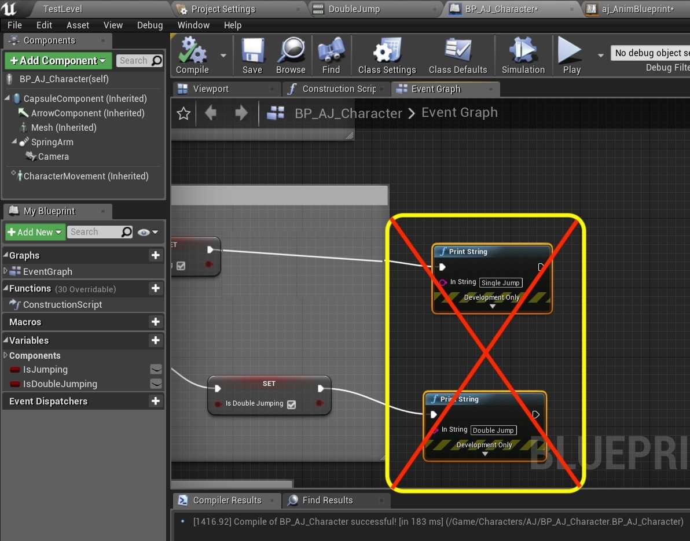

##### `Step 3.`\|`ITA`|:small_blue_diamond: :small_blue_diamond: :small_blue_diamond:

*Open* to the **bj_AnimBlueprint** and go to the **Event Graph**. *Duplicate* the **Pressed Jump** variable. Call it `bPressedDoubleJump`.

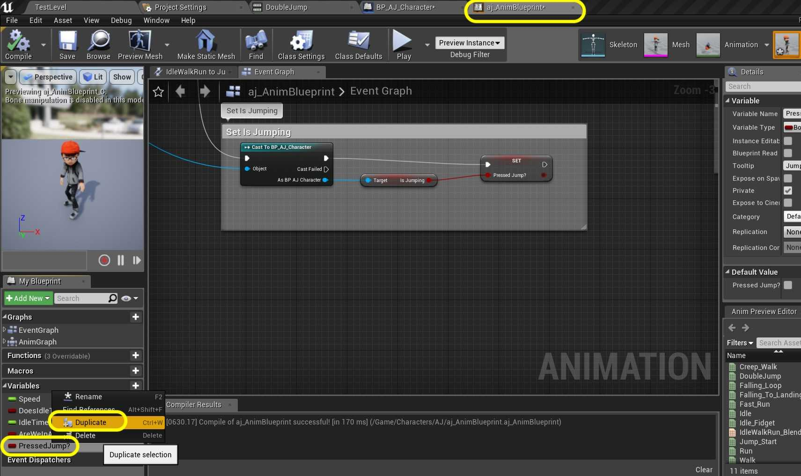

##### `Step 4.`\|`ITA`|:small_blue_diamond: :small_blue_diamond: :small_blue_diamond: :small_blue_diamond:

Go to the **Set Is Jumpin**g Section. Pull the As **BP_AJ_Character** pin and select a **Get Is Double Jumping** node.

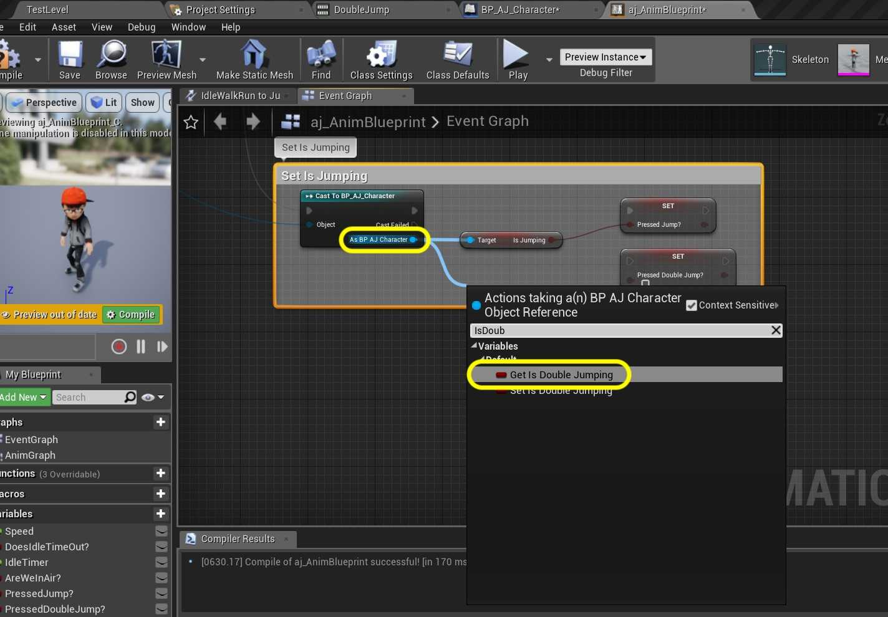

##### `Step 5.`\|`ITA`| :small_orange_diamond:

*Drag and drop* a **Set Pressed Double Jump** node. *Connect* it to the **Is Double Jumping** pin.

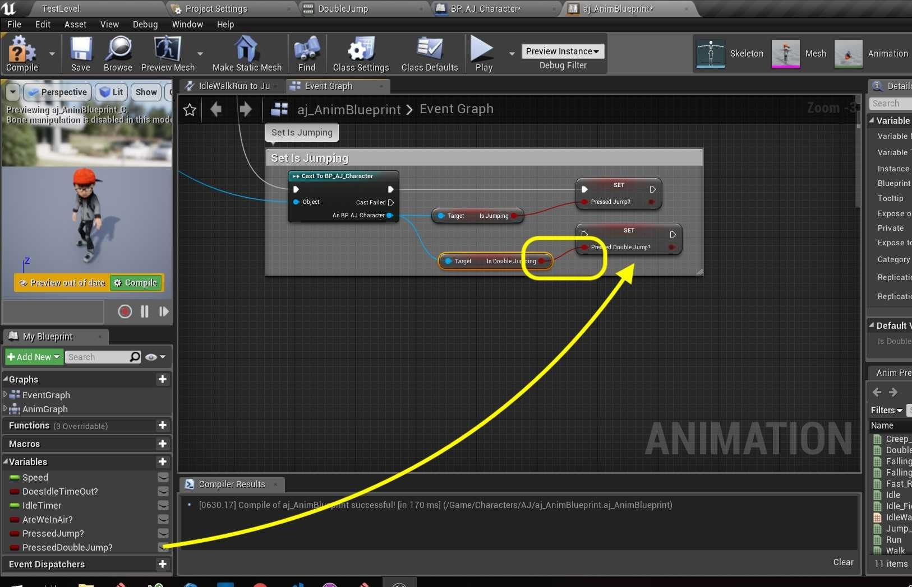

##### `Step 6.`\|`ITA`| :small_orange_diamond: :small_blue_diamond:

*Connect* the execution pin from the **Set Pressed Jump** node to the **Set Pressed Double Jump** node.

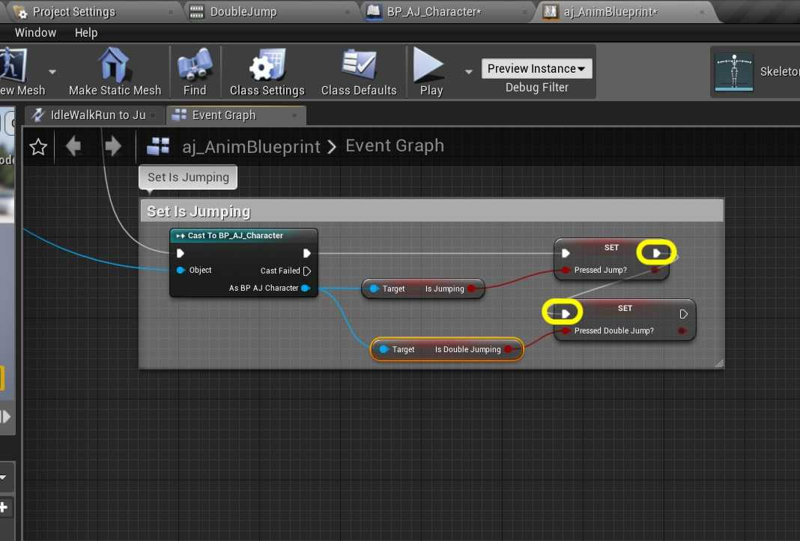

##### `Step 7.`\|`ITA`| :small_orange_diamond: :small_blue_diamond: :small_blue_diamond:

Go to the **Anim Graph | Core Locomotion** screen. To the right of the **Fall** node right click and select **Add State**.

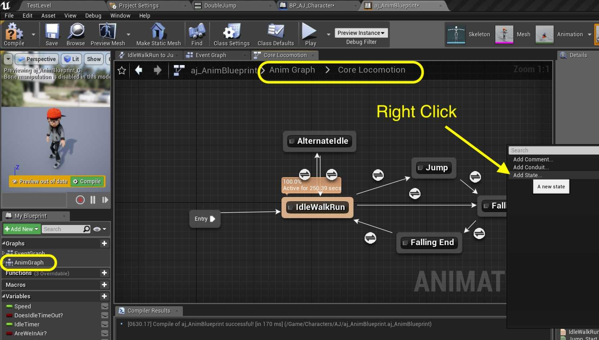

##### `Step 8.`\|`ITA`| :small_orange_diamond: :small_blue_diamond: :small_blue_diamond: :small_blue_diamond:

*Call* this new state `Double Jump`.

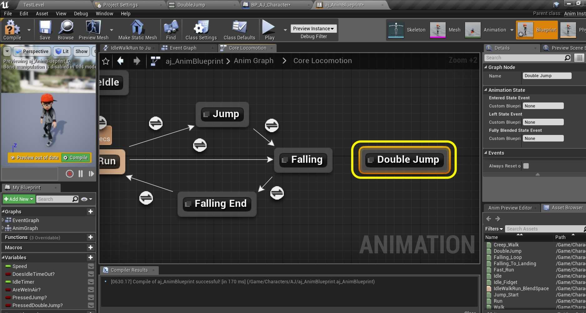

##### `Step 9.`\|`ITA`| :small_orange_diamond: :small_blue_diamond: :small_blue_diamond: :small_blue_diamond: :small_blue_diamond:

*Connect* the **Double Jump** node to and from the **Falling** node. We are double jumping while in the **Falling** state. *Double click* on the **Double Jump** node to assign the animation to this state.

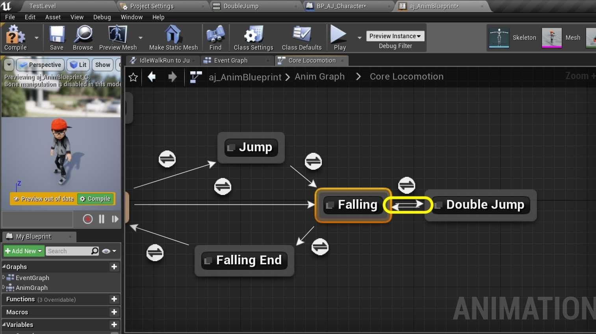

##### `Step 10.`\|`ITA`| :large_blue_diamond:

Drag and drop the **Double Jump** animation onto the animation graph.

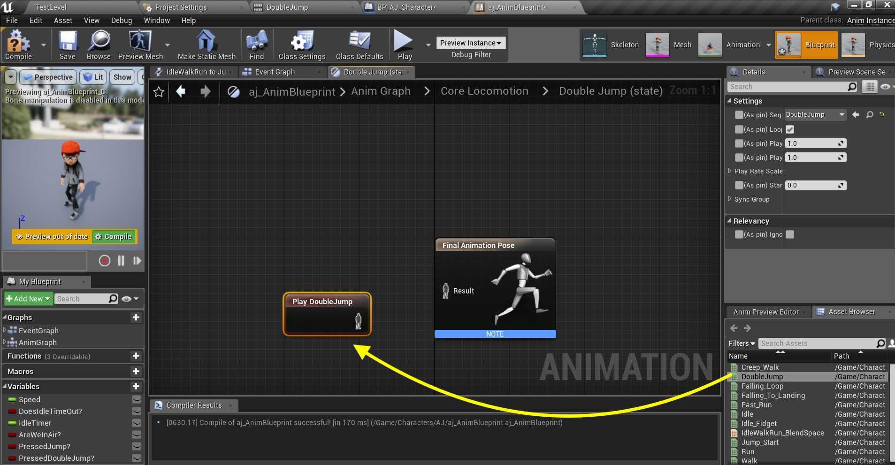

##### `Step 11.`\|`ITA`| :large_blue_diamond: :small_blue_diamond: 

*Connect* the **Play Double Jump** node to the **Final Animation Pose**.

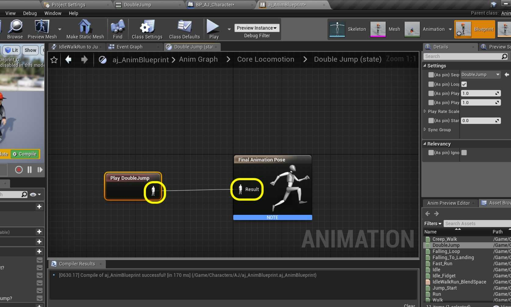

##### `Step 12.`\|`ITA`| :large_blue_diamond: :small_blue_diamond: :small_blue_diamond: 

*Double click* the transition from the **Falling** node to the **Double Jump** node.

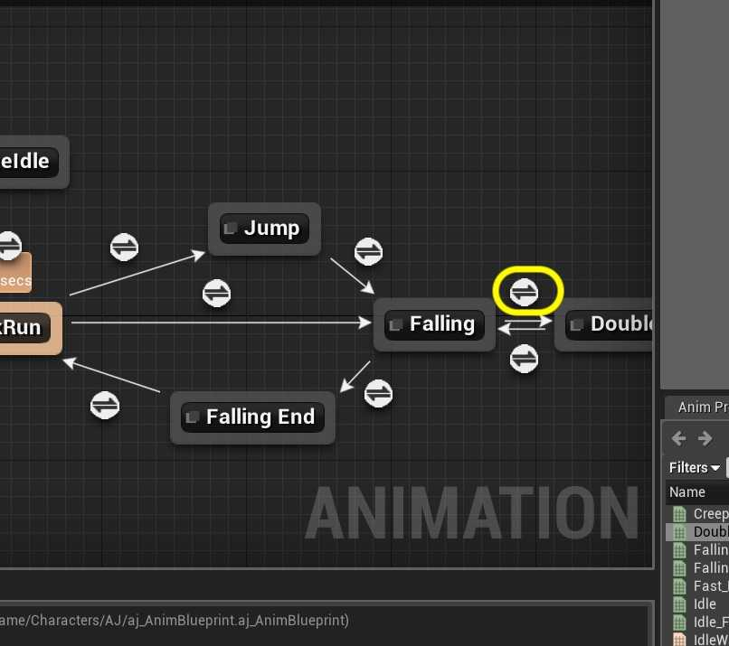

##### `Step 13.`\|`ITA`| :large_blue_diamond: :small_blue_diamond: :small_blue_diamond:  :small_blue_diamond: 

*Drag and drop* a **Get Pressed Double Jump** node onto the graph.

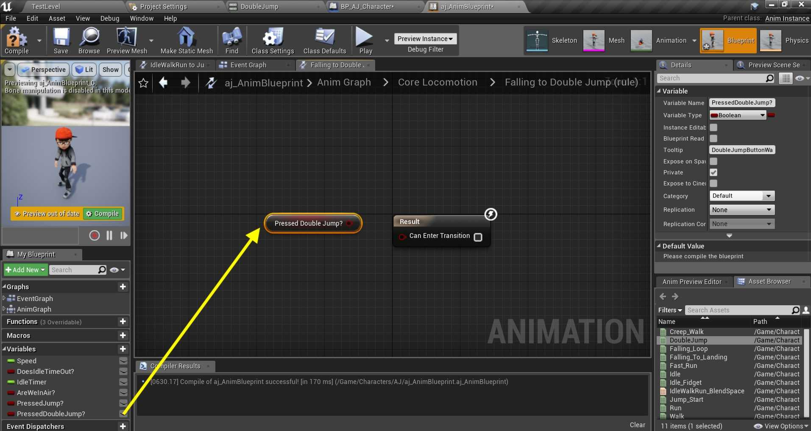

##### `Step 14.`\|`ITA`| :large_blue_diamond: :small_blue_diamond: :small_blue_diamond: :small_blue_diamond:  :small_blue_diamond: 

Connect the **Pressed Double Jump** node to the **Can Enter Transition** node. This will be triggered when in air and the **Pressed Double Jump** node is true.

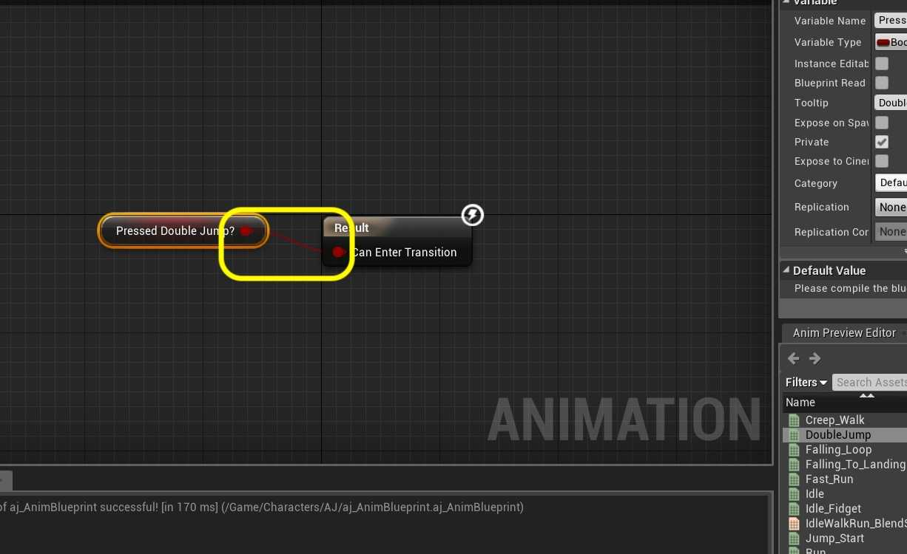

##### `Step 15.`\|`ITA`| :large_blue_diamond: :small_orange_diamond: 

Go back to the **Core Locomotion** screen. *Double click* on the **Double Jump to Falling** transition button. *Right click* on the graph and select a **Time Remaining (ratio) (Double Jump)** node.

##### `Step 16.`\|`ITA`| :large_blue_diamond: :small_orange_diamond:   :small_blue_diamond: 

*Pull off* of the **Return Value** from this node and select a **float <= float** node:

##### `Step 17.`\|`ITA`| :large_blue_diamond: :small_orange_diamond: :small_blue_diamond: :small_blue_diamond:

Set the value in the **<=** node to `0.2` and *connect* the output to the **Result** node.

##### `Step 18.`\|`ITA`| :large_blue_diamond: :small_orange_diamond: :small_blue_diamond: :small_blue_diamond: :small_blue_diamond:

One thing we haven't done is turn off the double jump state. If we run the game the player will just keep rolling. Go back to the **BP_AJ_Character** blueprint and go to the **Event Graph**. *Pull off* of the **Set Is Double Jumping** node's execution pin and add a **Delay** node.

##### `Step 19.`\|`ITA`| :large_blue_diamond: :small_orange_diamond: :small_blue_diamond: :small_blue_diamond: :small_blue_diamond: :small_blue_diamond:

Set the **Duration** of the **Delay** node to `0.1`. *Pull off* of the **Execution** pin and add a **Set Is Double Jumping** node and make sure it is set to `false`.

##### `Step 20.`\|`ITA`| :large_blue_diamond: :large_blue_diamond:

*Run* the game and a double jump animation should now run during the second jump. Press Save All and update Github by committing and pushing all the changes made.

https://user-images.githubusercontent.com/5504953/133079769-07e7d1f1-2ae2-4cb1-bb11-9be5d719a054.mp4

___

| [previous](../double-jump/README.md#user-content-double-jump)| [home](../README.md#user-content-ue4-animations) | [next](../ramps/README.md#user-content-speed-up--down-ramps)|
|---|---|---|
