### Double Jump II

[previous](../double-jump/README.md#user-content-double-jump) • [home](../README.md#user-content-ue4-animations) • [next](../ramps/README.md#user-content-speed-up--down-ramps)

Finish setting up the double jump ability to the player. 

 

---

##### `Step 1.`\|`ITA`|:small_blue_diamond:

Now lets set pressed jump to true for the first jump and reset the double jump in case it is true.  So drag a **Set Pressed Jump** and **Set Pressed Double Jump** to the right of the **Branch** node.  Set **Pressed Jump** to `true` and **Pressed Double Jump** to `false`. Connect them both to the **Branch | True** execution pin.

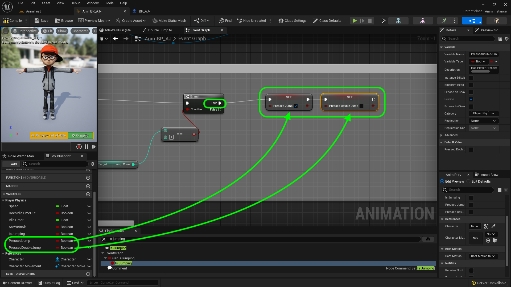

##### `Step 2.`\|`FHIU`|:small_blue_diamond: :small_blue_diamond: 

Drag off the **Jump Count** pin and select a **==** node.  This will now check to see if it is the second jump so set the second pin in the **==** node to `2`. This will run when we are at the second jump.

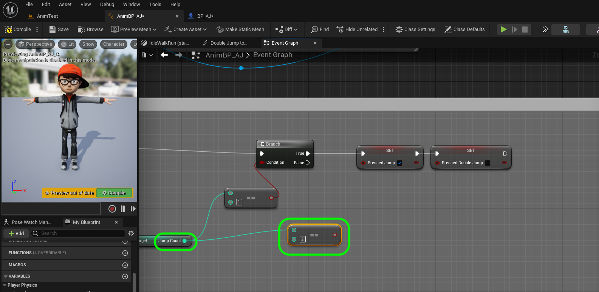

##### `Step 3.`\|`ITA`|:small_blue_diamond: :small_blue_diamond: :small_blue_diamond:

Pull off the second **==** nodes and select a new **Branch** node.  Connect it to the **Branch | False** pin from the first jump.

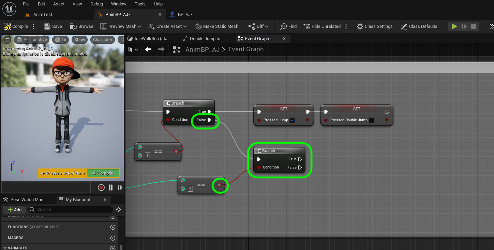

##### `Step 4.`\|`ITA`|:small_blue_diamond: :small_blue_diamond: :small_blue_diamond: :small_blue_diamond:

*Add* a **Set Pressed Double Jump** and set it to `true`.  Then add a **Set Pressed Jump** and set it to `false`. Connect both of them to the second **Branch** true node on the second jump.

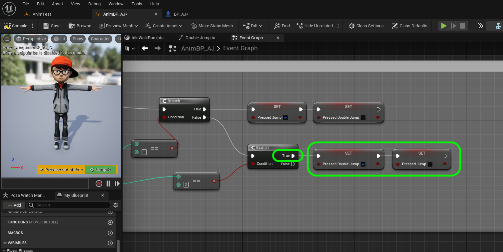

##### `Step 5.`\|`ITA`| :small_orange_diamond:

*Pull off* the **As BP_AJ** pin and select a **Set Jump Count** node and make it `3`.  Otherwise the player will keep spinning in the second jump spin.  This resets it so it doesn't call any jumping again until the player lands on the ground. Connect the **Execution** pin to the **Set Pressed Jump** node.

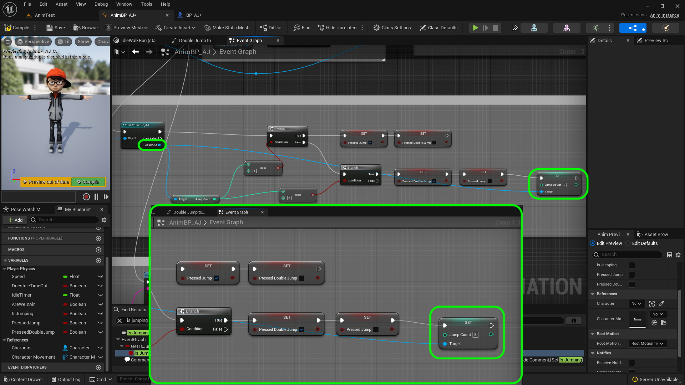

##### `Step 6.`\|`ITA`| :small_orange_diamond: :small_blue_diamond:

Now after the jump count is set to `3` we then set both **Pressed Jump** and **Pressed Double Jump** to false.  Add one more **Set Pressed Jump** and **Set Pressed Double Jump** to `false`.  Connect to the **Branch | False** pin from the second jump.

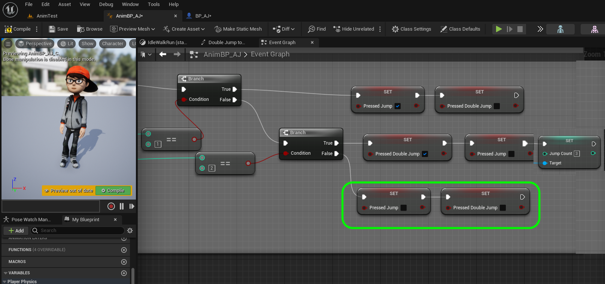

##### `Step 7.`\|`ITA`| :small_orange_diamond: :small_blue_diamond: :small_blue_diamond:

Go to the **Anim Graph | Core Locomotion** screen. To the right of the **Fall** node right click and select **Add State**.

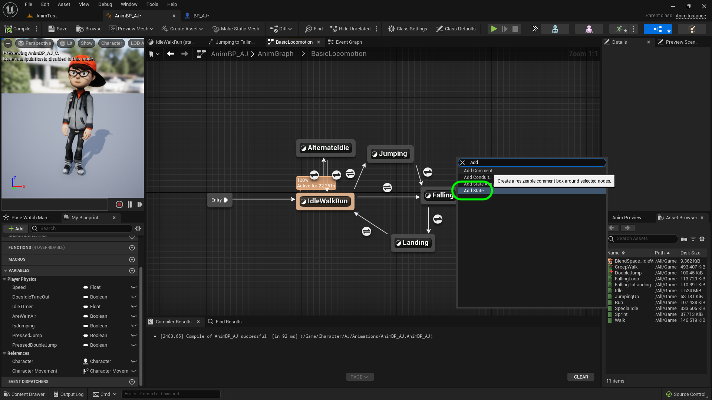

##### `Step 8.`\|`ITA`| :small_orange_diamond: :small_blue_diamond: :small_blue_diamond: :small_blue_diamond:

*Call* this new state `Double Jump`.

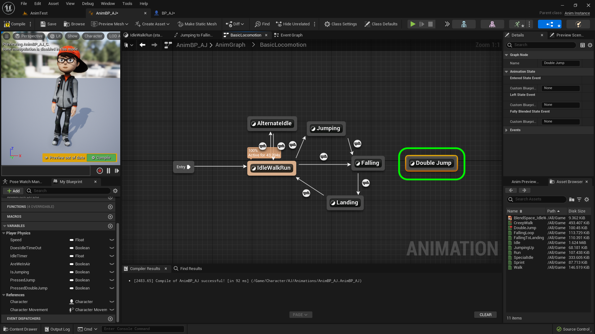

##### `Step 9.`\|`ITA`| :small_orange_diamond: :small_blue_diamond: :small_blue_diamond: :small_blue_diamond: :small_blue_diamond:

*Connect* the **Double Jump** node to and from the **Falling** node. We are double jumping while in the **Falling** state. *Double click* on the **Double Jump** node to assign the animation to this state.

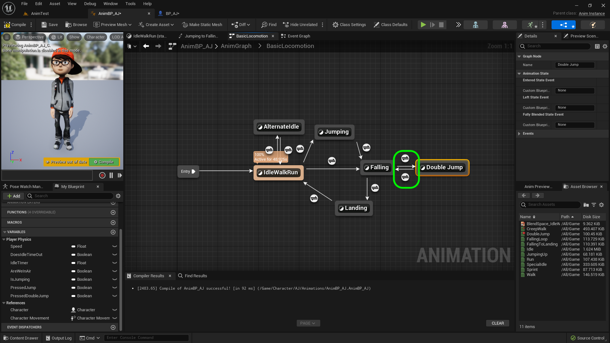

##### `Step 10.`\|`ITA`| :large_blue_diamond:

Drag and drop the **Double Jump** animation onto the animation graph.

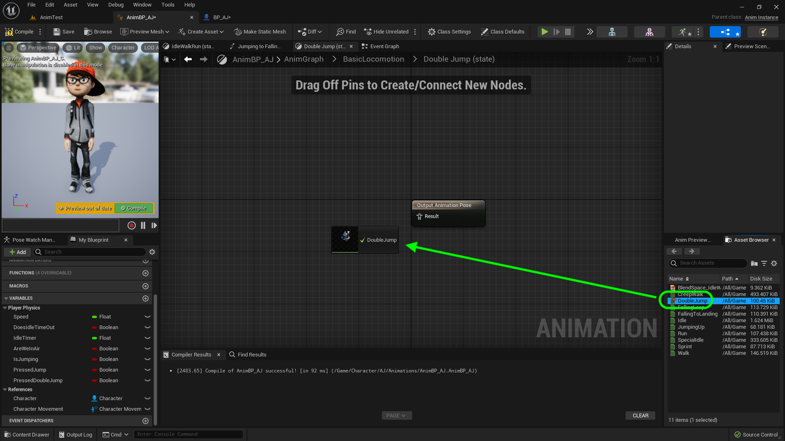

##### `Step 11.`\|`ITA`| :large_blue_diamond: :small_blue_diamond: 

*Connect* the **Play Double Jump** node to the **Final Animation Pose**.

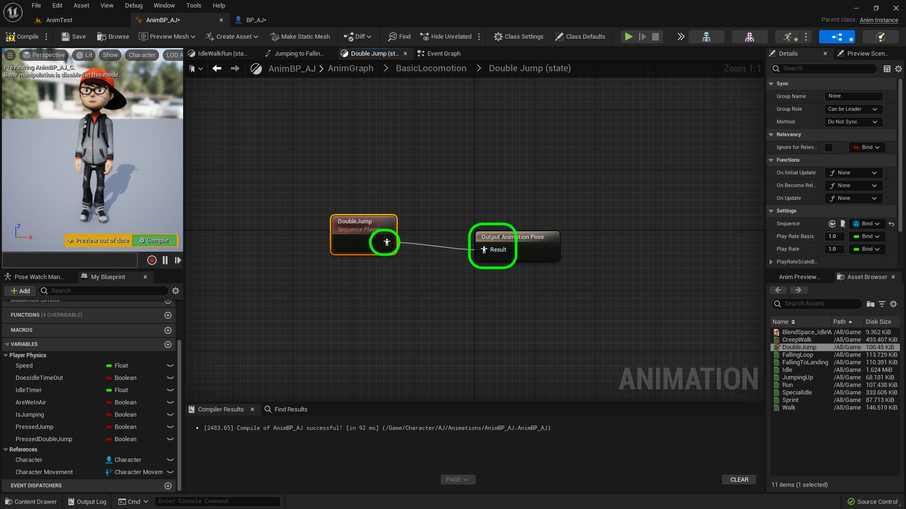

##### `Step 12.`\|`ITA`| :large_blue_diamond: :small_blue_diamond: :small_blue_diamond: 

*Double click* the transition from the **Falling** node to the **Double Jump** node.

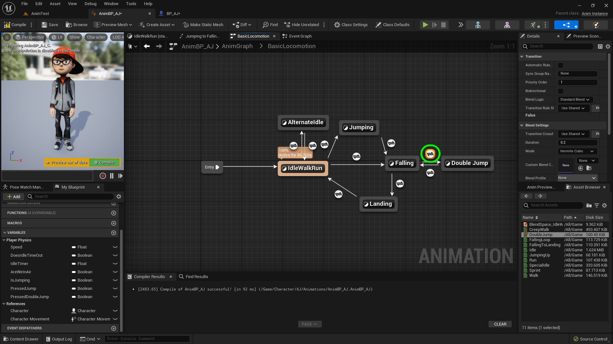

##### `Step 13.`\|`ITA`| :large_blue_diamond: :small_blue_diamond: :small_blue_diamond:  :small_blue_diamond: 

*Drag and drop* a **Get Pressed Double Jump** node onto the graph.

##### `Step 14.`\|`ITA`| :large_blue_diamond: :small_blue_diamond: :small_blue_diamond: :small_blue_diamond:  :small_blue_diamond: 

Connect the **Pressed Double Jump** node to the **Can Enter Transition** node. This will be triggered when in air and the **Pressed Double Jump** node is true.

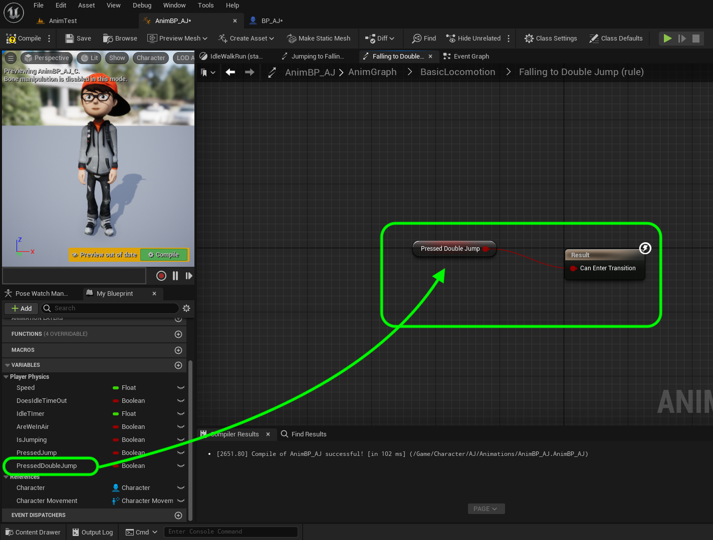

##### `Step 15.`\|`ITA`| :large_blue_diamond: :small_orange_diamond: 

Go back to the **Core Locomotion** screen. *Double click* on the **Double Jump to Falling** transition button. *Right click* on the graph and select a **Time Remaining (ratio) (Double Jump)** node.

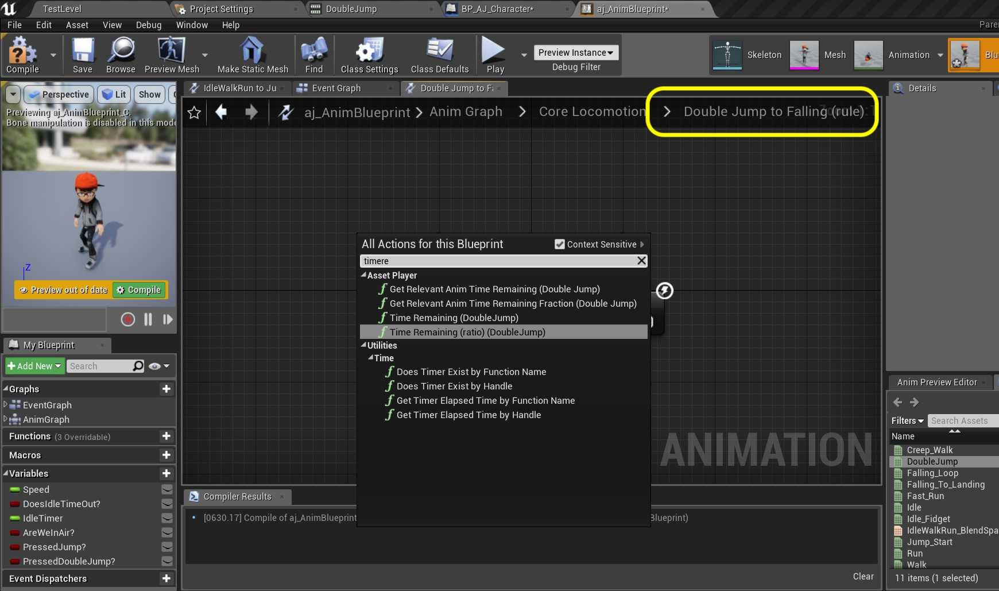

##### `Step 16.`\|`ITA`| :large_blue_diamond: :small_orange_diamond:   :small_blue_diamond: 

*Pull off* of the **Return Value** from this node and select a **float <= float** node:

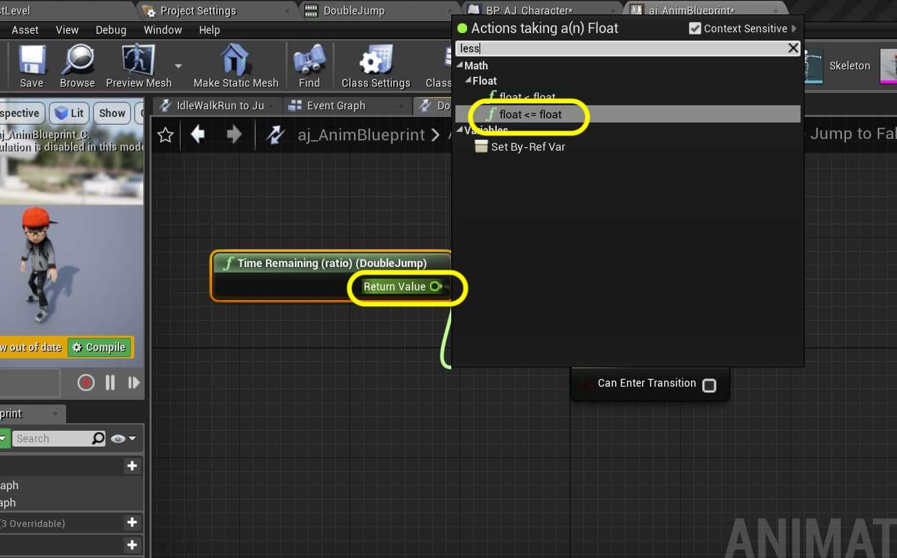

##### `Step 17.`\|`ITA`| :large_blue_diamond: :small_orange_diamond: :small_blue_diamond: :small_blue_diamond:

Set the value in the **<=** node to `0.2` and *connect* the output to the **Result** node.

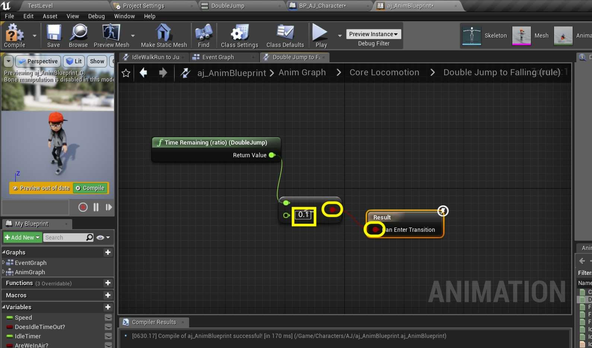

##### `Step 18.`\|`ITA`| :large_blue_diamond: :small_orange_diamond: :small_blue_diamond: :small_blue_diamond: :small_blue_diamond:

One thing we haven't done is turn off the double jump state. If we run the game the player will just keep rolling. Go back to the **BP_AJ_Character** blueprint and go to the **Event Graph**. *Pull off* of the **Set Is Double Jumping** node's execution pin and add a **Delay** node.

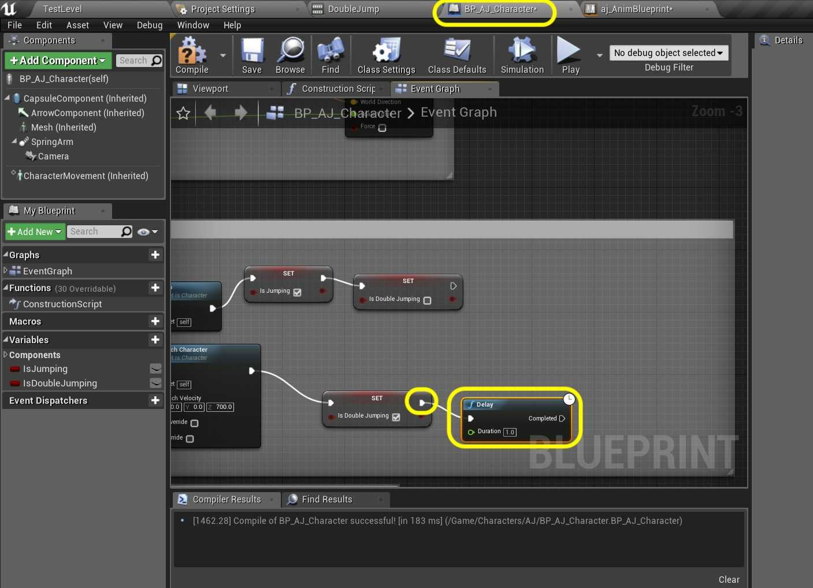

##### `Step 19.`\|`ITA`| :large_blue_diamond: :small_orange_diamond: :small_blue_diamond: :small_blue_diamond: :small_blue_diamond: :small_blue_diamond:

Set the **Duration** of the **Delay** node to `0.1`. *Pull off* of the **Execution** pin and add a **Set Is Double Jumping** node and make sure it is set to `false`.

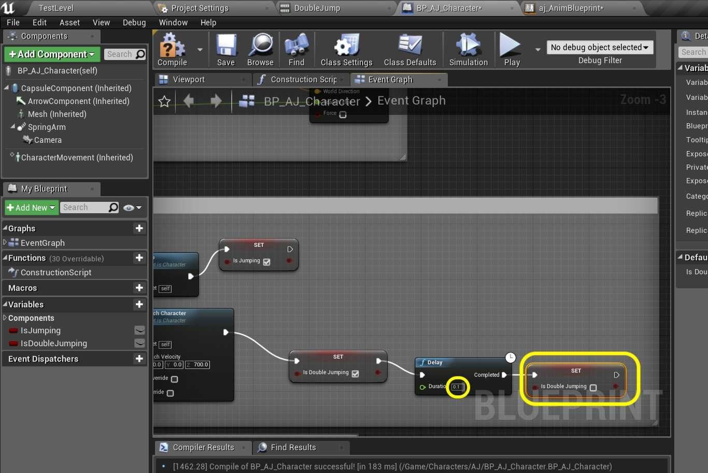

##### `Step 20.`\|`ITA`| :large_blue_diamond: :large_blue_diamond:

*Run* the game and a double jump animation should now run during the second jump.Select the **File | Save All** then press the <kbd>Source Control</kbd> button and select **Submit to Source Control...**. Enter a **Changelist Description** and then press <kbd>Submit</kbd>. Open up **GitHub Desktop** and select **Push origin** to update the server with the latest changes.

https://user-images.githubusercontent.com/5504953/133079769-07e7d1f1-2ae2-4cb1-bb11-9be5d719a054.mp4

___

<!--  -->

| [previous](../double-jump/README.md#user-content-double-jump)| [home](../README.md#user-content-ue4-animations) | [next](../ramps/README.md#user-content-speed-up--down-ramps)|
|---|---|---|
