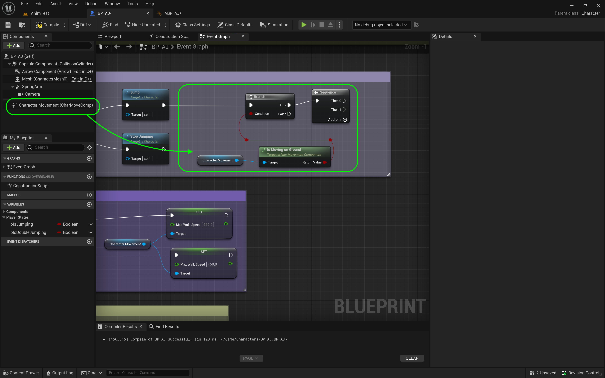
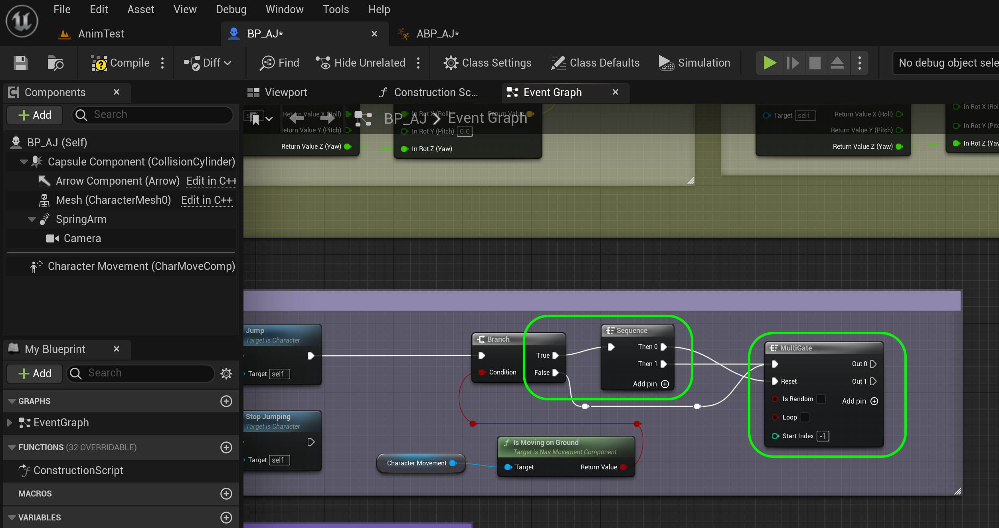
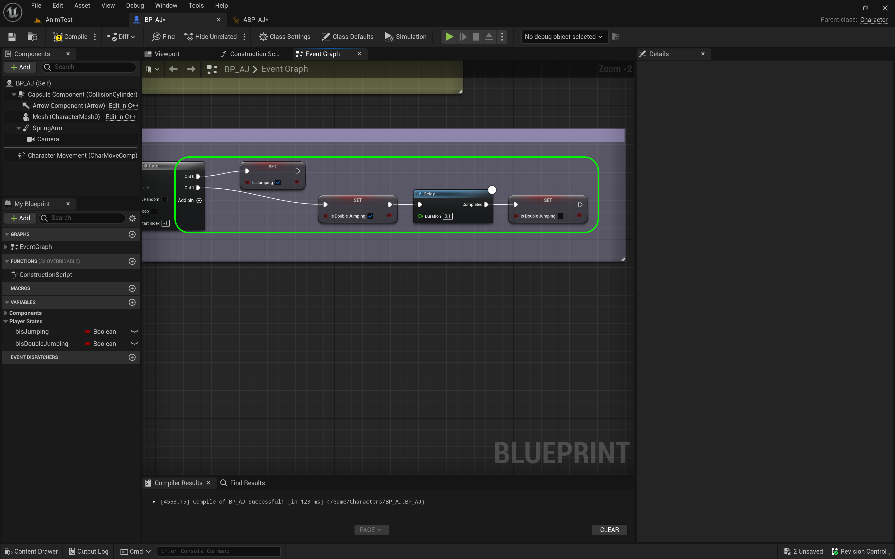
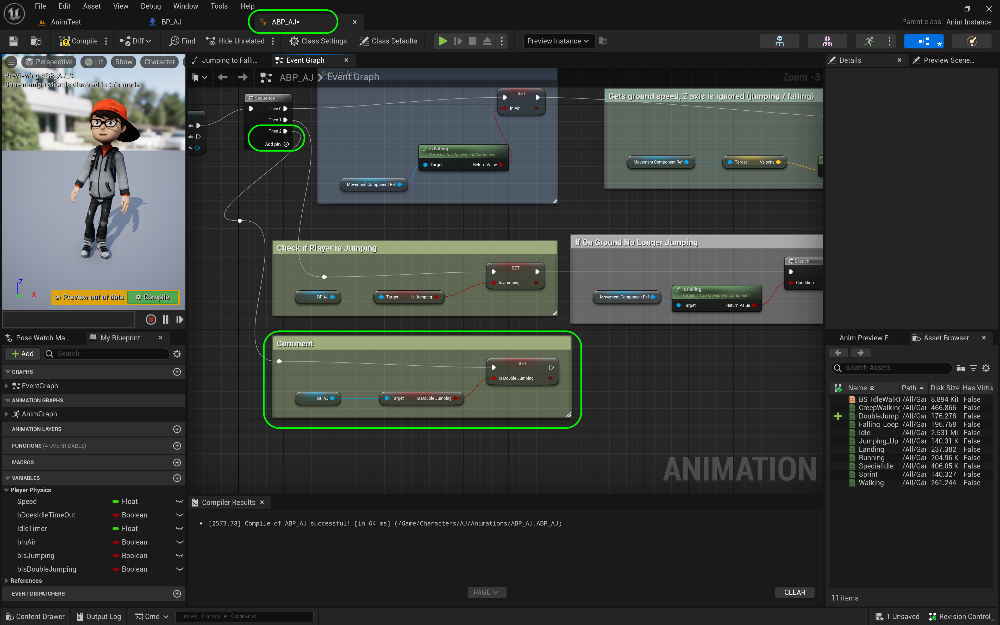
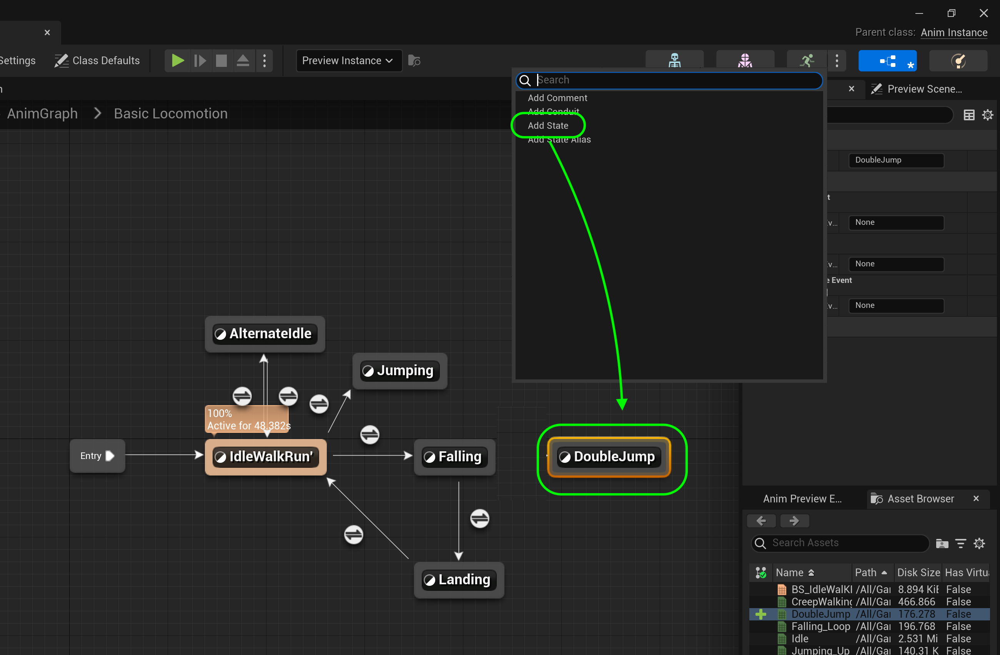
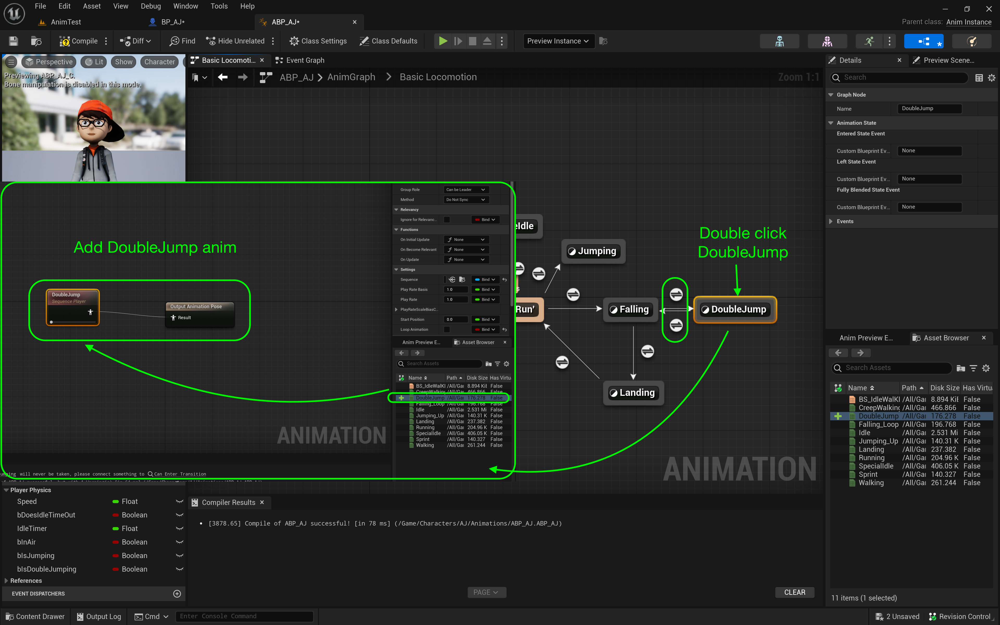
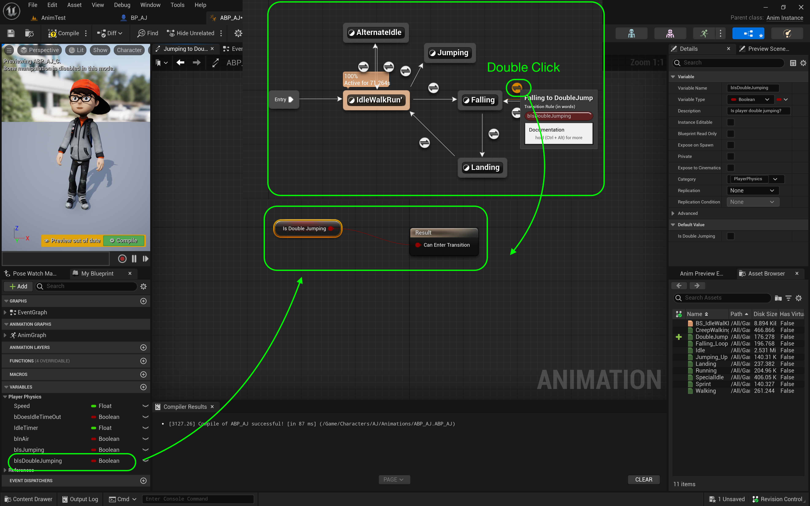
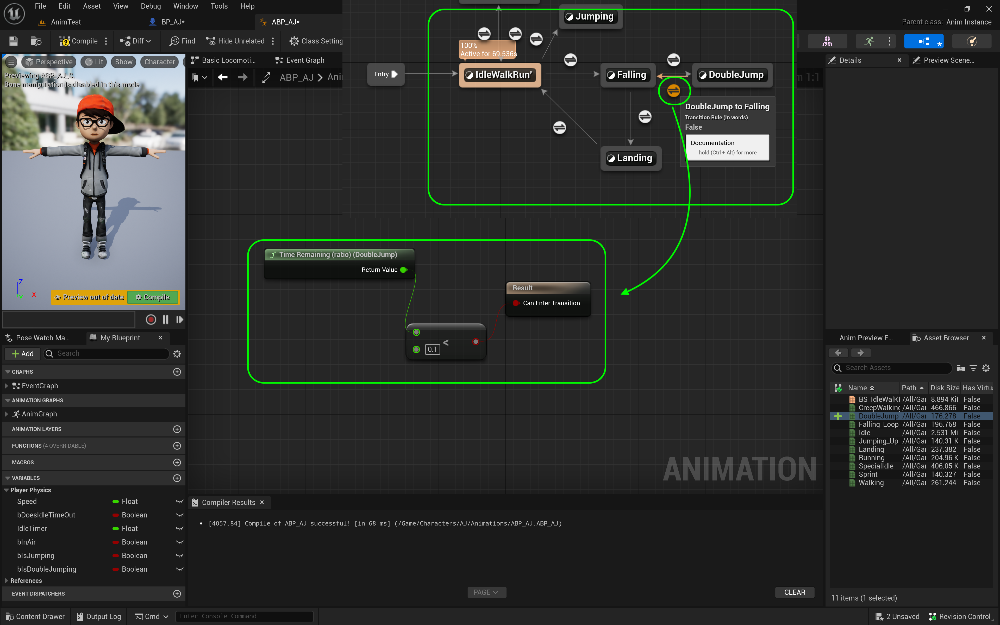
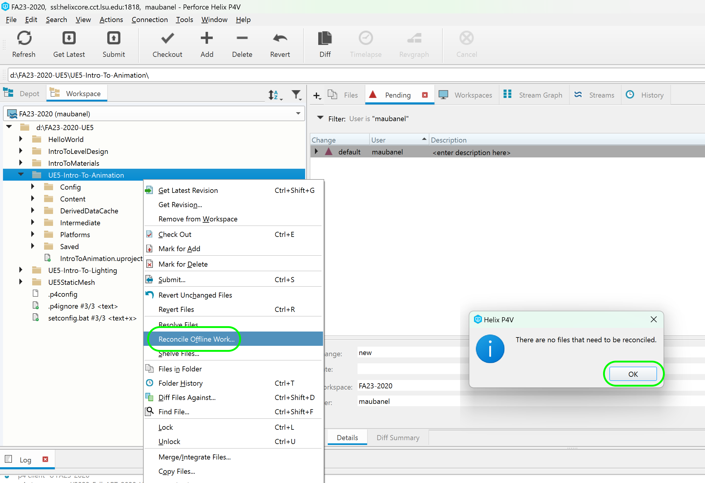

### Double Jump

[previous](../walk-sprint/README.md#user-content-slow-walk--sprint) • [home](../README.md#user-content-ue4-animations) • [next](../double-jump-ii/README.md#user-content-double-jump-ii)

Since I have downloaded this cartoon character, I would like to implement double jump which is not an option in the character controller. We will have to add this to the game by ourselves. We will do this now.

 

---

##### `Step 1.`\|`ITA`|:small_blue_diamond:

Go back to [Mixamo](https://www.mixamo.com/#/) and look for a good animation for a double jump. I am going with a foreward roll. Make sure it is set to **In Place** if there is translation and trim it to just the spin. We don't don't want any foot on ground bits in our final exported animation. **Export** the file without the skin. Just snip only the roll portion so don't include the legs extending or contracting.

https://github.com/maubanel/UE5-Animations/assets/5504953/b6c5a654-92d5-4ac2-9084-c80c95989705

##### `Step 2.`\|`FHIU`|:small_blue_diamond: :small_blue_diamond: 

Download the animation without a skin. *Drag and drop* the animation to the **Animations** folder. In the **FBX Import Options** assign the **Skeleton** that you are using. *Press* the <kbd>Import All</kbd> button. *Call* this animation `Double_Jump`. 

##### `Step 3.`\|`ITA`|:small_blue_diamond: :small_blue_diamond: :small_blue_diamond:

Open **BP_AJ** blueprint and go to the **Jump** section. Click on the top component and select **Character | Jump max Count** to `2`.

##### `Step 4.`\|`ITA`|:small_blue_diamond: :small_blue_diamond: :small_blue_diamond: :small_blue_diamond:

*Press* the <kbd>Play</kbd> button and double jump.  Notice that you double jump but there are no animations.

https://github.com/maubanel/UE5-Animations/assets/5504953/4bb88dc0-c30a-499b-800c-e4d9552576d3

##### `Step 5.`\|`ITA`| :small_orange_diamond:

Open up **ABP_AJ** and *delete* the **Print** nodes as we no lnoger need them.  

##### `Step 6.`\|`ITA`| :small_orange_diamond: :small_blue_diamond:

In **ABP_AJ** *add* a new **Boolean** vairable called `bIsDoubleJumping`.  Create a tooltip **Description** with `Is player in air?`. Then *set* **Private** to `true` and **Category** to `PlayerPhysics`.

##### `Step 7.`\|`ITA`| :small_orange_diamond: :small_blue_diamond: :small_blue_diamond:

Open up **BP_AJ** and lets add a double jump variable to the character blueprint. *Add* a new **Boolean** vairable called `bIsDoubleJumping`.  Create a tooltip **Description** with `Has Player pressed double jump in the air (Double Jumping)`. Then *set* **Private** to `true` and **Category** to `Player States`.

##### `Step 8.`\|`ITA`| :small_orange_diamond: :small_blue_diamond: :small_blue_diamond: :small_blue_diamond:

First thing we want to check if the player is on the ground, if they are they can't double jump.  Drag a reference to the **Character Movement** component.  Drag off of the pin and get the **Is Moving On Ground** node which outputs a yes or no boolean.  Add a **Branch** node and connect the execution pin from the **Jump** to the **Branch** node.  Pull off the execution pin on the **Branch Node** and select a **Sequence** node.  Take the return value of **Is Moving On Ground** and plae it in the **Branch | Condition** input pin.

##### `Step 9.`\|`ITA`| :small_orange_diamond: :small_blue_diamond: :small_blue_diamond: :small_blue_diamond: :small_blue_diamond:

Now here comes the tricky part.  We can't use a flip flop node as we don't want more than two jumps. This is where a **MultiGate** node comes in handy.  It will keep counting up until it resets it.  So the first time it is called it will be a jump. (index 0)  The second time a double jump (index 1).  Then it will keep increasing the index but we will do nothing with it.  When the player hits the ground we will reset the node so they can jump again.  Add a **Sequence** node to the graph. So the **Branch | True** pin (which is the player on ground)  will go to a **Seequence** node input.  Add a **MultiGate** node. Then we feed the **Sequence | Then 0** to the **Multi Game | Reset** pin (so the player can jump again).  The **Then 1** goes to the input of the **MultiGate**.  The **Branch | False** pin is when the player is not on the ground and that will get fed into the **MultiGate** as well.

##### `Step 10.`\|`ITA`| :large_blue_diamond:

Now on the first time through it is a jump so we set the **Set | bIsJumping** to `true`. On the second time through we need to get **Set | bIsDoubleJumping** to `true`. Now we need to reset this before the animation ends as it is short otherwise the aniamtion tree will keep triggering double jumps.  So add a **Delay** ndoe and set it for `0.1` milliseconds.  Then **Set | bIsDoubleJumping** to `false`

##### `Step 11.`\|`ITA`| :large_blue_diamond: :small_blue_diamond: 

Go back to **AnimBP_AJ** and a **Get | BP_AJ**.  Pull off of the blue pint and select **IsDoubleJumping**.  Then add a **Set | bIsDoubleJumping** node.  Now we keep the two double jump variables in sync.  Connect the **Set | Is Double Jump**'s execution pin to **Sequence | Then 2**.  You might need to press the **Add pin +** button.

##### `Step 12.`\|`ITA`| :large_blue_diamond: :small_blue_diamond: :small_blue_diamond: 

Go to the **Anim Graph | Core Locomotion** screen. To the right of the **Fall** node right click and select **Add State**. *Call* this new state `Double Jump`.

##### `Step 13.`\|`ITA`| :large_blue_diamond: :small_blue_diamond: :small_blue_diamond:  :small_blue_diamond: 

Falling works for the jumping up and down, so we are most likely in falling state when we press the double jump button. *Connect* the **Double Jump** node to and from the **Falling** node. We are double jumping while in the **Falling** state. *Double click* on the **Double Jump** node to assign the animation to this state. Drag and drop the **Double Jump** animation onto the animation graph. *Connect* the **Play Double Jump** node to the **Final Animation Pose**.

##### `Step 14.`\|`ITA`| :large_blue_diamond: :small_blue_diamond: :small_blue_diamond: :small_blue_diamond:  :small_blue_diamond: 

*Double click* the transition from the **Falling** node to the **Double Jump** node. *Drag and drop* a **Get Pressed Double Jump** node onto the graph. Connect the **Pressed Double Jump** node to the **Can Enter Transition** node. This will be triggered when in air and the **Pressed Double Jump** node is true.

##### `Step 15.`\|`ITA`| :large_blue_diamond: :small_orange_diamond: 

Go back to the **Core Locomotion** screen. *Double click* on the **Double Jump to Falling** transition button.  *Right click* on the graph and select a **Time Remaining (ratio) (Double Jump)** node. *Pull off* of the **Return Value** from this node and select a **float <= float** node. Set the value in the **<=** node to `0.1` and *connect* the output to the **Result** node.

##### `Step 16.`\|`ITA`| :large_blue_diamond: :small_orange_diamond:   :small_blue_diamond: 

*Run* the game and a double jump animation should now run during the second jump.

https://github.com/maubanel/UE5-Animations/assets/5504953/3127a2d2-480d-44a1-b04a-7bf5ac89bc1d

##### `Step 17.`\|`ITA`| :large_blue_diamond: :small_orange_diamond: :small_blue_diamond: :small_blue_diamond:

Select the **File | Save All** then press the <kbd>Revision Control</kbd> button and select **Submit Content**.  If you are prompted, select **Check Out** for all items that are not checked out of source control. Update the **Changelist Description** message and with the latest changes. Make sure all the files are correct and press the <kbd>Submit</kbd> button. A confirmation will pop up on the bottom right with a message about a changelist was submitted with a commit number. Quit Unreal and make sure your **Pending** tab in **P4V** is empty. **Submit** any work that is still in the editor.

##### `Step 18.`\|`ITA`| :large_blue_diamond: :small_orange_diamond: :small_blue_diamond: :small_blue_diamond: :small_blue_diamond:

Sometimes not all files get submitted to Unreal especially for files that don't show up in the editor.  It is good practice one you submit in **Unreal** and quit the game to right click on the top most project folder and select **Reconcile Offline Work...**.

This will either give a message saying ther is nothing to reconcile or bring up a tab.  Make sure that these are **NOT** files in the **Intermediate** and **Saved** folders as these should be ignored from the `.p4ignore`.

If the files are in **Content** or **Configuration** then press the <kbd>Reconcile</kbd> button.  Then submit the changes with a message and press the <kbd>Submit</kbd> button.

<!--  -->

| [previous](../walk-sprint/README.md#user-content-slow-walk--sprint)| [home](../README.md#user-content-ue4-animations) | [next](../double-jump-ii/README.md#user-content-double-jump-ii)|
|---|---|---|
