### Double Jump

[previous](../walk-sprint/README.md#user-content-slow-walk--sprint) • [home](../README.md#user-content-ue4-animations) • [next](../double-jump-ii/README.md#user-content-double-jump-ii)

Since I have downloaded this cartoon character, I would like to implement double jump which is not an option in the character controller. We will have to add this to the game by ourselves. We will do this now.

 

---

##### `Step 1.`\|`ITA`|:small_blue_diamond:

Go back to [Mixamo](https://www.mixamo.com/#/) and look for a good animation for a double jump. I am going with a foreward roll. Make sure it is set to **In Place** if there is translation and trim it to just the spin. We don't don't want any foot on ground bits in our final exported animation. **Export** the file without the skin.

https://user-images.githubusercontent.com/5504953/133075815-ad64f111-a297-4ef0-a9f6-eda8f01a2e3b.mp4

##### `Step 2.`\|`FHIU`|:small_blue_diamond: :small_blue_diamond: 

Go to the **Animations** folder and press the <kbd>Add/Import</kbd> button. *Select* the latest animation you just downloaded.

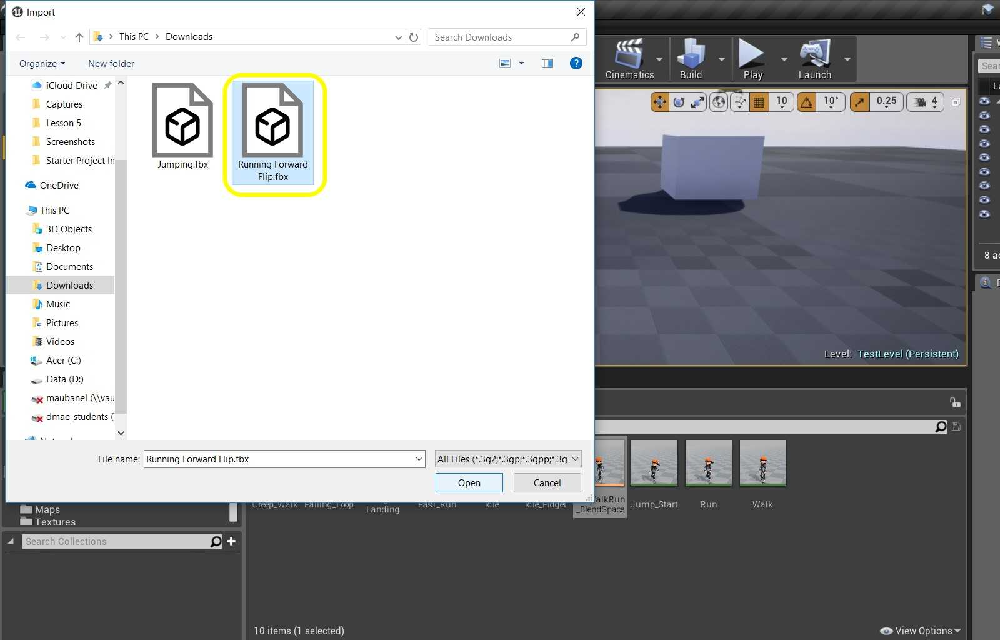

##### `Step 3.`\|`ITA`|:small_blue_diamond: :small_blue_diamond: :small_blue_diamond:

In the **FBX Import Options** assign the **Skeleton** that you are using. *Press* the <kbd>Import</kbd> button.

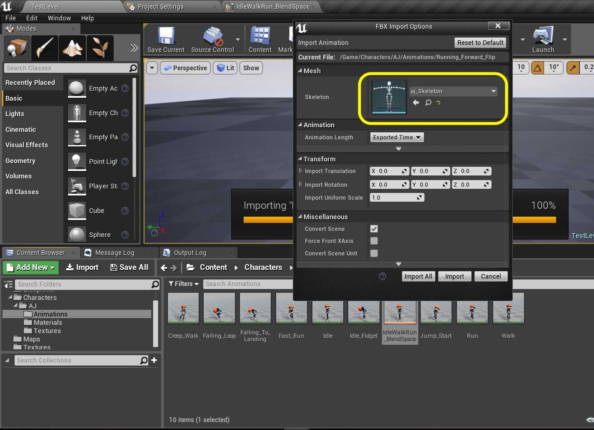

##### `Step 4.`\|`ITA`|:small_blue_diamond: :small_blue_diamond: :small_blue_diamond: :small_blue_diamond:

*Call* this animation `Double_Jump`. *Double click* it to open it in the editor.

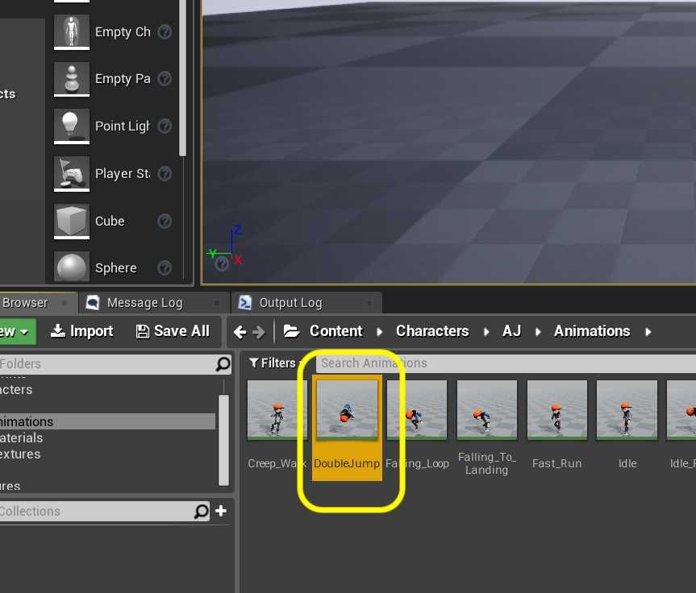

##### `Step 5.`\|`ITA`| :small_orange_diamond:

Confim that the animation is correct.

https://user-images.githubusercontent.com/5504953/133076270-248aec90-4c4a-48f9-bb38-4e35994bc19d.mp4

##### `Step 6.`\|`ITA`| :small_orange_diamond: :small_blue_diamond:

Open **BP_AJ_Character** blueprint and go to the **Jump** section. Make some room in this comment box to add some more nodes for double jumps.

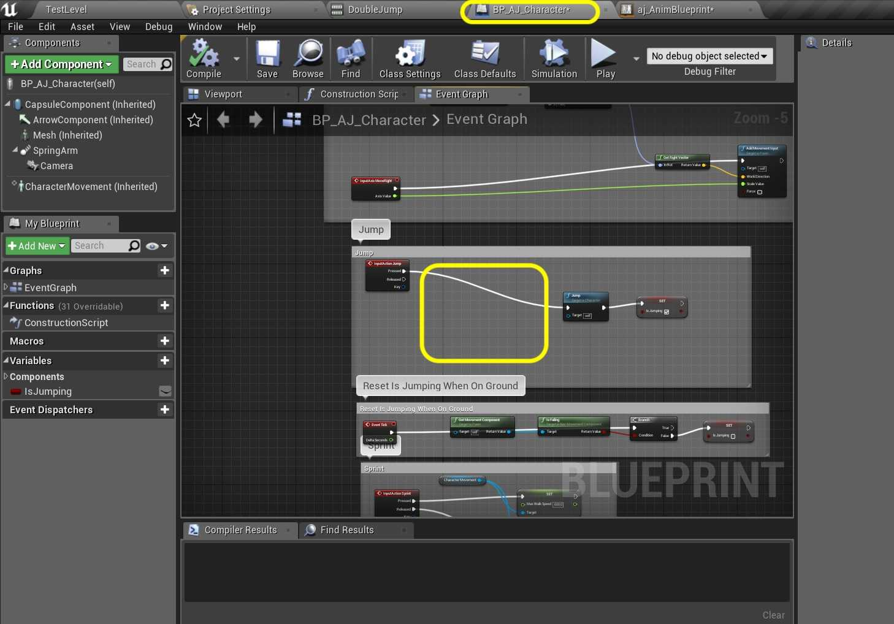

##### `Step 7.`\|`ITA`| :small_orange_diamond: :small_blue_diamond: :small_blue_diamond:

Right click and add a **DoN** node. This node will repeat n number of times. We will set it to two for double jump.

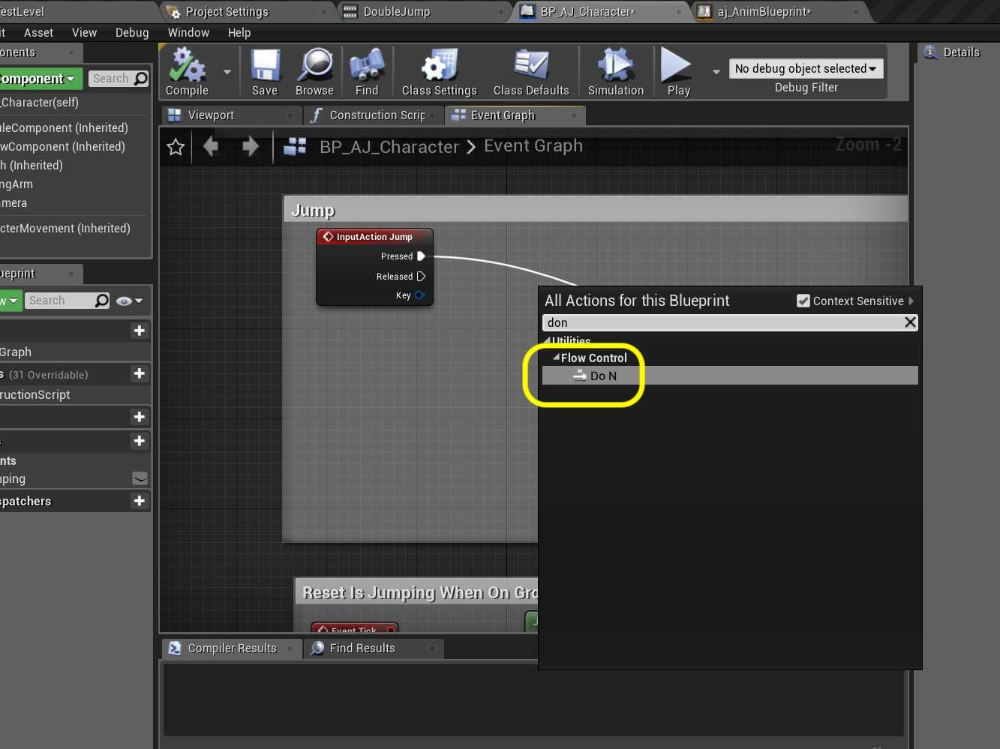

##### `Step 8.`\|`ITA`| :small_orange_diamond: :small_blue_diamond: :small_blue_diamond: :small_blue_diamond:

We are going to now switch on the integer coming from the **DoN** node. Add a **Switch on Int** node. Set the **N** number to start at `2` as the player will be starting by falling and can't jump at the very begining of pressing play (like they are coming down from a double jump).

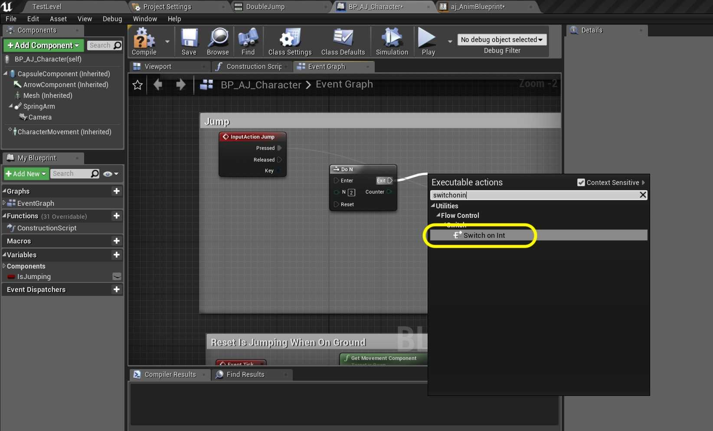

##### `Step 9.`\|`ITA`| :small_orange_diamond: :small_blue_diamond: :small_blue_diamond: :small_blue_diamond: :small_blue_diamond:

*Connect* the **Counter** pin from the **DoN** node to the **Switch on Int** node's **Selection** pin:

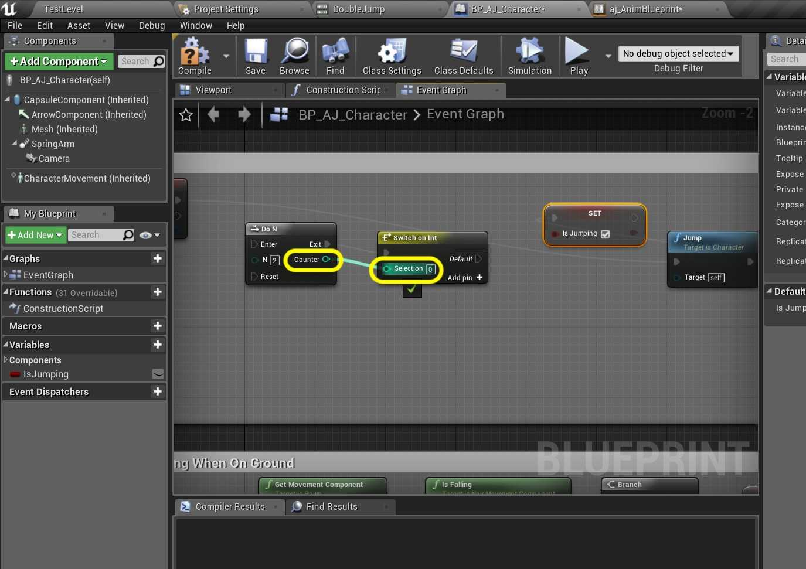

##### `Step 10.`\|`ITA`| :large_blue_diamond:

*Connect* the **DoN** execution pin to the **Switch on Int** node:

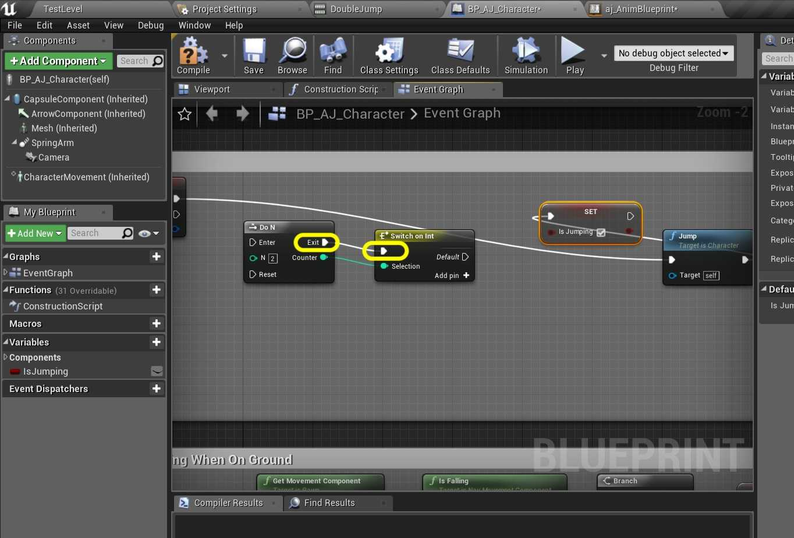

##### `Step 11.`\|`ITA`| :large_blue_diamond: :small_blue_diamond: 

*Disconnect* the execution pin coming out of the **Jump** node

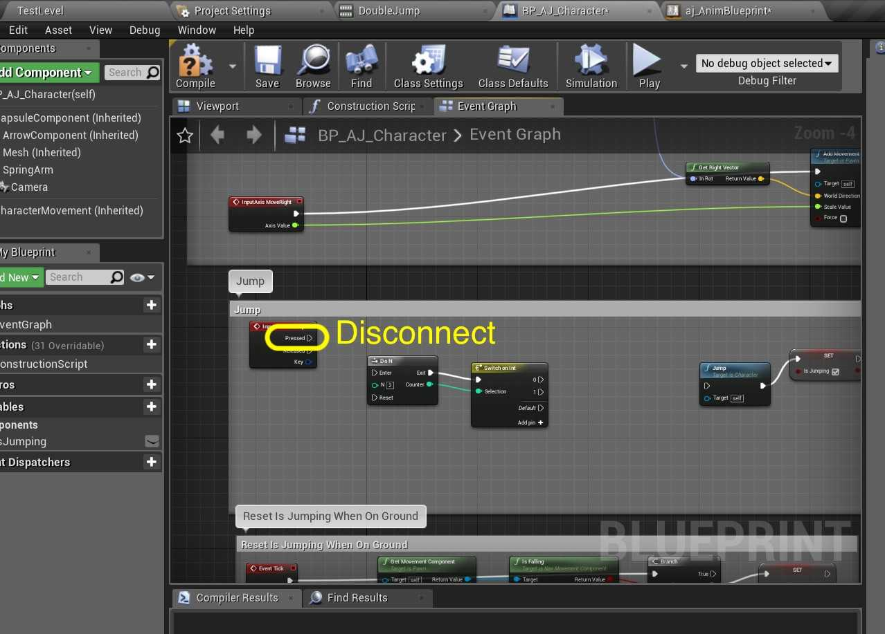

##### `Step 12.`\|`ITA`| :large_blue_diamond: :small_blue_diamond: :small_blue_diamond: 

*Connect* the **Jump** node's execution pin to the **DoN** node.

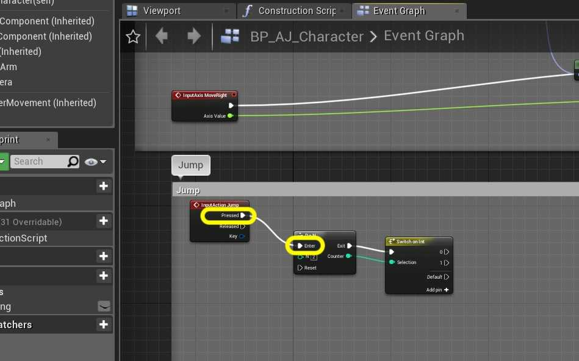

##### `Step 13.`\|`ITA`| :large_blue_diamond: :small_blue_diamond: :small_blue_diamond:  :small_blue_diamond: 

Now we need a variable to know that we have pressed this button. *Right click* on the **bIsJumping** variable and select **Duplicate** to make another copy.

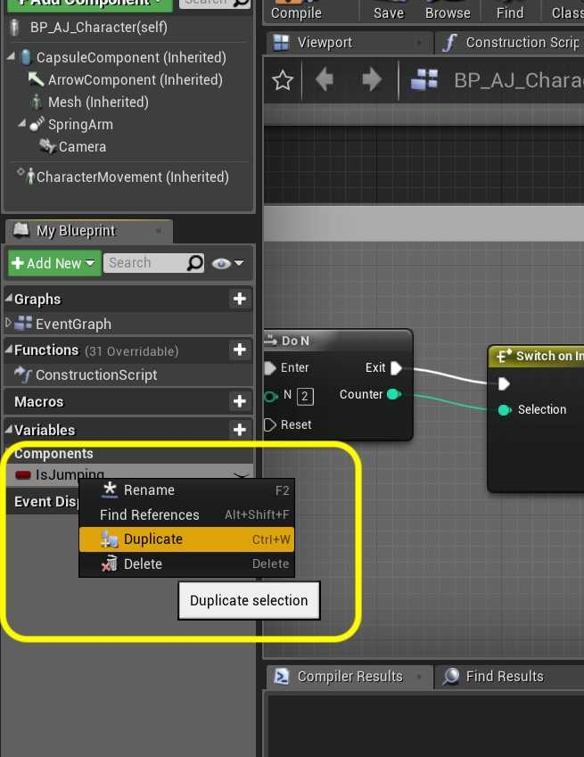

##### `Step 14.`\|`ITA`| :large_blue_diamond: :small_blue_diamond: :small_blue_diamond: :small_blue_diamond:  :small_blue_diamond: 

*Call* this new Variable `bIsDoubleJumping`.

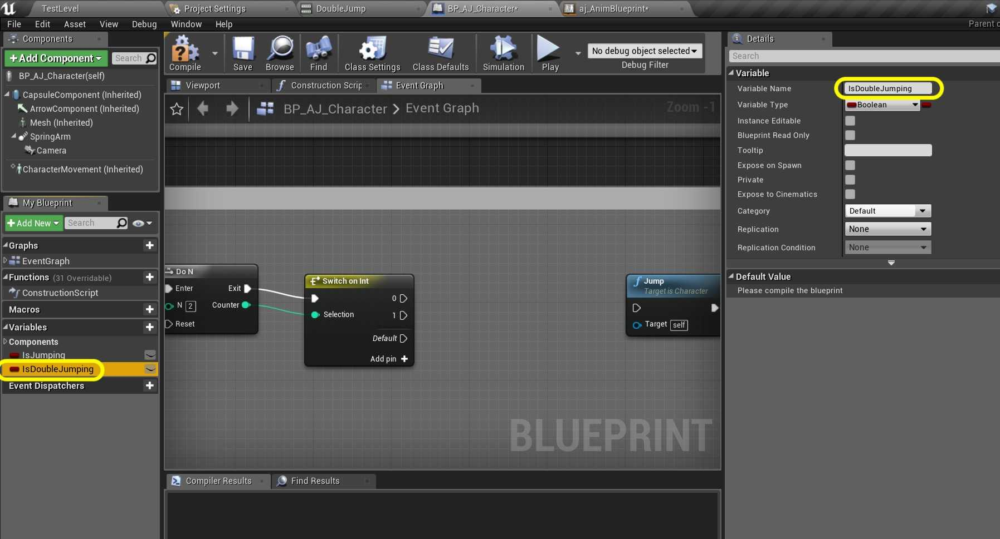

##### `Step 15.`\|`ITA`| :large_blue_diamond: :small_orange_diamond: 

*Press* the **+** button three times on the **Switch On Int** node. Even though we only need two pins the **DoN** node starts counting at `1` and the **Switch On Int** node starts on `0`. Connect the output pin **1** from the **Switch on Int** node to the **Jump** node:

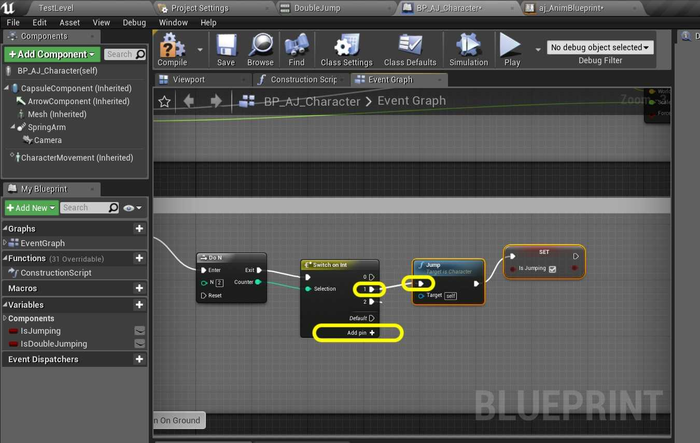

##### `Step 16.`\|`ITA`| :large_blue_diamond: :small_orange_diamond:   :small_blue_diamond: 

*Pull* from the **Switch on Int | 2** node's execution pin and select a **Launch Character** node.

##### `Step 17.`\|`ITA`| :large_blue_diamond: :small_orange_diamond: :small_blue_diamond: :small_blue_diamond:

We want to launch the characer upwards, or positive along the **Z** axis. *Change* the **Launch Velocity | Z** to `700.0`. *Pull off* the execution pin and select **Set Is Double Jumping** variable.

##### `Step 18.`\|`ITA`| :large_blue_diamond: :small_orange_diamond: :small_blue_diamond: :small_blue_diamond: :small_blue_diamond:

Set the **Is Double Jumping** setting to `true`.

##### `Step 19.`\|`ITA`| :large_blue_diamond: :small_orange_diamond: :small_blue_diamond: :small_blue_diamond: :small_blue_diamond: :small_blue_diamond:

*Right click* under the **Action Event Jump** node and select an **Event On Landed**. This will run when the player lands.

##### `Step 20.`\|`ITA`| :large_blue_diamond: :large_blue_diamond:

*Connect* the output execution pin from the **Event On Landed** node and put it on the **Reset** pin on the **DoN** node. This means that each time the player lands he will be able to jump then double jump again!

##### `Step 21.`\|`ITA`| :large_blue_diamond: :large_blue_diamond: :small_blue_diamond:

To test our work lets print on screen. *Add* two **Print String** nodes. *Add* to the **InString** in the top one `Single Jump` then in the bottom one `Double Jump`. *Connect* the **Is Jumping** output to the top **Print String** node and the **Is Double Jumping** to the bottom **Print String** node.

___

| [previous](../walk-sprint/README.md#user-content-slow-walk--sprint)| [home](../README.md#user-content-ue4-animations) | [next](../double-jump-ii/README.md#user-content-double-jump-ii)|
|---|---|---|
