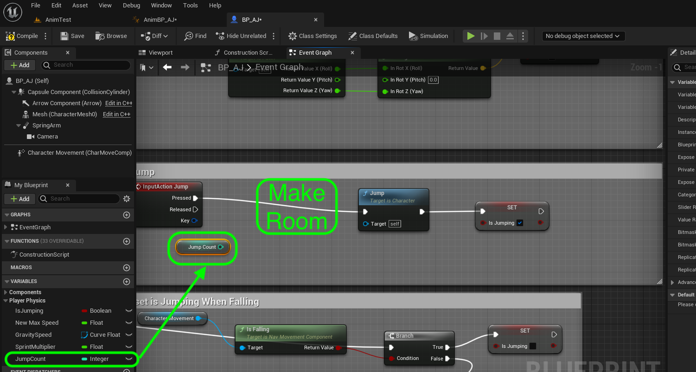

### Double Jump

[previous](../walk-sprint/README.md#user-content-slow-walk--sprint) • [home](../README.md#user-content-ue4-animations) • [next](../double-jump-ii/README.md#user-content-double-jump-ii)

Since I have downloaded this cartoon character, I would like to implement double jump which is not an option in the character controller. We will have to add this to the game by ourselves. We will do this now.

 

---

##### `Step 1.`\|`ITA`|:small_blue_diamond:

Go back to [Mixamo](https://www.mixamo.com/#/) and look for a good animation for a double jump. I am going with a foreward roll. Make sure it is set to **In Place** if there is translation and trim it to just the spin. We don't don't want any foot on ground bits in our final exported animation. **Export** the file without the skin. Just snip only the roll portion so don't include the legs extending or contracting.

https://github.com/maubanel/UE5-Animations/assets/5504953/b6c5a654-92d5-4ac2-9084-c80c95989705

##### `Step 2.`\|`FHIU`|:small_blue_diamond: :small_blue_diamond: 

Download the animation without a skin. *Drag and drop* the animation to the **Animations** folder. In the **FBX Import Options** assign the **Skeleton** that you are using. *Press* the <kbd>Import All</kbd> button. *Call* this animation `Double_Jump`. 

##### `Step 3.`\|`ITA`|:small_blue_diamond: :small_blue_diamond: :small_blue_diamond:

Open **BP_AJ** blueprint and go to the **Jump** section. Click on the top component and select **Character | Jump max Count** to `2`.

##### `Step 4.`\|`ITA`|:small_blue_diamond: :small_blue_diamond: :small_blue_diamond: :small_blue_diamond:

*Press* the <kbd>Play</kbd> button and double jump.  Notice that you double jump but there are no animations.

https://github.com/maubanel/UE5-Animations/assets/5504953/4bb88dc0-c30a-499b-800c-e4d9552576d3

##### `Step 5.`\|`ITA`| :small_orange_diamond:

##### `Step 6.`\|`ITA`| :small_orange_diamond: :small_blue_diamond:

##### `Step 7.`\|`ITA`| :small_orange_diamond: :small_blue_diamond: :small_blue_diamond:

##### `Step 8.`\|`ITA`| :small_orange_diamond: :small_blue_diamond: :small_blue_diamond: :small_blue_diamond:

Open up **AnimBP_AJ** and *disconnect* the **Print** node as we will be moving it as we will be adding logic to the double jumping.  

##### `Step 9.`\|`ITA`| :small_orange_diamond: :small_blue_diamond: :small_blue_diamond: :small_blue_diamond: :small_blue_diamond:

Now next to the **Update Animation** event press the **Add Pin +** in the **Sequence** node to add a `Then 2` execution pin.

##### `Step 10.`\|`ITA`| :large_blue_diamond:

Move the **Print** nodes to the bottom. Connect the output of the **Sequence | Then 2** node to the input **Print** node.

##### `Step 11.`\|`ITA`| :large_blue_diamond: :small_blue_diamond: 

Add **Comments** to the print node to clean up the chart.

##### `Step 12.`\|`ITA`| :large_blue_diamond: :small_blue_diamond: :small_blue_diamond: 

Add a new **Boolean** vairable called `PressedDoubleJump`.  Create a tooltip **Description** with `Has Player pressed double jump`. Then *set* **Private** to `true` and **Category** to `Player Physics`.

##### `Step 13.`\|`ITA`| :large_blue_diamond: :small_blue_diamond: :small_blue_diamond:  :small_blue_diamond: 

Open up **BP_AJ** and we need a new **Variable**.  Create a new **Variable Type** `Integer` and call it `JumpCount`.  Change the **Category** to `Player Physics` and the **Description** to `Counts Player Jumps`.

##### `Step 14.`\|`ITA`| :large_blue_diamond: :small_blue_diamond: :small_blue_diamond: :small_blue_diamond:  :small_blue_diamond: 

*Drag* a get **Jump Count** to the **Jumping** area.  Make room to add some nodes before the jump function.

##### `Step 15.`\|`ITA`| :large_blue_diamond: :small_orange_diamond: 

*Drag* off of the **Jump Count** pin and select a **Increment Int** node.  This will add `1` to the interger value.

##### `Step 16.`\|`ITA`| :large_blue_diamond: :small_orange_diamond:   :small_blue_diamond: 

*Highjack* the execution pins from **InputAction Jump** to **++** to **Jump** node.

##### `Step 17.`\|`ITA`| :large_blue_diamond: :small_orange_diamond: :small_blue_diamond: :small_blue_diamond:

Now we do not want to trigger an animation if the jump is pressed three or more times. *Drag* a get **Jump Count**. Select the pin and select a **<=** node.  Set the bottom value to `2`.

##### `Step 18.`\|`ITA`| :large_blue_diamond: :small_orange_diamond: :small_blue_diamond: :small_blue_diamond: :small_blue_diamond:

*Pull off* the **<=** pin and select a **Branch** node.  *Highjack* the execution pin from **Jump** to **Branch** and **Branch | True** to **Set | Is Jupming**.  This will only set is jumping tif the count is 2 or less (so the first or second jump).

##### `Step 19.`\|`ITA`| :large_blue_diamond: :small_orange_diamond: :small_blue_diamond: :small_blue_diamond: :small_blue_diamond: :small_blue_diamond:

Below the jumping on the falling node.  Switch setting **Is Jumping** to `false` on the **False** node.  This way when we hit the ground we set **Is Jumping** to `false`.  Also add a **Set Jump Count** variable to the chart and set it to `0`.  Connect it from the **Set | Is Jumping** execution pin.

##### `Step 20.`\|`ITA`| :large_blue_diamond: :large_blue_diamond:

Go back to **AnimBP_AJ** and delete all the nodes after **Cast to BP_AJ** node. 

##### `Step 21.`\|`ITA`| :large_blue_diamond: :large_blue_diamond: :small_blue_diamond:

*Drag* off of the **Cast To BP_AJ | As BP_AJ** pin and select **Get Jump Count**. Pull off the **Jump Count** pin and select **==** node and set the check to `1`. This is the first time it is pressed.  *Pull off* the boolean from the **==** node and select a **Branch** node.  Connect the execution pin to the **Cast to BP_AJ** node.

<!--  -->

| [previous](../walk-sprint/README.md#user-content-slow-walk--sprint)| [home](../README.md#user-content-ue4-animations) | [next](../double-jump-ii/README.md#user-content-double-jump-ii)|
|---|---|---|
