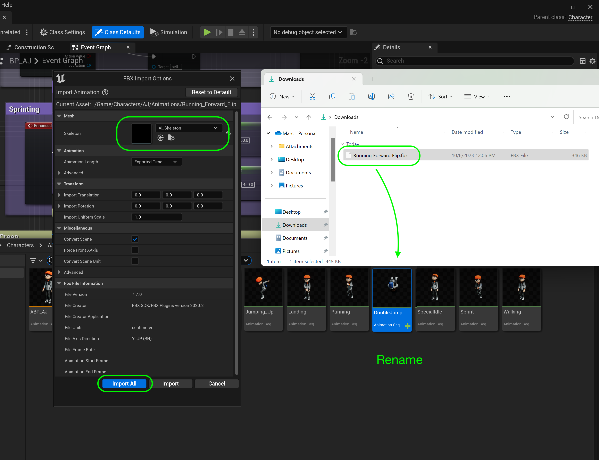
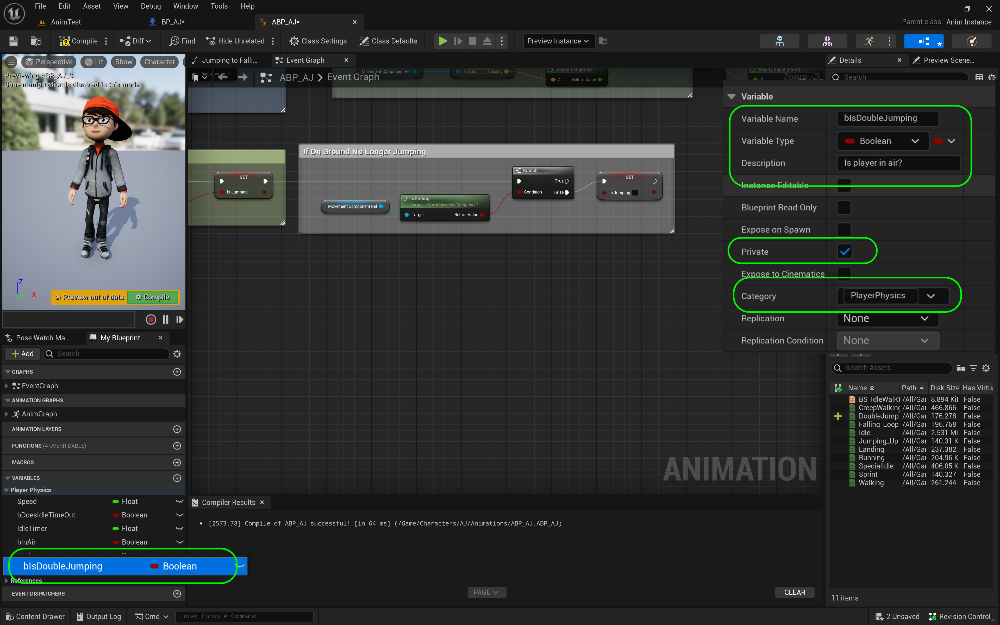

### Double Jump

[previous](../walk-sprint/README.md#user-content-slow-walk--sprint) • [home](../README.md#user-content-ue4-animations) • [next](../double-jump-ii/README.md#user-content-double-jump-ii)

Since I have downloaded this cartoon character, I would like to implement double jump which is not an option in the character controller. We will have to add this to the game by ourselves. We will do this now.

 

---

##### `Step 1.`\|`ITA`|:small_blue_diamond:

Go back to [Mixamo](https://www.mixamo.com/#/) and look for a good animation for a double jump. I am going with a foreward roll. Make sure it is set to **In Place** if there is translation and trim it to just the spin. We don't don't want any foot on ground bits in our final exported animation. **Export** the file without the skin. Just snip only the roll portion so don't include the legs extending or contracting.

##### `Step 2.`\|`FHIU`|:small_blue_diamond: :small_blue_diamond: 

Download the animation without a skin.

##### `Step 3.`\|`ITA`|:small_blue_diamond: :small_blue_diamond: :small_blue_diamond:

*Drag and drop* the animation to the **Animations** folder. In the **FBX Import Options** assign the **Skeleton** that you are using. *Press* the <kbd>Import All</kbd> button.

##### `Step 4.`\|`ITA`|:small_blue_diamond: :small_blue_diamond: :small_blue_diamond: :small_blue_diamond:

*Call* this animation `Double_Jump`. *Double click* it to open it in the editor.

##### `Step 5.`\|`ITA`| :small_orange_diamond:

Confim that the animation is correct.

https://user-images.githubusercontent.com/5504953/197363276-33f0dfb0-a71d-4acb-851b-29c795c19dba.mp4

##### `Step 6.`\|`ITA`| :small_orange_diamond: :small_blue_diamond:

Open **BP_AJ** blueprint and go to the **Jump** section. Click on the top component and select **Jump max Count** to `2`.

##### `Step 7.`\|`ITA`| :small_orange_diamond: :small_blue_diamond: :small_blue_diamond:

*Press* the <kbd>Play</kbd> button and double jump.  Notice that you double jump but there are no animations.

https://user-images.githubusercontent.com/5504953/197363429-3ea55e48-6045-456a-8ec4-aea582efa827.mp4

##### `Step 8.`\|`ITA`| :small_orange_diamond: :small_blue_diamond: :small_blue_diamond: :small_blue_diamond:

Open up **AnimBP_AJ** and *disconnect* the **Print** node as we will be moving it as we will be adding logic to the double jumping.  

##### `Step 9.`\|`ITA`| :small_orange_diamond: :small_blue_diamond: :small_blue_diamond: :small_blue_diamond: :small_blue_diamond:

Now next to the **Update Animation** event press the **Add Pin +** in the **Sequence** node to add a `Then 2` execution pin.

##### `Step 10.`\|`ITA`| :large_blue_diamond:

Move the **Print** nodes to the bottom. Connect the output of the **Sequence | Then 2** node to the input **Print** node.

##### `Step 11.`\|`ITA`| :large_blue_diamond: :small_blue_diamond: 

Add **Comments** to the print node to clean up the chart.

##### `Step 12.`\|`ITA`| :large_blue_diamond: :small_blue_diamond: :small_blue_diamond: 

Add a new **Boolean** vairable called `PressedDoubleJump`.  Create a tooltip **Description** with `Has Player pressed double jump`. Then *set* **Private** to `true` and **Category** to `Player Physics`.

##### `Step 13.`\|`ITA`| :large_blue_diamond: :small_blue_diamond: :small_blue_diamond:  :small_blue_diamond: 

Now we need a variable to know that we have pressed this button. *Right click* on the **bIsJumping** variable and select **Duplicate** to make another copy.

##### `Step 14.`\|`ITA`| :large_blue_diamond: :small_blue_diamond: :small_blue_diamond: :small_blue_diamond:  :small_blue_diamond: 

*Call* this new Variable `bIsDoubleJumping`.

##### `Step 15.`\|`ITA`| :large_blue_diamond: :small_orange_diamond: 

*Press* the **+** button three times on the **Switch On Int** node. Even though we only need two pins the **DoN** node starts counting at `1` and the **Switch On Int** node starts on `0`. Connect the output pin **1** from the **Switch on Int** node to the **Jump** node:

##### `Step 16.`\|`ITA`| :large_blue_diamond: :small_orange_diamond:   :small_blue_diamond: 

*Pull* from the **Switch on Int | 2** node's execution pin and select a **Launch Character** node.

##### `Step 17.`\|`ITA`| :large_blue_diamond: :small_orange_diamond: :small_blue_diamond: :small_blue_diamond:

We want to launch the characer upwards, or positive along the **Z** axis. *Change* the **Launch Velocity | Z** to `700.0`. *Pull off* the execution pin and select **Set Is Double Jumping** variable.

##### `Step 18.`\|`ITA`| :large_blue_diamond: :small_orange_diamond: :small_blue_diamond: :small_blue_diamond: :small_blue_diamond:

Set the **Is Double Jumping** setting to `true`.

##### `Step 19.`\|`ITA`| :large_blue_diamond: :small_orange_diamond: :small_blue_diamond: :small_blue_diamond: :small_blue_diamond: :small_blue_diamond:

*Right click* under the **Action Event Jump** node and select an **Event On Landed**. This will run when the player lands.

##### `Step 20.`\|`ITA`| :large_blue_diamond: :large_blue_diamond:

*Connect* the output execution pin from the **Event On Landed** node and put it on the **Reset** pin on the **DoN** node. This means that each time the player lands he will be able to jump then double jump again!

##### `Step 21.`\|`ITA`| :large_blue_diamond: :large_blue_diamond: :small_blue_diamond:

To test our work lets print on screen. *Add* two **Print String** nodes. *Add* to the **InString** in the top one `Single Jump` then in the bottom one `Double Jump`. *Connect* the **Is Jumping** output to the top **Print String** node and the **Is Double Jumping** to the bottom **Print String** node.

___

<!--  -->

| [previous](../walk-sprint/README.md#user-content-slow-walk--sprint)| [home](../README.md#user-content-ue4-animations) | [next](../double-jump-ii/README.md#user-content-double-jump-ii)|
|---|---|---|
