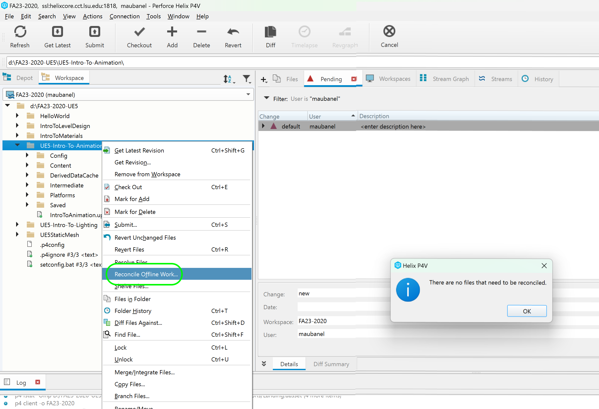

### Falling Animation II

[previous](../falling/README.md#user-content-falling-animation) • [home](../README.md#user-content-ue4-animations) • [next](../jumping/README.md#user-content-jumping-animation)

Falling animation continued...

 

---

##### `Step 1.`\|`ITA`|:small_blue_diamond:

*Run* the game and the player should fall on the cube. Walk off the cube and the player should fall on the floor. We should have our states working correctly for falling. Now the only issue is that it is jerky at the end the blend is not working properly.  It is either getting cut off or is not long enough.

https://github.com/maubanel/UE5-Animations/assets/5504953/a27f0a2c-44c0-4b66-b470-ba2bd736017c

##### `Step 2.`\|`FHIU`|:small_blue_diamond: :small_blue_diamond: 

It takes too long to blend from landing back to running again.  Look at **FallingToLanding** and scrub in the timeline to pick a better blend point.  I think about half way through might be best.

##### `Step 3.`\|`ITA`|:small_blue_diamond: :small_blue_diamond: :small_blue_diamond:

*Double click*  on the transition from **Landing** to **IdleWalkRun** on the transition and change the value in the **<** node to `0.6` to start blend at 40% complete (roughly a quarter second left in anim at this point). Depending on how tightly you edited the land this number might need to be different for you.  Trial and error is key here.

##### `Step 4.`\|`ITA`|:small_blue_diamond: :small_blue_diamond: :small_blue_diamond: :small_blue_diamond:

*Run* the game and the player should fall on the floor and the blend works perfectly once you find the right part of the animation to blend out of!

https://github.com/maubanel/UE5-Animations/assets/5504953/3bda78ba-478b-4fc3-b174-7a8a9e2cc4b1

##### `Step 5.`\|`ITA`| :small_orange_diamond:

Select the **File | Save All** then press the <kbd>Revision Control</kbd> button and select **Submit Content**.  If you are prompted, select **Check Out** for all items that are not checked out of source control. Update the **Changelist Description** message and with the latest changes. Make sure all the files are correct and press the <kbd>Submit</kbd> button. A confirmation will pop up on the bottom right with a message about a changelist was submitted with a commit number. Quit Unreal and make sure your **Pending** tab in **P4V** is empty. **Submit** any work that is still in the editor.

##### `Step 6.`\|`ITA`| :small_orange_diamond: :small_blue_diamond:

Sometimes not all files get submitted to Unreal especially for files that don't show up in the editor.  It is good practice one you submit in **Unreal** and quit the game to right click on the top most project folder and select **Reconcile Offline Work...**.

This will either give a message saying ther is nothing to reconcile or bring up a tab.  Make sure that these are **NOT** files in the **Intermediate** and **Saved** folders as these should be ignored from the `.p4ignore`.

If the files are in **Content** or **Configuration** then press the <kbd>Reconcile</kbd> button.  Then submit the changes with a message and press the <kbd>Submit</kbd> button.

<!--  -->

| [previous](../falling/README.md#user-content-falling-animation)| [home](../README.md#user-content-ue4-animations) | [next](../jumping/README.md#user-content-jumping-animation)|
|---|---|---|

