### Falling Animation II

[previous](../falling/README.md#user-content-falling-animation) • [home](../README.md#user-content-ue4-animations) • [next](../jumping/README.md#user-content-jumping-animation)

Falling animation continued...

 

---

##### `Step 1.`\|`ITA`|:small_blue_diamond:

Attach the two only pins in this graph.

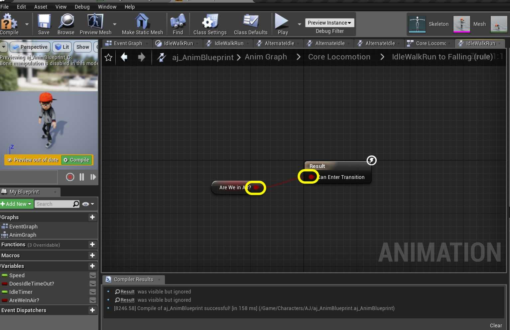

##### `Step 2.`\|`FHIU`|:small_blue_diamond: :small_blue_diamond: 

Lets put the animation inside the falling state. *Double click* the **Falling** state node.

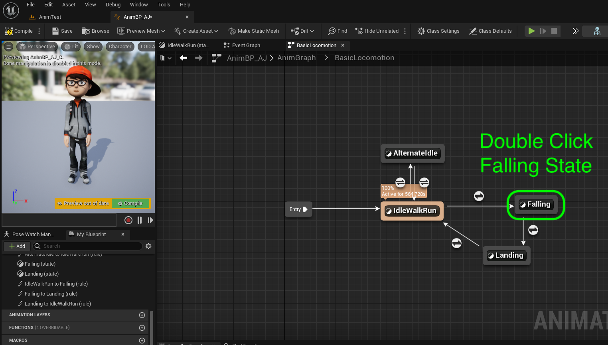

##### `Step 3.`\|`ITA`|:small_blue_diamond: :small_blue_diamond: :small_blue_diamond:

*Drag and drop* the **Falling_Loop** animation onto the graph. *Connect* the animation pins together.

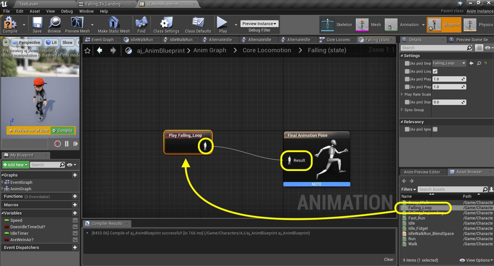

##### `Step 4.`\|`ITA`|:small_blue_diamond: :small_blue_diamond: :small_blue_diamond: :small_blue_diamond:

Go back to the **Anim Graph | Core Locomotion** screen and *double click* the transition button between **Falling** and **Falling End** state nodes:

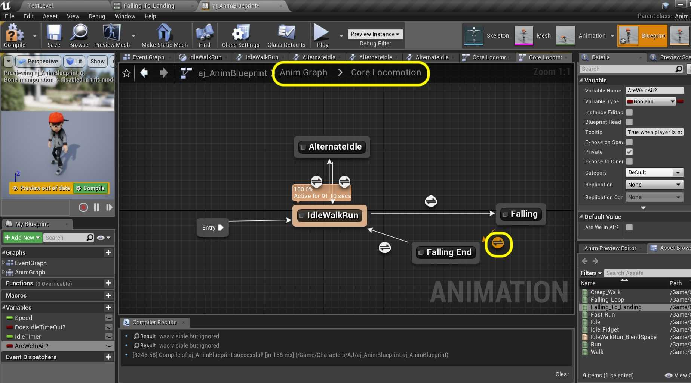

##### `Step 5.`\|`ITA`| :small_orange_diamond:

We switch to this animation when we hit the ground. *Drag* a **Get Are We in Air?** node to the graph.

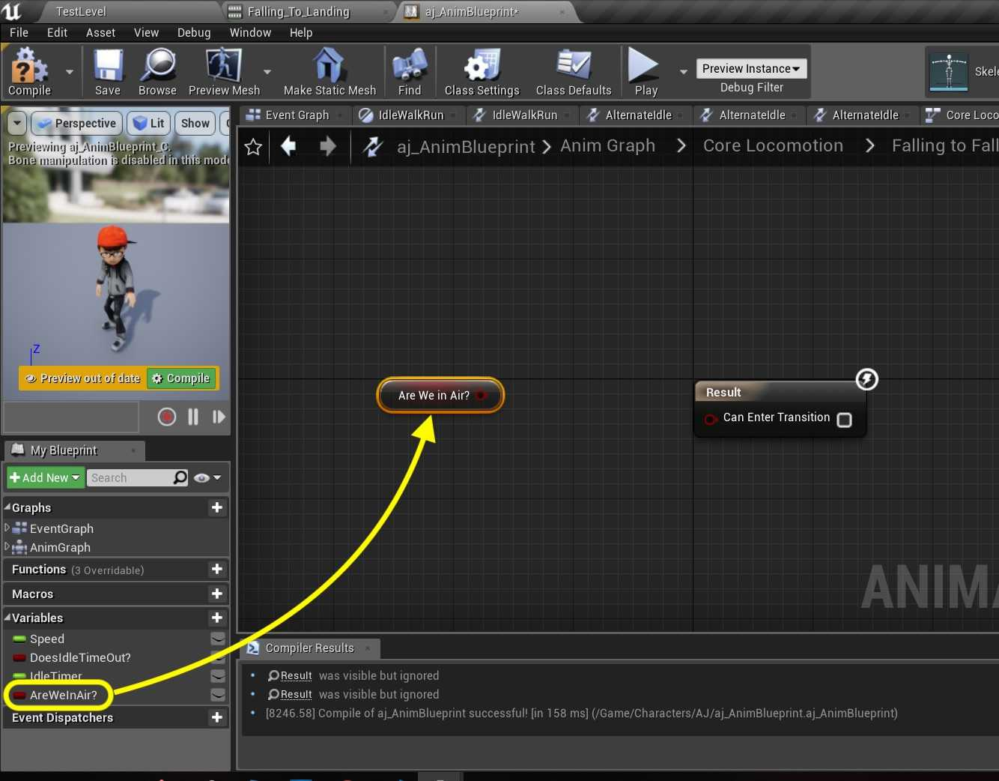

##### `Step 6.`\|`ITA`| :small_orange_diamond: :small_blue_diamond:

*Pull off* of the **Are We in Air?** node and select a **NOT Boolean** node as we want to find out if the player is not in the air.

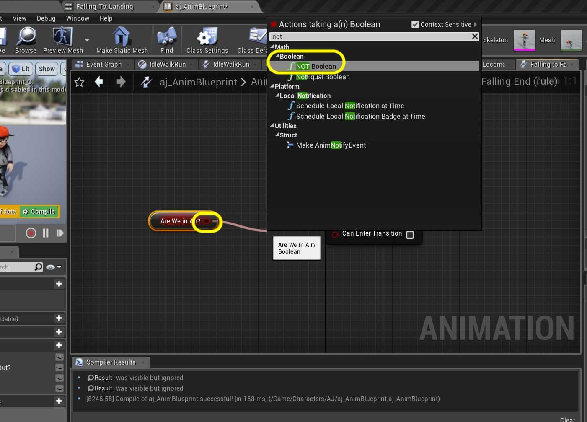

##### `Step 7.`\|`ITA`| :small_orange_diamond: :small_blue_diamond: :small_blue_diamond:

Connect the output of the **NOT** node to the **Result** node.

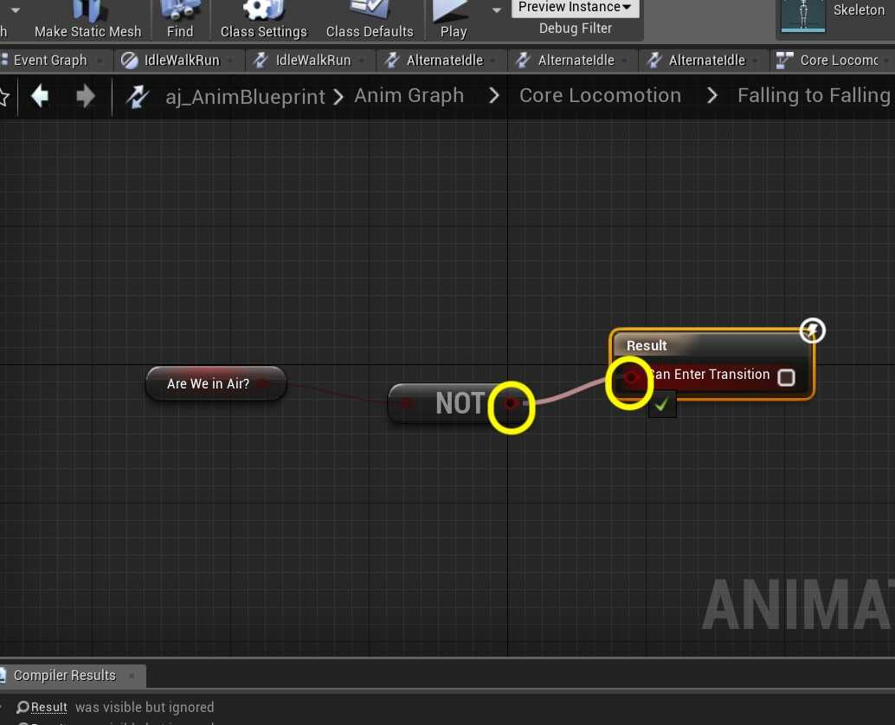

##### `Step 8.`\|`ITA`| :small_orange_diamond: :small_blue_diamond: :small_blue_diamond: :small_blue_diamond:

Lets assign the falling end animation. Go back to the **Anim Graph | Core Locomotiion** screen and *double left-click* on **Falling End**.

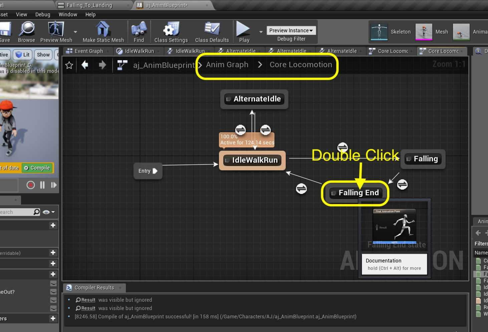

##### `Step 9.`\|`ITA`| :small_orange_diamond: :small_blue_diamond: :small_blue_diamond: :small_blue_diamond: :small_blue_diamond:

*Drag and drop* the **Falling_To_Landing** animation onto the graph. *Connect* the animation pin to the **Output Animation Pose**.

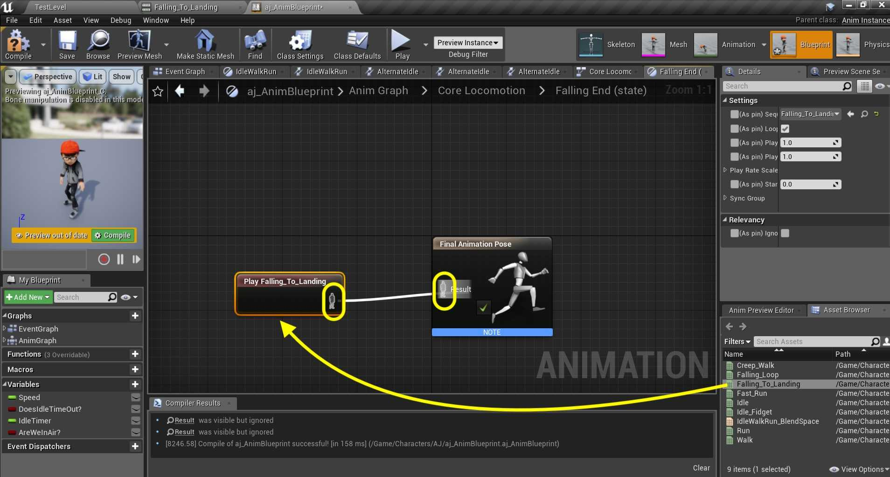

##### `Step 10.`\|`ITA`| :large_blue_diamond:

*Double click* on the transition button from **Falling End** to **IdleWalkRun**.

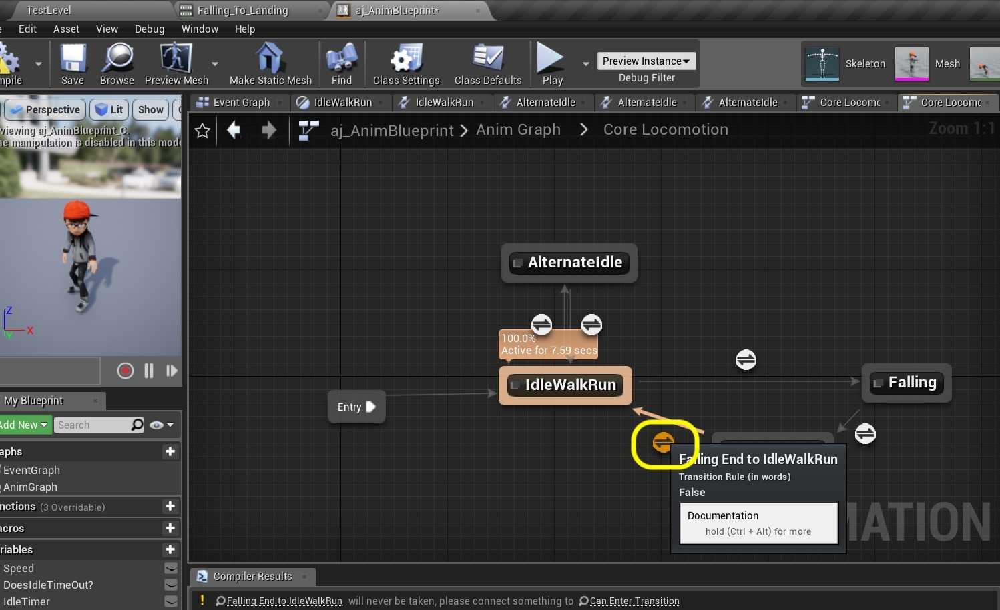

##### `Step 11.`\|`ITA`| :large_blue_diamond: :small_blue_diamond: 

We want this animation to play once then blend back to the **IdleWalkRun** state. There is a node for this. *Right click* on the graph and select a **Time Remaining (ratio)(Falling_To_Landing)** node.

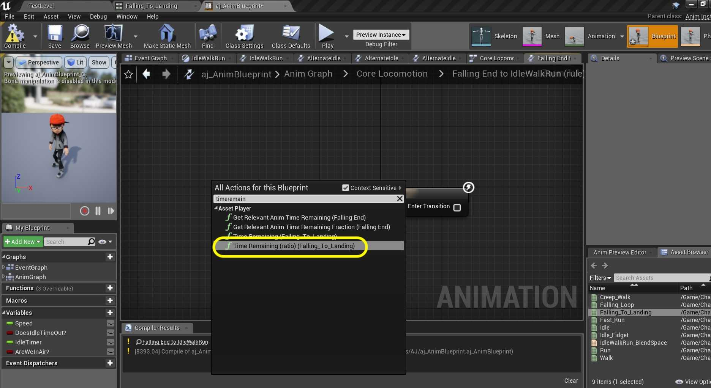

##### `Step 12.`\|`ITA`| :large_blue_diamond: :small_blue_diamond: :small_blue_diamond: 

*Pull off* of the **Return Value** pin from the **Time Remaining** node and select a **<=** node:

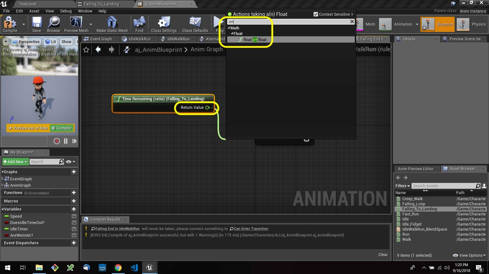

##### `Step 13.`\|`ITA`| :large_blue_diamond: :small_blue_diamond: :small_blue_diamond:  :small_blue_diamond: 

Set the bottom value for the **<=** node to `0.2`. Then *connect* the output to the input of the **Result** node. Why do we start the transition with 20% left?  Because we need room to blend out of this animation into the next (overlap).

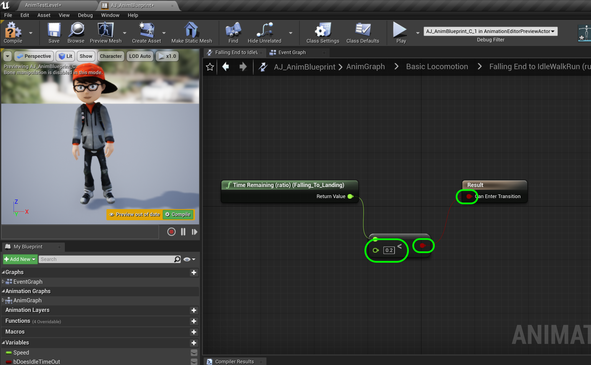

##### `Step 14.`\|`ITA`| :large_blue_diamond: :small_blue_diamond: :small_blue_diamond: :small_blue_diamond:  :small_blue_diamond: 

Go back to the game editor and select the **Floor** object in the **World Outliner**. Copy it multiple times to create a **6 x 6** grid centered in the world.  You should have 36 ground pieces.  Put them in a folder called `Ground` and lock them in place by turning on **Transform | Lock Actor Movement**.

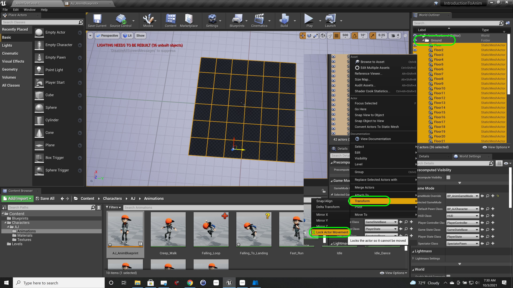

##### `Step 15.`\|`ITA`| :large_blue_diamond: :small_orange_diamond: 

Add a cube under the **Player Start** so that the player will land on the cube. Scale the cube to`3.0` to triple its size. Raise the **Player Start** so it is above this platform.

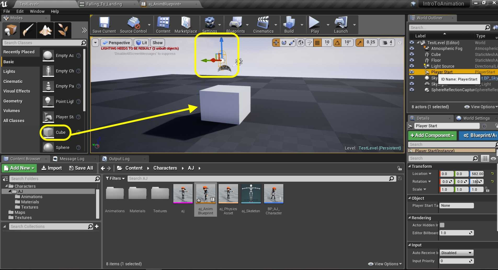

##### `Step 16.`\|`ITA`| :large_blue_diamond: :small_orange_diamond:   :small_blue_diamond: 

*Run* the game and the player should fall on the cube. Walk off the cube and the player should fall on the floor. We should have our states working correctly for falling. Now the only issue is that it is jerky at the end the blend is not working properly.  It is either getting cut off or is not long enough.

https://user-images.githubusercontent.com/5504953/135755418-1e18c62b-d315-4f3e-a452-ef280803120b.mp4

##### `Step 17.`\|`ITA`| :large_blue_diamond: :small_orange_diamond:   :small_blue_diamond: :small_blue_diamond: 

So open up the **Falling_To_Landing** animation and scroll to the end.  You will see that is is **16** frames long or **0.53** seconds (remember we exported these animations from Mixamo at 30 FPS).  So we should start the blend at about half way (.5) and blend for .25 seconds.

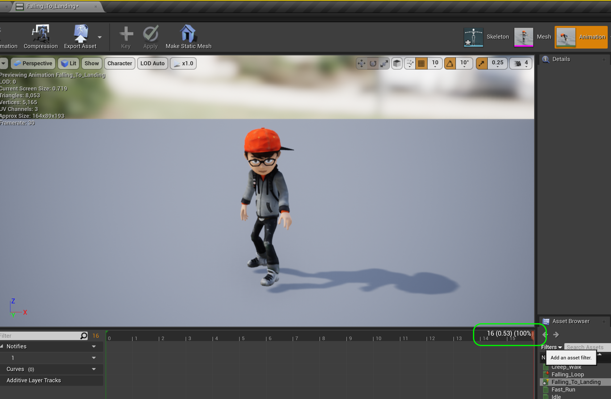

##### `Step 18.`\|`ITA`| :large_blue_diamond: :small_orange_diamond:   :small_blue_diamond: :small_blue_diamond: :small_blue_diamond: 

Click on the tarnsition from **Falling End** to **IdleWalkRun** and change the **Details | Duration** to `0.25` to increase the blend time to a quarter of a second.  *Double click* on the transition and change the value in the **<** node to `0.5` to start blend at 50% complete (roughly a quarter second left in anim at this point).

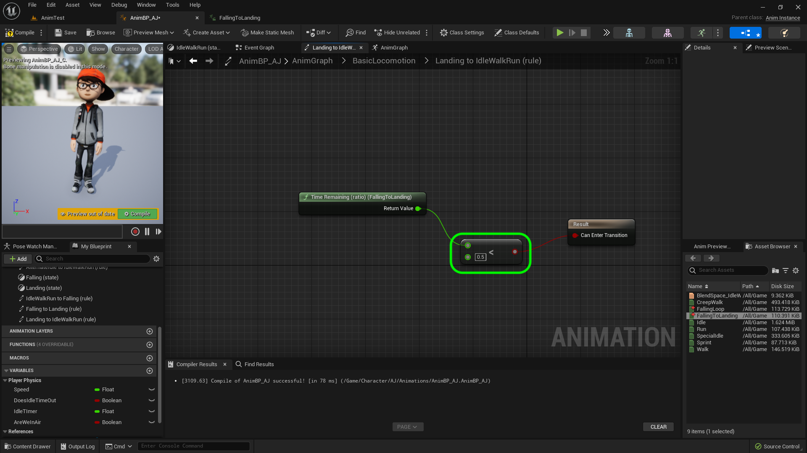

##### `Step 19.`\|`ITA`| :large_blue_diamond: :small_orange_diamond:   :small_blue_diamond: :small_blue_diamond: :small_blue_diamond: 

*Run* the game and the player should fall on the floor and the blend works perfectly!

https://user-images.githubusercontent.com/5504953/135755444-752e994b-c9e0-4aed-89d1-3ec14d008eae.mp4

##### `Step 20.`\|`ITA`| :large_blue_diamond: :large_blue_diamond:

Press **Save All** and update **Github** by **committing** and **pushing** all the changes made. Next up we will be adding jumping to the game.

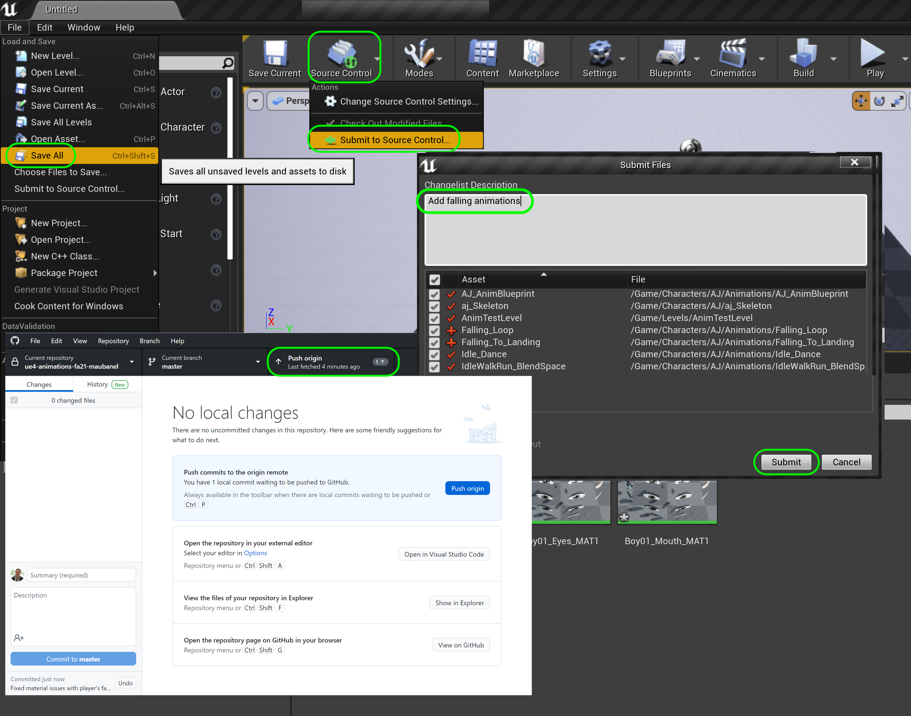
___

<!--  -->

| [previous](../falling/README.md#user-content-falling-animation)| [home](../README.md#user-content-ue4-animations) | [next](../jumping/README.md#user-content-jumping-animation)|
|---|---|---|

