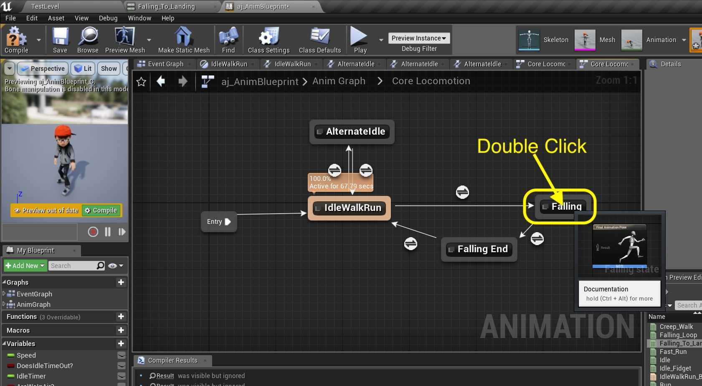

### Falling Animation II

[previous](../falling/README.md#user-content-falling-animation) • [home](../README.md#user-content-ue4-animations) • [next](../jumping/README.md#user-content-jumping-animation)

Falling animation continued...

 

---

##### `Step 1.`\|`ITA`|:small_blue_diamond:

Attach the two only pins in this graph.

##### `Step 2.`\|`FHIU`|:small_blue_diamond: :small_blue_diamond: 

Lets put the animation inside the falling state. *Double click* the **Falling** state node.

##### `Step 3.`\|`ITA`|:small_blue_diamond: :small_blue_diamond: :small_blue_diamond:

*Drag and drop* the **Falling_Loop** animation onto the graph. *Connect* the animation pins together.

##### `Step 4.`\|`ITA`|:small_blue_diamond: :small_blue_diamond: :small_blue_diamond: :small_blue_diamond:

Go back to the **Anim Graph | Core Locomotion** screen and *double click* the transition button between **Falling** and **Falling End** state nodes:

##### `Step 5.`\|`ITA`| :small_orange_diamond:

We switch to this animation when we hit the ground. *Drag* a **Get Are We in Air?** node to the graph.

##### `Step 6.`\|`ITA`| :small_orange_diamond: :small_blue_diamond:

*Pull off* of the **Are We in Air?** node and select a **NOT Boolean** node as we want to find out if the player is not in the air.

##### `Step 7.`\|`ITA`| :small_orange_diamond: :small_blue_diamond: :small_blue_diamond:

Connect the output of the **NOT** node to the **Result** node.

##### `Step 8.`\|`ITA`| :small_orange_diamond: :small_blue_diamond: :small_blue_diamond: :small_blue_diamond:

Lets assign the falling end animation. Go back to the **Anim Graph | Core Locomotiion** screen and *double left-click* on **Falling End**.

##### `Step 9.`\|`ITA`| :small_orange_diamond: :small_blue_diamond: :small_blue_diamond: :small_blue_diamond: :small_blue_diamond:

*Drag and drop* the **Falling_To_Landing** animation onto the graph. *Connect* the animation pin to the **Output Animation Pose**.

##### `Step 10.`\|`ITA`| :large_blue_diamond:

*Double click* on the transition button from **Falling End** to **IdleWalkRun**.

##### `Step 11.`\|`ITA`| :large_blue_diamond: :small_blue_diamond: 

We want this animation to play once then blend back to the **IdleWalkRun** state. There is a node for this. *Right click* on the graph and select a **Time Remaining (ratio)(Falling_To_Landing)** node.

##### `Step 12.`\|`ITA`| :large_blue_diamond: :small_blue_diamond: :small_blue_diamond: 

*Pull off* of the **Return Value** pin from the **Time Remaining** node and select a **<=** node:

##### `Step 13.`\|`ITA`| :large_blue_diamond: :small_blue_diamond: :small_blue_diamond:  :small_blue_diamond: 

Set the bottom value for the **<=** node to `0.2`. Then *connect* the output to the input of the **Result** node. Why do we start the transition with 20% left?  Because we need room to blend out of this animation into the next (overlap).

##### `Step 14.`\|`ITA`| :large_blue_diamond: :small_blue_diamond: :small_blue_diamond: :small_blue_diamond:  :small_blue_diamond: 

Go back to the game editor and select the **Floor** object in the **World Outliner**. Copy it multiple times to create a **6 x 6** grid centered in the world.  You should have 36 ground pieces.  Put them in a folder called `Ground` and lock them in place by turning on **Transform | Lock Actor Movement**.

##### `Step 15.`\|`ITA`| :large_blue_diamond: :small_orange_diamond: 

Add a cube under the **Player Start** so that the player will land on the cube. Scale the cube to a size that makes sense to you. Raise the **Player Start** so it is above this platform.

##### `Step 16.`\|`ITA`| :large_blue_diamond: :small_orange_diamond:   :small_blue_diamond: 

*Run* the game and the player should fall on the cube. Walk off the cube and the player should fall on the floor. We should have our states working correctly for falling. Press **Save All** and update **Github** by **committing** and **pushing** all the changes made. Next up we will be adding jumping to the game.

https://user-images.githubusercontent.com/5504953/132987892-ec21b82f-c6eb-4190-a7e7-e52882d3baa4.mp4
___

| [previous](../falling/README.md#user-content-falling-animation)| [home](../README.md#user-content-ue4-animations) | [next](../jumping/README.md#user-content-jumping-animation)|
|---|---|---|
