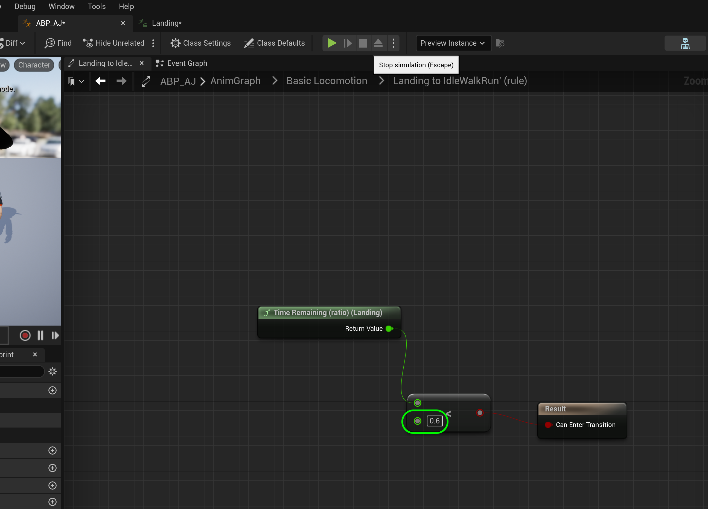

### Falling Animation II

[previous](../falling/README.md#user-content-falling-animation) • [home](../README.md#user-content-ue4-animations) • [next](../jumping/README.md#user-content-jumping-animation)

Falling animation continued...

 

---

##### `Step 1.`\|`ITA`|:small_blue_diamond:

*Run* the game and the player should fall on the cube. Walk off the cube and the player should fall on the floor. We should have our states working correctly for falling. Now the only issue is that it is jerky at the end the blend is not working properly.  It is either getting cut off or is not long enough.

https://github.com/maubanel/UE5-Animations/assets/5504953/a27f0a2c-44c0-4b66-b470-ba2bd736017c

##### `Step 2.`\|`FHIU`|:small_blue_diamond: :small_blue_diamond: 

It takes too long to blend from landing back to running again.  Look at **FallingToLanding** and scrub in the timeline to pick a better blend point.  I think about half way through might be best.

##### `Step 3.`\|`ITA`|:small_blue_diamond: :small_blue_diamond: :small_blue_diamond:

*Double click*  on the transition from **Landing** to **IdleWalkRun** on the transition and change the value in the **<** node to `0.6` to start blend at 40% complete (roughly a quarter second left in anim at this point). Depending on how tightly you edited the land this number might need to be different for you.  Trial and error is key here.

##### `Step 4.`\|`ITA`|:small_blue_diamond: :small_blue_diamond: :small_blue_diamond: :small_blue_diamond:

*Run* the game and the player should fall on the floor and the blend works perfectly once you find the right part of the animation to blend out of!

https://github.com/maubanel/UE5-Animations/assets/5504953/3bda78ba-478b-4fc3-b174-7a8a9e2cc4b1

##### `Step 5.`\|`ITA`| :small_orange_diamond:

##### `Step 6.`\|`ITA`| :small_orange_diamond: :small_blue_diamond:

##### `Step 7.`\|`ITA`| :small_orange_diamond: :small_blue_diamond: :small_blue_diamond:

##### `Step 8.`\|`ITA`| :small_orange_diamond: :small_blue_diamond: :small_blue_diamond: :small_blue_diamond:

##### `Step 9.`\|`ITA`| :small_orange_diamond: :small_blue_diamond: :small_blue_diamond: :small_blue_diamond: :small_blue_diamond:

##### `Step 10.`\|`ITA`| :large_blue_diamond:

##### `Step 11.`\|`ITA`| :large_blue_diamond: :small_blue_diamond: 

##### `Step 12.`\|`ITA`| :large_blue_diamond: :small_blue_diamond: :small_blue_diamond: 

##### `Step 13.`\|`ITA`| :large_blue_diamond: :small_blue_diamond: :small_blue_diamond:  :small_blue_diamond: 

##### `Step 14.`\|`ITA`| :large_blue_diamond: :small_blue_diamond: :small_blue_diamond: :small_blue_diamond:  :small_blue_diamond: 

##### `Step 15.`\|`ITA`| :large_blue_diamond: :small_orange_diamond: 

##### `Step 16.`\|`ITA`| :large_blue_diamond: :small_orange_diamond:   :small_blue_diamond: 

##### `Step 17.`\|`ITA`| :large_blue_diamond: :small_orange_diamond:   :small_blue_diamond: :small_blue_diamond: 

Select the **File | Save All** then quit UE5.   Go to **P4V** and go the top project folder (the one that holds the `.uproject` file and **Content** folder) and press the <kbd>+Add</kbd> then <kbd>OK</kbd> button.  This makes sure any files that Unreal didn't add get added to source control. Press the <kbd>Submit</kbd> button and enter a message explaining the work done.  Press <kbd>Submit</kbd>.

<!--  -->

| [previous](../falling/README.md#user-content-falling-animation)| [home](../README.md#user-content-ue4-animations) | [next](../jumping/README.md#user-content-jumping-animation)|
|---|---|---|

