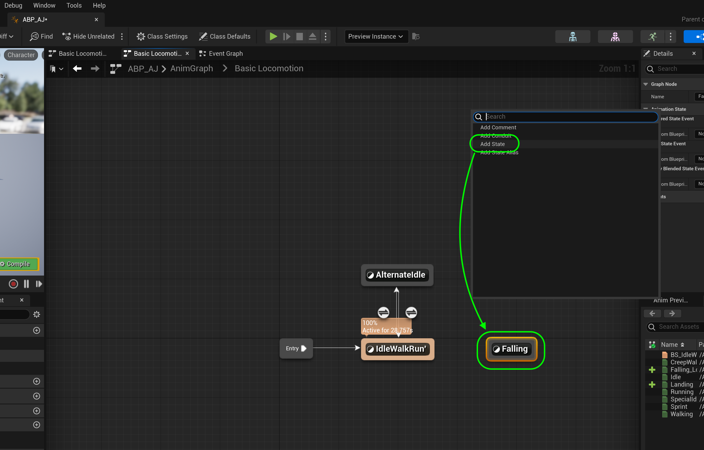
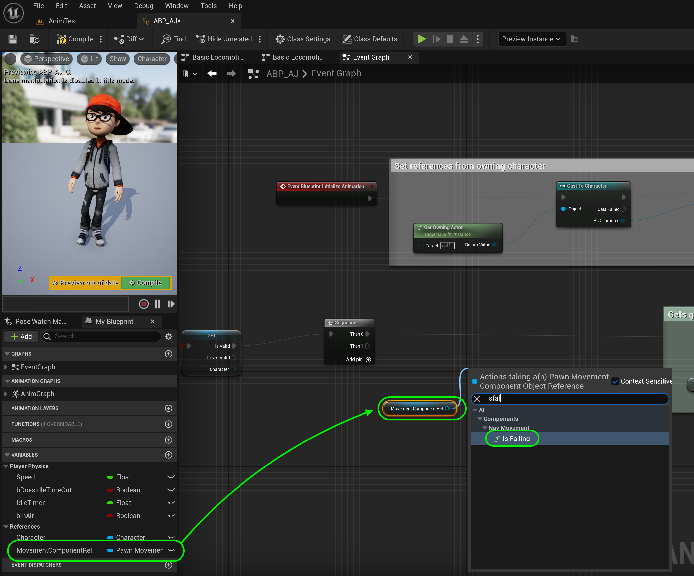

### Falling Animation

[previous](../second-idle-ii/README.md#user-content-time-out-for-second-idle-ii) • [home](../README.md#user-content-ue4-animations) • [next](../falling-ii/README.md#user-content-falling-animation-ii)

Lets add an animation for when the player is falling to our movement state machine for when the player falls off the edge of a surface.

 

---

##### `Step 1.`\|`ITA`|:small_blue_diamond:

Lets go back to [Mixamo](https://www.mixamo.com/#/) and look for some more animations. I am looking for a looping falling animation and for hitting the ground (after falling). Select the character you are using then search for these two animations. First pick the looping falling and make the appropriate adjustments. *Click* the **Download** button.

##### `Step 2.`\|`FHIU`|:small_blue_diamond: :small_blue_diamond: 

*Download* just the animation with the default settings. *Set* **Skin** to `Without Skin` to avoid bringing in any geometry. *Press* the <kbd>Download</kbd> button again.

##### `Step 3.`\|`ITA`|:small_blue_diamond: :small_blue_diamond: :small_blue_diamond:

I also found an animation from falling to hitting the ground. I sped up the animation as I didn't want it to interupt gameplay too much so I cranked up the **Overdrive**. On the next menu it should be the same settings as previously so you can verify this then *press* <kbd>Download</kbd> again.

##### `Step 4.`\|`ITA`|:small_blue_diamond: :small_blue_diamond: :small_blue_diamond: :small_blue_diamond:

Go back to the game and go to the **AJ | Animations** folder and *press* the <kbd>Add/Import</kbd> button and *select* these two animations you just downloaded.

##### `Step 5.`\|`ITA`| :small_orange_diamond:

In the **FBX Import Options** overlay, make sure you select the skeleton you have been using. Then press the <kbd>Import All</kbd> button.

##### `Step 6.`\|`ITA`| :small_orange_diamond: :small_blue_diamond:

*Preview* the animations in the editor. *Name* them accordingly. I named them `FallingLoop` and `FallingToLanding`.

##### `Step 7.`\|`ITA`| :small_orange_diamond: :small_blue_diamond: :small_blue_diamond:

Open the **AnimBP_AJ** animation blueprint and go to the **Anim Graph | Basic Locomotion** tab. *Right click* on the area and add an **Add State** button. Call this new state `Falling`. 

##### `Step 8.`\|`ITA`| :small_orange_diamond: :small_blue_diamond: :small_blue_diamond: :small_blue_diamond:

*Right click* again and select another **Add State** node. *Call* this new state `Landing`.

##### `Step 9.`\|`ITA`| :small_orange_diamond: :small_blue_diamond: :small_blue_diamond: :small_blue_diamond: :small_blue_diamond:

We need a reference to the character component of the player blueprint.  Go to the **Event Graph** of the **AnimBP_AJ**.  Go to the right of setting the **Character Reference** and pull off the **Set Character** output pin and select **Character Movemement** to add this node.  Right click on the output and select **Promote to Variable**.

##### `Step 10.`\|`ITA`| :large_blue_diamond:

Connect thte execution pin from **Set Character** to **Set Character Movement**.  On the **Character Movement** variable set **Private** to `true` and **Category** to `Reference`.

##### `Step 11.`\|`ITA`| :large_blue_diamond: :small_blue_diamond: 

Increase the size of the **References** comment group to include these new nodes.

##### `Step 12.`\|`ITA`| :large_blue_diamond: :small_blue_diamond: :small_blue_diamond: 

Now we need a boolean to track when we are on the ground or in the air. Add a new **Boolean** Variable and call it `AreWeInAir`. *Make* it **Private** and set the **Tooltip** to `True when player is not on the ground`. Set the **Category** to `Player Physics`.

##### `Step 13.`\|`ITA`| :large_blue_diamond: :small_blue_diamond: :small_blue_diamond:  :small_blue_diamond: 

Go to the **Event Graph** tab and make some space between the **Is Valid** node and the **Get Velocity** node to check to see if we are in air.

##### `Step 14.`\|`ITA`| :large_blue_diamond: :small_blue_diamond: :small_blue_diamond: :small_blue_diamond:  :small_blue_diamond: 

*Drag* a get **Character Movement** variable to the graph. *Pull off* of the **Return Value** pin from the **Movement Component** and select the **IsFalling** node.

##### `Step 15.`\|`ITA`| :large_blue_diamond: :small_orange_diamond: 

*Drag* the **Set Are We In Air** variable onto the graph.

##### `Step 16.`\|`ITA`| :large_blue_diamond: :small_orange_diamond:   :small_blue_diamond: 

Connect the **Return Value** pin from the **Is Falling** node to the **Set Are We In Air?** node. *Hijack* the execution pin from **Is Valid** node and *send it* to the **Set Are We In Air?** node.

##### `Step 17.`\|`ITA`| :large_blue_diamond: :small_orange_diamond: :small_blue_diamond: :small_blue_diamond:

Take the output execution pin from **Set Are We in Air?** node to the **Set Speed** node.

##### `Step 18.`\|`ITA`| :large_blue_diamond: :small_orange_diamond: :small_blue_diamond: :small_blue_diamond: :small_blue_diamond:

Select the new nodes and make a **comment** `Sets Whether Player Is In Air`.

##### `Step 19.`\|`ITA`| :large_blue_diamond: :small_orange_diamond: :small_blue_diamond: :small_blue_diamond: :small_blue_diamond: :small_blue_diamond:

Go back to the **Anim Graph | Core Locomotion** screen. *Connect* the **IdleWalkRun** state to the **Falling** state to the **Falling End** state *back* to the **IdleWalkRun**.

##### `Step 20.`\|`ITA`| :large_blue_diamond: :large_blue_diamond:

Double click the transition from **IdleWalkRun** to **Falling**.

##### `Step 21.`\|`ITA`| :large_blue_diamond: :large_blue_diamond: :small_blue_diamond:

*Drag and drop* the **Get Are We In Air?** variable onto the graph.

___

<!--  -->

| [previous](../second-idle-ii/README.md#user-content-time-out-for-second-idle-ii)| [home](../README.md#user-content-ue4-animations) | [next](../falling-ii/README.md#user-content-falling-animation-ii)|
|---|---|---|
