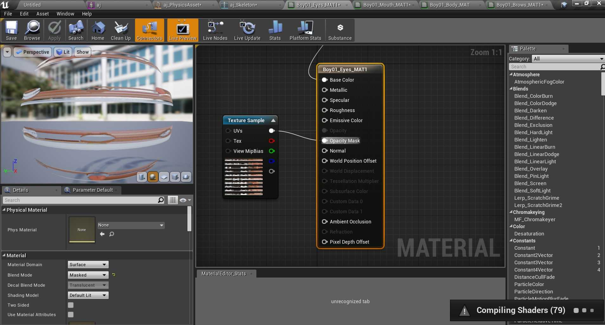
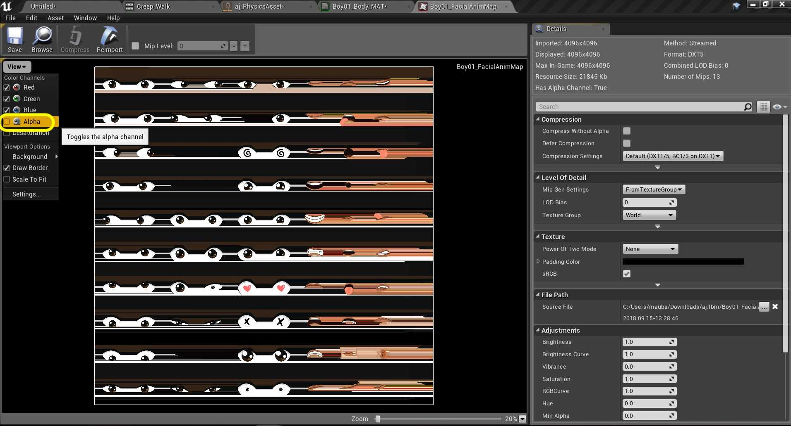
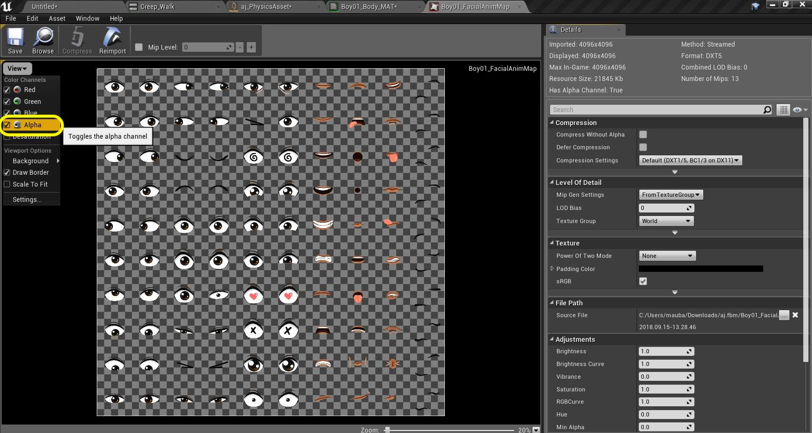
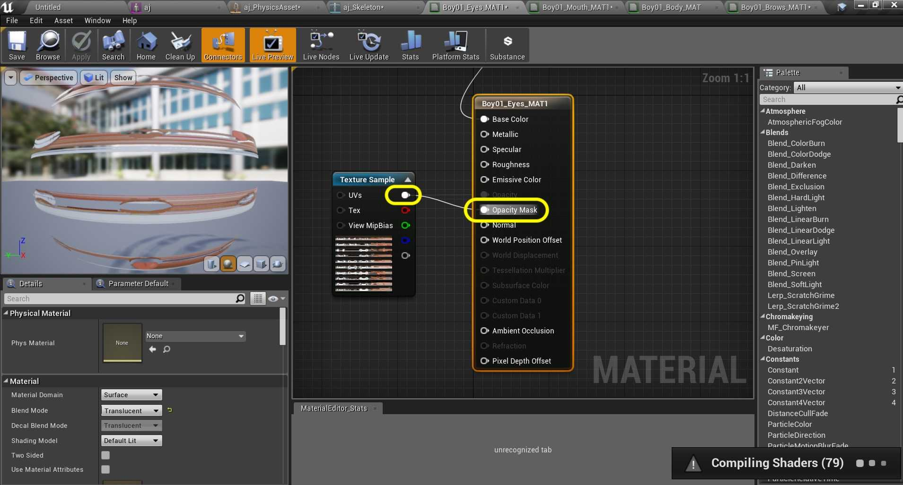
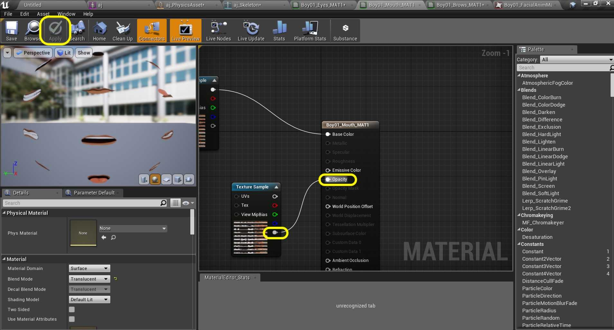
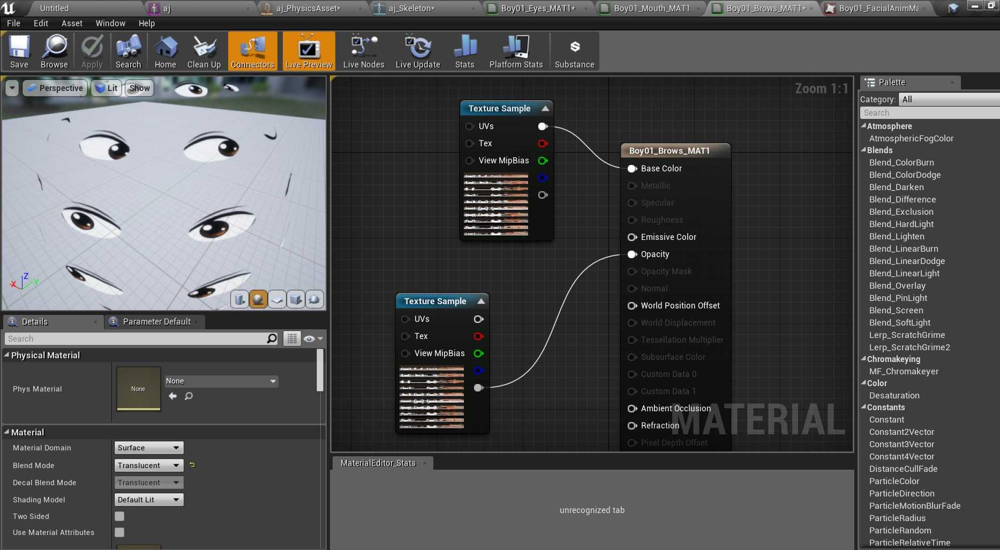

### Fixing Mixamo Models

[previous](../character-anim/README.md#user-content-download-character--animations) • [home](../README.md#user-content-ue4-animations) • [next](../add-animations/README.md#user-content-add-animations)

There may or may not be issues with the skeletal meshe's material(s). Look carefully for any issues especially around, eyes, mouths and accessories. Compare what it looks like in Unreal versus what it looks like on Mixamo.  It should look the same. If your character has no issues you can move on to the [next section](../add-animations/README.md#user-content-add-animations).

 

---

##### `Step 1.`\|`ITA`|:small_blue_diamond:

There are some common issues with the materials. Sometimes the material uses a **Transulucent** instead of an **Opaque Blend Mode**. I see problems in the face in my model. I see 3 materials that control the mouth, brow and eyes. I look at one of the materials and see some streaking in the texture:

##### `Step 2.`\|`FHIU`|:small_blue_diamond: :small_blue_diamond: 

If I open the **Texture** that is used on the face I can see that if I turn the **Alpha** off I see the same steaking.

##### `Step 3.`\|`ITA`|:small_blue_diamond: :small_blue_diamond: :small_blue_diamond:

If we turn the **Alpha** back on then the texture is rendered correctly.

##### `Step 4.`\|`ITA`|:small_blue_diamond: :small_blue_diamond: :small_blue_diamond: :small_blue_diamond:

Go back to the material and look at the texture plugged into the **Opacity Mask**. It is the three 3 channels minus the alpha. This is wrong, the only channel that should be plugged into Opacity is the **A** alpha channel.

##### `Step 5.`\|`ITA`| :small_orange_diamond:

Now change the pin going to **Opacity** from the top **RGB** pin to the bottom **Alpha** pin. This uses the alpha channel to cut out the texture from the background. Press the Apply button.  

##### `Step 6.`\|`ITA`| :small_orange_diamond: :small_blue_diamond:

I repeated this for the other two face materials on this character. I put in the correct alpha pin and pressed <kbd>Apply</kbd>. You can see that th texture has the correct Alpha cut out in the preview window. If you picked a different character you will have to figure out how to correct any material issues your model might have.

##### `Step 7.`\|`ITA`| :small_orange_diamond: :small_blue_diamond: :small_blue_diamond:

Go back to the skeletal mesh and move the camera around the character. Make sure you have fixed all the material issues that arose.

___

| [previous](../character-anim/README.md#user-content-download-character--animations)| [home](../README.md#user-content-ue4-animations) | [next](../add-animations/README.md#user-content-add-animations)|
|---|---|---|
