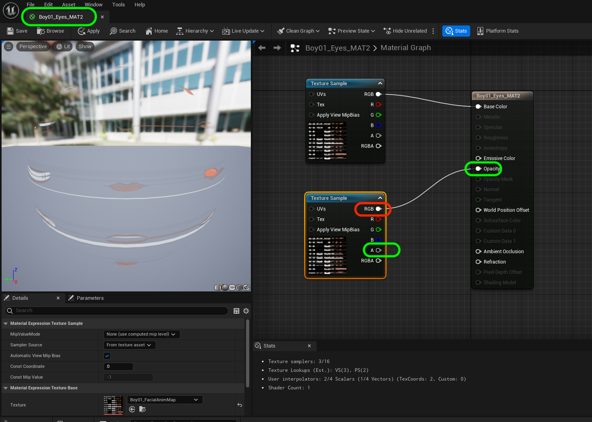
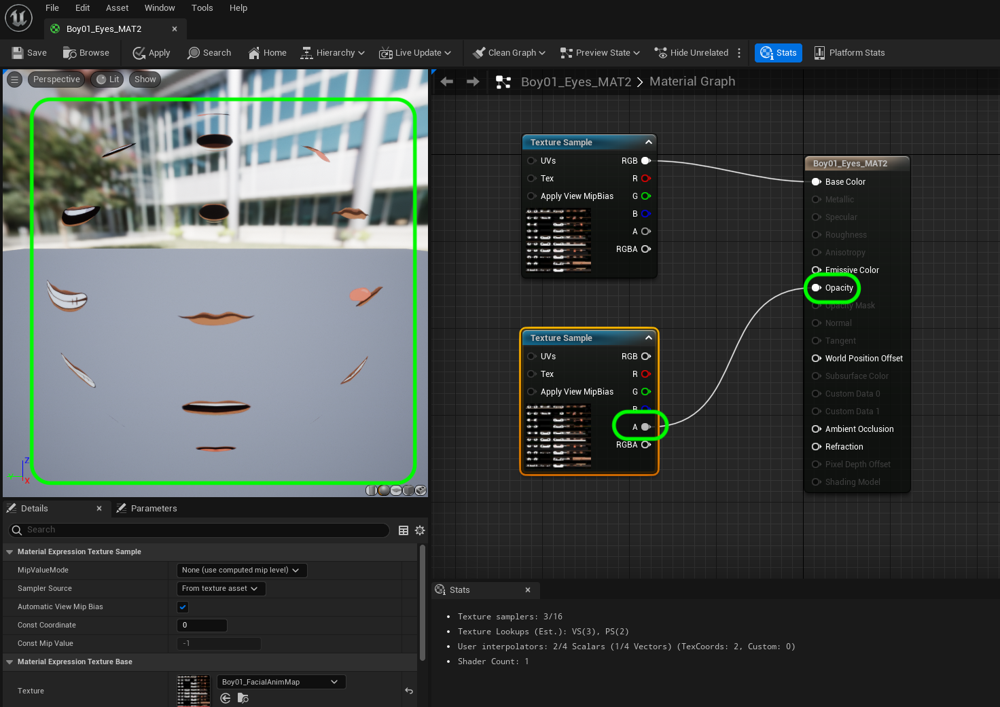
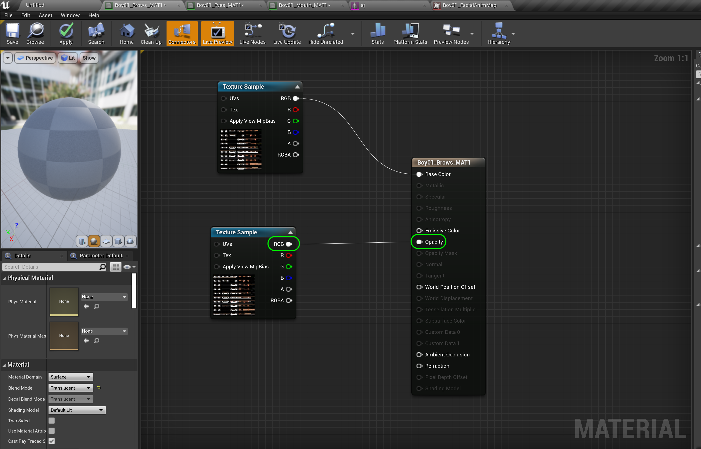
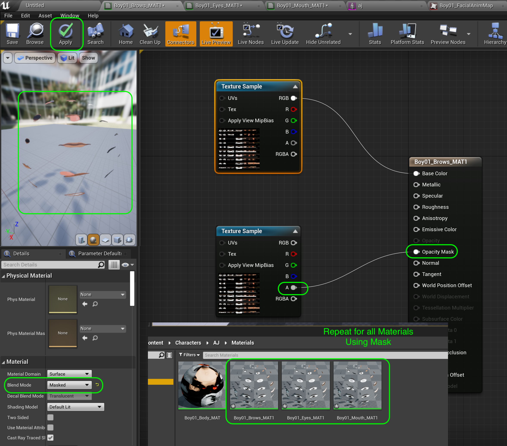
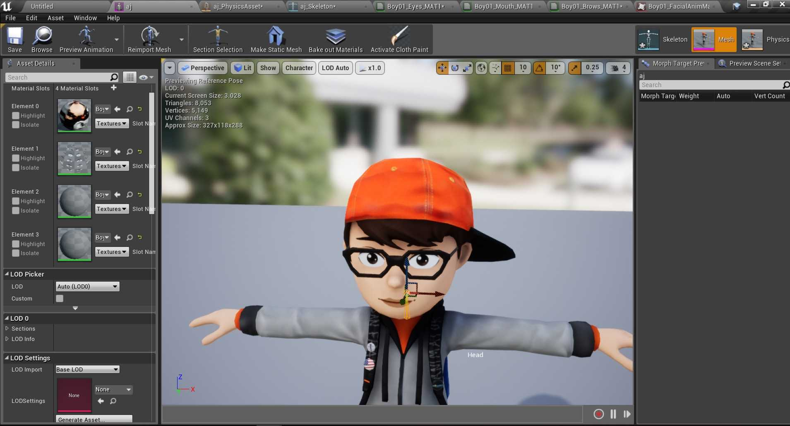
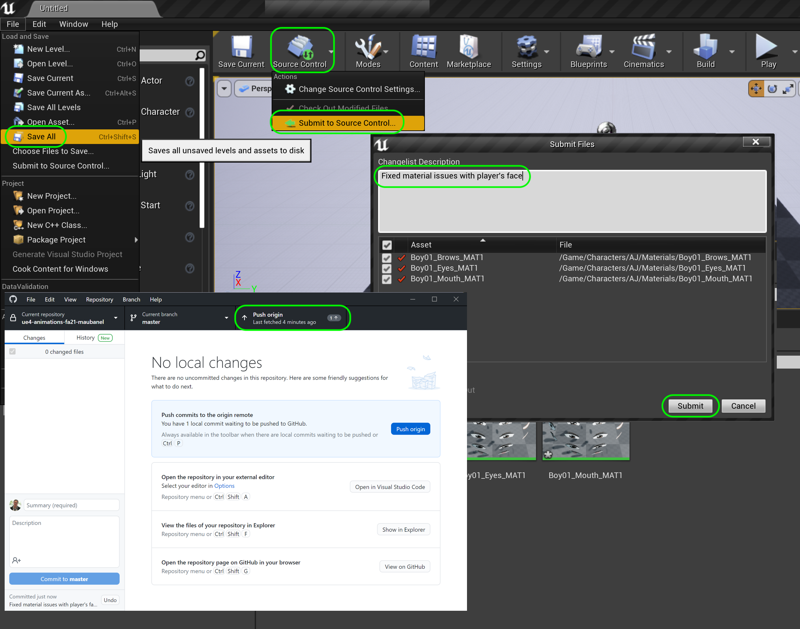

### Fixing Mixamo Models

[previous](../character-anim/README.md#user-content-download-character--animations) • [home](../README.md#user-content-ue4-animations) • [next](../add-animations/README.md#user-content-add-animations)

There may or may not be issues with the skeletal meshe's material(s). Look carefully for any issues especially around, eyes, mouths and accessories. Compare what it looks like in Unreal versus what it looks like on Mixamo.  It should look the same. If your character has no issues you can move on to the [next section](../add-animations/README.md#user-content-add-animations).

 

---

##### `Step 1.`\|`ITA`|:small_blue_diamond:

There are some common issues with the materials. I see problems in the face in my model. I see 3 materials that control the mouth, brow and eyes. I look at one of the materials **Boy01_Eyes_MAT2** and see that it is feeding the **RGB** (Albedo) into the **Opacity** channel.  This really should be the **Alpha** channel of the texture.

##### `Step 2.`\|`FHIU`|:small_blue_diamond: :small_blue_diamond: 

Change the channel going to the **Opacity** node instead to **Alpha**. Notice now how the graphics for the eyes, brows and mouth all of a sudden are opaque! Press the <kbd>Apply</kbd> button.

##### `Step 3.`\|`ITA`|:small_blue_diamond: :small_blue_diamond: :small_blue_diamond:

Repeat this for the mouth and brows materials which have the same problem. Press the <kbd>Apply</kbd> button.

##### `Step 4.`\|`ITA`|:small_blue_diamond: :small_blue_diamond: :small_blue_diamond: :small_blue_diamond:

Go back to the material and look at the texture plugged into the **Opacity Mask**. It is the three 3 channels minus the alpha. This is wrong, the only channel that should be plugged into Opacity is the **A** alpha channel.

##### `Step 5.`\|`ITA`| :small_orange_diamond:

Now change the pin going to **Opacity** from the top **RGB** pin to the bottom **Alpha** pin. Also since these graphics are not opaque we can use it in the **Opacity Mask** pin in the shader.  Redirect the **Alpha** pin to the **Opacity Mask** and remove the conection to the **Opacity** pin.  Change the shader **Blend Mode** to `Masked`. This uses the alpha channel to mask out the texture from the background. Press the <kbd>Apply</kbd> button.  You will notice that the textures don't streak and are sharp.  Do this to all the materials using this texture.

##### `Step 6.`\|`ITA`| :small_orange_diamond: :small_blue_diamond:

Go back to the skeletal mesh and move the camera around the character. Make sure you have fixed all the material issues that arose. The issues you may have may be different depending on which character you selected.

##### `Step 7.`\|`ITA`| :small_orange_diamond: :small_blue_diamond: :small_blue_diamond:

Select the **File | Save All** then press the <kbd>Source Control</kbd> button and select **Submit to Source Control...**.  Enter a **Changelist Description** and then press <kbd>Submit</kbd>.  Open up **GitHub Desktop** and select **Push origin** to update the server with the latest changes.

___

<!--  -->

| [previous](../character-anim/README.md#user-content-download-character--animations)| [home](../README.md#user-content-ue4-animations) | [next](../add-animations/README.md#user-content-add-animations)|
|---|---|---|
