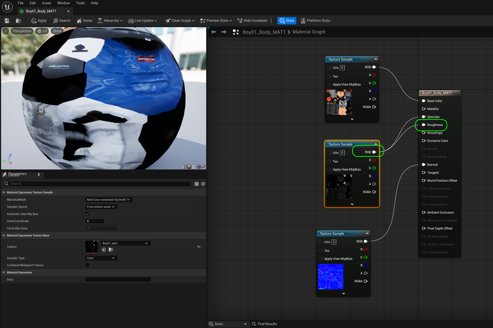
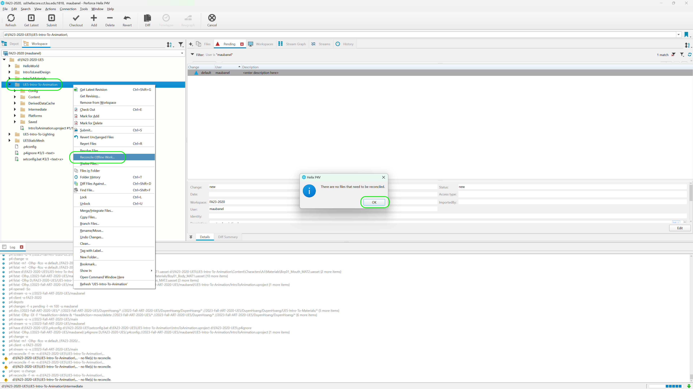

### Fixing Mixamo Models

[previous](../character-anim/README.md#user-content-download-character--animations) • [home](../README.md#user-content-ue4-animations) • [next](../add-animations/README.md#user-content-add-animations)

There may or may not be issues with the skeletal meshe's material(s). Look carefully for any issues especially around, eyes, mouths and accessories. Compare what it looks like in Unreal versus what it looks like on Mixamo.  It should look the same. If your character has no issues you can move on to the [next section](../add-animations/README.md#user-content-add-animations).

 

---

##### `Step 1.`\|`ITA`|:small_blue_diamond:

There are some common issues with the materials. I see problems in the face in my model. I see 3 materials that control the mouth, brow and eyes. I look at one of the materials **Boy01_Eyes_MAT2** and see that it is feeding the **RGB** (Albedo) into the **Opacity** channel.  This really should be the **Alpha** channel of the texture. Change the channel going to the **Opacity** node instead to **Alpha**. Notice now how the graphics for the eyes, brows and mouth all of a sudden are opaque! Press the <kbd>Apply</kbd> button.

##### `Step 2.`\|`FHIU`|:small_blue_diamond: :small_blue_diamond: 

Repeat this for the brows material **Boy01_Brows_MAT2** which has the same problem. Connect the **A** channel and press the <kbd>Apply</kbd> button.

##### `Step 3.`\|`ITA`|:small_blue_diamond: :small_blue_diamond: :small_blue_diamond:

Repeat this for the mouth material **Boy01_Mouth_MAT2** which have the same problem. Connect the **A** channel and press the <kbd>Apply</kbd> button..

##### `Step 4.`\|`ITA`|:small_blue_diamond: :small_blue_diamond: :small_blue_diamond: :small_blue_diamond:

Now open up the material **Boy01_Body_MAT2** and connect the mask **RGB** pin to the **Roughness** pin of the material so we can use the rougness channel.

##### `Step 5.`\|`ITA`| :small_orange_diamond:

Go back to the skeletal mesh and move the camera around the character. Make sure you have fixed all the material issues that arose. The issues you may have may be different depending on which character you selected. My face is all better now and looks like the version on ***Mixamo***.

##### `Step 6.`\|`ITA`| :small_orange_diamond: :small_blue_diamond:

Select the **File | Save All** then press the <kbd>Revision Control</kbd> button and select **Submit Content**.  If you are prompted, select **Check Out** for all items that are not checked out of source control. Update the **Changelist Description** message and with the latest changes. Make sure all the files are correct and press the <kbd>Submit</kbd> button. A confirmation will pop up on the bottom right with a message about a changelist was submitted with a commit number. Quit Unreal and make sure your **Pending** tab in **P4V** is empty. **Submit** any work that is still in the editor.

##### `Step 7.`\|`ITA`| :small_orange_diamond: :small_blue_diamond: :small_blue_diamond:

Sometimes not all files get submitted to Unreal especially for files that don't show up in the editor.  It is good practice one you submit in **Unreal** and quit the game to right click on the top most project folder and select **Reconcile Offline Work...**.

This will either give a message saying ther is nothing to reconcile or bring up a tab.  Make sure that these are **NOT** files in the **Intermediate** and **Saved** folders as these should be ignored from the `.p4ignore`.

If the files are in **Content** or **Configuration** then press the <kbd>Reconcile</kbd> button.  Then submit the changes with a message and press the <kbd>Submit</kbd> button.

<!--  -->

| [previous](../character-anim/README.md#user-content-download-character--animations)| [home](../README.md#user-content-ue4-animations) | [next](../add-animations/README.md#user-content-add-animations)|
|---|---|---|
