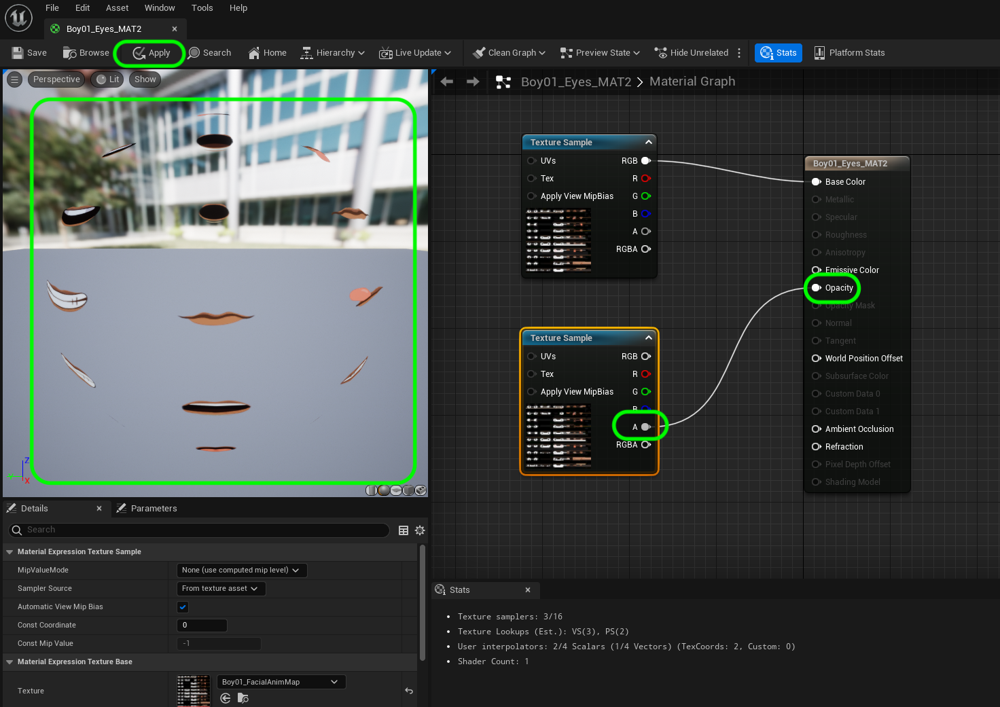
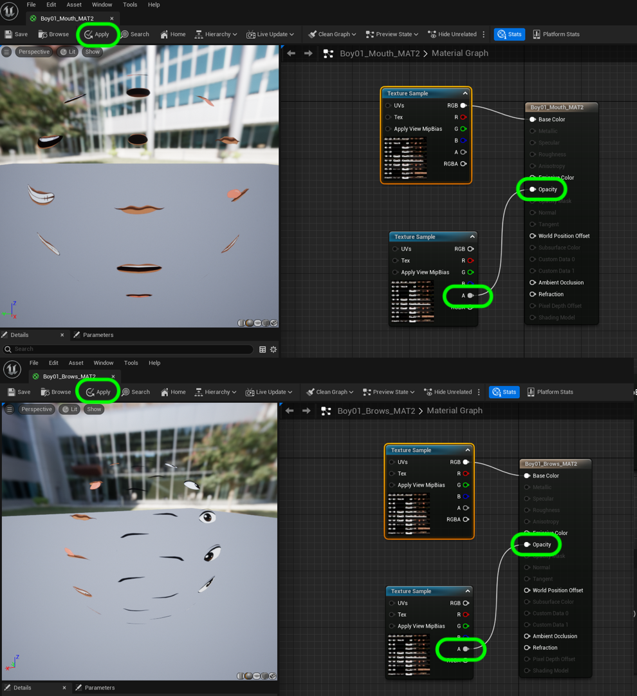
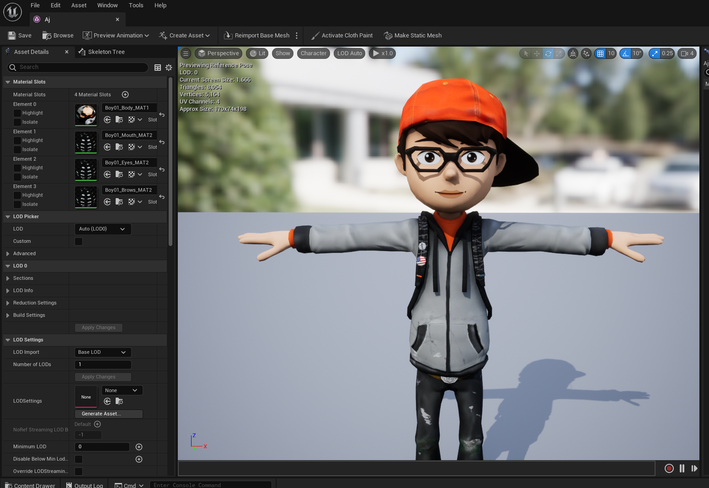

### Fixing Mixamo Models

[previous](../character-anim/README.md#user-content-download-character--animations) • [home](../README.md#user-content-ue4-animations) • [next](../add-animations/README.md#user-content-add-animations)

There may or may not be issues with the skeletal meshe's material(s). Look carefully for any issues especially around, eyes, mouths and accessories. Compare what it looks like in Unreal versus what it looks like on Mixamo.  It should look the same. If your character has no issues you can move on to the [next section](../add-animations/README.md#user-content-add-animations).

 

---

##### `Step 1.`\|`ITA`|:small_blue_diamond:

There are some common issues with the materials. I see problems in the face in my model. I see 3 materials that control the mouth, brow and eyes. I look at one of the materials **Boy01_Eyes_MAT2** and see that it is feeding the **RGB** (Albedo) into the **Opacity** channel.  This really should be the **Alpha** channel of the texture.

##### `Step 2.`\|`FHIU`|:small_blue_diamond: :small_blue_diamond: 

Change the channel going to the **Opacity** node instead to **Alpha**. Notice now how the graphics for the eyes, brows and mouth all of a sudden are opaque! Press the <kbd>Apply</kbd> button.

##### `Step 3.`\|`ITA`|:small_blue_diamond: :small_blue_diamond: :small_blue_diamond:

Repeat this for the mouth and brows materials which have the same problem. Press the <kbd>Apply</kbd> button.

##### `Step 4.`\|`ITA`|:small_blue_diamond: :small_blue_diamond: :small_blue_diamond: :small_blue_diamond:

Go back to the skeletal mesh and move the camera around the character. Make sure you have fixed all the material issues that arose. The issues you may have may be different depending on which character you selected.

##### `Step 5.`\|`ITA`| :small_orange_diamond:

##### `Step 6.`\|`ITA`| :small_orange_diamond: :small_blue_diamond:

##### `Step 7.`\|`ITA`| :small_orange_diamond: :small_blue_diamond: :small_blue_diamond:

___

<!--  -->

| [previous](../character-anim/README.md#user-content-download-character--animations)| [home](../README.md#user-content-ue4-animations) | [next](../add-animations/README.md#user-content-add-animations)|
|---|---|---|
