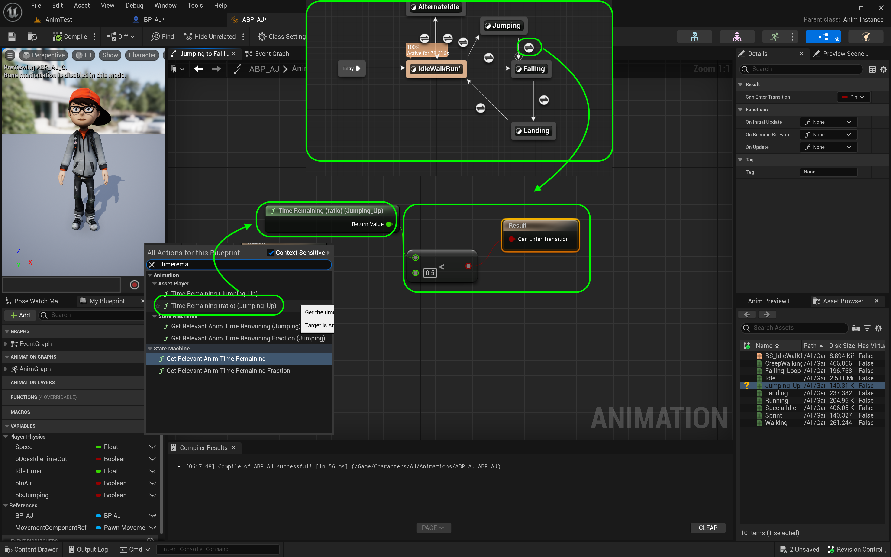
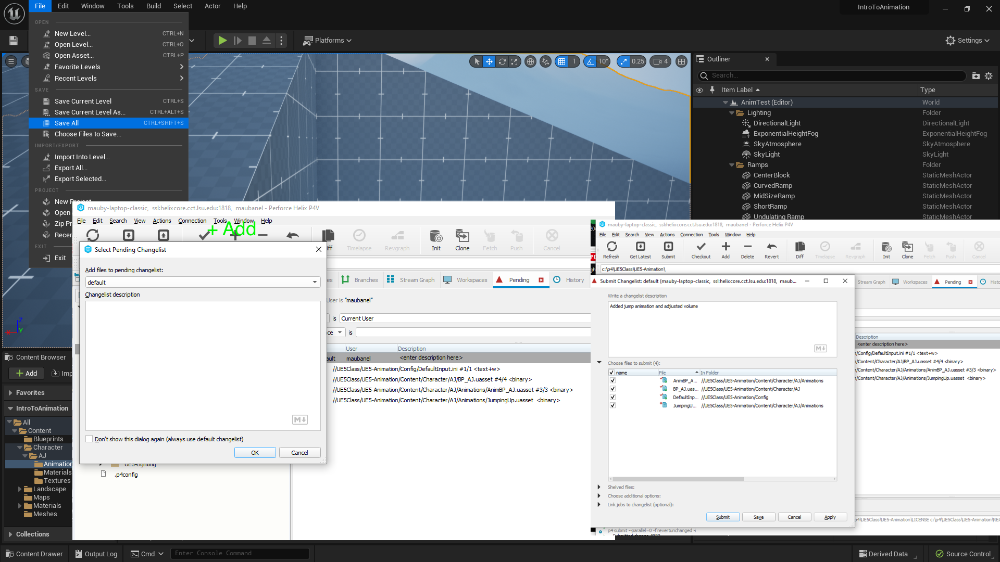

### Jumping Animation II

[previous](../jumping/README.md#user-content-jumping-animation) • [home](../README.md#user-content-ue4-animations) • [next](../walk-sprint/README.md#user-content-slow-walk--sprint)

Continue implementing jump animation...

 

---

##### `Step 1.`\|`ITA`|:small_blue_diamond:

Go back to the **Anim Graph | Basic Locomotion** section of the animation blueprint and *click on* the transition button from **IdleWalkRun** to **Jumping** transition. Add a **Is Jumping** node and *connect* the pin to the **Result | Can Enter Transition** pin.

##### `Step 2.`\|`FHIU`|:small_blue_diamond: :small_blue_diamond: 

Go back to the **Anim Graph | Core Locomotion** page. *Double click* the **Jumping** state to assign the **JumpingUp** animation. Drag and drop the **Jumping_Up** animation to the graph. *Connect* the animation nodes with the **Output Animation Pose**.

##### `Step 3.`\|`ITA`|:small_blue_diamond: :small_blue_diamond: :small_blue_diamond:

Go back to the **Anim Graph | Core Locomotion** screen. *Double click* on the transition in the **Anim Graph | Basic Locomotion** page from **IdleWalkRun** to **Falling**. This is for falling off the edge of an object without jumping. We need to find out if we are in the air but **not** pressing the jump button. *Drag* a  **Get IsJumping** nodes onto the graph.

##### `Step 4.`\|`ITA`|:small_blue_diamond: :small_blue_diamond: :small_blue_diamond: :small_blue_diamond:

*Drag off* of the **Is Jumping** pin and select **NOT Boolean**. *Add* an **AND Boolean** to the node chart. *Connect* it to the input of the **AND** pin. *Connect* the output of the **AND** node to **Result** node. Connect the **In Air** pin to the top of the **AND** node.

##### `Step 5.`\|`ITA`| :small_orange_diamond:

*Double click* on the **Jumping** to **Falling** transition button on the **Anim Graph | Core Locomotion** screen. *Right click* on the graph and select a **Time Remaining (ratio) (JumpingUp)** node. *Pull off* of the **Return Value** pin and select a **float <= float** node. *Set* the bottom to `0.5`. *Connect* the output to the **Result** pin. *Press* <kbd>Compile</kbd> on all open blueprints and the warning will disapear.

##### `Step 6.`\|`ITA`| :small_orange_diamond: :small_blue_diamond:

Press the <kbd>Play</kbd> button and jump and now we should have a jump animation in the flow. Make sure both transitions of running off edge and jumping are working correctly

https://github.com/maubanel/UE5-Animations/assets/5504953/77521d39-1132-4721-b40f-163a0bf1cdb5

##### `Step 7.`\|`ITA`| :small_orange_diamond: :small_blue_diamond: :small_blue_diamond:

If you run up to the ramp and jump next to the wall, the character's head penetrates it too much for my liking. The head when jumping up the wall gets buried inside the wall geometry. Lets fix this.

https://github.com/maubanel/UE5-Animations/assets/5504953/8e420fa9-515d-4f46-9efb-d649245d173b

##### `Step 8.`\|`ITA`| :small_orange_diamond: :small_blue_diamond: :small_blue_diamond: :small_blue_diamond:

Open up **BP_AJ**. Then go to the **Capsule** component and increase the **Capsule Radius**. For my character `70.0` seems to work fine. I also adjusted the height as it was a bit short to a **Capsule Half Height** of `95.0`. Readjust the height of the mesh so it is at the bottom of the collision volume.

##### `Step 9.`\|`ITA`| :small_orange_diamond: :small_blue_diamond: :small_blue_diamond: :small_blue_diamond: :small_blue_diamond:

##### `Step 10.`\|`ITA`| :large_blue_diamond:

##### `Step 11.`\|`ITA`| :large_blue_diamond: :small_blue_diamond: 

##### `Step 12.`\|`ITA`| :large_blue_diamond: :small_blue_diamond: :small_blue_diamond: 

##### `Step 13.`\|`ITA`| :large_blue_diamond: :small_blue_diamond: :small_blue_diamond:  :small_blue_diamond: 

##### `Step 14.`\|`ITA`| :large_blue_diamond: :small_blue_diamond: :small_blue_diamond: :small_blue_diamond:  :small_blue_diamond: 

##### `Step 15.`\|`ITA`| :large_blue_diamond: :small_orange_diamond: 

##### `Step 16.`\|`ITA`| :large_blue_diamond: :small_orange_diamond:   :small_blue_diamond: 

Now I like the collision much better. The player small amount of penetration does not bother me and the collisions feel better. 

https://user-images.githubusercontent.com/5504953/197301091-1ff74a00-0f7f-4efa-90ae-ad307cd18e4f.mp4

##### `Step 17.`\|`ITA`| :large_blue_diamond: :small_orange_diamond: :small_blue_diamond: :small_blue_diamond:

Select the **File | Save All** then quit UE5.   Go to **P4V** and go the top project folder (the one that holds the `.uproject` file and **Content** folder) and press the <kbd>+Add</kbd> then <kbd>OK</kbd> button.  This makes sure any files that Unreal didn't add get added to source control. Press the <kbd>Submit</kbd> button and enter a message explaining the work done.  Press <kbd>Submit</kbd>.

<!--  -->

| [previous](../jumping/README.md#user-content-jumping-animation)| [home](../README.md#user-content-ue4-animations) | [next](../walk-sprint/README.md#user-content-slow-walk--sprint)|
|---|---|---|
