### Jumping Animation II

[previous](../jumping/README.md#user-content-jumping-animation) • [home](../README.md#user-content-ue4-animations) • [next](../walk-sprint/README.md#user-content-slow-walk--sprint)

Continue implementing jump animation...

 

---

##### `Step 1.`\|`ITA`|:small_blue_diamond:
Make some room on the left hand side of the comment. Right click and add a Event Tick node.

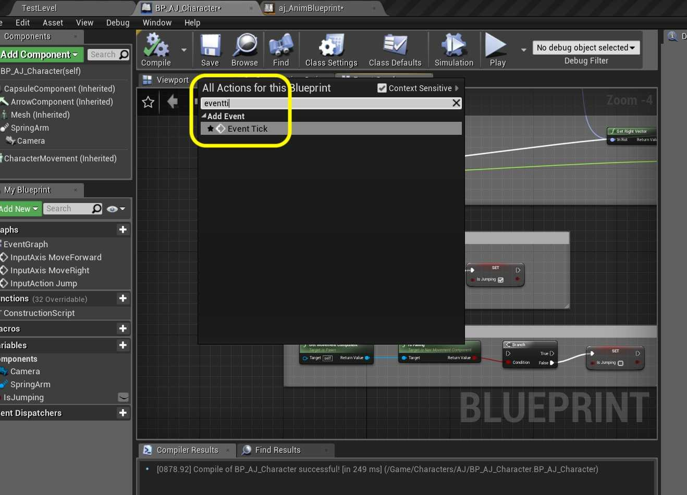

##### `Step 2.`\|`FHIU`|:small_blue_diamond: :small_blue_diamond: 

*Connect* the execution pin from **Event Tick** to **Branch**.

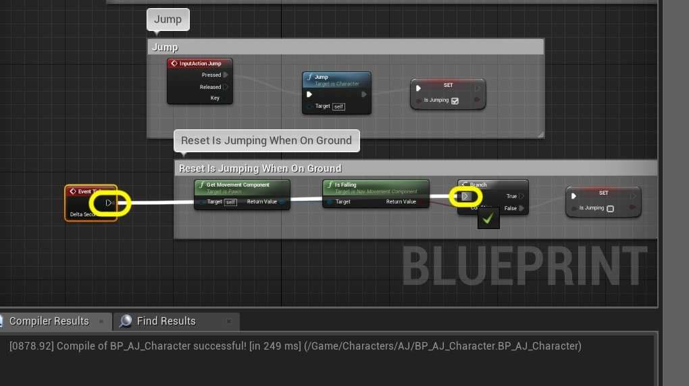

##### `Step 3.`\|`ITA`|:small_blue_diamond: :small_blue_diamond: :small_blue_diamond:

Now your graph should look like the below image.

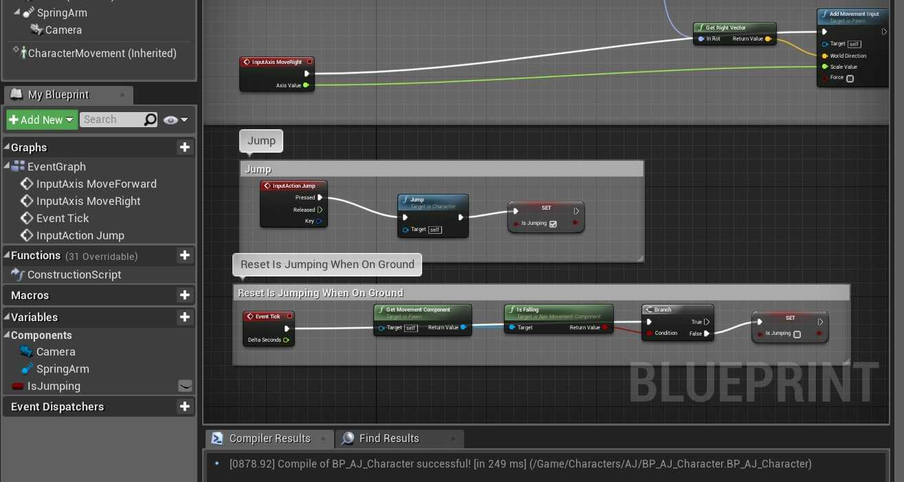

##### `Step 4.`\|`ITA`|:small_blue_diamond: :small_blue_diamond: :small_blue_diamond: :small_blue_diamond:

*Open* the **aj_AnimBlueprint | Event Graph**. We need to access the character's **IsJumping** variable. We are not in the right class with the Pawn Owner. We need to pull off of it's execution pin and select a **Cast** To BP **AJ_Character** node.

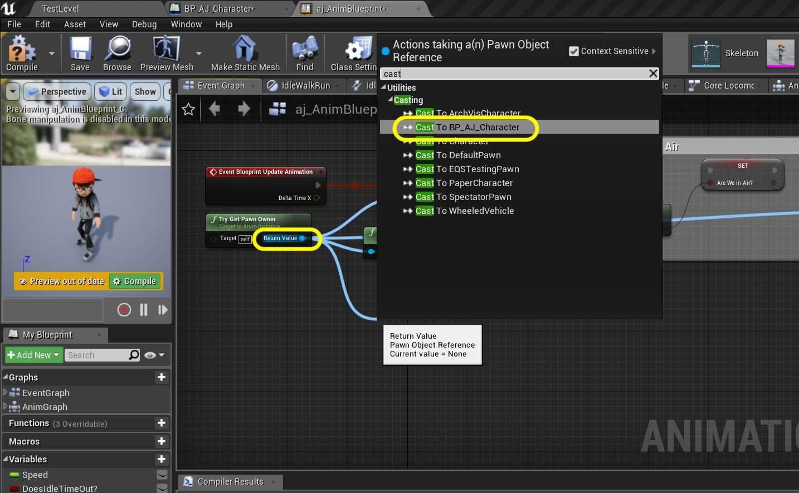

##### `Step 5.`\|`ITA`| :small_orange_diamond:

Pull off the As **BP_AJ_Character** pin on the **Cast** node and select **Get IsJumping**.

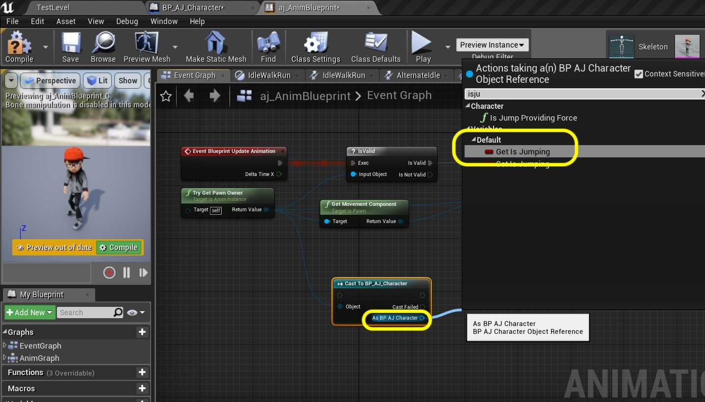

##### `Step 6.`\|`ITA`| :small_orange_diamond: :small_blue_diamond:

We need a variable in the animation blueprint to run our transitions with. Add a new **Boolean** Variable named `bPressedJump` and make it *Private* and set the tooltip to `Jump button was pressed`.

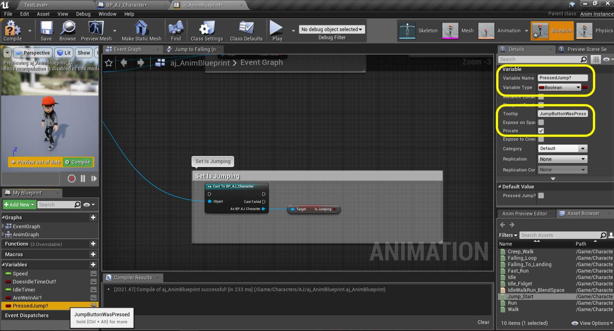

##### `Step 7.`\|`ITA`| :small_orange_diamond: :small_blue_diamond: :small_blue_diamond:

*Drag and drop* the Set **bPressedJump** node and connect its execution pin to the **Cast** node. Connect the **IsJumping** pin to the **PressedJump?** pin. *Connect* the execution pins from **Cast** to **BP_AJCharacter** to Set **bPressedJump**.

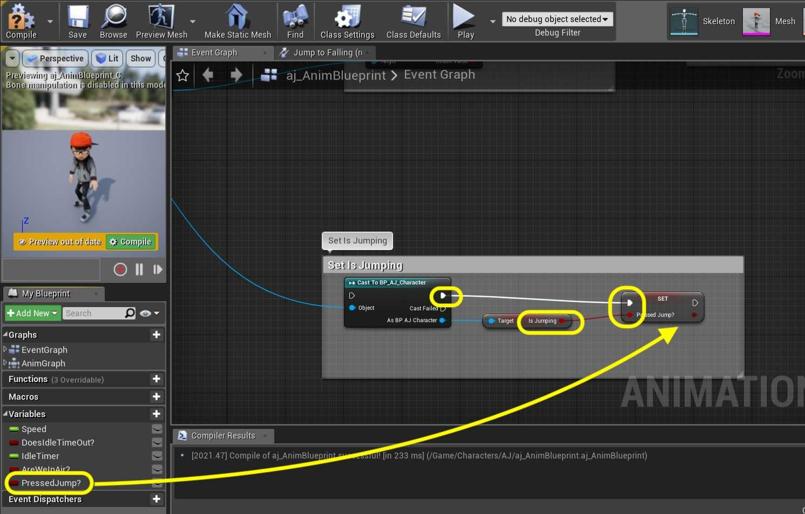

##### `Step 8.`\|`ITA`| :small_orange_diamond: :small_blue_diamond: :small_blue_diamond: :small_blue_diamond:

To keep things need add a **Sequence** node between the **Is Valid** node and the **Set Are We in Air?** node. *Reconnect* **Is Valid** to the **Sequence** input node then the **Then 0** to S**et Are We in Air** node. *Send* the **Then 1** pin to the **Cast** to **BP_AI_Character** node.

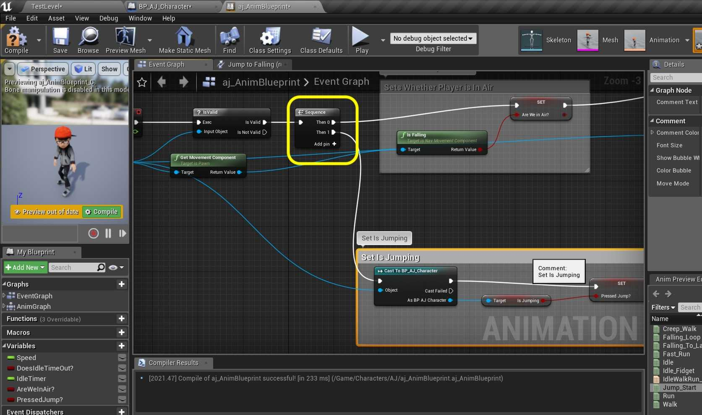

##### `Step 9.`\|`ITA`| :small_orange_diamond: :small_blue_diamond: :small_blue_diamond: :small_blue_diamond: :small_blue_diamond:

Go back to the **Anim Graph | Core Locomotion** section of the animatin blueprint and *click on* the transition button from **IdleWalkRun** to **Jump** transition.

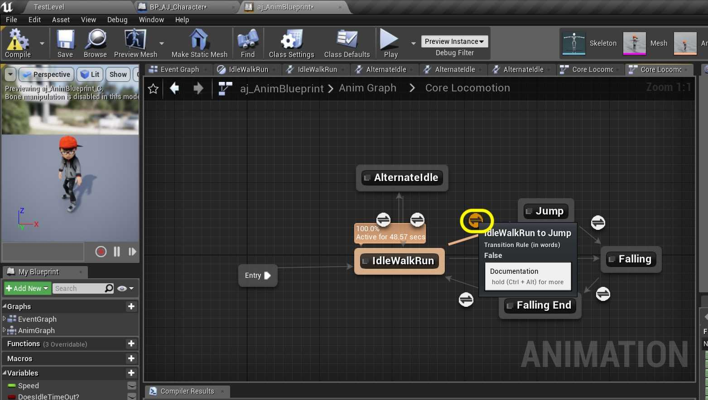

##### `Step 10.`\|`ITA`| :large_blue_diamond:

Add a **Get bPressedJump** node and *connect* the pin to the **Result | Can Enter Transition** pin.

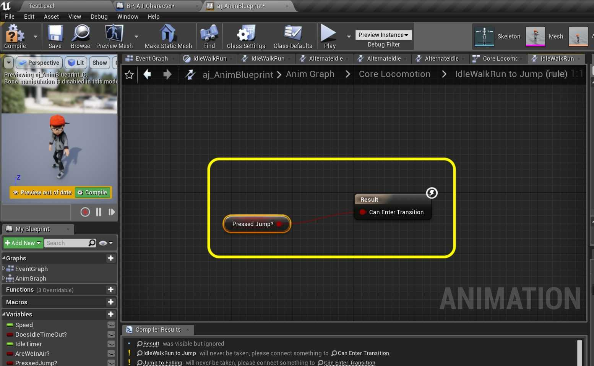

##### `Step 11.`\|`ITA`| :large_blue_diamond: :small_blue_diamond: 

Go back to the **Anim Graph | Core Locomotion** page. *Double click* the **Jump** state to assign the **Jump_Start** animation.

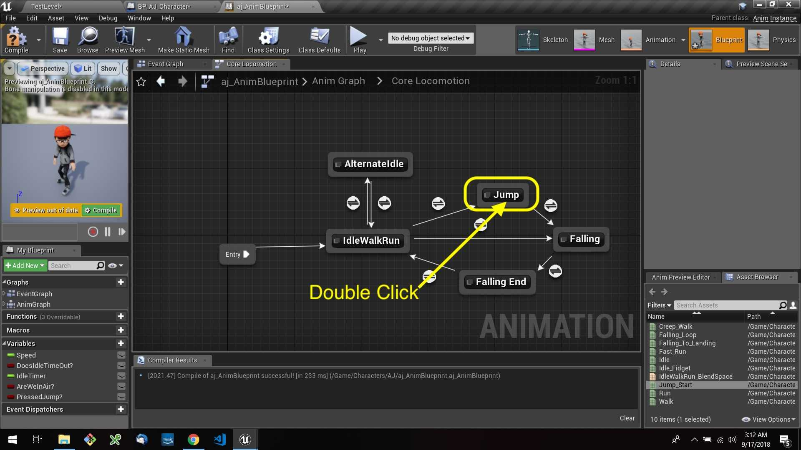

##### `Step 12.`\|`ITA`| :large_blue_diamond: :small_blue_diamond: :small_blue_diamond: 

Drag and drop the **Jump_Start** animation to the graph. *Connect* the animation nodes with the **Final Animation Pose**.

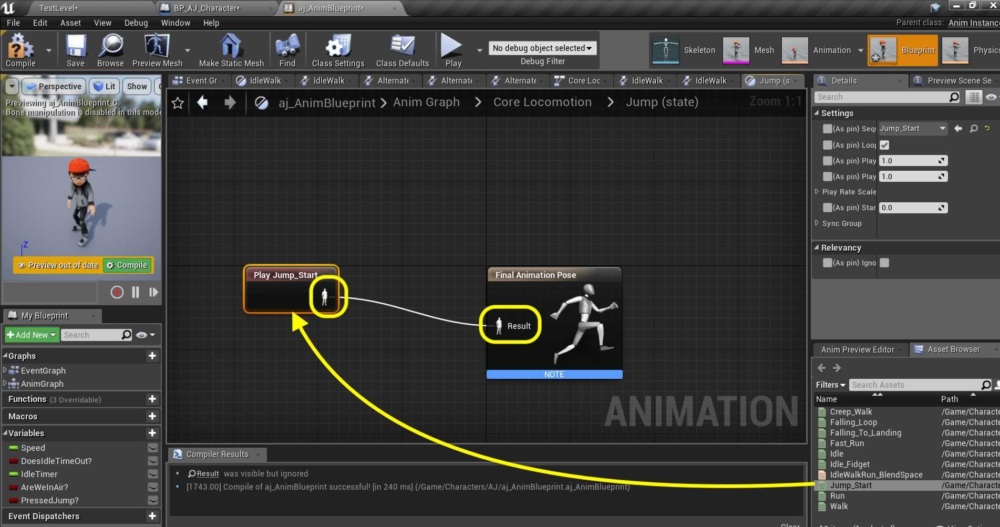

##### `Step 13.`\|`ITA`| :large_blue_diamond: :small_blue_diamond: :small_blue_diamond:  :small_blue_diamond: 

Go back to the **Anim Graph | Core Locomotion** screen. *Double click* on the transition in the **Anim Graph | Core Locomotion** page from **IdleWalkRun** to **Falling**.

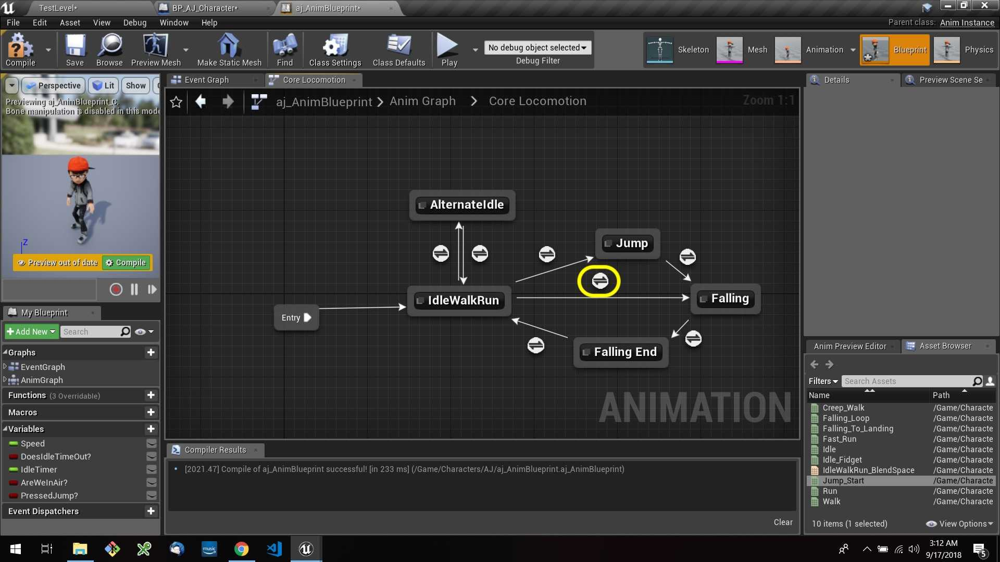

##### `Step 14.`\|`ITA`| :large_blue_diamond: :small_blue_diamond: :small_blue_diamond: :small_blue_diamond:  :small_blue_diamond: 

This is for falling off the edge of an object without jumping. We need to find out if we are in the air but not pressing the jump button. *Drag* a **Get Are We in Air** and **Get Pressed Jump** nodes onto the graph.

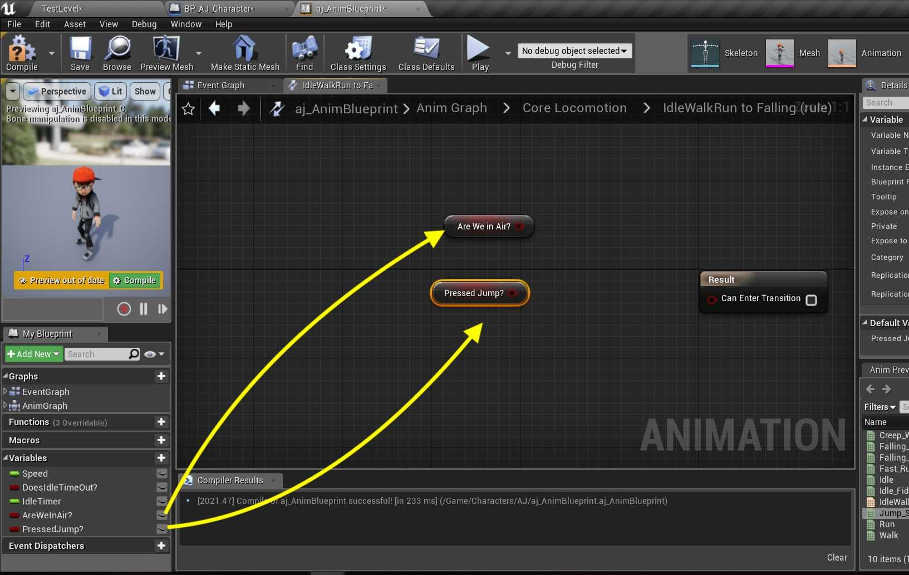

##### `Step 15.`\|`ITA`| :large_blue_diamond: :small_orange_diamond: 

*Drag* off of the **Are We in Air?** pin and *add* a **Boolean AND** node.

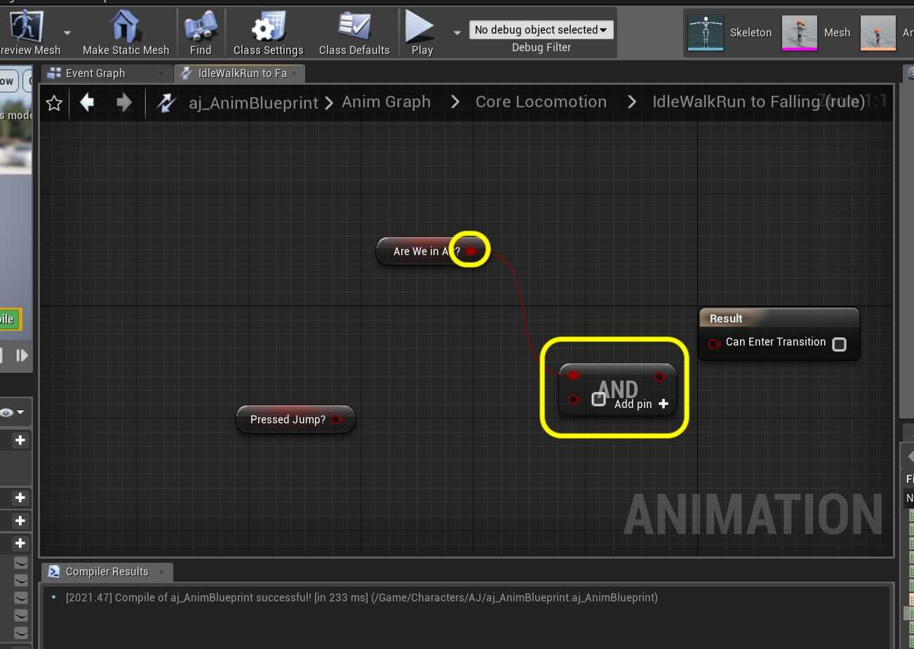

##### `Step 16.`\|`ITA`| :large_blue_diamond: :small_orange_diamond:   :small_blue_diamond: 

*Drag off* of the **Pressed Jump** pin and select **NOT Boolean**. *Connect* it to the input of the **AND** pin. *Connect* the output of the **AND** node to **Result** node.

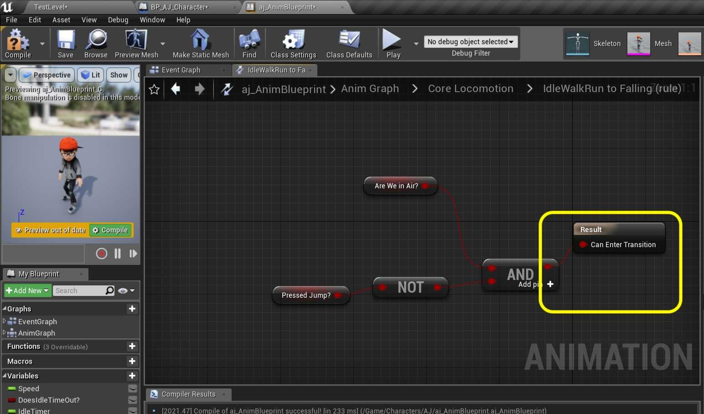

##### `Step 17.`\|`ITA`| :large_blue_diamond: :small_orange_diamond: :small_blue_diamond: :small_blue_diamond:

*Double click* on the **Jump** to **Falling** transition button on the **Anim Graph | Core Locomotion** screen.

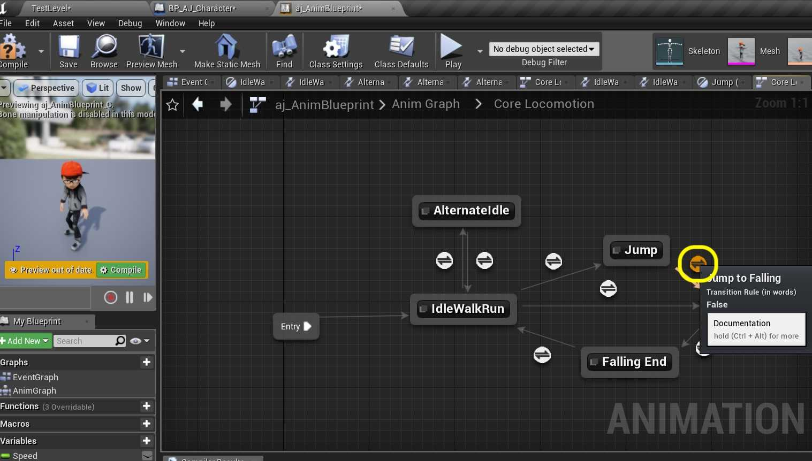

##### `Step 18.`\|`ITA`| :large_blue_diamond: :small_orange_diamond: :small_blue_diamond: :small_blue_diamond: :small_blue_diamond:

*Right click* on the graph and select a **Time Remaining (ratio) (Jump_Start)** node.

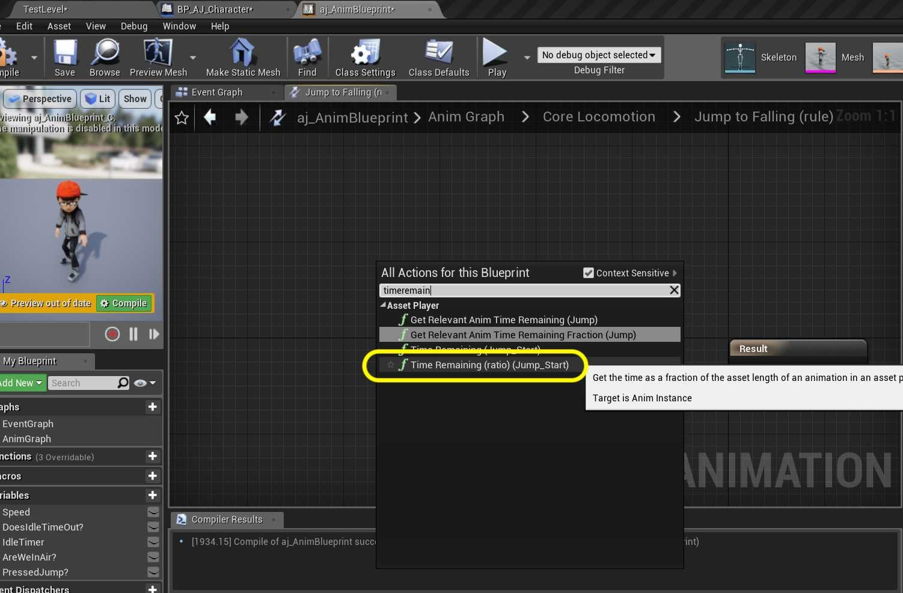

##### `Step 19.`\|`ITA`| :large_blue_diamond: :small_orange_diamond: :small_blue_diamond: :small_blue_diamond: :small_blue_diamond: :small_blue_diamond:

*Pull off* of the **Return Value** pin and select a **float <= float** node. *Set* the bottom to `0.2`. *Connect* the output to the **Result** pin. *Press* <kbd>Compile</kbd> on all open blueprints.

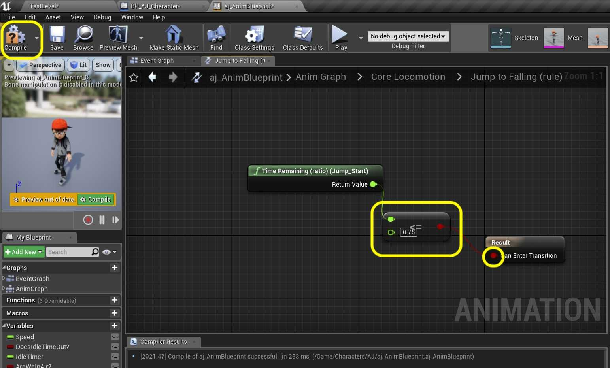

##### `Step 20.`\|`ITA`| :large_blue_diamond: :large_blue_diamond:

Press *play* and run around and fall off edge and jump. Make sure both transitions of running off edge and jumping are working correctly? I run up to the cube and the character penetrates it too much for my liking. The head when jumping up the wall gets buried inside the wall geometry. Lets fix this.

https://user-images.githubusercontent.com/5504953/133070942-118cb874-f74f-48c3-8a71-a2a381dc69c0.mp4

##### `Step 21.`\|`ITA`| :large_blue_diamond: :large_blue_diamond: :small_blue_diamond:

Go to the **BP_AJ_Character** blueprint and *select* the **Mesh** component. I adjust the mesh back on the **Y** Location a bit.

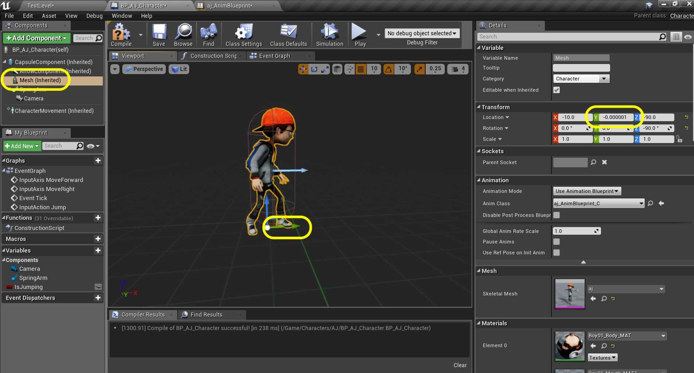

##### `Step 22.`\|`ITA`| :large_blue_diamond: :large_blue_diamond: :small_blue_diamond: :small_blue_diamond:

I then go to the **Capsule** component and increate the **Capsule Radius**. For my character `60.0` seems to work fine.

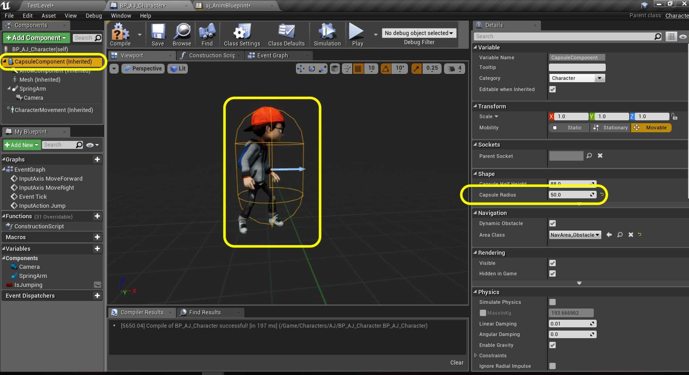

##### `Step 23.`\|`ITA`| :large_blue_diamond: :large_blue_diamond: :small_blue_diamond: :small_blue_diamond: :small_blue_diamond:

Now I like the collision much better. The player small amount of penetration does not bother me and the collisions feel better. *Press* **Save All** and update Github by **committing** and **pushing** all the changes made. 

https://user-images.githubusercontent.com/5504953/133071433-7e83b339-bef4-4235-a43b-ef7e69b31149.mp4
___

| [previous](../jumping/README.md#user-content-jumping-animation)| [home](../README.md#user-content-ue4-animations) | [next](../walk-sprint/README.md#user-content-slow-walk--sprint)|
|---|---|---|
