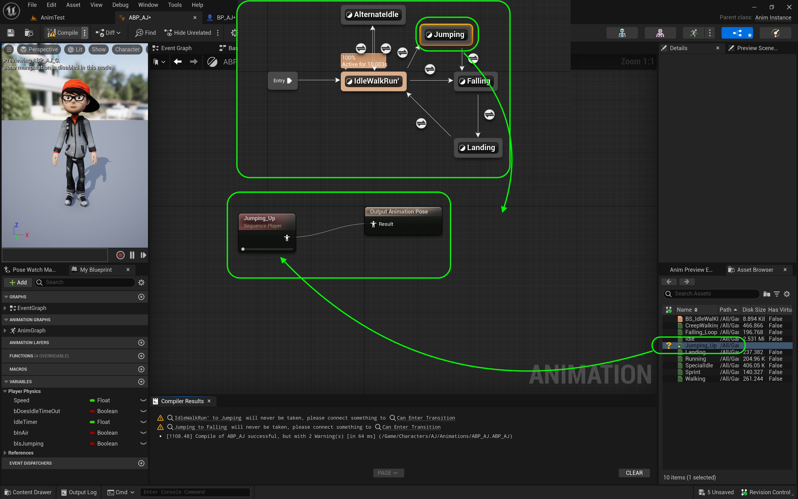
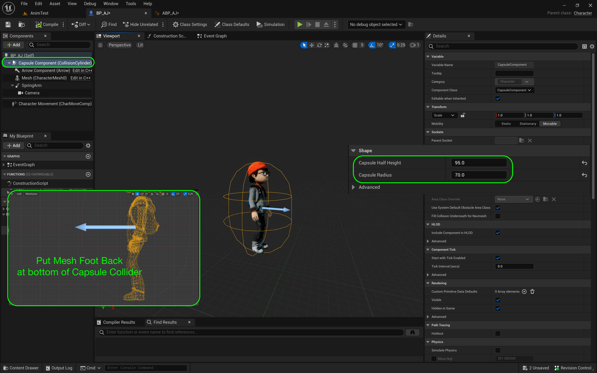
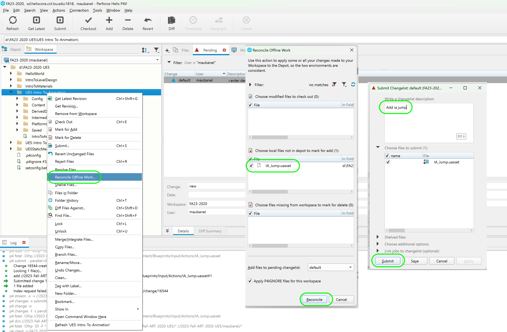

### Jumping Animation II

[previous](../jumping/README.md#user-content-jumping-animation) • [home](../README.md#user-content-ue4-animations) • [next](../walk-sprint/README.md#user-content-slow-walk--sprint)

Continue implementing jump animation...

 

---

##### `Step 1.`\|`ITA`|:small_blue_diamond:

Go back to the **Anim Graph | Basic Locomotion** section of the animation blueprint and *click on* the transition button from **IdleWalkRun** to **Jumping** transition. Add a **Is Jumping** node and *connect* the pin to the **Result | Can Enter Transition** pin.

##### `Step 2.`\|`FHIU`|:small_blue_diamond: :small_blue_diamond: 

Go back to the **Anim Graph | Core Locomotion** page. *Double click* the **Jumping** state to assign the **JumpingUp** animation. Drag and drop the **Jumping_Up** animation to the graph. *Connect* the animation nodes with the **Output Animation Pose**.

##### `Step 3.`\|`ITA`|:small_blue_diamond: :small_blue_diamond: :small_blue_diamond:

Go back to the **Anim Graph | Core Locomotion** screen. *Double click* on the transition in the **Anim Graph | Basic Locomotion** page from **IdleWalkRun** to **Falling**. This is for falling off the edge of an object without jumping. We need to find out if we are in the air but **not** pressing the jump button. *Drag* a  **Get IsJumping** nodes onto the graph.

##### `Step 4.`\|`ITA`|:small_blue_diamond: :small_blue_diamond: :small_blue_diamond: :small_blue_diamond:

*Drag off* of the **Is Jumping** pin and select **NOT Boolean**. *Add* an **AND Boolean** to the node chart. *Connect* it to the input of the **AND** pin. *Connect* the output of the **AND** node to **Result** node. Connect the **In Air** pin to the top of the **AND** node.

##### `Step 5.`\|`ITA`| :small_orange_diamond:

*Double click* on the **Jumping** to **Falling** transition button on the **Anim Graph | Core Locomotion** screen. *Right click* on the graph and select a **Time Remaining (ratio) (JumpingUp)** node. *Pull off* of the **Return Value** pin and select a **float <= float** node. *Set* the bottom to `0.5`. *Connect* the output to the **Result** pin. *Press* <kbd>Compile</kbd> on all open blueprints and the warning will disapear.

##### `Step 6.`\|`ITA`| :small_orange_diamond: :small_blue_diamond:

Press the <kbd>Play</kbd> button and jump and now we should have a jump animation in the flow. Make sure both transitions of running off edge and jumping are working correctly

https://github.com/maubanel/UE5-Animations/assets/5504953/77521d39-1132-4721-b40f-163a0bf1cdb5

##### `Step 7.`\|`ITA`| :small_orange_diamond: :small_blue_diamond: :small_blue_diamond:

If you run up to the ramp and jump next to the wall, the character's head penetrates it too much for my liking. The head when jumping up the wall gets buried inside the wall geometry. Lets fix this.

https://github.com/maubanel/UE5-Animations/assets/5504953/8e420fa9-515d-4f46-9efb-d649245d173b

##### `Step 8.`\|`ITA`| :small_orange_diamond: :small_blue_diamond: :small_blue_diamond: :small_blue_diamond:

Open up **BP_AJ**. Then go to the **Capsule** component and increase the **Capsule Radius**. For my character `70.0` seems to work fine. I also adjusted the height as it was a bit short to a **Capsule Half Height** of `95.0`. Readjust the height of the mesh so it is at the bottom of the collision volume.

##### `Step 9.`\|`ITA`| :small_orange_diamond: :small_blue_diamond: :small_blue_diamond: :small_blue_diamond: :small_blue_diamond:

Press the <kbd>Play</kbd> button and jump agains the side wall, I like the collision much better. The player small amount of penetration does not bother me and the collisions feel better. 

##### `Step 10.`\|`ITA`| :large_blue_diamond:

Select the **File | Save All** then press the <kbd>Revision Control</kbd> button and select **Submit Content**.  If you are prompted, select **Check Out** for all items that are not checked out of source control. Update the **Changelist Description** message and with the latest changes. Make sure all the files are correct and press the <kbd>Submit</kbd> button. A confirmation will pop up on the bottom right with a message about a changelist was submitted with a commit number. Quit Unreal and make sure your **Pending** tab in **P4V** is empty. **Submit** any work that is still in the editor.

##### `Step 11.`\|`ITA`| :large_blue_diamond: :small_blue_diamond: 

Sometimes not all files get submitted to Unreal especially for files that don't show up in the editor.  It is good practice one you submit in **Unreal** and quit the game to right click on the top most project folder and select **Reconcile Offline Work...**.

This will either give a message saying ther is nothing to reconcile or bring up a tab.  Make sure that these are **NOT** files in the **Intermediate** and **Saved** folders as these should be ignored from the `.p4ignore`.

If the files are in **Content** or **Configuration** then press the <kbd>Reconcile</kbd> button.  Then submit the changes with a message and press the <kbd>Submit</kbd> button.

<!--  -->

| [previous](../jumping/README.md#user-content-jumping-animation)| [home](../README.md#user-content-ue4-animations) | [next](../walk-sprint/README.md#user-content-slow-walk--sprint)|
|---|---|---|
