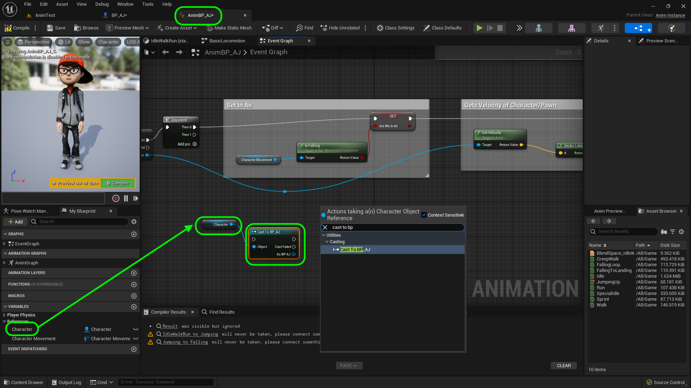
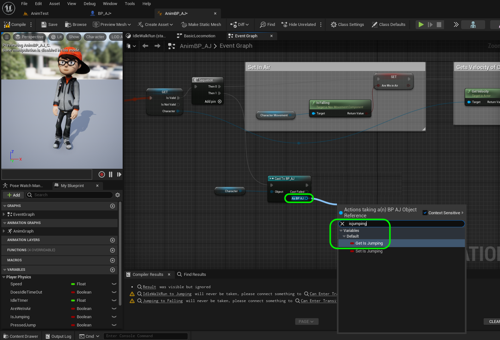
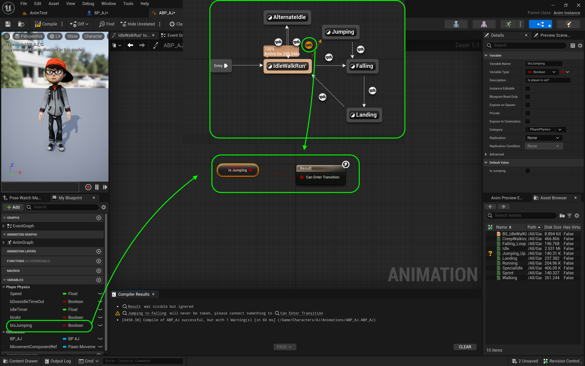

### Jumping Animation II

[previous](../jumping/README.md#user-content-jumping-animation) • [home](../README.md#user-content-ue4-animations) • [next](../walk-sprint/README.md#user-content-slow-walk--sprint)

Continue implementing jump animation...

 

---

##### `Step 1.`\|`ITA`|:small_blue_diamond:

*Open* the **AnimmBP_AJ | Event Graph**. We need to access the character's **IsJumping** variable. We are not in the right class with the Pawn Owner. *Drag* a **Get Character** node from the **Variables** section.  Then *pull* off of it's output pin and select a **Cast To BP AJ** node.

##### `Step 2.`\|`FHIU`|:small_blue_diamond: :small_blue_diamond: 

*Connect* the **Sequence | Then 1** pin to the **Cast to BP_AJ** execution pin. 

We need a variable in the animation blueprint to run our transitions with. Add a new **Boolean** Variable named `PressedJump` and make it **Private** and set the tooltip to `Jump button was pressed`. *Put* it in **Catogory** `Player Physics`.

##### `Step 3.`\|`ITA`|:small_blue_diamond: :small_blue_diamond: :small_blue_diamond:

Pull off the As **BP_AJ_Character** pin on the **Cast** node and select **Get IsJumping**.

##### `Step 4.`\|`ITA`|:small_blue_diamond: :small_blue_diamond: :small_blue_diamond: :small_blue_diamond:

*Drag and drop* the Set **PressedJump** node. Connect the **IsJumping** pin to the **PressedJump** pin. *Connect* the execution pins from **Cast to BP_AJ** to Set **bPressedJump**. Add a comment around the text sayin `Set Is Jumping`.

##### `Step 5.`\|`ITA`| :small_orange_diamond:

Go back to the **Anim Graph | Basic Locomotion** section of the animation blueprint and *click on* the transition button from **IdleWalkRun** to **Jumping** transition.

##### `Step 6.`\|`ITA`| :small_orange_diamond: :small_blue_diamond:

Add a **Get PressedJump** node and *connect* the pin to the **Result | Can Enter Transition** pin.

##### `Step 7.`\|`ITA`| :small_orange_diamond: :small_blue_diamond: :small_blue_diamond:

Go back to the **Anim Graph | Core Locomotion** page. *Double click* the **Jumping** state to assign the **JumpingUp** animation. Drag and drop the **JumpingUp** animation to the graph. *Connect* the animation nodes with the **Output Animation Pose**.

##### `Step 8.`\|`ITA`| :small_orange_diamond: :small_blue_diamond: :small_blue_diamond: :small_blue_diamond:

Go back to the **Anim Graph | Core Locomotion** screen. *Double click* on the transition in the **Anim Graph | Basic Locomotion** page from **IdleWalkRun** to **Falling**.

##### `Step 9.`\|`ITA`| :small_orange_diamond: :small_blue_diamond: :small_blue_diamond: :small_blue_diamond: :small_blue_diamond:

This is for falling off the edge of an object without jumping. We need to find out if we are in the air but **not** pressing the jump button. *Drag* a  **Get Pressed Jump** nodes onto the graph.

##### `Step 10.`\|`ITA`| :large_blue_diamond:

*Drag off* of the **Pressed Jump** pin and select **NOT Boolean**. *Add* an **AND Boolean** to the node chart. *Connect* it to the input of the **AND** pin. *Connect* the output of the **AND** node to **Result** node. Connect the **Are Wer in Air** pin to the top of the **AND** node.

##### `Step 11.`\|`ITA`| :large_blue_diamond: :small_blue_diamond: 

*Double click* on the **Jumping** to **Falling** transition button on the **Anim Graph | Core Locomotion** screen.

##### `Step 12.`\|`ITA`| :large_blue_diamond: :small_blue_diamond: :small_blue_diamond: 

*Right click* on the graph and select a **Time Remaining (ratio) (JumpingUp)** node.

##### `Step 13.`\|`ITA`| :large_blue_diamond: :small_blue_diamond: :small_blue_diamond:  :small_blue_diamond: 

*Pull off* of the **Return Value** pin and select a **float <= float** node. *Set* the bottom to `0.5`. *Connect* the output to the **Result** pin. *Press* <kbd>Compile</kbd> on all open blueprints and the warning will disapear.

##### `Step 14.`\|`ITA`| :large_blue_diamond: :small_blue_diamond: :small_blue_diamond: :small_blue_diamond:  :small_blue_diamond: 

Press *play* and run around and fall off edge and jump. Make sure both transitions of running off edge and jumping are working correctly? I run up to the cube and the character penetrates it too much for my liking. The head when jumping up the wall gets buried inside the wall geometry. Lets fix this.

https://user-images.githubusercontent.com/5504953/197299827-39bb2a30-3b99-4936-ba5e-0d2f0d90f5df.mp4

##### `Step 15.`\|`ITA`| :large_blue_diamond: :small_orange_diamond: 

Open up **BP_AJ**. Then go to the **Capsule** component and increase the **Capsule Radius**. For my character `70.0` seems to work fine. I also adjusted the height as it was a bit short to a **Capsule Half Height** of `95.0`.

##### `Step 16.`\|`ITA`| :large_blue_diamond: :small_orange_diamond:   :small_blue_diamond: 

Now I like the collision much better. The player small amount of penetration does not bother me and the collisions feel better. 

##### `Step 17.`\|`ITA`| :large_blue_diamond: :small_orange_diamond: :small_blue_diamond: :small_blue_diamond:

##### `Step 18.`\|`ITA`| :large_blue_diamond: :small_orange_diamond: :small_blue_diamond: :small_blue_diamond: :small_blue_diamond:

##### `Step 19.`\|`ITA`| :large_blue_diamond: :small_orange_diamond: :small_blue_diamond: :small_blue_diamond: :small_blue_diamond: :small_blue_diamond:

##### `Step 20.`\|`ITA`| :large_blue_diamond: :large_blue_diamond:

##### `Step 21.`\|`ITA`| :large_blue_diamond: :large_blue_diamond: :small_blue_diamond:

Go to the **BP_AJ_Character** blueprint and *select* the **Mesh** component. I adjust the mesh back on the **Y** Location a bit.

##### `Step 22.`\|`ITA`| :large_blue_diamond: :large_blue_diamond: :small_blue_diamond: :small_blue_diamond:

##### `Step 23.`\|`ITA`| :large_blue_diamond: :large_blue_diamond: :small_blue_diamond: :small_blue_diamond: :small_blue_diamond:

 

Select the **File | Save All** then press the <kbd>Source Control</kbd> button and select **Submit to Source Control...**.  Enter a **Changelist Description** and then press <kbd>Submit</kbd>.  Open up **GitHub Desktop** and select **Push origin** to update the server with the latest changes.

https://user-images.githubusercontent.com/5504953/135758442-fcf8a098-5c4b-4bf4-847c-a7ae513f6e55.mp4

___

<!--  -->

| [previous](../jumping/README.md#user-content-jumping-animation)| [home](../README.md#user-content-ue4-animations) | [next](../walk-sprint/README.md#user-content-slow-walk--sprint)|
|---|---|---|
