### Jumping Animation

[previous](../falling-ii/README.md#user-content-falling-animation-ii) • [home](../README.md#user-content-ue4-animations) • [next](../jumping-ii/README.md#user-content-jumping-animation-ii)

Lets add the ability for the player to jump around the level and tune this to our liking.

 

---

##### `Step 1.`\|`ITA`|:small_blue_diamond:

Before we start lets set this level as the default boot up level. Go to **Edit | Project Settings** and navigate to the **Maps & Modes** section. Change the **Editor Startup Map** to `AnimTestLevel`.

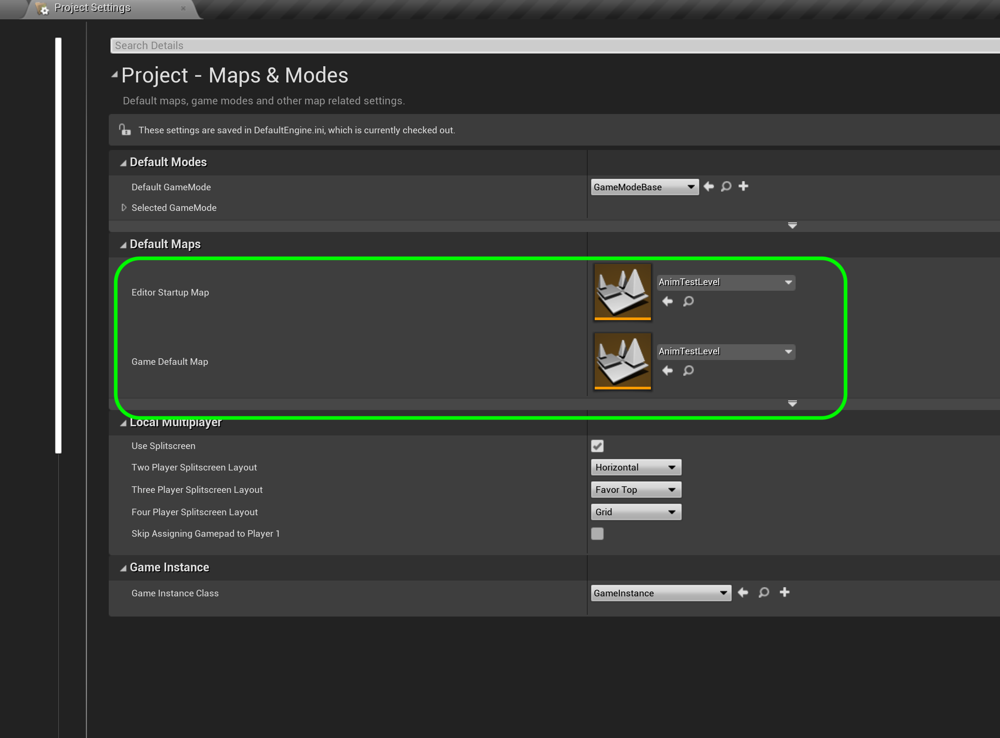

##### `Step 2.`\|`FHIU`|:small_blue_diamond: :small_blue_diamond: 

Now we need to add a controller event for jumping. Go to the **Engine | Input** section and press the **+** button next to the **Action Mappings** heading.

![go to input in project settings and add a action mapping](images

:small_blue_diamond:

Call this new action `Jump`. Press the **+** button next to the **Jump** setting and add a **Keyboard | Space Bar** to the controls.

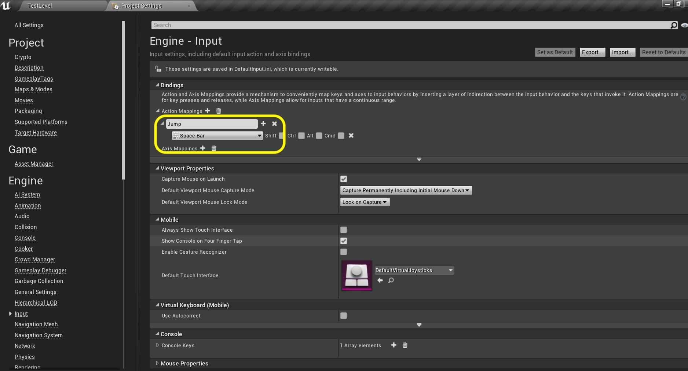

##### `Step 4.`\|`ITA`|:small_blue_diamond: :small_blue_diamond: :small_blue_diamond: :small_blue_diamond:

Open up the **BP_AJ_Character** blueprint and go to the **Event Graph**. *Right click* and add a **Action Events | Jump** to the graph.

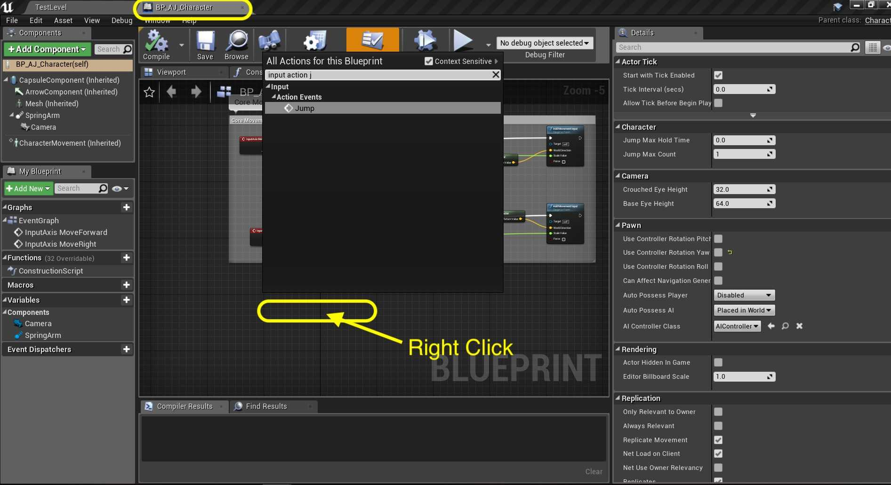

##### `Step 5.`\|`ITA`| :small_orange_diamond:

Pull off of the **Jump** node's **Pressed** execution pin and select the **Jump** node.

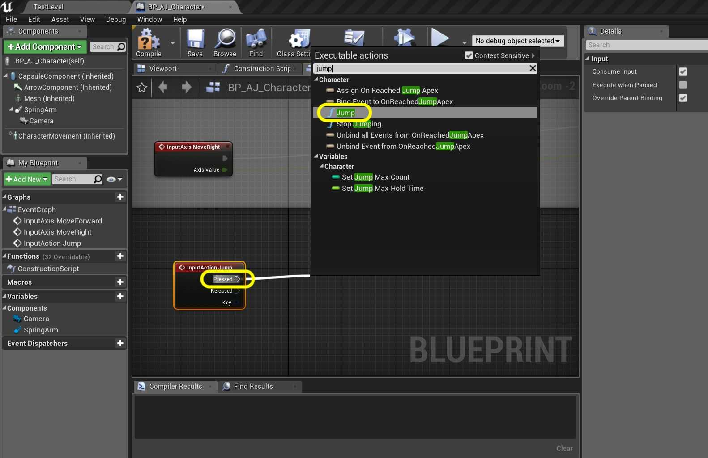

##### `Step 6.`\|`ITA`| :small_orange_diamond: :small_blue_diamond:

Add a **comment** around these two nodes called `Jump`.

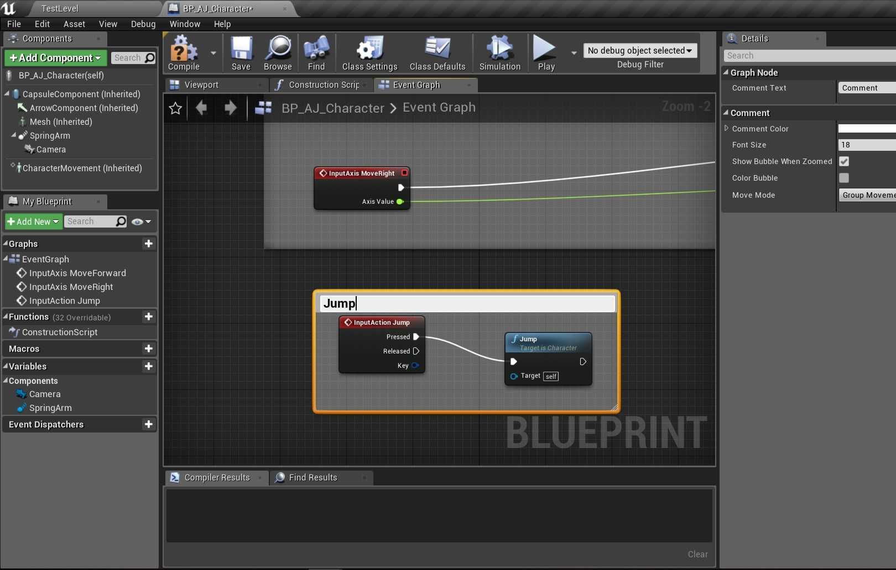

##### `Step 7.`\|`ITA`| :small_orange_diamond: :small_blue_diamond: :small_blue_diamond:

*Press** the <kbd>Compile</kbd> button and *run* the game and press the jump button <kbd>space bar</kbd>. Now you should be jumping around the level.

https://user-images.githubusercontent.com/5504953/132988110-e708986d-8dd4-46f1-9d40-b92ad8b8015f.mp4

##### `Step 8.`\|`ITA`| :small_orange_diamond: :small_blue_diamond: :small_blue_diamond: :small_blue_diamond:

Now we could leave it like this as it looks ok. We will add a jump start just to show how it is done. Go back to the [Mixamo](https://www.mixamo.com/#/) site and look for the start of a jump animation. Make sure you speed it up as we want it to be very fast. Also clip just the very begining of the jump. Pick one that will work from jump from stand and from run.

https://user-images.githubusercontent.com/5504953/132995968-f2f3999a-bd91-400e-9bec-c9564ca3beb6.mp4

##### `Step 9.`\|`ITA`| :small_orange_diamond: :small_blue_diamond: :small_blue_diamond: :small_blue_diamond: :small_blue_diamond:

Remember to set **Skin** to `Without Skin` when *downloading*:

##### `Step 10.`\|`ITA`| :large_blue_diamond:

*Add/Import* the **Jump Start** animation into the jump start folder.

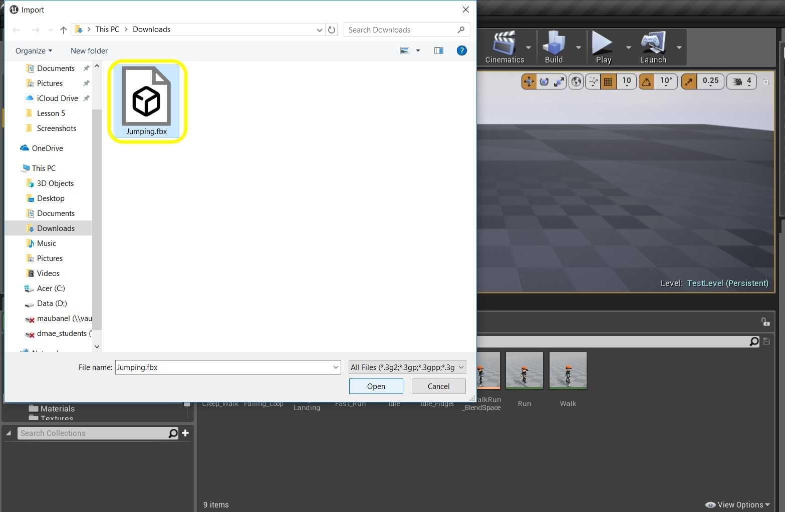

##### `Step 11.`\|`ITA`| :large_blue_diamond: :small_blue_diamond: 

In the **FBX Import Options** select the *skeleton* for the character. *Press* the <kbd>Import</kbd> button.

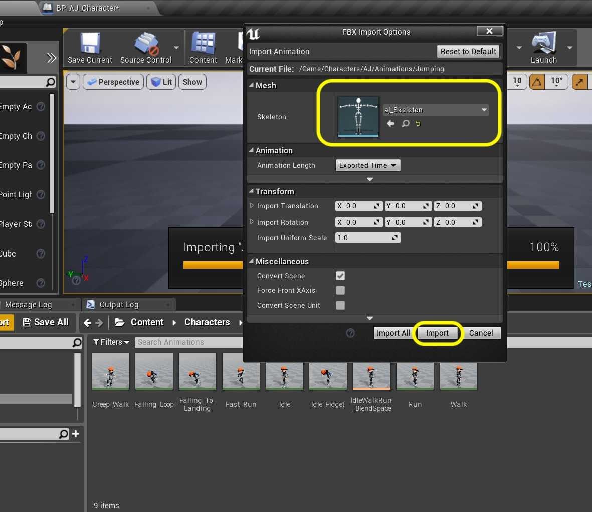

##### `Step 12.`\|`ITA`| :large_blue_diamond: :small_blue_diamond: :small_blue_diamond: 

*Rename* the animation `Jump_Start` and *run* it to confirm you are happy with the animation.

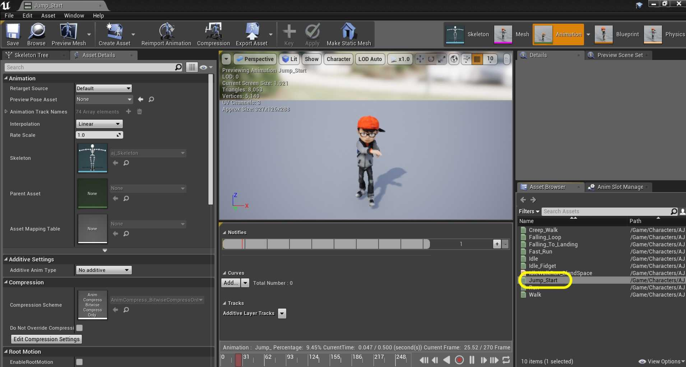

##### `Step 13.`\|`ITA`| :large_blue_diamond: :small_blue_diamond: :small_blue_diamond:  :small_blue_diamond: 

*Open* the **aj_AnimBlueprint** and go to the **Anim Graph | Core Locomotion** page. Right click and select **Add State**.

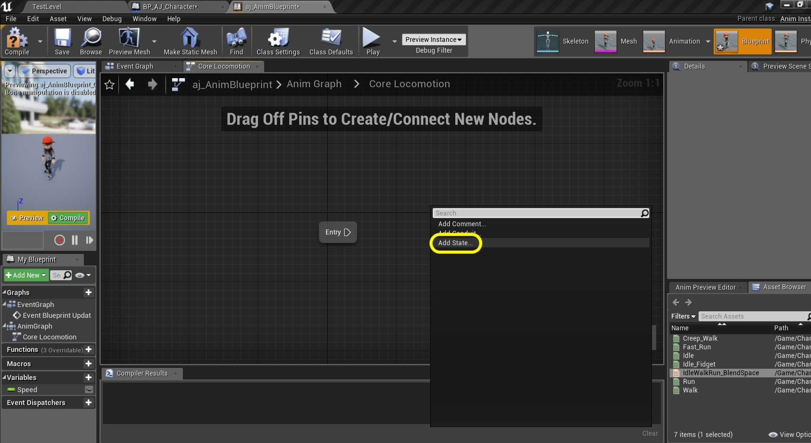

##### `Step 14.`\|`ITA`| :large_blue_diamond: :small_blue_diamond: :small_blue_diamond: :small_blue_diamond:  :small_blue_diamond: 

Call this state `Jump` and *connect* a transition from **IdleWalkRun** to **Jump to Falling**. There will be a different path to just running off a platform and jumping.

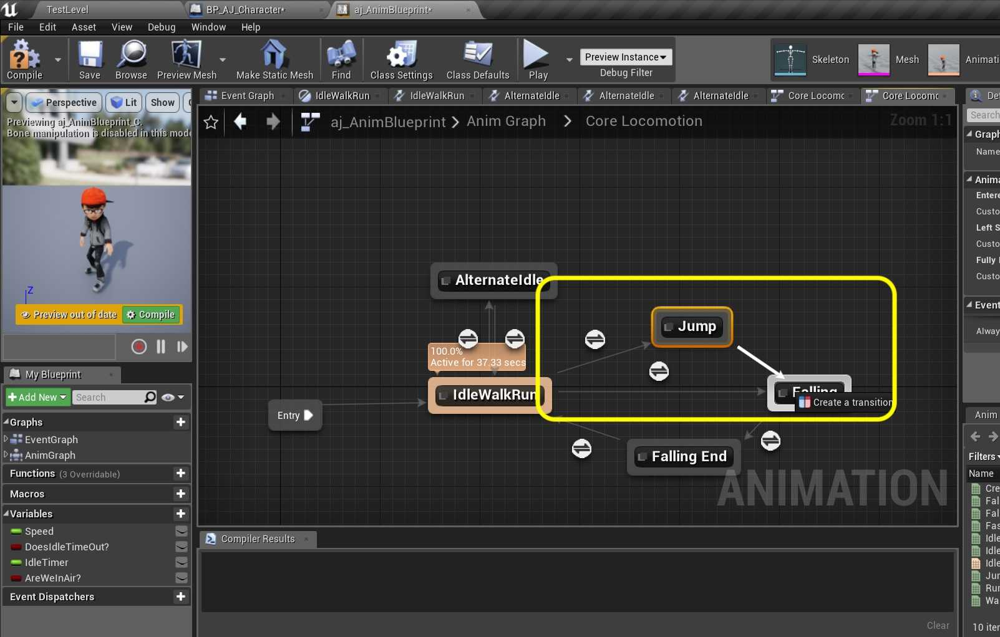

##### `Step 15.`\|`ITA`| :large_blue_diamond: :small_orange_diamond: 

Now the animation blueprint needs to know when the jump button is pressed. Go to **BP_AJ_Character** blueprint and add a **Boolean** variable called `bIsJumping`. Keep it **Public** (**Private** set to `false`) because we need to access it in the animation blueprint.

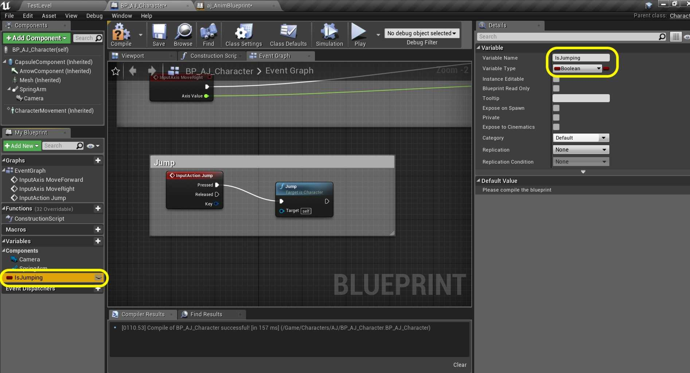

##### `Step 16.`\|`ITA`| :large_blue_diamond: :small_orange_diamond:   :small_blue_diamond: 

*Enlarge* the comment section for jumping. *Drag and drop* a **Set IsJumping** variable next to the **Jump** node.

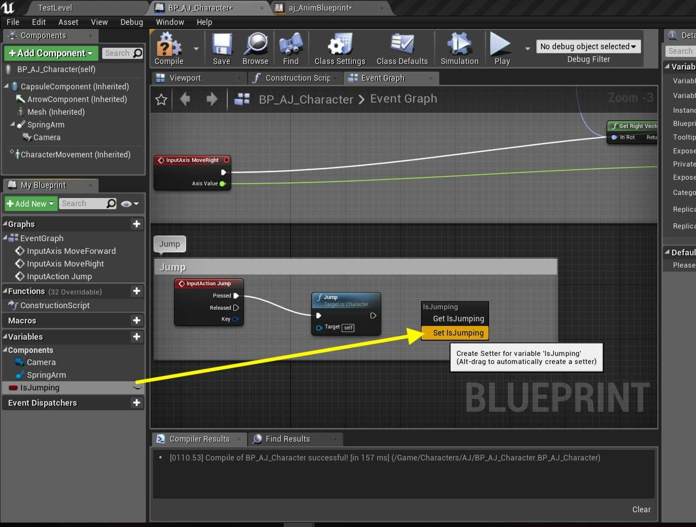

##### `Step 17.`\|`ITA`| :large_blue_diamond: :small_orange_diamond: :small_blue_diamond: :small_blue_diamond:

*Set* the execution pin from the **Jump** node to the **Set Is Jumping** node. *Set* **Is Jumping** to `true`.

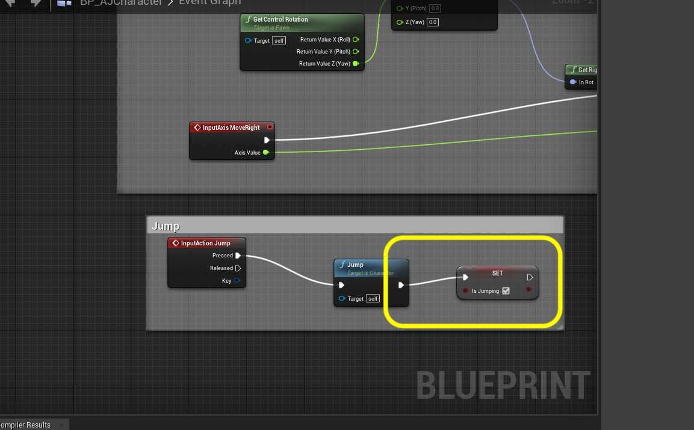

##### `Step 18.`\|`ITA`| :large_blue_diamond: :small_orange_diamond: :small_blue_diamond: :small_blue_diamond: :small_blue_diamond:

We need to reset this **boolean** when you are touching the ground. Under the **Jump** nodes *right click* on the graph and add a **Get Movement Component** node. Pull of its pin and look for a **Is Falling** node.

##### `Step 19.`\|`ITA`| :large_blue_diamond: :small_orange_diamond: :small_blue_diamond: :small_blue_diamond: :small_blue_diamond: :small_blue_diamond:

*Pull off* of the **Is Falling** node's pin and select a **Branch** node.

##### `Step 20.`\|`ITA`| :large_blue_diamond: :large_blue_diamond:

*Pull off* of the **False** execution pin from this **Branch** node and select a **Set IsJumping** node and leave it as `false`:

##### `Step 21.`\|`ITA`| :large_blue_diamond: :large_blue_diamond: :small_blue_diamond:

*Surround* these nodes with a **comment** saying `Reset IsJumping When On Ground`. Now notice there are no execution pins that run every frame (Tick Event).

___

| [previous](../falling-ii/README.md#user-content-falling-animation-ii)| [home](../README.md#user-content-ue4-animations) | [next](../jumping-ii/README.md#user-content-jumping-animation-ii)|
|---|---|---|
