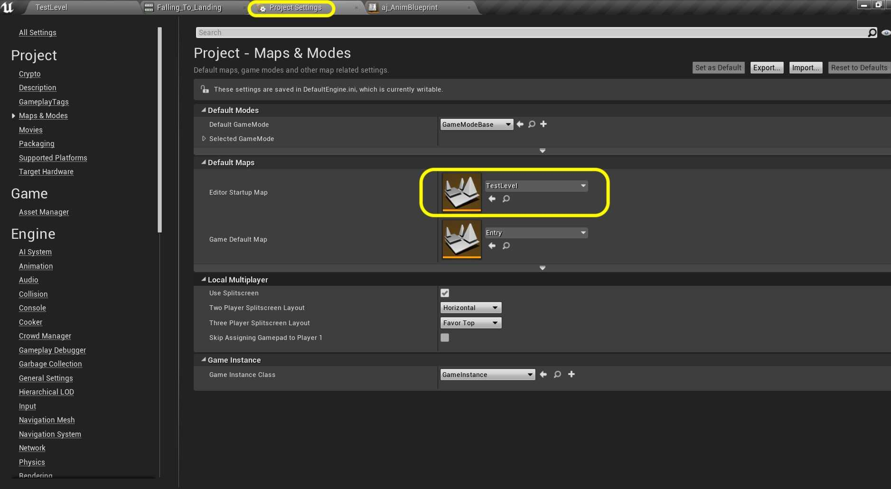
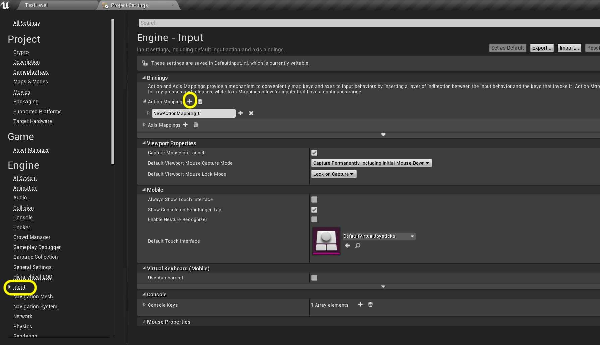

### Jumping Animation

[previous](../falling-ii/README.md#user-content-falling-animation-ii) • [home](../README.md#user-content-ue4-animations) • [next](../jumping-ii/README.md#user-content-jumping-animation-ii)

Lets add the ability for the player to jump around the level and tune this to our liking.

 

---

##### `Step 1.`\|`ITA`|:small_blue_diamond:

Before we start lets set this level as the default boot up level. Go to **Edit | Project Settings** and navigate to the **Maps & Modes** section. Change the **Editor Startup Map** to `TestLevel`.

##### `Step 2.`\|`FHIU`|:small_blue_diamond: :small_blue_diamond: 

Now we need to add a controller event for jumping. Go to the **Engine | Input** section and press the **+** button next to the **Action Mappings** heading.

##### `Step 3.`\|`ITA`|:small_blue_diamond: :small_blue_diamond: :small_blue_diamond:

Call this new action `Jump`. Press the **+** button next to the **Jump** setting and add a **Keyboard | Space Bar** to the controls.

##### `Step 4.`\|`ITA`|:small_blue_diamond: :small_blue_diamond: :small_blue_diamond: :small_blue_diamond:

Open up the **BP_AJ_Character** blueprint and go to the **Event Graph**. *Right click* and add a **Action Events | Jump** to the graph.

##### `Step 5.`\|`ITA`| :small_orange_diamond:

Pull off of the **Jump** node's **Pressed** execution pin and select the **Jump** node.

##### `Step 6.`\|`ITA`| :small_orange_diamond: :small_blue_diamond:

Add a **comment** around these two nodes called `Jump`.

##### `Step 7.`\|`ITA`| :small_orange_diamond: :small_blue_diamond: :small_blue_diamond:

*Press** the <kbd>Compile</kbd> button and *run* the game and press the jump button (<kbd>space bar</kbd>). Now you should be jumping around the level.

##### `Step 8.`\|`ITA`| :small_orange_diamond: :small_blue_diamond: :small_blue_diamond: :small_blue_diamond:

##### `Step 9.`\|`ITA`| :small_orange_diamond: :small_blue_diamond: :small_blue_diamond: :small_blue_diamond: :small_blue_diamond:

##### `Step 10.`\|`ITA`| :large_blue_diamond:

##### `Step 11.`\|`ITA`| :large_blue_diamond: :small_blue_diamond: 

##### `Step 12.`\|`ITA`| :large_blue_diamond: :small_blue_diamond: :small_blue_diamond: 

##### `Step 13.`\|`ITA`| :large_blue_diamond: :small_blue_diamond: :small_blue_diamond:  :small_blue_diamond: 

##### `Step 14.`\|`ITA`| :large_blue_diamond: :small_blue_diamond: :small_blue_diamond: :small_blue_diamond:  :small_blue_diamond: 

##### `Step 15.`\|`ITA`| :large_blue_diamond: :small_orange_diamond: 

##### `Step 16.`\|`ITA`| :large_blue_diamond: :small_orange_diamond:   :small_blue_diamond: 

##### `Step 17.`\|`ITA`| :large_blue_diamond: :small_orange_diamond: :small_blue_diamond: :small_blue_diamond:

##### `Step 18.`\|`ITA`| :large_blue_diamond: :small_orange_diamond: :small_blue_diamond: :small_blue_diamond: :small_blue_diamond:

##### `Step 19.`\|`ITA`| :large_blue_diamond: :small_orange_diamond: :small_blue_diamond: :small_blue_diamond: :small_blue_diamond: :small_blue_diamond:

##### `Step 20.`\|`ITA`| :large_blue_diamond: :large_blue_diamond:

##### `Step 21.`\|`ITA`| :large_blue_diamond: :large_blue_diamond: :small_blue_diamond:

___

| [previous](../falling-ii/README.md#user-content-falling-animation-ii)| [home](../README.md#user-content-ue4-animations) | [next](../jumping-ii/README.md#user-content-jumping-animation-ii)|
|---|---|---|
