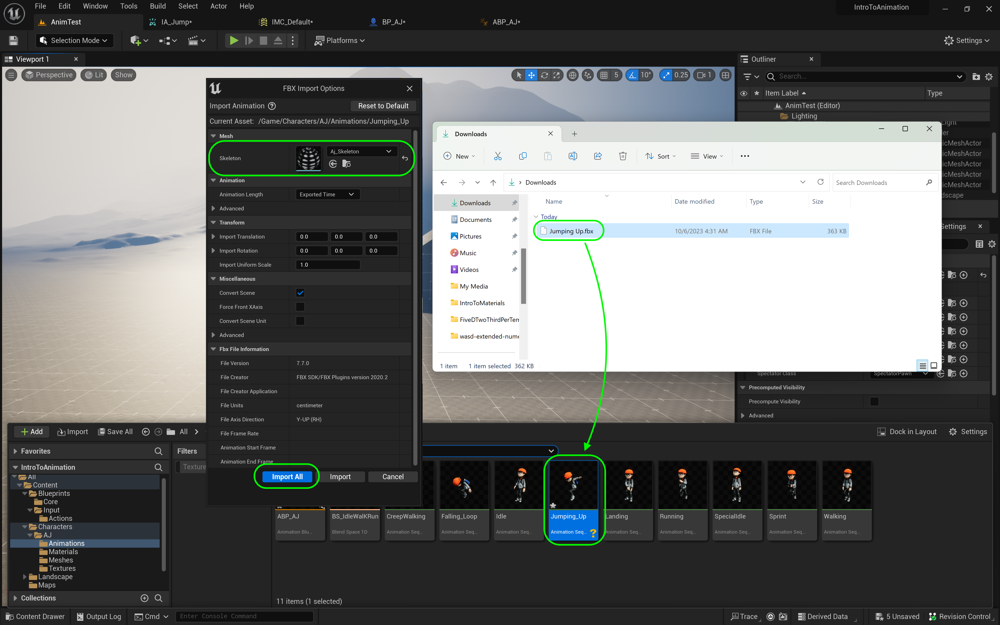
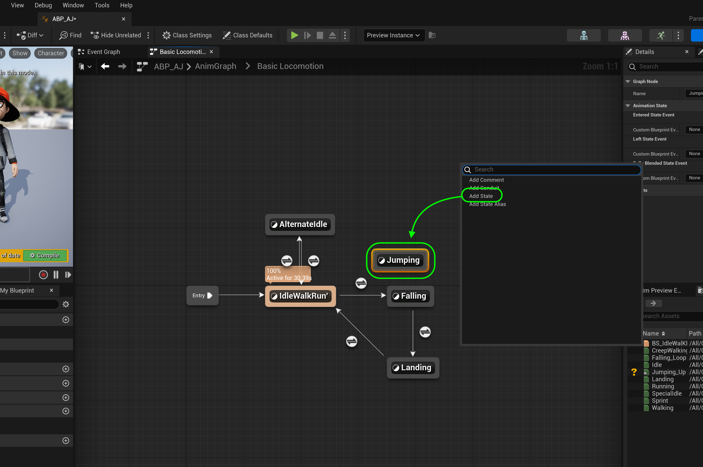
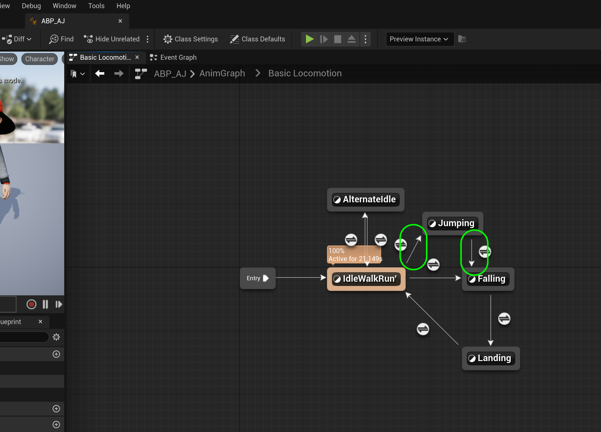
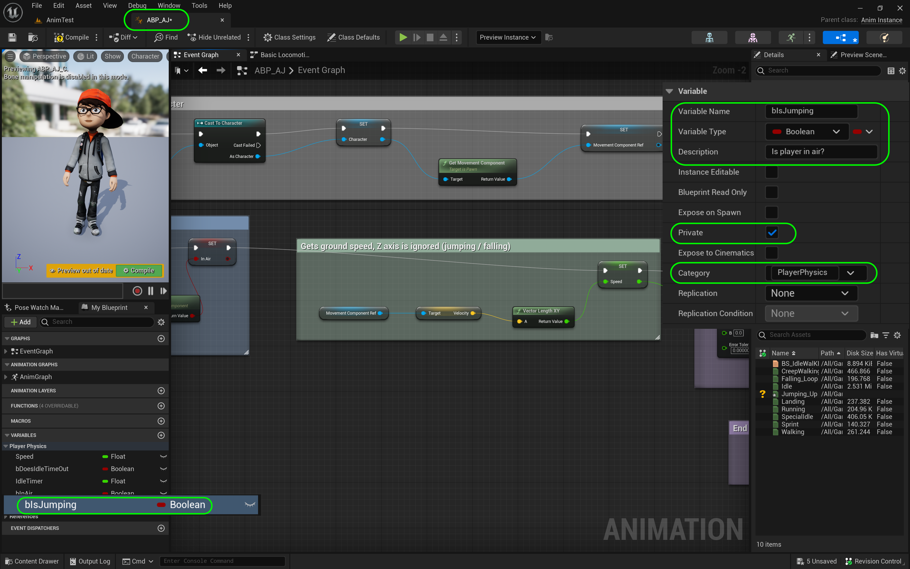
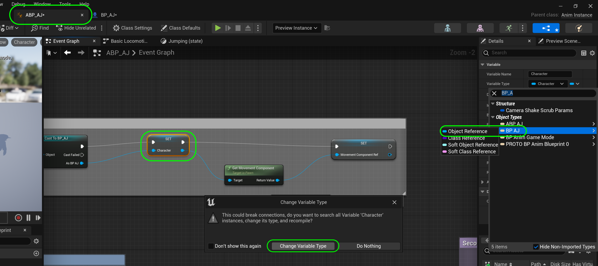

### Jumping Animation

[previous](../falling-ii/README.md#user-content-falling-animation-ii) • [home](../README.md#user-content-ue4-animations) • [next](../jumping-ii/README.md#user-content-jumping-animation-ii)

Lets add the ability for the player to jump around the level and tune this to our liking.

 

---

##### `Step 1.`\|`ITA`|:small_blue_diamond:

First we need to assign and action and a button to jumping.  Go to **Input | Actions** and add a **Input | Input Action** and call it `IA_Jump`.

##### `Step 2.`\|`FHIU`|:small_blue_diamond: :small_blue_diamond: 

Open up **IA_Jump**.  Leave it as a **Digital Bool** as we want to use the space bar which is either pressed or not pressed (boolean).

##### `Step 3.`\|`ITA`|:small_blue_diamond: :small_blue_diamond: :small_blue_diamond:

Open up **IMC_Default** to assign a key press.  Press the <kbd>+</kbd> button next to **Mappings** and select `IA_Jump`.  Assign the `Space Bar` to this action.

##### `Step 4.`\|`ITA`|:small_blue_diamond: :small_blue_diamond: :small_blue_diamond: :small_blue_diamond:

Open up the **BP_AJ** blueprint and go to the **Event Graph**. *Right click* and add a **Enhanced Actoin Events | IA_Jump** to the graph. Add a **Action Events | Jump** node. 

##### `Step 5.`\|`ITA`| :small_orange_diamond:

Connect **IA_Jump | Started** to the **Jump** node execution pin.  Add a **Stop Jumping** node and connect it to the **Completed** pin (when you let go of the jump button).

##### `Step 6.`\|`ITA`| :small_orange_diamond: :small_blue_diamond:

*Press* the <kbd>Compile</kbd> button and *run* the game and press the jump button <kbd>space bar</kbd>. Now you should be jumping around the level.

https://github.com/maubanel/UE5-Animations/assets/5504953/d5942529-dfbe-4d86-bfce-fa0d2c402013

##### `Step 7.`\|`ITA`| :small_orange_diamond: :small_blue_diamond: :small_blue_diamond:

Now we could leave it like this as it looks ok. We will add a jump start just to show how it is done. Go back to the [Mixamo](https://www.mixamo.com/#/) site and look for the start of a jump start animation. This is for when the player starts to jump from either a stand or run. Make sure you speed it up as we want it to be very fast. Also clip just the very begining of the jump. Pick one that will work from jump from stand and from run.

https://github.com/maubanel/UE5-Animations/assets/5504953/f7742dae-c500-4b90-8fa6-8c1ce105bb39

##### `Step 8.`\|`ITA`| :small_orange_diamond: :small_blue_diamond: :small_blue_diamond: :small_blue_diamond:

Remember to set **Skin** to `Without Skin` when *downloading*:

##### `Step 9.`\|`ITA`| :small_orange_diamond: :small_blue_diamond: :small_blue_diamond: :small_blue_diamond: :small_blue_diamond:

*Drag and drop* the **Jumping Up** animation into the **Animations** folder. In the **FBX Import Options** select the *skeleton* for the character. *Press* the <kbd>Import</kbd> button. *Rename* the animation `Jumping_Up` and *run* it to confirm you are happy with the animation.

##### `Step 10.`\|`ITA`| :large_blue_diamond:

*Open* the **ABP_AJ** and go to the **Anim Graph | Basic Locomotion** page. Right click and select **Add State**. Call this state `Jumping`.

##### `Step 11.`\|`ITA`| :large_blue_diamond: :small_blue_diamond: 

*Connect* a transition from **IdleWalkRun** to **Jumping** and **Jumping** to **Falling**.  There will be a different path to just running off a platform and jumping.

##### `Step 12.`\|`ITA`| :large_blue_diamond: :small_blue_diamond: :small_blue_diamond: 

Now the animation blueprint needs to know when the jump button is pressed. Go to **ABP_AJ** blueprint and add a **Boolean** variable called `bIsJumping`. Set **Private** to `true`. Set the **Category** to `Player Physics`.

##### `Step 13.`\|`ITA`| :large_blue_diamond: :small_blue_diamond: :small_blue_diamond:  :small_blue_diamond: 

We need to tell the animation blueprint that we have pressed the button. Open up the **BP_AJ** blueprint and add a **Boolean** variable called `bIsJumping`. Keep it **Public** (**Private** set to `false`) because we need to access it in the animation blueprint. Set the **Category** to `Player State`. *Enlarge* the comment section for jumping. *Drag and drop* a **Set IsJumping** variable next to the **Jump** node. Set it to `true` when jump is pressed.

##### `Step 14.`\|`ITA`| :large_blue_diamond: :small_blue_diamond: :small_blue_diamond: :small_blue_diamond:  :small_blue_diamond: 

Go back to **ABP_AJ**.  Now it needs to access the `bIsJumping` variable in the player blueprint.  But it is using the **Character** reference (the parent to BP_AJ).  So we need to change this reference to the derived class.  Click on the **Character** variable and change the **Variable Type** to `BP_AN | Object Reference`.

 

##### `Step 15.`\|`ITA`| :large_blue_diamond: :small_orange_diamond: 

Rename the variable from **Character** to `BP_AJ`.  Pull off of the **Get Owning Actor** pin and select the **Cast To BP_AJ** node.

 

##### `Step 16.`\|`ITA`| :large_blue_diamond: :small_orange_diamond:   :small_blue_diamond: 

Reconnect execution pins from **Cast To BP_AJ** to **Set BP_AJ** to **Set Movement Component Ref**.

 

##### `Step 17.`\|`ITA`| :large_blue_diamond: :small_orange_diamond: :small_blue_diamond: :small_blue_diamond:

Now that we have access to the variables in side of BP_AJ add a **BP_AJ** node to the event graph in the **ABP_AJ**.  Pull off of the pin and select a **Get Is Jumping** node.

 

##### `Step 18.`\|`ITA`| :large_blue_diamond: :small_orange_diamond: :small_blue_diamond: :small_blue_diamond: :small_blue_diamond:

##### `Step 19.`\|`ITA`| :large_blue_diamond: :small_orange_diamond: :small_blue_diamond: :small_blue_diamond: :small_blue_diamond: :small_blue_diamond:

##### `Step 20.`\|`ITA`| :large_blue_diamond: :large_blue_diamond:

*Pull off* of the **False** execution pin from this **Branch** node and select a **Set IsJumping** node and leave it as `false`:

##### `Step 21.`\|`ITA`| :large_blue_diamond: :large_blue_diamond: :small_blue_diamond:

Add an **Event Tick** node and connect it to the input execution pin of the **Branch** node.  *Surround* these nodes with a **comment** saying `Reset IsJumping When Falling`. Now notice there are no execution pins that run every frame (Tick Event).

___

<!--  -->

| [previous](../falling-ii/README.md#user-content-falling-animation-ii)| [home](../README.md#user-content-ue4-animations) | [next](../jumping-ii/README.md#user-content-jumping-animation-ii)|
|---|---|---|
