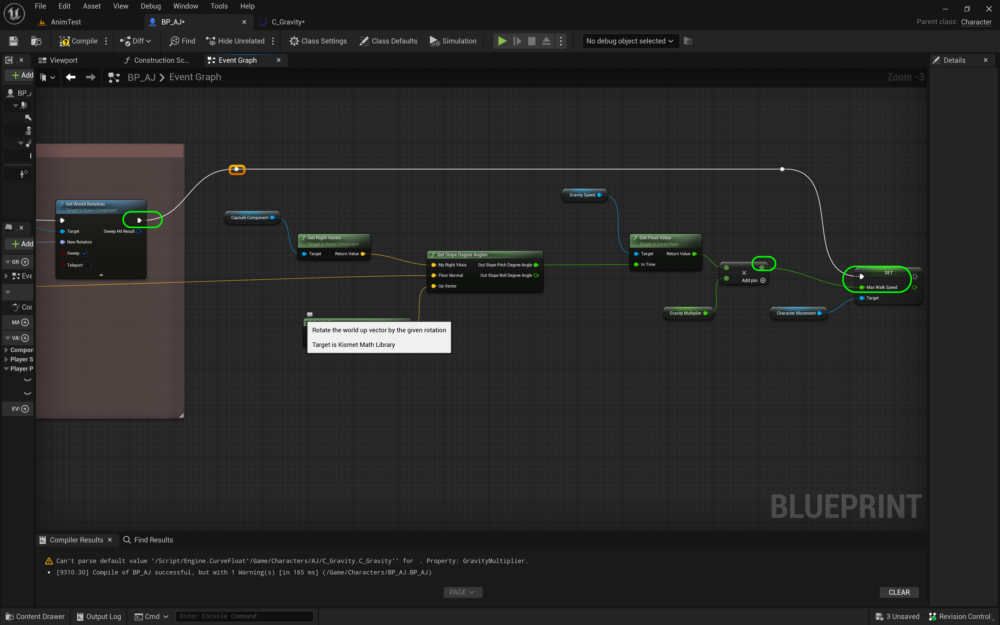
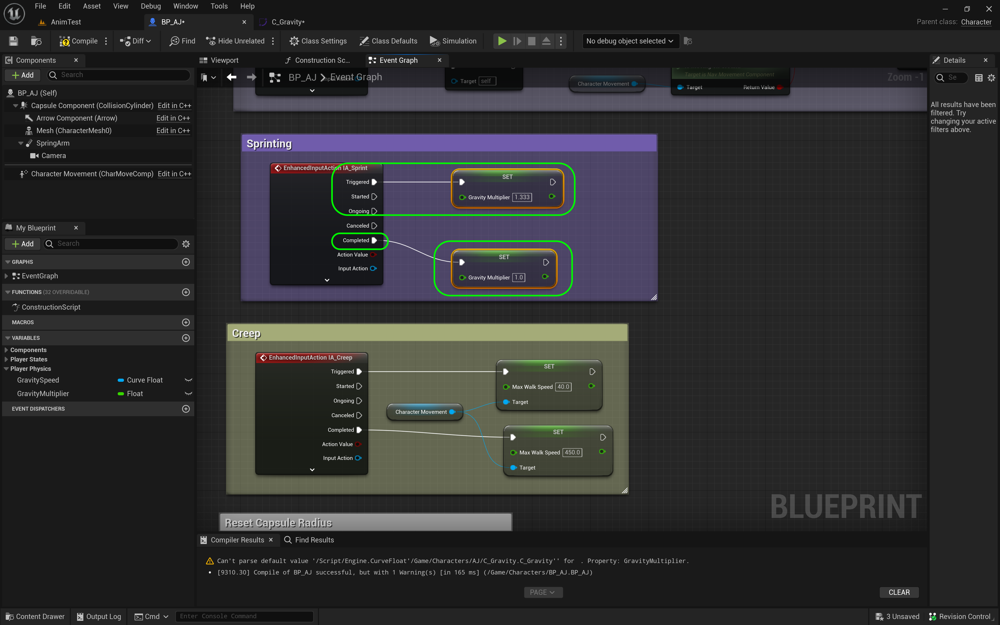
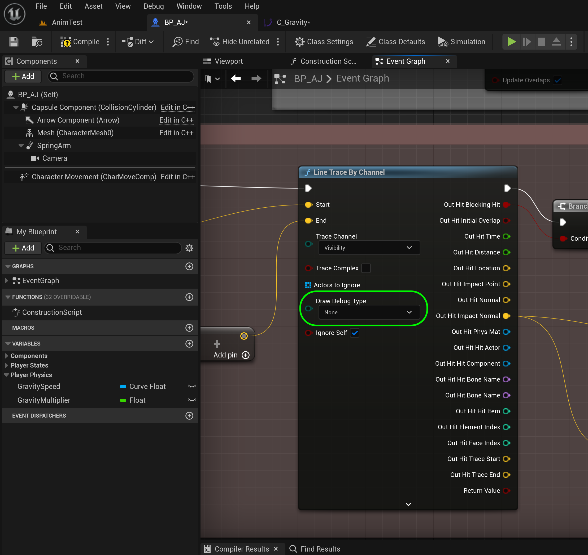
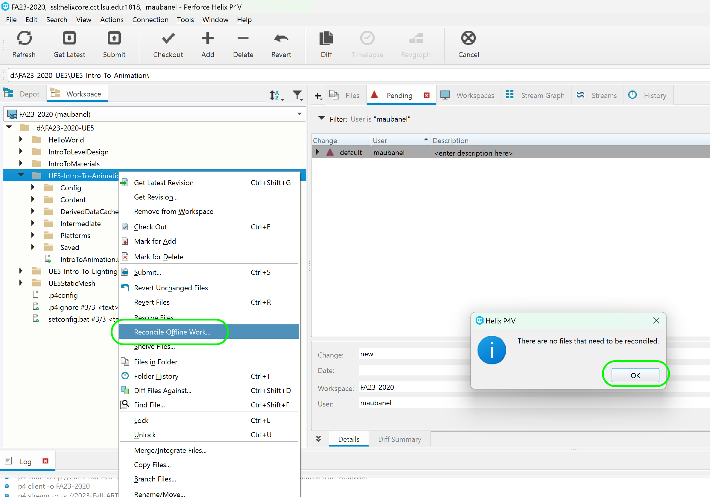

### Speed Up & Down Ramps II

[previous](../ramps/README.md#user-content-speed-up--down-ramps) • [home](../README.md#user-content-ue4-animations)

Running up & down ramps continued...

---

##### `Step 1.`\|`ITA`|:small_blue_diamond:

Select each key and right click and make it **Auto**.  This will change the key from a linear to a curved key.  This will give a more natural slope and less abrupt change to the player speed.

##### `Step 2.`\|`FHIU`|:small_blue_diamond: :small_blue_diamond: 

Adjust the two angles between 10° and -10° so that part is flat without any bumps or lumps.

##### `Step 3.`\|`ITA`|:small_blue_diamond: :small_blue_diamond: :small_blue_diamond:

Go back to **BP_AJ** and add a **Capsule Component** and then pull off the pin and select a **Get Right Vector** node. This gets the player's relative right hand vector.

##### `Step 4.`\|`ITA`|:small_blue_diamond: :small_blue_diamond: :small_blue_diamond: :small_blue_diamond:

*Add* a **Get Up Vector** node and set **Z** to `1.0` and leave **X** and **Y** at `0.0`. Add a **Get Slope Degress Angles** node.  Connect the **Get Right Vector | Return Value** to the **My Right YAxis** node.  Connect the **Out Hit Impace Normal** pin to the **Floor Normal** pin.  Select the output of the **Get Up Vector | Return Value** pin to the **Up Vector** pin in **Get Slope Degree Angles**.

##### `Step 5.`\|`ITA`| :small_orange_diamond:

Now we need to read from the slope graph we just created.  So we need to add a **Variable** athat is called `Gravity Speed` and set the type to **Object Type | Curve Float | Ojbect Reference** and make certain it is an `Object Reference`. Set the variable to **Private** as `true` and the **Category** to `Player Physics`. Add a description.

##### `Step 6.`\|`ITA`| :small_orange_diamond: :small_blue_diamond:

Now before we can add a **Default Value** we need press the <kbd>Compile</kbd> button. Now you can set the **Default Value** to `C_Gravity` the curve you just created. Add a **Gravity Speed** node to the graph.

##### `Step 7.`\|`ITA`| :small_orange_diamond: :small_blue_diamond: :small_blue_diamond:

 *Pull off* of the pin and select a **Get Float Value** node.  

##### `Step 8.`\|`ITA`| :small_orange_diamond: :small_blue_diamond: :small_blue_diamond: :small_blue_diamond:

Connect the **Get Slope Pitch Degree in Angle** to the **In Time** pin of the float value.  This will get us the angle in degrees and output the value from the curve. Now the problem is that this doesn't take into consideration the sprint and slow walk.  So we will need to scale that value up and down when the player presses the <kbd>Shift</kbd> or <kbd>Alt</kbd> keys.  Add a new **Float** varialbe called `SprintMultiplier`.  Make it **Private** and set the **Category** to `PlayerPhysics`. Set a **Description** that says `Multiplies Speed`. Set the **Default Value** to `1.0`.
`

##### `Step 9.`\|`ITA`| :small_orange_diamond: :small_blue_diamond: :small_blue_diamond: :small_blue_diamond: :small_blue_diamond:

Add the **Gravity Multiplier** variable to the graph.

##### `Step 10.`\|`ITA`| :large_blue_diamond:

Now add a **Multiplier** node and add the **Get Float Value** in the top and **Gravity Multiplier** in the bottom input node. Drag a **Character Movement** component onto the graph and pull off of the blue pin and select **Set Max Walk Speed**.

##### `Step 11.`\|`ITA`| :large_blue_diamond: :small_blue_diamond: 

Connect the output pin from the **X** multiply pin to the **Set | Max Walk Speed** pin. Connect the execution pin to **Set World Rotation**.

##### `Step 12.`\|`ITA`| :large_blue_diamond: :small_blue_diamond: :small_blue_diamond: 

Now we need to go back to the sprinting code where we hard coded the speed.  So for sprinting we set the speed to `600` instead of `450`.  So if we divide 600/450 we get 1.3. So we need to multiply our speed by this amount.  So replace **Set Max Walk Speed** next to the **InputAction Sprint** button to a **Set Sprint Multiplier** with a value of `1.333`.  Then replace the second hard coded **Max Walk Speed** with a **Set Sprint Multiplier** with a value of `1.0` (which is regular run).

##### `Step 13.`\|`ITA`| :large_blue_diamond: :small_blue_diamond: :small_blue_diamond:  :small_blue_diamond: 

Attach **IA_Sprint | Triggered** to **Set | Gravity Multiplier** of `1.33`.  Connect **IA_Sprint | Completed** to **Set | Gravity Multiplier** of `1.0`.

##### `Step 14.`\|`ITA`| :large_blue_diamond: :small_blue_diamond: :small_blue_diamond: :small_blue_diamond:  :small_blue_diamond: 

For slow walk we had a value of `20`.  So if we divide 40/450 we get `.088`.  So this will be our scalar for slow walk.  Go to **IA_Creep** and replace the hard coded values for **Triggered** with a **Set Sprint Multiplier** with a value of `0.088` when the key is pressed and a value of `1.0` when the event is **Completed**.

Now these scalars will multiply the value that is in the curve float. 

##### `Step 15.`\|`ITA`| :large_blue_diamond: :small_orange_diamond: 

*Press* the <kbd>Play</kbd> button.  Run, sprint and slow walk up and down all ramps and see that the speed changes!  You can adjust the curve float values for your liking increasing or decreasing the effects of gravity.

https://github.com/maubanel/UE5-Animations/assets/5504953/d9c67fba-50b2-4a40-a4a3-45510b331d4f

##### `Step 16.`\|`ITA`| :large_blue_diamond: :small_orange_diamond:   :small_blue_diamond: 

The only thing left to do once you tune the curve is to turn the debug line draw off. Open up **BP_AJ** and find the **Line Trace by Channel** node.  Turn **Draw Debug Type** back to `none`.

##### `Step 17.`\|`ITA`| :large_blue_diamond: :small_orange_diamond: :small_blue_diamond: :small_blue_diamond:

*Press* the <kbd>Play</kbd> button and look at how you have recreated the 3rd person template but with your own character!

https://github.com/maubanel/UE5-Animations/assets/5504953/7dd80ff9-bade-4c79-a8b9-df86d475a52b

##### `Step 18.`\|`ITA`| :large_blue_diamond: :small_orange_diamond: :small_blue_diamond: :small_blue_diamond: :small_blue_diamond:

Select the **File | Save All** then press the <kbd>Revision Control</kbd> button and select **Submit Content**.  If you are prompted, select **Check Out** for all items that are not checked out of source control. Update the **Changelist Description** message and with the latest changes. Make sure all the files are correct and press the <kbd>Submit</kbd> button. A confirmation will pop up on the bottom right with a message about a changelist was submitted with a commit number. Quit Unreal and make sure your **Pending** tab in **P4V** is empty. **Submit** any work that is still in the editor.

##### `Step 19.`\|`ITA`| :large_blue_diamond: :small_orange_diamond: :small_blue_diamond: :small_blue_diamond: :small_blue_diamond: :small_blue_diamond:

Sometimes not all files get submitted to Unreal especially for files that don't show up in the editor.  It is good practice one you submit in **Unreal** and quit the game to right click on the top most project folder and select **Reconcile Offline Work...**.

This will either give a message saying ther is nothing to reconcile or bring up a tab.  Make sure that these are **NOT** files in the **Intermediate** and **Saved** folders as these should be ignored from the `.p4ignore`.

If the files are in **Content** or **Configuration** then press the <kbd>Reconcile</kbd> button.  Then submit the changes with a message and press the <kbd>Submit</kbd> button.

| `animation.character`\|`THE END`| 
| :--- |
| **That's All Folks!** Thanks for sticking around. That's it for this lesson. |

<!--  -->

| [previous](../ramps/README.md#user-content-speed-up--down-ramps)| [home](../README.md#user-content-ue4-animations) | 
|---|---|
