### Speed Up & Down Ramps II

[previous](../ramps/README.md#user-content-speed-up--down-ramps) • [home](../README.md#user-content-ue4-animations) • [next](../ramps-iii/README.md#user-content-speed-up--down-ramps-iii)

Running up & down ramps continued...

 

---

##### `Step 1.`\|`ITA`|:small_blue_diamond:

Now we need to cast a line down the player based on his world angle. So we will drag and drop the **Capsule Component** from the **Component** menu and then pull the pin and add a **Get Up Vector** node. This gets a vector pointing upwards from his head.

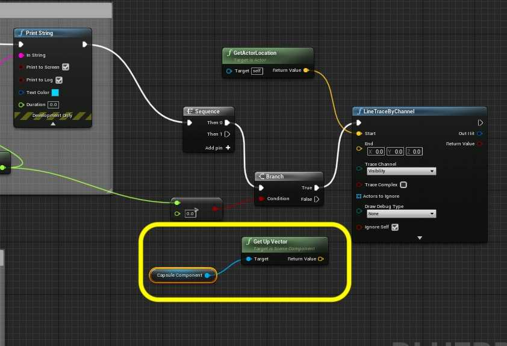

##### `Step 2.`\|`FHIU`|:small_blue_diamond: :small_blue_diamond: 

Now *add* a **Vector * Float** node. We need to scale this normalized vector 300 units in the opposite direction. Set the multiplication amount to `-300.0` (multiplying a vector by -1 reverses the direction of the vector, since Unreal is Z-Up this will make it 300 cm downwards). 

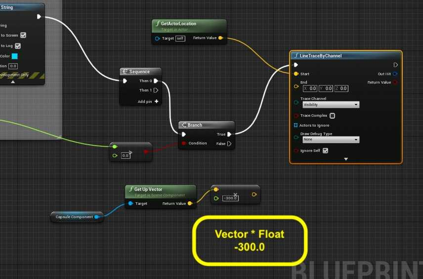

##### `Step 3.`\|`ITA`|:small_blue_diamond: :small_blue_diamond: :small_blue_diamond:

To see this line trace we will turn the **Draw Debug Type** to `For One Frame`. This will allow us to see the line being cast and wether it collides with a surface.

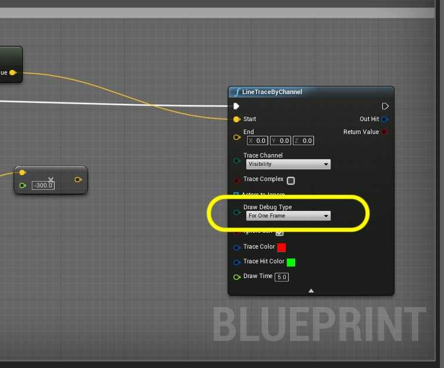

##### `Step 4.`\|`ITA`|:small_blue_diamond: :small_blue_diamond: :small_blue_diamond: :small_blue_diamond:

Now this value is in local space and we need to translate it to world space. We do this by adding the actual world location. *Pull off* the **Multiplication** pin and select a **vector + vector** node. *Add* the **Return Value** to the **Get Actor Location**. *Send* the output to the **End** pin of the **Line Trace By Channel** node.

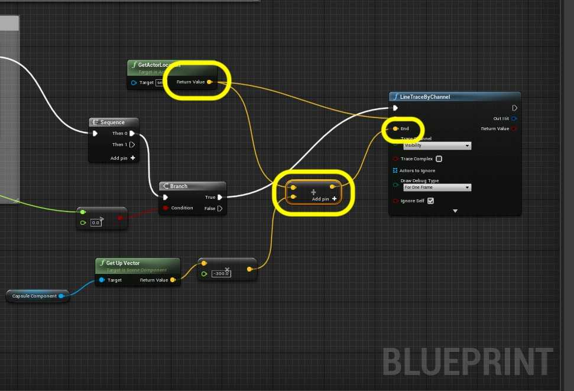

##### `Step 5.`\|`ITA`| :small_orange_diamond:

I add a comment explaining my actions.

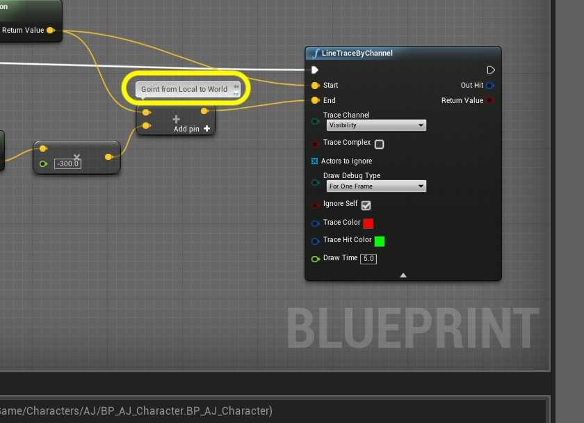

##### `Step 6.`\|`ITA`| :small_orange_diamond: :small_blue_diamond:

*Run* the game. You should see a red line casting downwards with a hit target on the ground beneath the player when the player is moving and no line cast when they stop.

https://user-images.githubusercontent.com/5504953/134693811-e7d62071-15c4-4623-830c-1ee9b8658ed3.mp4

##### `Step 7.`\|`ITA`| :small_orange_diamond: :small_blue_diamond: :small_blue_diamond:

Now I need to cast a second line then be the angle of the slope. This will tell me if I am going up or down the slope as well. I am going to cast a line 10 units ahead based on the direction of their **Velocity**. *Add* a second **Line Trace By Channel** node to the graph beneath the previous one. To the left add a **Get Actor Location** node.

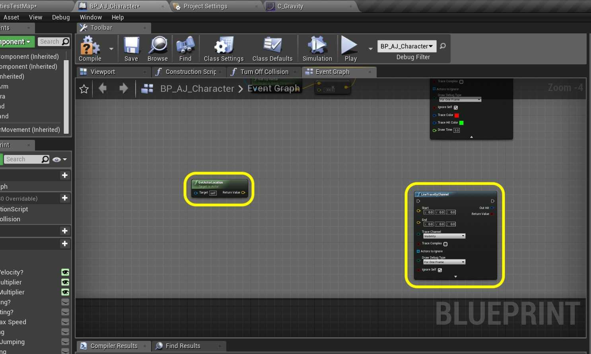

##### `Step 8.`\|`ITA`| :small_orange_diamond: :small_blue_diamond: :small_blue_diamond: :small_blue_diamond:

We need to get forward by 10 velocity units from the current location. *Add* a **vector + vector** node and connect the input to the **Return Value** of the **Get Actor Location** pin. Send the output to the **Start** pin of the **Line Trace By Channel** node.

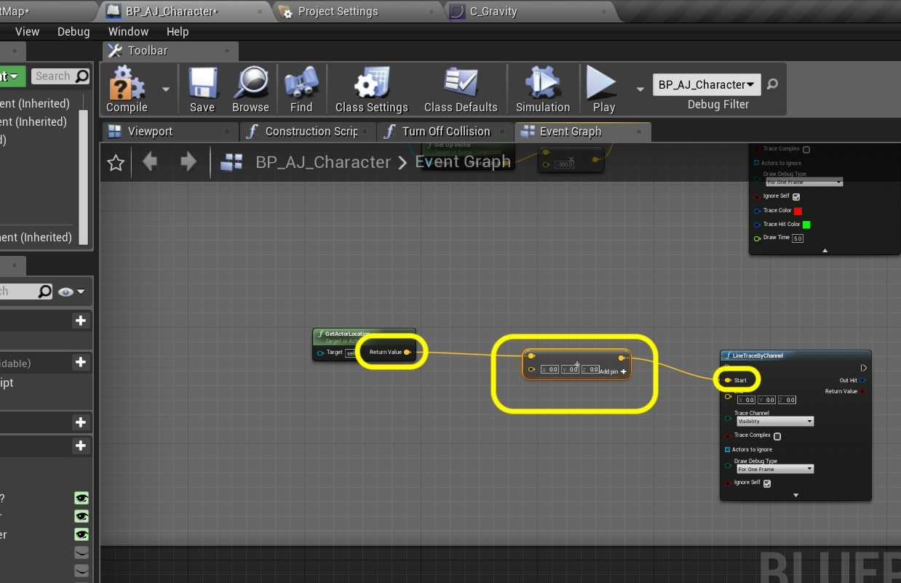

##### `Step 9.`\|`ITA`| :small_orange_diamond: :small_blue_diamond: :small_blue_diamond: :small_blue_diamond: :small_blue_diamond:

*Drag* a **Character Movement** node from the **Component** menu. *Drag off* of its pin and select a **Get Velocity** node.

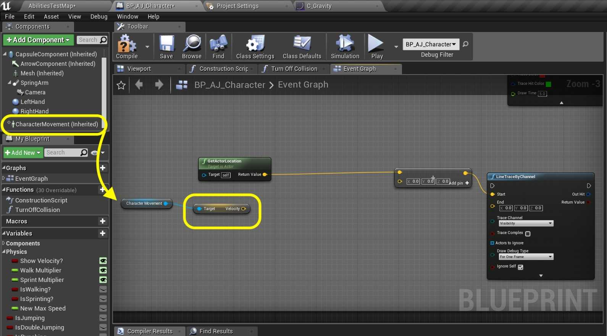

##### `Step 10.`\|`ITA`| :large_blue_diamond:

Grab the output of the **Velocity** pin and select a **Normalize** node. Now add a **vector * float** node to multiply the vector by `10.0` to scale it up. Remember a normalized vector is 1 unit in length. Multiplying it by 10 sends it forward by 10 units. Send this output to the second side of the vector **Addition** node.

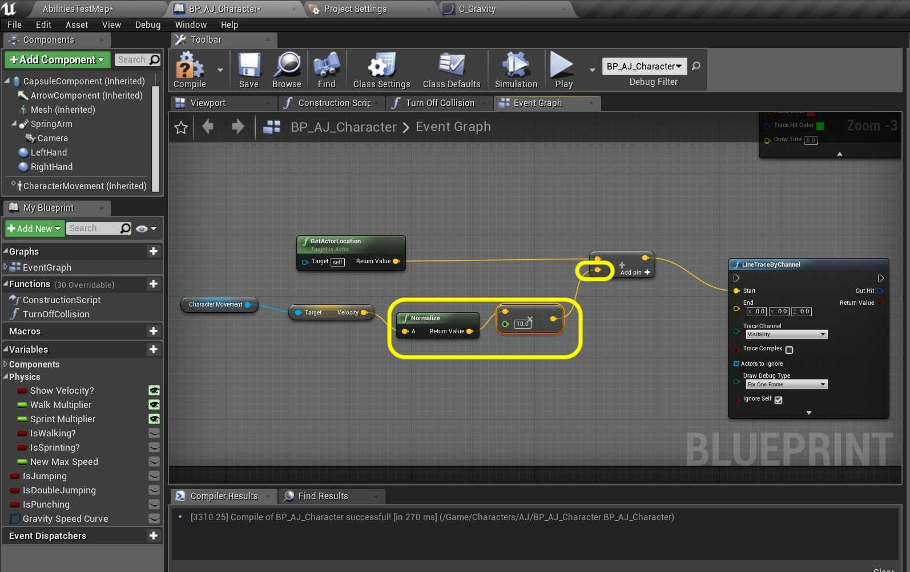

##### `Step 11.`\|`ITA`| :large_blue_diamond: :small_blue_diamond: 

The end unit will be 300 units underneath the player. *Add* a **vector + vector** node.

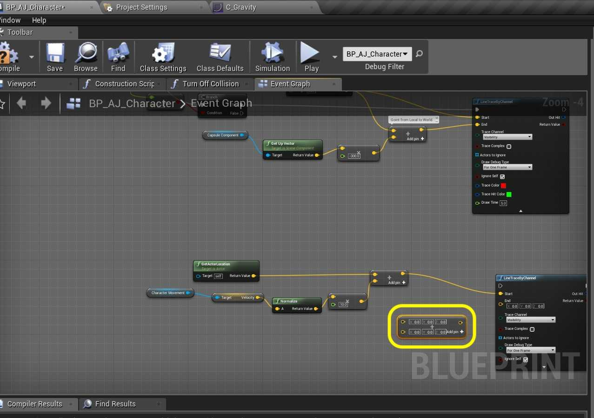

##### `Step 12.`\|`ITA`| :large_blue_diamond: :small_blue_diamond: :small_blue_diamond: 

*Connect* the output of the **Multiplication** pin where you go down 300 units from the center downwards to the topside of the addition node. Take the output of the **Addition** pin to the input of the other end of the addition node. *Send* the output of to the **End** pin in the **Line Trace by Channel** node. Set the **Draw Debug Type** to `For One Frame` to test out.

##### `Step 13.`\|`ITA`| :large_blue_diamond: :small_blue_diamond: :small_blue_diamond:  :small_blue_diamond: 

*Connect* the execution pin between the two **Line Trace by Channel** nodes. *Play* the game and see if you can see the second vector. It renders two vectors very close to each other (which is what we want) which might still looks like one single vector. What we need to do is termporarilly make them further apart. Change the distance of the **Multiplication** pin from `10.0` to `50.0` and make sure the second vector is in front of the player.

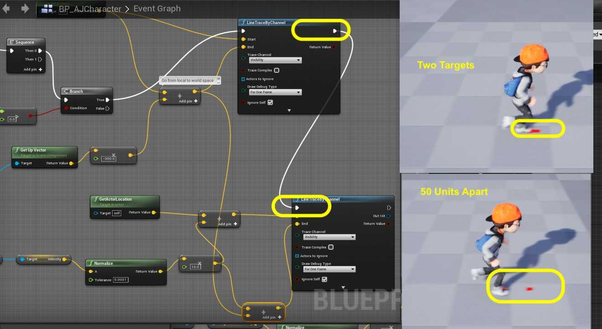

##### `Step 14.`\|`ITA`| :large_blue_diamond: :small_blue_diamond: :small_blue_diamond: :small_blue_diamond:  :small_blue_diamond: 

*Play* the game and you should now see the second vector. Set the **Multiplication** pin back to `10.0`. Now on the next page we will figure out the slope of the surface by measuring the angle between these two vectors. *Press* **Save All** and update Github by **committing** and **pushing** all the changes made.

##### `Step 15.`\|`ITA`| :large_blue_diamond: :small_orange_diamond: 

##### `Step 16.`\|`ITA`| :large_blue_diamond: :small_orange_diamond:   :small_blue_diamond: 

##### `Step 17.`\|`ITA`| :large_blue_diamond: :small_orange_diamond: :small_blue_diamond: :small_blue_diamond:

##### `Step 18.`\|`ITA`| :large_blue_diamond: :small_orange_diamond: :small_blue_diamond: :small_blue_diamond: :small_blue_diamond:

##### `Step 19.`\|`ITA`| :large_blue_diamond: :small_orange_diamond: :small_blue_diamond: :small_blue_diamond: :small_blue_diamond: :small_blue_diamond:

##### `Step 20.`\|`ITA`| :large_blue_diamond: :large_blue_diamond:

##### `Step 21.`\|`ITA`| :large_blue_diamond: :large_blue_diamond: :small_blue_diamond:

___

| [previous](../ramps/README.md#user-content-speed-up--down-ramps)| [home](../README.md#user-content-ue4-animations) | [next](../ramps-iii/README.md#user-content-speed-up--down-ramps-iii)|
|---|---|---|
