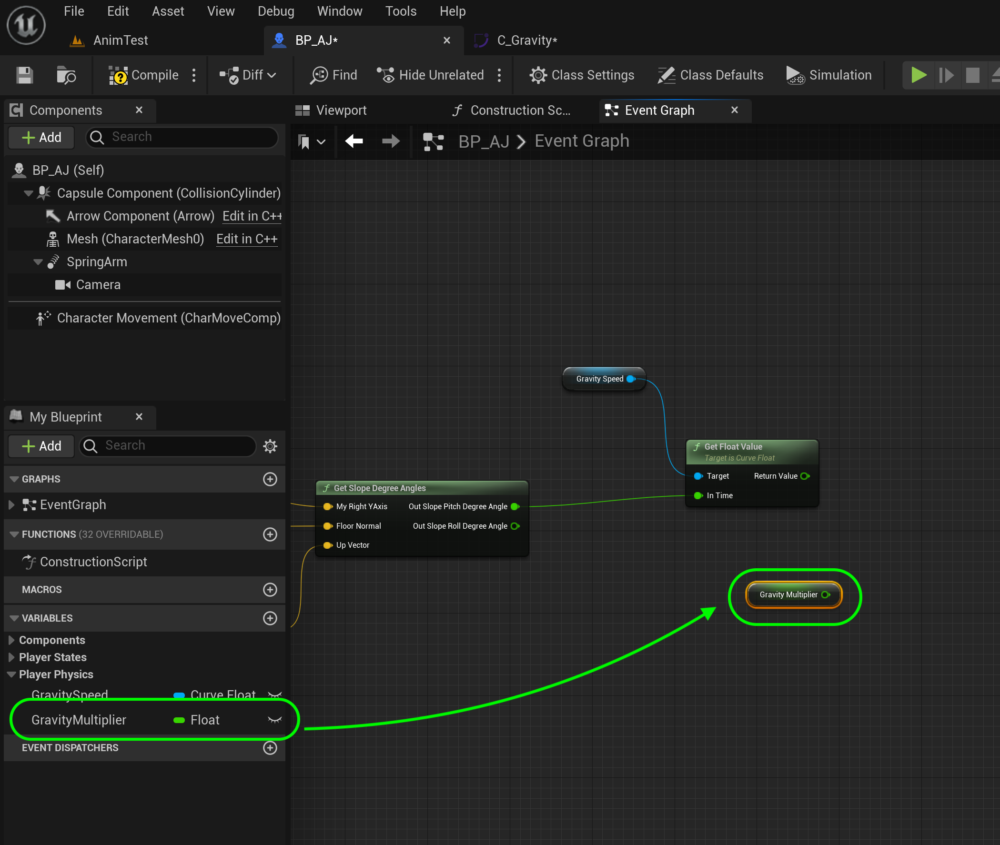
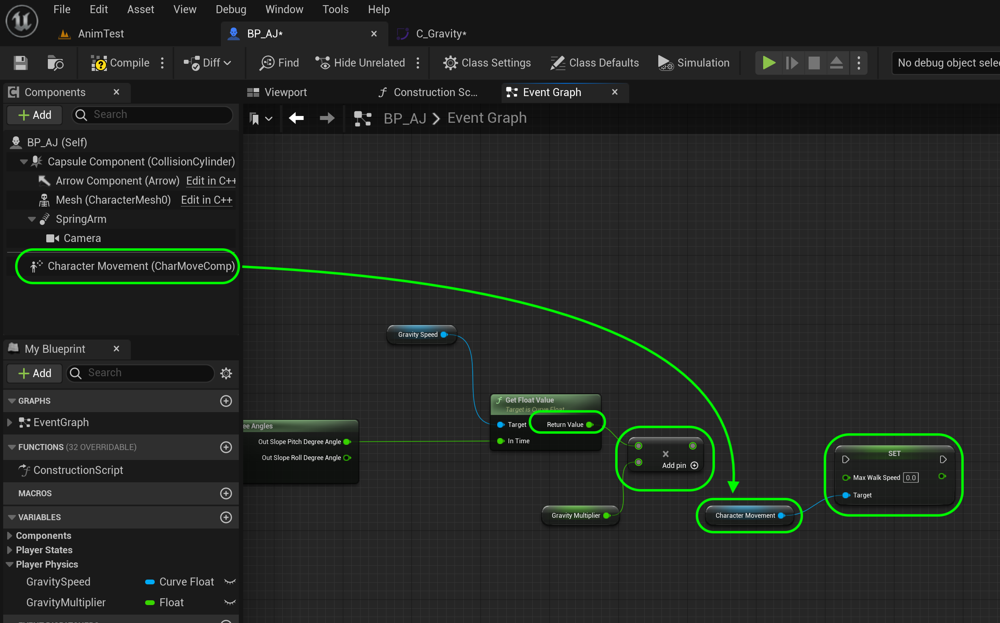
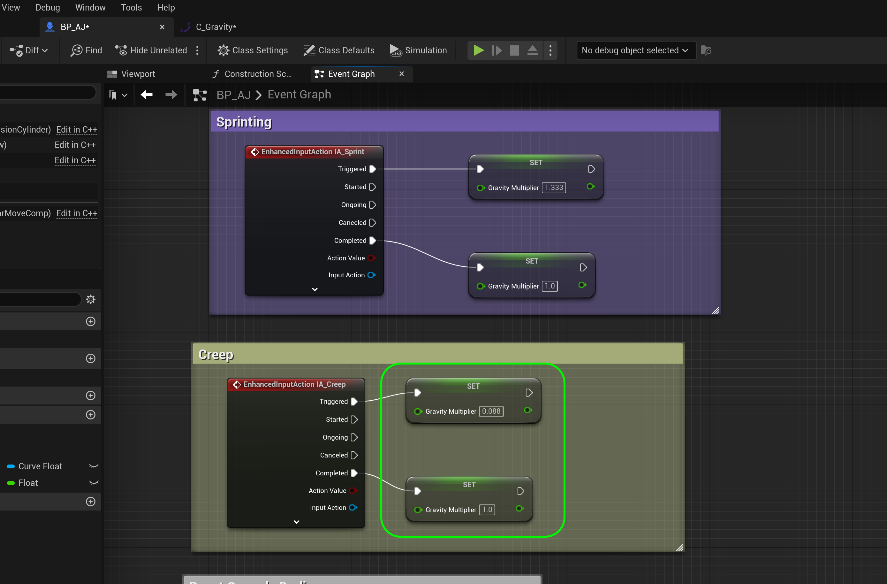

### Speed Up & Down Ramps II

[previous](../ramps/README.md#user-content-speed-up--down-ramps) • [home](../README.md#user-content-ue4-animations)

Running up & down ramps continued...

---

##### `Step 1.`\|`ITA`|:small_blue_diamond:

Select each key and right click and make it **Auto**.  This will change the key from a linear to a curved key.  This will give a more natural slope and less abrupt change to the player speed.

##### `Step 2.`\|`FHIU`|:small_blue_diamond: :small_blue_diamond: 

Adjust the two angles between 10° and -10° so that part is flat without any bumps or lumps.

##### `Step 3.`\|`ITA`|:small_blue_diamond: :small_blue_diamond: :small_blue_diamond:

Go back to **BP_AJ** and add a **Capsule Component** and then pull off the pin and select a **Get Right Vector** node. This gets the player's relative right hand vector.

##### `Step 4.`\|`ITA`|:small_blue_diamond: :small_blue_diamond: :small_blue_diamond: :small_blue_diamond:

*Add* a **Get Up Vector** node and set **Z** to `1.0` and leave **X** and **Y** at `0.0`. Add a **Get Slope Degress Angles** node.  Connect the **Get Right Vector | Return Value** to the **My Right YAxis** node.  Connect the **Out Hit Impace Normal** pin to the **Floor Normal** pin.  Select the output of the **Get Up Vector | Return Value** pin to the **Up Vector** pin in **Get Slope Degree Angles**.

##### `Step 5.`\|`ITA`| :small_orange_diamond:

Now we need to read from the slope graph we just created.  So we need to add a **Variable** athat is called `Gravity Speed` and set the type to **Object Type | Curve FLoat** and make it an `Object Reference`.

##### `Step 6.`\|`ITA`| :small_orange_diamond: :small_blue_diamond:

##### `Step 7.`\|`ITA`| :small_orange_diamond: :small_blue_diamond: :small_blue_diamond:

Set the variable to **Private** as `true` and the **Category** to `Player Physics`.  Now before we can add a **Default Value** we need press the <kbd>Compile</kbd> button. Now you can set the **Default Value** to `C_Gravity` the curve you just created.

##### `Step 8.`\|`ITA`| :small_orange_diamond: :small_blue_diamond: :small_blue_diamond: :small_blue_diamond:

Add a **Gravity Speed** node and *pull off* of the pin and select a **Get Float Value** node.  Connect the **Get Slope Pitch Degree in Angle** to the **In Time** pin of the float value.  This will get us the angle in degrees and output the value from the curve.

##### `Step 9.`\|`ITA`| :small_orange_diamond: :small_blue_diamond: :small_blue_diamond: :small_blue_diamond: :small_blue_diamond:

Now the problem is that this doesn't take into consideration the sprint and slow walk.  So we will need to scale that value up and down when the player presses the <kbd>Shift</kbd> or <kbd>Alt</kbd> keys.  Add a new **Float** varialbe called `SprintMultiplier`.  Make it **Private** and set the **Category** to `PlayerPhysics`. Set a **Description** that says `Multiplies Speed`. SET DEFAULT VALUE TO `1.0` FIX IN SCREENSHOT!!!!!!
`

##### `Step 10.`\|`ITA`| :large_blue_diamond:

Add the **Sprint Multiplier** variable to the graph.

##### `Step 11.`\|`ITA`| :large_blue_diamond: :small_blue_diamond: 

Now add a **Multiplier** node and add the **Get Float Value** in the top and **Sprint Multiplier** in the bottom input node.

##### `Step 12.`\|`ITA`| :large_blue_diamond: :small_blue_diamond: :small_blue_diamond: 

Now we need to go back to the sprinting code where we hard coded the speed.  So for sprinting we set the speed to `600` instead of `450`.  So if we divide 600/450 we get 1.3. So we need to multiply our speed by this amount.  So replace **Set Max Walk Speed** next to the **InputAction Sprint** button to a **Set Sprint Multiplier** with a value of `1.3`.  Then replace the second hard coded **Max Walk Speed** with a **Set Sprint Multiplier** with a value of `1.0` (which is regular run).

##### `Step 13.`\|`ITA`| :large_blue_diamond: :small_blue_diamond: :small_blue_diamond:  :small_blue_diamond: 

Flor slow walk we had a value of `20`.  So if we divide 20/450 we get `.044`.  So this will be our scalar for slow walk.  Go to **InputAction Slow Walk** and replace the hard coded values with a **Set Sprint Multiplier** with a value of `0.044` when the key is pressed and a value of `1.0` when it is released.

##### `Step 14.`\|`ITA`| :large_blue_diamond: :small_blue_diamond: :small_blue_diamond: :small_blue_diamond:  :small_blue_diamond: 

Now go back to where we were working before and instead add the **Set Max Walk Speed** node to this position.  Remember it needs to come from the **Character Movement** component.

##### `Step 15.`\|`ITA`| :large_blue_diamond: :small_orange_diamond: 

Connect the execution pin from **Set World Rotation** to **Set Walk Speed**.

##### `Step 16.`\|`ITA`| :large_blue_diamond: :small_orange_diamond:   :small_blue_diamond: 

Send the output of the **Multiply** pin to the **Max Walk Speed** pin which will add the multiplier for slowing down or speeding up.

##### `Step 17.`\|`ITA`| :large_blue_diamond: :small_orange_diamond: :small_blue_diamond: :small_blue_diamond:

*Press* the <kbd>Play</kbd> button.  Run, sprint and slow walk up and down all ramps and see that the speed changes! 

https://user-images.githubusercontent.com/5504953/197391355-ead384c6-6f93-4499-9dd3-272f3e96fae2.mp4

##### `Step 18.`\|`ITA`| :large_blue_diamond: :small_orange_diamond: :small_blue_diamond: :small_blue_diamond: :small_blue_diamond:

Finally, lets remove the debug line as we no longer need it.  Go to **Line Trace By Channel** and set the **Draw Debug Type** to `none`. \

##### `Step 19.`\|`ITA`| :large_blue_diamond: :small_orange_diamond: :small_blue_diamond: :small_blue_diamond: :small_blue_diamond: :small_blue_diamond:

*Press* the <kbd>Play</kbd> button. Now you have a final version of a basic third person player. This will do it for this walk through! You have recreated a slightly different version of the third person template.

https://user-images.githubusercontent.com/5504953/197391363-a29b911d-6e5d-4c35-841d-87761b317051.mp4

##### `Step 20.`\|`ITA`| :large_blue_diamond: :large_blue_diamond:

Select the **File | Save All** then quit UE5.   Go to **P4V** and go the top project folder (the one that holds the `.uproject` file and **Content** folder) and press the <kbd>+Add</kbd> then <kbd>OK</kbd> button.  This makes sure any files that Unreal didn't add get added to source control. Press the <kbd>Submit</kbd> button and enter a message explaining the work done.  Press <kbd>Submit</kbd>.

| `animation.character`\|`THE END`| 
| :--- |
| **That's All Folks!** Thanks for sticking around. That's it for this lesson. |

<!--  -->

| [previous](../ramps/README.md#user-content-speed-up--down-ramps)| [home](../README.md#user-content-ue4-animations) | 
|---|---|
