### Speed Up & Down Ramps III

[previous](../ramps-ii/README.md#user-content-speed-up--down-ramps-ii) • [home](../README.md#user-content-ue4-animations) • [next](../ramps-iv/README.md#user-content-speed-up--down-ramps-iv)

Running up & down ramps continued...

 

---

##### `Step 1.`\|`ITA`|:small_blue_diamond:

https://user-images.githubusercontent.com/5504953/134770628-4ea7e0c3-baf2-41a9-8b58-cc9b4381edc5.mp4

Play the game and run around and up and down the ramp. It should be 0 degrees on flat land, a positive number when going up hill and a negative number in degrees when going downhill.

##### `Step 2.`\|`FHIU`|:small_blue_diamond: :small_blue_diamond: 

Now we want the player's pitch to rotate to match the slope of the round. The player will lean back when running uphill and forward when moving downhill. We will use this slop value we calculated for this. *Right click* on the **Return Value Y (Pitch)** pin from the **Find Look at Rotation** node and *select* **Promote to Variable**. *Call* it `NewPlayerPitch` and make it **Type** `Float` and `Private`. Set the **Tooltip** to `Pitch of player negative downhill, positive uphill in degrees`. *Connect* the execution pins between the second **Line Trace** and the **Print String** statement.

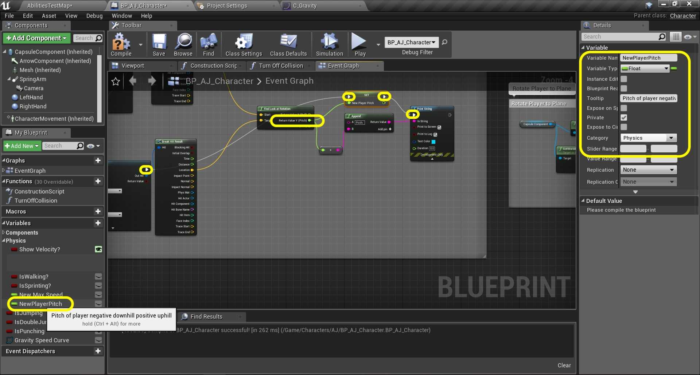

##### `Step 3.`\|`ITA`|:small_blue_diamond: :small_blue_diamond: :small_blue_diamond:

Lets get a reference to the **Capsule Component** and *pull off* its pin and get it current rotation by selecting a **Get World Rotation** node.

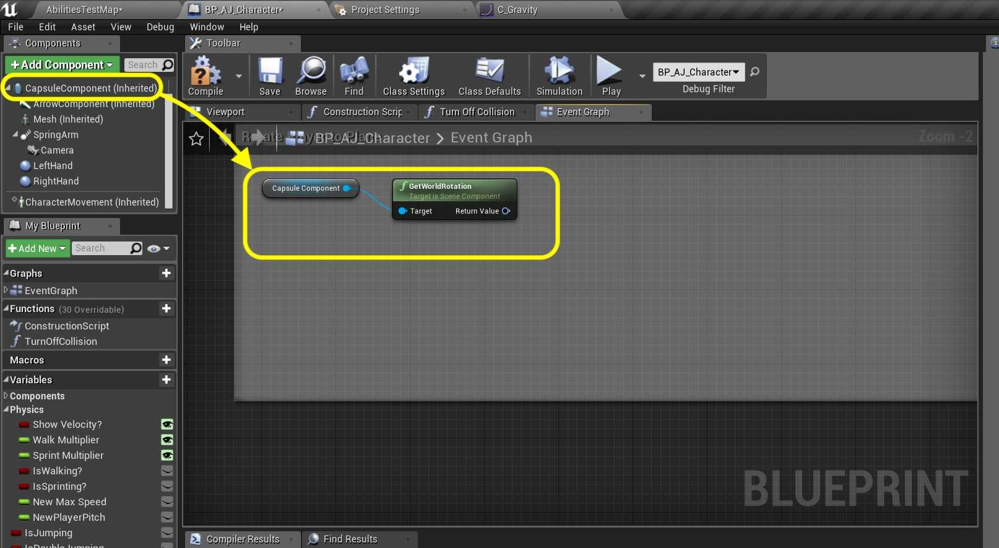

##### `Step 4.`\|`ITA`|:small_blue_diamond: :small_blue_diamond: :small_blue_diamond: :small_blue_diamond:

We don't want the player to just jump immediately to the new angle, we want them to animate to it. So we need a LERP node. *Pull off* of the **Return Value** from the **Get World Rotation** node and select a **RInterp To** node. *Right click* on the **Target** pin and select **Split Struct Pins**.

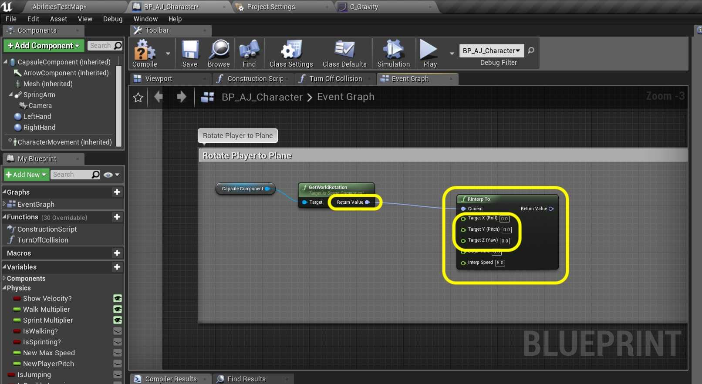

##### `Step 5.`\|`ITA`| :small_orange_diamond:

Our starting point in our current angle and our destination point is the angle with the new pitch from the floor. *Add* another **Get World Rotation** node from the **Capsule Component**.

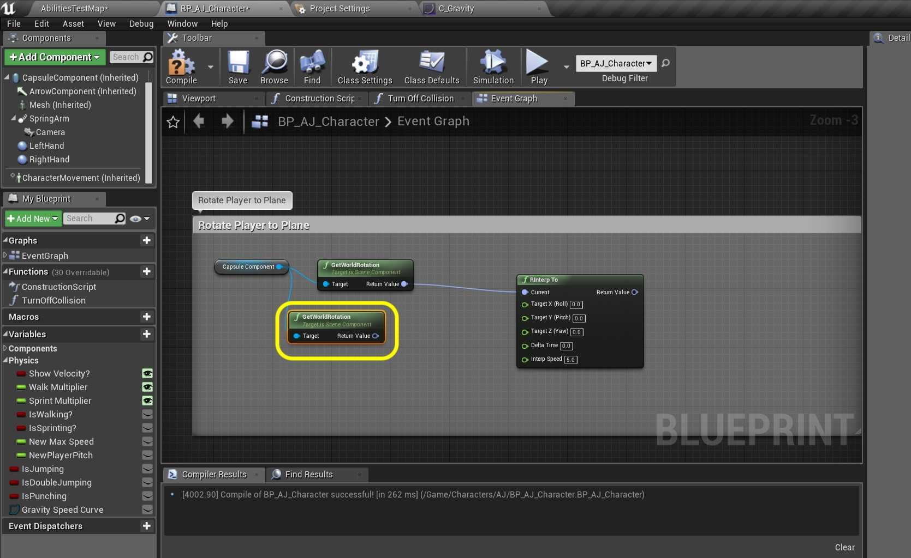

##### `Step 6.`\|`ITA`| :small_orange_diamond: :small_blue_diamond:

Split the pins on this new node by *right clicking* on the **Return Value** pin and splitting the pins.

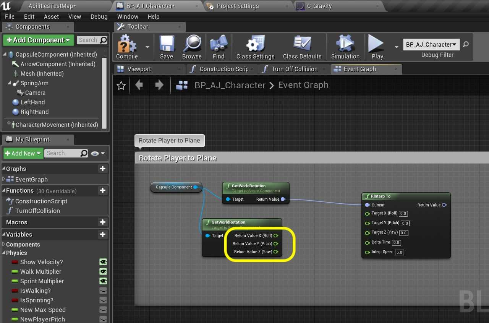

##### `Step 7.`\|`ITA`| :small_orange_diamond: :small_blue_diamond: :small_blue_diamond:

*Connect* the **Return Value X (Roll)** to the **Target X (Roll)** pins on the **RInterp To** node. Also *connect* the **Return Value Z (Yaw)** to the **Target Z (Yaw)** on the **RInterp To** node. These will not change.

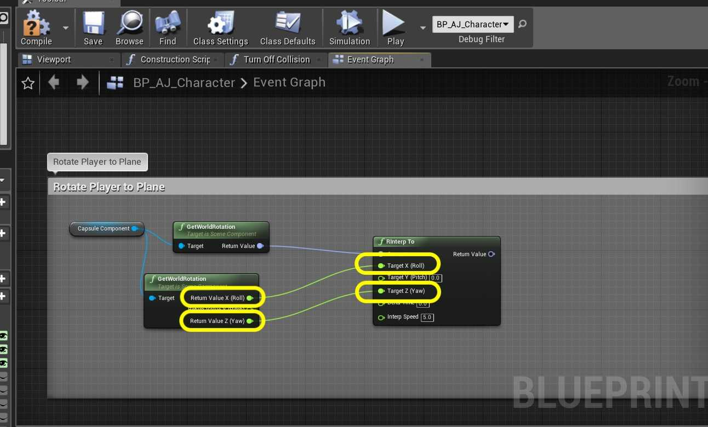

##### `Step 8.`\|`ITA`| :small_orange_diamond: :small_blue_diamond: :small_blue_diamond: :small_blue_diamond:

Now we will take the angle of the ground plane and add this to our pitch target to lerp to this point. *Add* a **Get New Player Pitch** node and send it to the **Target Y (Pitch)** in the **RInterp To** node.

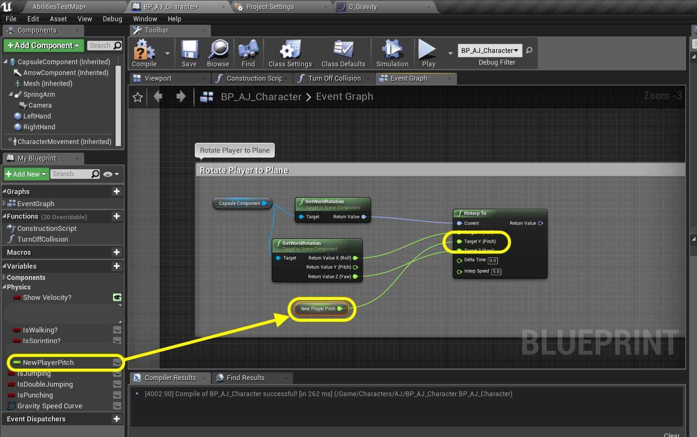

##### `Step 9.`\|`ITA`| :small_orange_diamond: :small_blue_diamond: :small_blue_diamond: :small_blue_diamond: :small_blue_diamond:

*Add* a **Set Actor Rotation** node and *connect* the output of the **Print String** execution pin to this new node.

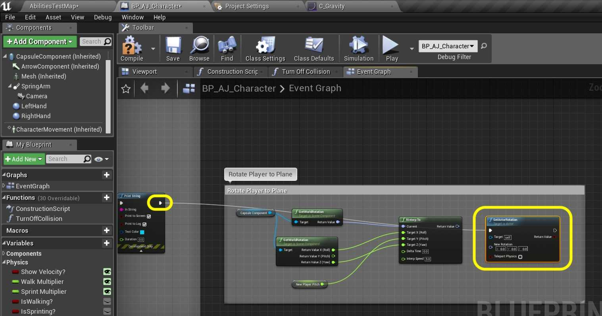

##### `Step 10.`\|`ITA`| :large_blue_diamond:

*Connect* from the **Return Value** pin of the **RInterp To** node to the **New Rotation** of the **Set Actor Rotation** node.

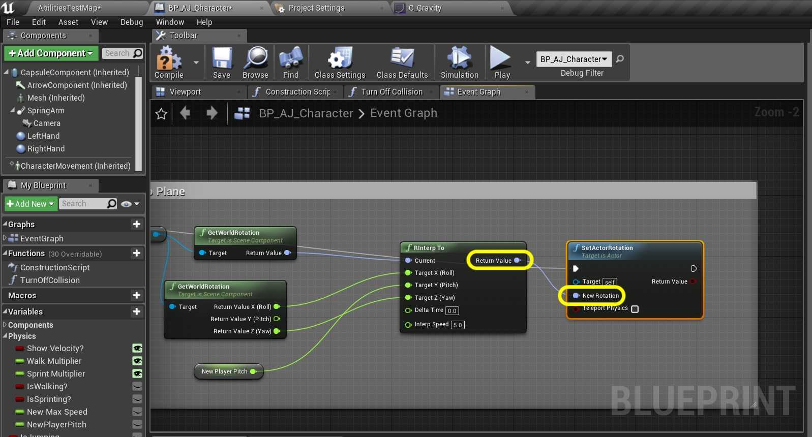

##### `Step 11.`\|`ITA`| :large_blue_diamond: :small_blue_diamond: 

The **RInterp To** node needs the delta time since last frame. *Right click* and add a **Get World Delta Seconds** node and *connect* it to the **Delta Time** pin in the **RInterp To** node. Set the **Interp Speed** to `5.0`.

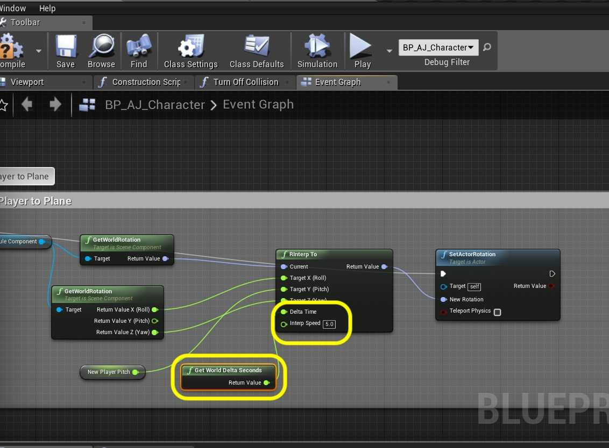

##### `Step 12.`\|`ITA`| :large_blue_diamond: :small_blue_diamond: :small_blue_diamond: 

*Play* the game and run up and down the slope and on flat ground. You should see the player rotate to match the slope of the ground. Works great now we will move on to adjusting speed. We want the player to move faster going downhill and slower moving uphill.

https://user-images.githubusercontent.com/5504953/134771021-86032461-37c0-4797-aad6-c6f79c78f777.mp4

##### `Step 13.`\|`ITA`| :large_blue_diamond: :small_blue_diamond: :small_blue_diamond:  :small_blue_diamond: 

This will make us rethink the movement logic for the player. They will be dynamically changing based on the slope. Right now we have hard coded our speed values. Lets change this and turn them into states we can check. *Delete all* the nodes inside the **Sprint** and **Walk** sections.

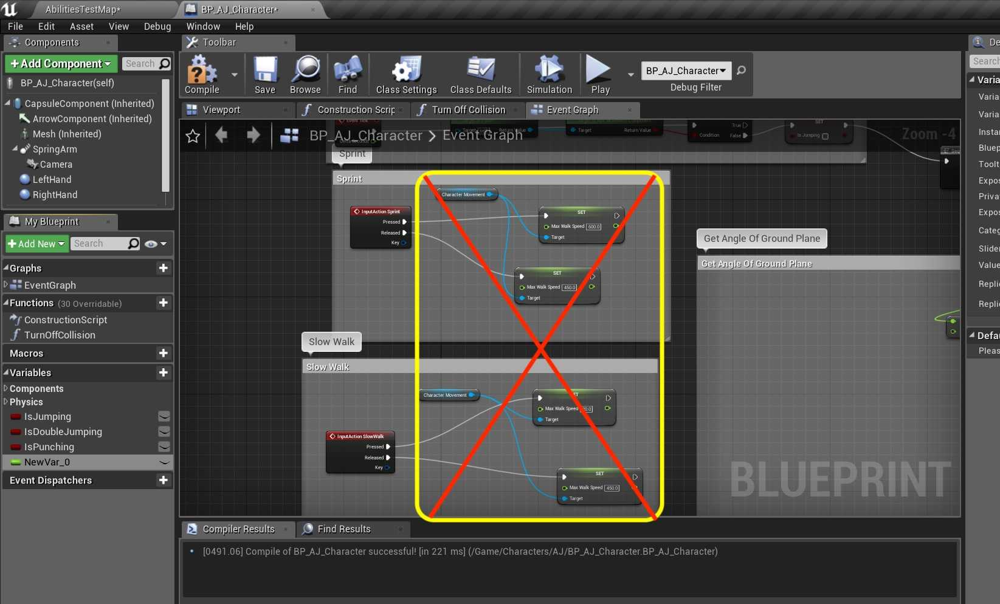

##### `Step 14.`\|`ITA`| :large_blue_diamond: :small_blue_diamond: :small_blue_diamond: :small_blue_diamond:  :small_blue_diamond: 

We are going to *add* another **Variable**. Call it `bIsWalking` and make it **Type** `Boolean`. Set it to `Private` and to **Category** to `Physics`. Add a **Tooltip** that states `Is player is walking or not?`.

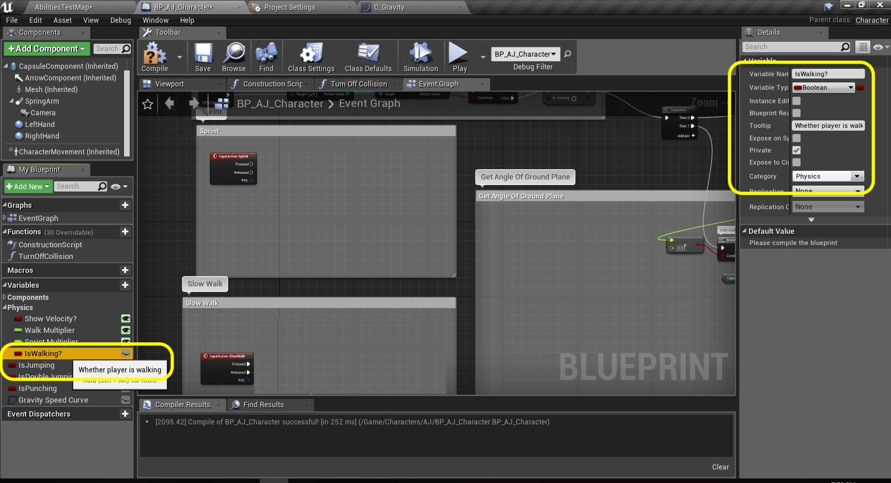

##### `Step 15.`\|`ITA`| :large_blue_diamond: :small_orange_diamond: 

*Right click* the **bIsWalking** variable and **Duplicate** it. *Call* it `bIsSprinting` and adjust the tooltip accordingly.

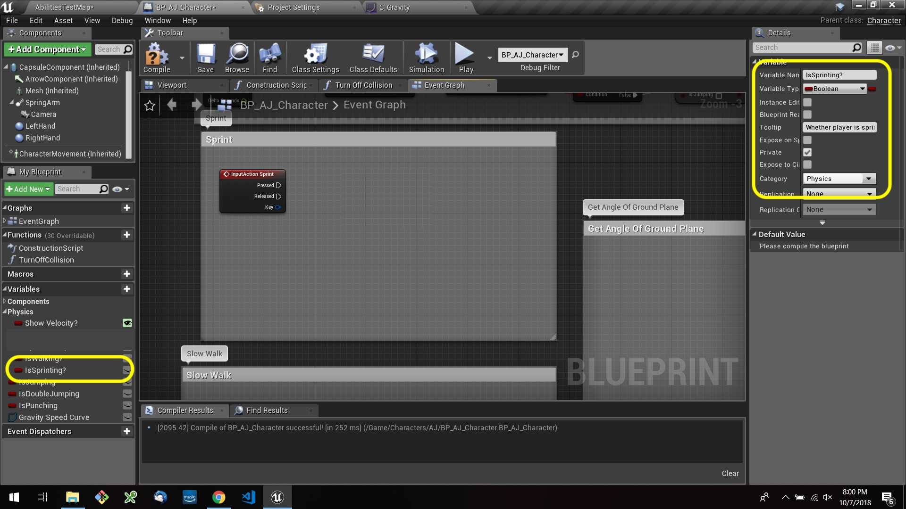

##### `Step 16.`\|`ITA`| :large_blue_diamond: :small_orange_diamond:   :small_blue_diamond: 

In the Sprint section *add two* **Set bIsSprinting** nodes. *Connect* the **Pressed** execution pin to the top node and set it to `True`. The the **Released** pin to the bottom one and leave it as `False`.

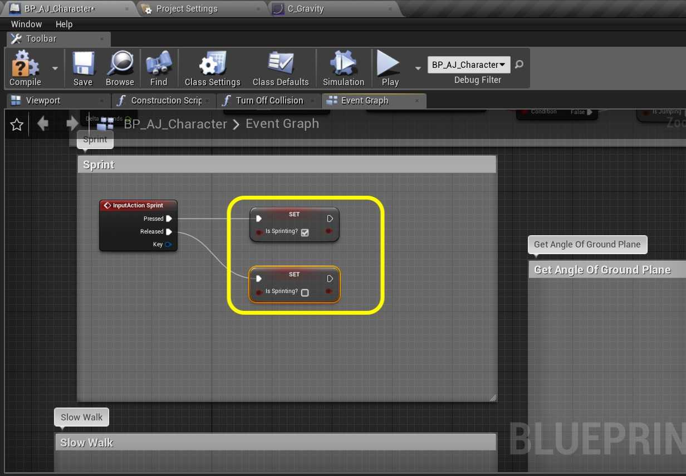

##### `Step 17.`\|`ITA`| :large_blue_diamond: :small_orange_diamond: :small_blue_diamond: :small_blue_diamond:

Now we don't want sprinting and walking at the same time so add a **Set bIsWalking** node and set it to false right after you set **Is Sprinting** to true.

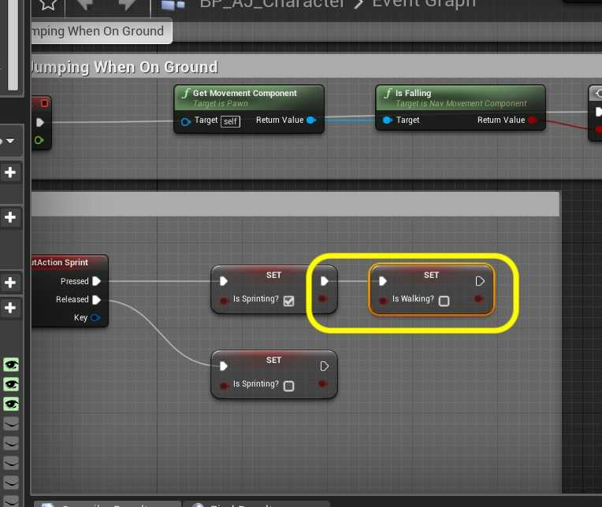

##### `Step 18.`\|`ITA`| :large_blue_diamond: :small_orange_diamond: :small_blue_diamond: :small_blue_diamond: :small_blue_diamond:

Repeat this procedure with the **Event Slow Walk**. *Add* two **bIsWalking** nodes with the *`true`* node connected to **Pressed** and the `false` node connected to **Released**.

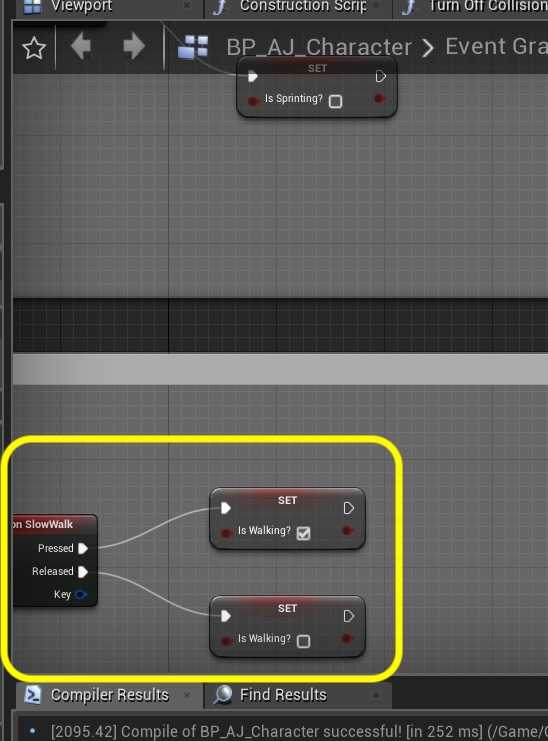

##### `Step 19.`\|`ITA`| :large_blue_diamond: :small_orange_diamond: :small_blue_diamond: :small_blue_diamond: :small_blue_diamond: :small_blue_diamond:

Then add after you set **bIsWalking** to `true` another **Set bIsSprinting** node and *set* it to `false`. This way we can't have sprinting and walking at the same time.

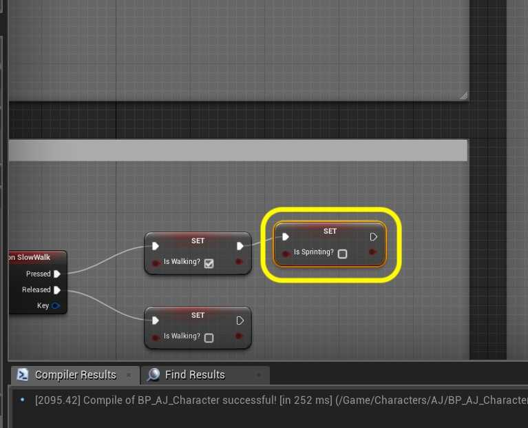

##### `Step 20.`\|`ITA`| :large_blue_diamond: :large_blue_diamond:

We will calculate the spriting and walking as an offset of our master speed. Create a new float called `Sprint Multiplier` of type **Float**. Set **Instace Editable** and **Private** to `true` then set the **Category** to `Physics`. Set the **Tooltip** to `How much faster is sprint from base speed`. *Press* the **Compile** button and set the default to `1.33`.

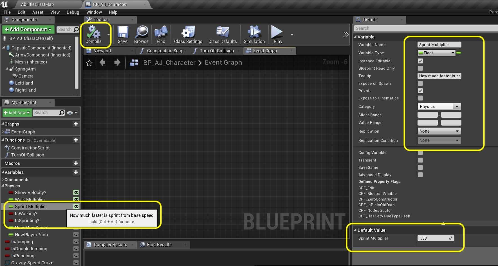

##### `Step 21.`\|`ITA`| :large_blue_diamond: :large_blue_diamond: :small_blue_diamond:

Create another variable called `Walking Multiplier` and set it to **Type** `Float`. Set **Private** and **Instance Editable** to `true`. Set the **Category** to `Physics` and the **Tooltip** to `How much slower is walk speed from base speed`. Press the **Compile** button and set the **Default** to `0.044`.

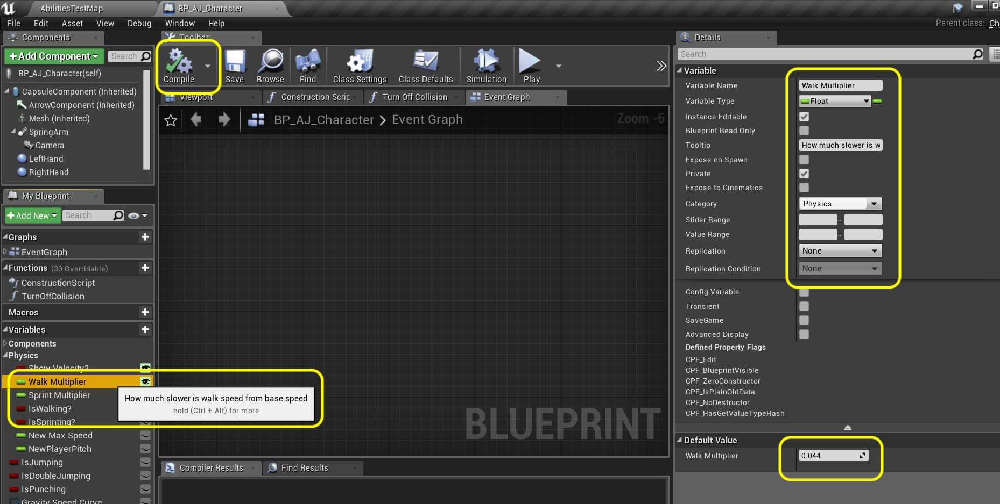

___

| [previous](../ramps-ii/README.md#user-content-speed-up--down-ramps-ii)| [home](../README.md#user-content-ue4-animations) | [next](../ramps-iv/README.md#user-content-speed-up--down-ramps-iv)|
|---|---|---|
