### Speed Up & Down Ramps IV

[previous](../ramps-iii/README.md#user-content-speed-up--down-ramps-iii) • [home](../README.md#user-content-ue4-animations) 

Running up & down ramps continued...

 

---

##### `Step 1.`\|`ITA`|:small_blue_diamond:

We need to save our ever changing max speed in a variable. *Create* another **Type** `Float` and call it `New Max Speed`. Set it to `Private` and to **Category** to `Physics`. *Add* a **Tooltip** that says `New max speed whether running walking or sprinting`.

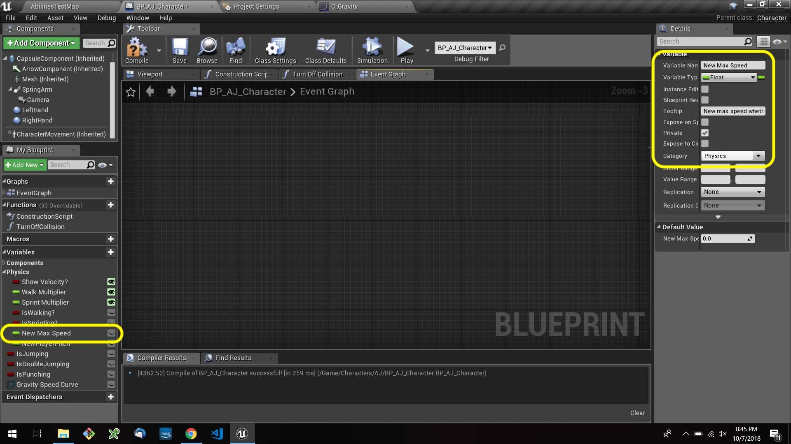

##### `Step 2.`\|`FHIU`|:small_blue_diamond: :small_blue_diamond: 

Go to the **Content Browser** directory that holds your character blueprint. *Press* the **Add New** button and select **Miscellaneous | Curve**. We are going to map the various speeds on a curve.

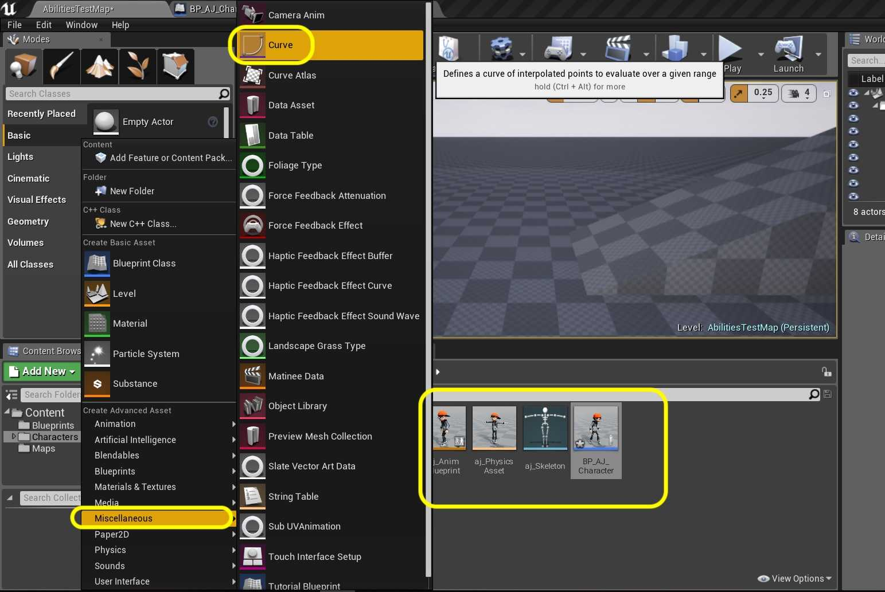

##### `Step 3.`\|`ITA`|:small_blue_diamond: :small_blue_diamond: :small_blue_diamond:

Select a `Curve Float`.

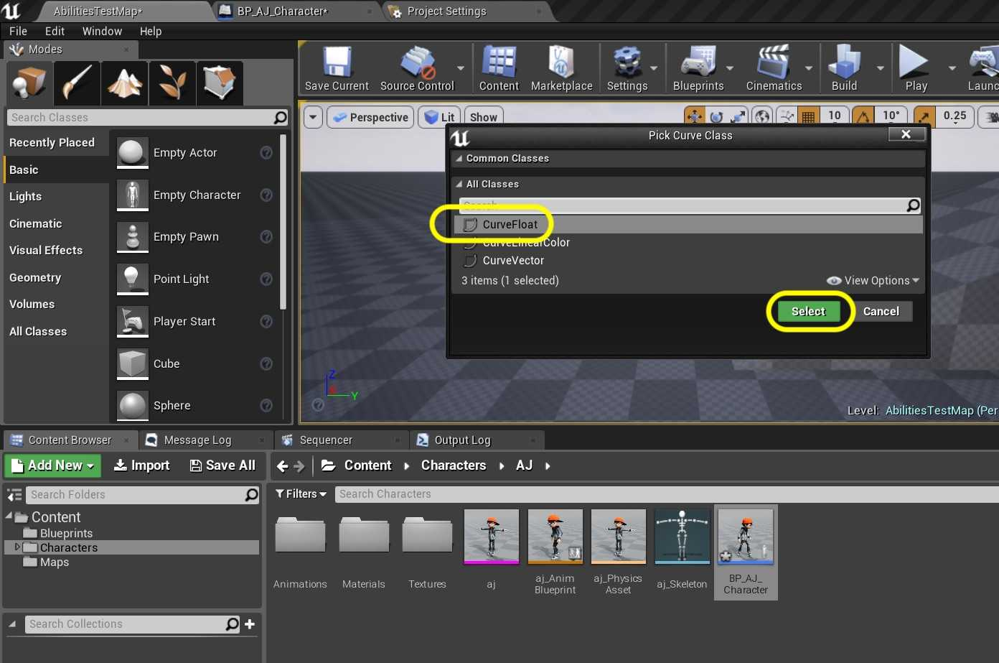

##### `Step 4.`\|`ITA`|:small_blue_diamond: :small_blue_diamond: :small_blue_diamond: :small_blue_diamond:

*Call* this curve `C_Gravity` and save it to where you character blueprint is located.

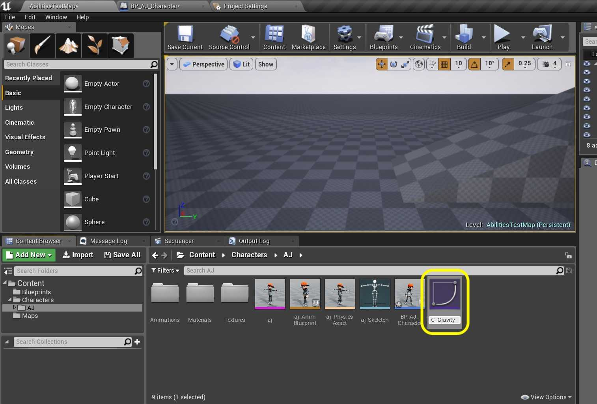

##### `Step 5.`\|`ITA`| :small_orange_diamond:

*Double click* the curve and *right click* **three** times to add **three keys**. *Select* all three keys with the cursor and press the **Auto** button so that it is a rounded curve instead of straight lines.

##### `Step 6.`\|`ITA`| :small_orange_diamond: :small_blue_diamond:

*Add* a final fourth point on the curve by *Shift Left Clicking* in the graph. Now highlight the first point and set it to **Time** of `-45.0` with a **Value** of `900.0`, set the second to a **Time** of `-10.0 `and a **Value** of `450.0`. The third point is set to a **Time** of `10.0` and a **Value** of `450.0`. The last point is set to a **Time** of `45.0` and a **Value** of `100.0`. Now we will be using the slope of the ground in degrees as the **Time** component. This means that if it is within 10 degrees of flat it will be at the same regular speed as previously of 450. If we are going downhill 45 degrees we will increase to 900. If we are going uphill on the same slope it will be a speed of 100.

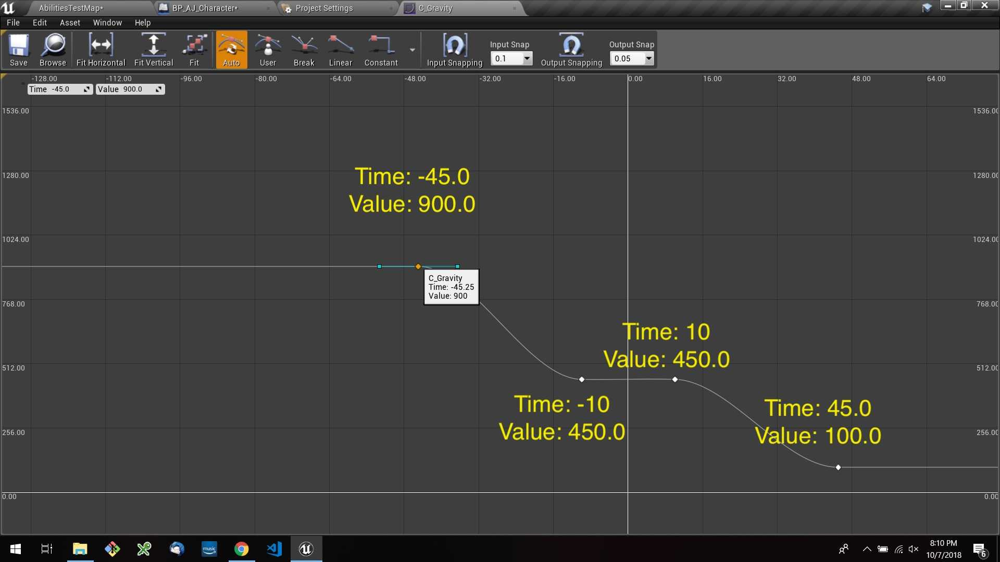

##### `Step 7.`\|`ITA`| :small_orange_diamond: :small_blue_diamond: :small_blue_diamond:

We want to access points on this curve based on the slope of the ground. Lets add a **Variable** called `Gravity Speed Curve` and set it to **Type** `Object Type | Curve Float | Object Reference`. This will give us access to this curve.

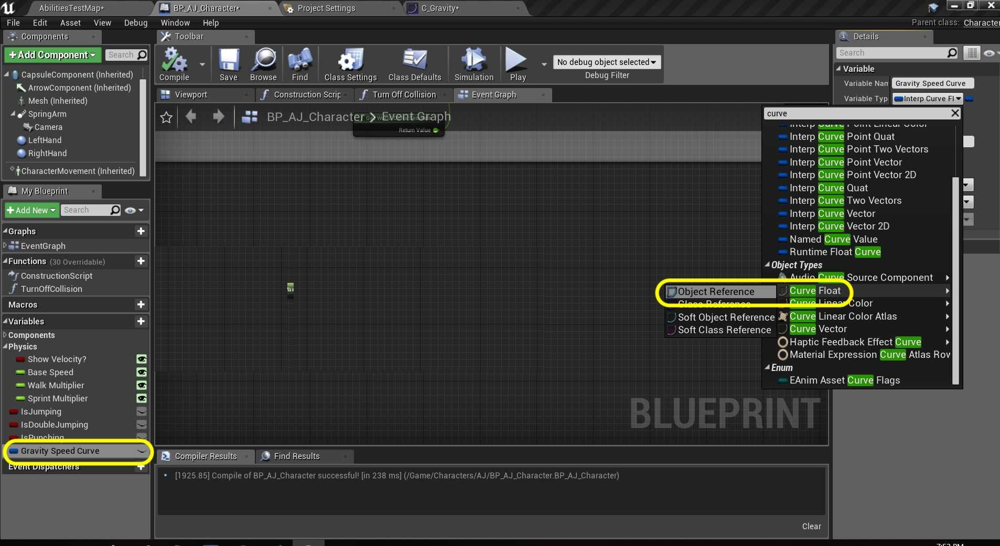

##### `Step 8.`\|`ITA`| :small_orange_diamond: :small_blue_diamond: :small_blue_diamond: :small_blue_diamond:

Set the **Category** to `Physics` and press the **Compile** button. Set the Default Value to the curve you just created `C_Gravity`.

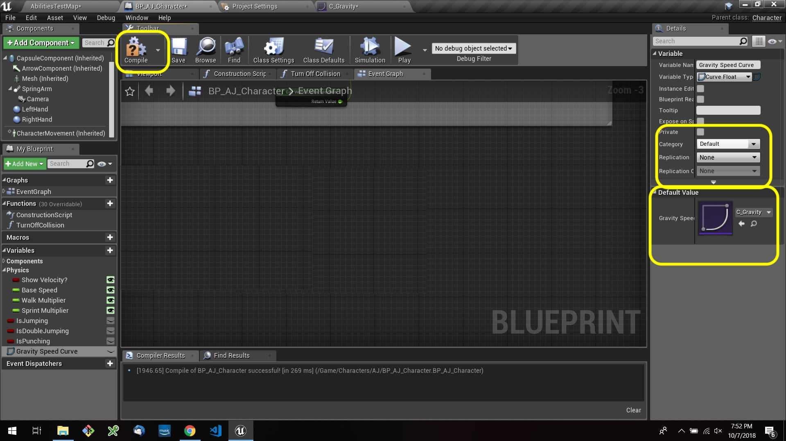

##### `Step 9.`\|`ITA`| :small_orange_diamond: :small_blue_diamond: :small_blue_diamond: :small_blue_diamond: :small_blue_diamond:

Lets get the value for when you are not spriting or walking. *Drag and drop* a copy of the **Gravity Speed Curve** and *pull off* its pin to select a **Get Float Value**. Send this to a **Set New Max Speed** node.

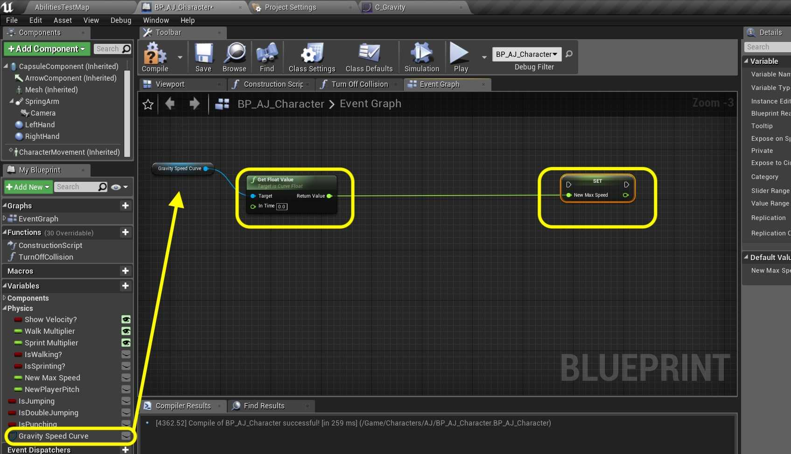

##### `Step 10.`\|`ITA`| :large_blue_diamond:

Now to select the correct point in the curve we will be using the slope of the line. *Add* a **Get New Player Pitch** node and connect it to the **In Time** pin on the **Get Float Value** node.

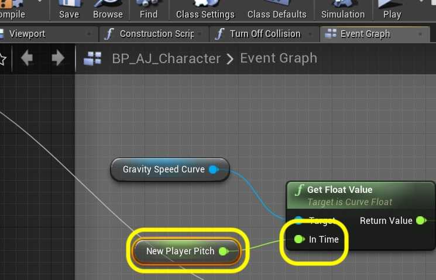

##### `Step 11.`\|`ITA`| :large_blue_diamond: :small_blue_diamond: 

Lets set the speed when walking. Add a **Get Is Walking?** node and pull the output pin and select a **Branch** node.

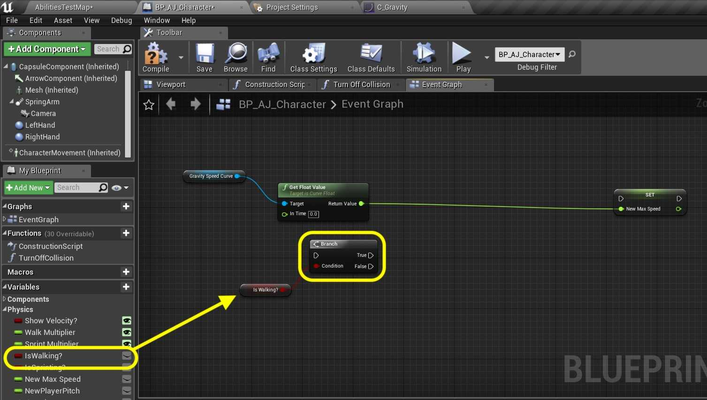

##### `Step 12.`\|`ITA`| :large_blue_diamond: :small_blue_diamond: :small_blue_diamond: 

*Pull* the **Return Value** from the ***Get Float Value*** node and add a **float * float** node. *Put* a **Get Walk Multiplier** node into the second value of this multiply.

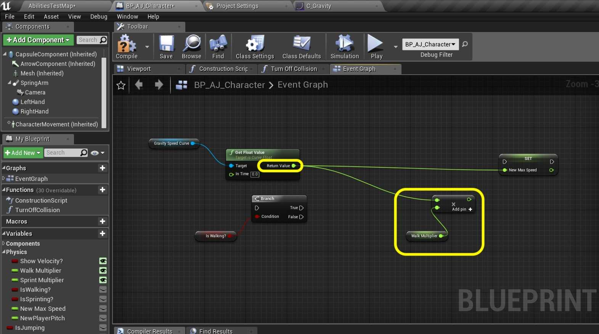

##### `Step 13.`\|`ITA`| :large_blue_diamond: :small_blue_diamond: :small_blue_diamond:  :small_blue_diamond: 

*Pull off* of the output of the **Multiply** node and add a **Set New Max Speed** node. *Connect* its execution input to the output of the **True** pin on the **Branch** node. So if walking is true, multiply the graph speed by the scalar.

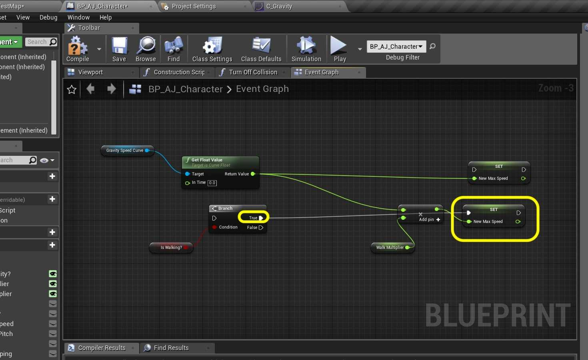

##### `Step 14.`\|`ITA`| :large_blue_diamond: :small_blue_diamond: :small_blue_diamond: :small_blue_diamond:  :small_blue_diamond: 

Beneath do the same thing for sprinting. *Add* a **bIsSprinting** node and then take the output and send it to a new **Branch** mode. *Send* the **False** execution pin from the previous **Branch** node to the input of this new one.

##### `Step 15.`\|`ITA`| :large_blue_diamond: :small_orange_diamond: 

*Drag off* of this new **Branch** node's **True** pin and *select* a **Set New Max Speed** node. Add a **float * float** node and put on the top in the output from the **Get Float Value** node and add a **Get Sprint Multiplier** node and send the output to the other side of the float **Multiply** node. *Send* the output to the **New Max Speed** pin.

##### `Step 16.`\|`ITA`| :large_blue_diamond: :small_orange_diamond:   :small_blue_diamond: 

*Add* a **Get Character Movement Component** reference to the **Event Graph**. *Pull off* its pin and select a **Get Max Walk Speed** node.

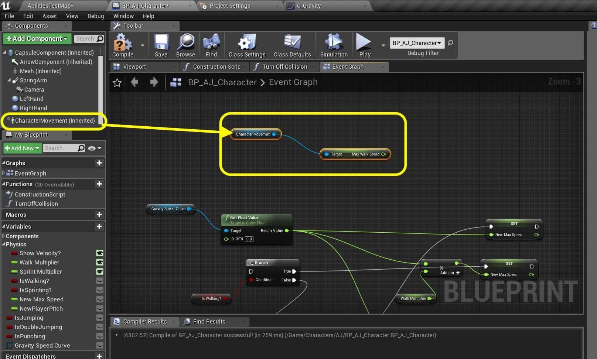

##### `Step 17.`\|`ITA`| :large_blue_diamond: :small_orange_diamond: :small_blue_diamond: :small_blue_diamond:

We will add a **FInterp To** node to the **Event Graph**. This will allow us to transition to and from new speed while on the ground.

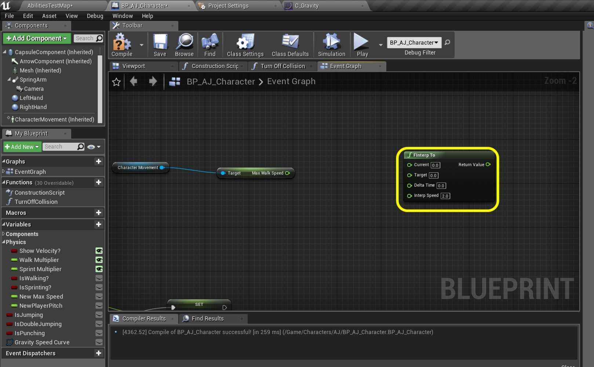

##### `Step 18.`\|`ITA`| :large_blue_diamond: :small_orange_diamond: :small_blue_diamond: :small_blue_diamond: :small_blue_diamond:

*Connect* the ouput of **Get Max Speed** node to the **Current** pin in the **FInterp To** node. *Add* a new **Get New Max Speed** node and *send* the output to the **Target** pin of the **FInterp To** node. Set the **Interp Speed** to `2.0`.

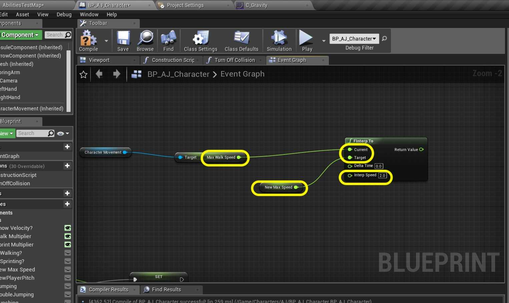

##### `Step 19.`\|`ITA`| :large_blue_diamond: :small_orange_diamond: :small_blue_diamond: :small_blue_diamond: :small_blue_diamond: :small_blue_diamond:

*Add* a **Get World Delta Seconds** node and send it to the **Delta Time** pin on the **FInterp To** node.

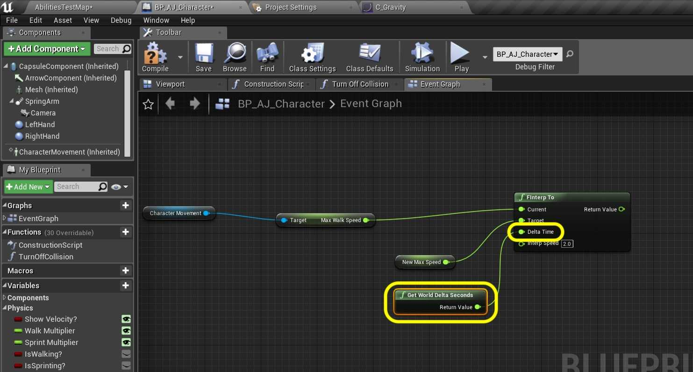

##### `Step 20.`\|`ITA`| :large_blue_diamond: :large_blue_diamond:

Set the **Interp Speed** to `2.0` on the **FInterp To** node. *Drag* from the **Character Movement** pin and select a **Set Max Walk Speed** node. *Connect* the output of the **FInterp To** node to this new Setter.

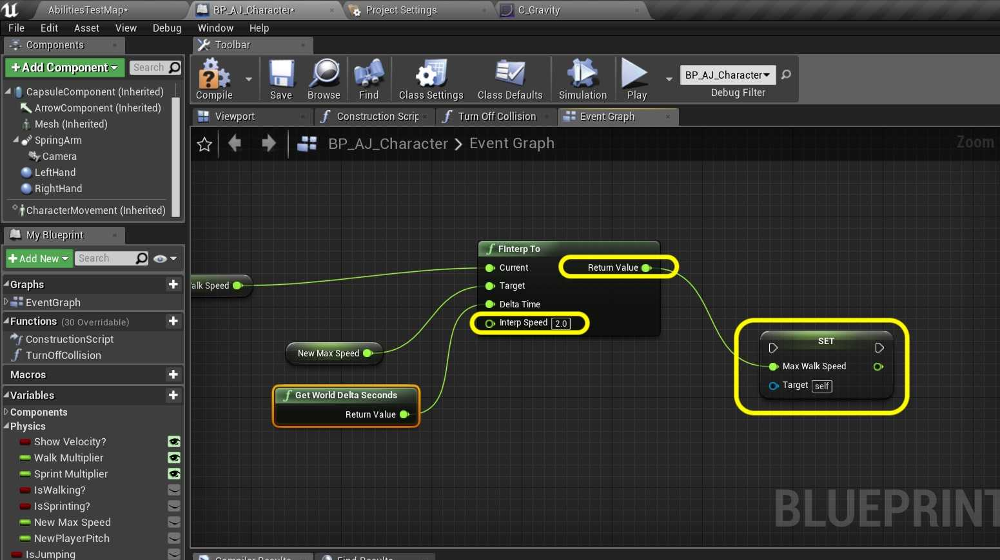

##### `Step 21.`\|`ITA`| :large_blue_diamond: :large_blue_diamond: :small_blue_diamond:

Send the output of the **Set Actor Rotation** execution pin (the last node in the **Event Tick** chain) to the input of the first **Branch** node.

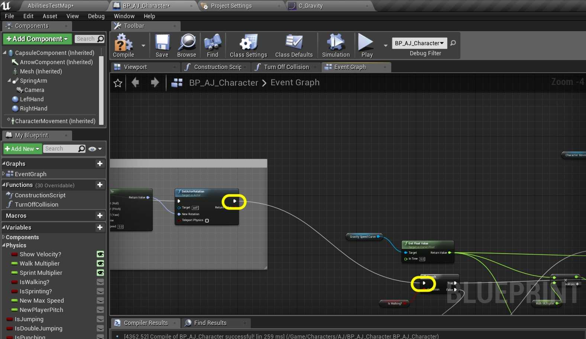

##### `Step 22.`\|`ITA`| :large_blue_diamond: :large_blue_diamond: :small_blue_diamond: :small_blue_diamond:

*Set* the output of the three **Set New Max Speed** nodes to the input execution pin of the **Set Max Walk Speed** variable.

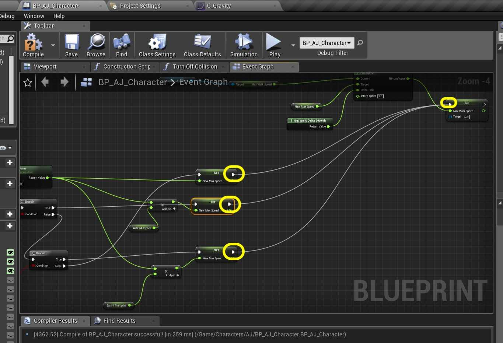

##### `Step 23.`\|`ITA`| :large_blue_diamond: :large_blue_diamond: :small_blue_diamond: :small_blue_diamond: :small_blue_diamond:

Compile this blueprint and address any errors.

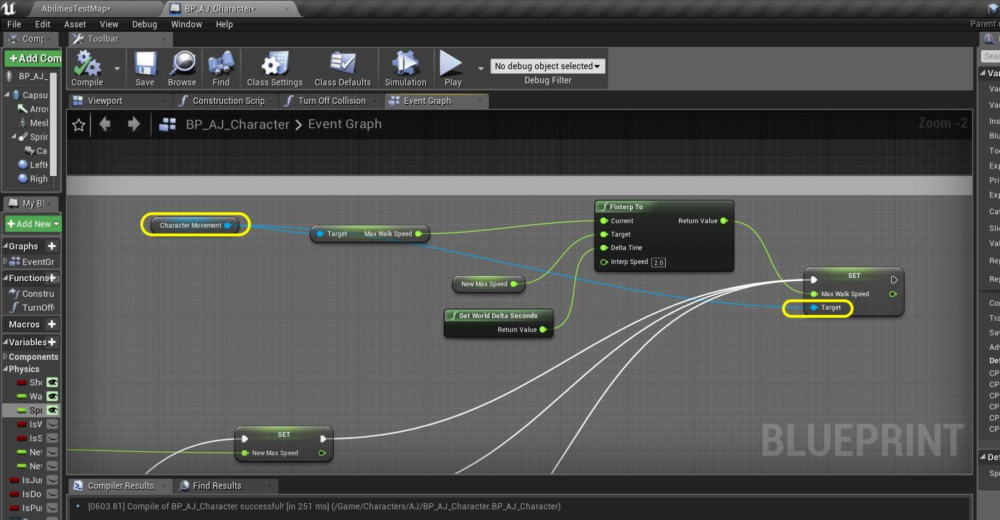

##### `Step 24.`\|`ITA`| :large_blue_diamond: :large_blue_diamond: :small_blue_diamond: :small_blue_diamond: :small_blue_diamond: :small_blue_diamond:

Add a **comment** called `Set Run Speed on Slope` for these nodes added.

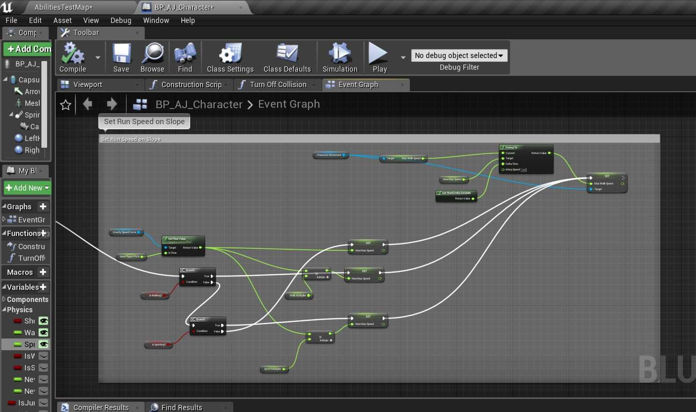

##### `Step 25.`\|`ITA`| :large_blue_diamond: :large_blue_diamond: :small_orange_diamond:

*Play* the game and you will notice that all three speeds should work and change speeds on slopes. Select the **File | Save All** then press the <kbd>Source Control</kbd> button and select **Submit to Source Control...**. Enter a **Changelist Description** and then press <kbd>Submit</kbd>. Open up **GitHub Desktop** and select **Push origin** to update the server with the latest changes.

https://user-images.githubusercontent.com/5504953/134772161-9b6fc0fb-33b9-4b18-bf18-9f106c387a86.mp4

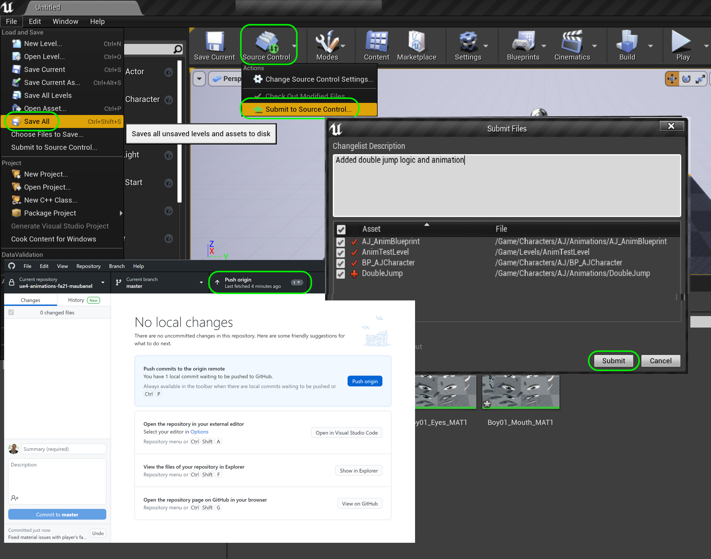

| `animation.character`\|`THE END`| 
| :--- |
| **That's All Folks!** Thanks for sticking around. That's it for this lesson. |

| [previous](../ramps-iii/README.md#user-content-speed-up--down-ramps-iii)| [home](../README.md#user-content-ue4-animations) |
|---|---|
