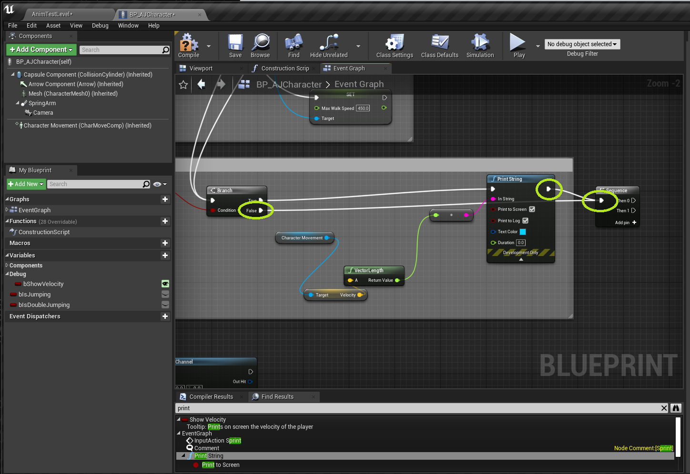

### Speed Up & Down Ramps

[previous](../double-jump-ii/README.md#user-content-double-jump-ii) • [home](../README.md#user-content-ue4-animations) • [next](../ramps-ii/README.md#user-content-speed-up--down-ramps-ii)

Lets make the player run slower when moving up a ramp and faster when moving down.  Lets also have the player lean into the motion so they are perpendicular to the ground.

 

---

##### `Step 1.`\|`ITA`|:small_blue_diamond:

Now the larger capsule we selected doesn't make much sense for running up and down ramps.  The player hangs way off the side.  So open **BP_AJ** and select the **Capsule Component** and change the **Capsule Radius** to `30`.

##### `Step 2.`\|`FHIU`|:small_blue_diamond: :small_blue_diamond: 

Adjust the size to `2000` by `400` by `600` in the **brush size**. And make sure the box is on the ground (press the <kbd>End</kbd> key).

##### `Step 3.`\|`ITA`|:small_blue_diamond: :small_blue_diamond: :small_blue_diamond:

Move player start in front of this box.

##### `Step 4.`\|`ITA`|:small_blue_diamond: :small_blue_diamond: :small_blue_diamond: :small_blue_diamond:

##### `Step 5.`\|`ITA`| :small_orange_diamond:

##### `Step 6.`\|`ITA`| :small_orange_diamond: :small_blue_diamond:

Open your player blueprint **BP_AJCharacter**. Add a variable called `bShowVelocity` that is type **Boolean**. Set **Instance Editable** and **Private** to `true`. Set the **Category** to `Debug` and the **Tooltip** to `Prints on screen the velociy of the player`.

##### `Step 7.`\|`ITA`| :small_orange_diamond: :small_blue_diamond: :small_blue_diamond:

*Drag and drop* a `Get bShowVelocity` node and *pull off* of the pin to add a **Branch** node.

##### `Step 8.`\|`ITA`| :small_orange_diamond: :small_blue_diamond: :small_blue_diamond: :small_blue_diamond:

*Pull off* of the **True** branch and select a **Print** node. We will be printing the magnitude (length) of the **Velocity** vector of our character.

##### `Step 9.`\|`ITA`| :small_orange_diamond: :small_blue_diamond: :small_blue_diamond: :small_blue_diamond: :small_blue_diamond:

*Drag and drop* a reference to the **Character Movement** Component in the player blueprint.

##### `Step 10.`\|`ITA`| :large_blue_diamond:

*Pull off* the **Character Movement** node and select the **Get Velocity** node.

##### `Step 11.`\|`ITA`| :large_blue_diamond: :small_blue_diamond: 

Now lets get the magnitude (length) of the **Vector** which will return how fast they are moving. *Pull off* of the **Velocity** exit pin and add a **Vector Length** node.

##### `Step 12.`\|`ITA`| :large_blue_diamond: :small_blue_diamond: :small_blue_diamond: 

*Take* the ouput of the **Vector Length** node and plug it into the **In String** in the **Print String** node. *Press* the triangle at the bottom to get more options. Set the **Duration** to `0.0`.

##### `Step 13.`\|`ITA`| :large_blue_diamond: :small_blue_diamond: :small_blue_diamond:  :small_blue_diamond: 

We need this to be on the **Tick** event.  *Drag* the pin from **Set Is Jumping** output execution pin and from the **True** pin of the **Branch** node before **Set Is Jumping** to the input pin on the new **Branch** node created. We only care now about the ground speed so this will suffice. Add a comment around these nodes called `Debug Velocity`.

##### `Step 14.`\|`ITA`| :large_blue_diamond: :small_blue_diamond: :small_blue_diamond: :small_blue_diamond:  :small_blue_diamond: 

Set **bShowVelocity** to `True` in the blueprint. *Press* the <kbe>Compile</kbd> button on the blueprint. Go to back to the game.

##### `Step 15.`\|`ITA`| :large_blue_diamond: :small_orange_diamond: 

*Run* the game and sprint, run and walk up and down the ramp. Now the player does not lean into the ramps not does the speed change when running on slopes.

https://user-images.githubusercontent.com/5504953/133780569-c4fb10dc-b0cf-4a81-9837-e280e65f18d2.mp4

##### `Step 16.`\|`ITA`| :large_blue_diamond: :small_orange_diamond:   :small_blue_diamond: 

So first we need to find out the slope of the ground under us. How are we going to do this? We need to cast a line from the player straight downwards to the ground. When it collides we will use that to determine the slope (pitch of the surface normal). 

*Right click* under the debug print we just made on the character blueprint then add a **Line Trace By Channel** node.

##### `Step 17.`\|`ITA`| :large_blue_diamond: :small_orange_diamond: :small_blue_diamond: :small_blue_diamond:

Make some room to the right of the debug **Print String** nodes and add a **Sequence** node to keep our graph clean.

##### `Step 18.`\|`ITA`| :large_blue_diamond: :small_orange_diamond: :small_blue_diamond: :small_blue_diamond: :small_blue_diamond:

*Attach* the execution pin between **Print String** and **Sequence** nodes and from the **Branch | False** from the branch node in front of the **Print String**.

##### `Step 19.`\|`ITA`| :large_blue_diamond: :small_orange_diamond: :small_blue_diamond: :small_blue_diamond: :small_blue_diamond: :small_blue_diamond:

Now we want to only perform this operation if the player is moving. So *grab* the output of the previous **Vector Length** node and add a **Float > Float** node.

##### `Step 20.`\|`ITA`| :large_blue_diamond: :large_blue_diamond:

Add a **Branch** node after checking in seeing if the **Velocity** is greater than **0**. Attach the output of the **Then 1** execution pin to the input of the **Branch** node.

##### `Step 21.`\|`ITA`| :large_blue_diamond: :large_blue_diamond: :small_blue_diamond:

Now we will start the line trace in the center of the character. *Right click* and select a **Get Actor Location** node. *Send* the output of this to the **Start** pin in the **Line Trace By Channel** node. *Connect* the **Then 0** pin of the **Sequence** node to the **Branch** node then select the **True** execution pin from the **Branch** node to the **Line Trace By Channel** node.

___

<!--  -->

| [previous](../double-jump-ii/README.md#user-content-double-jump-ii)| [home](../README.md#user-content-ue4-animations) | [next](../ramps-ii/README.md#user-content-speed-up--down-ramps-ii)|
|---|---|---|
