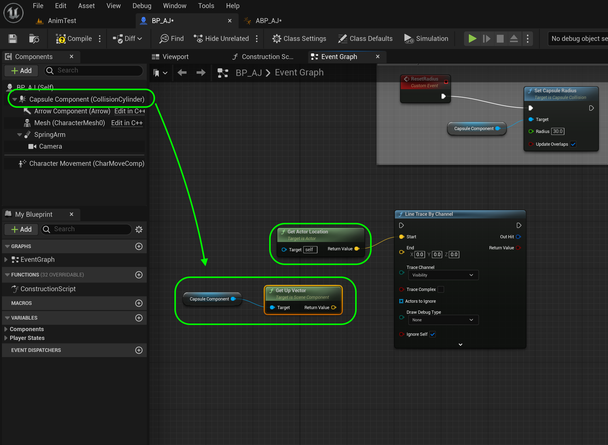
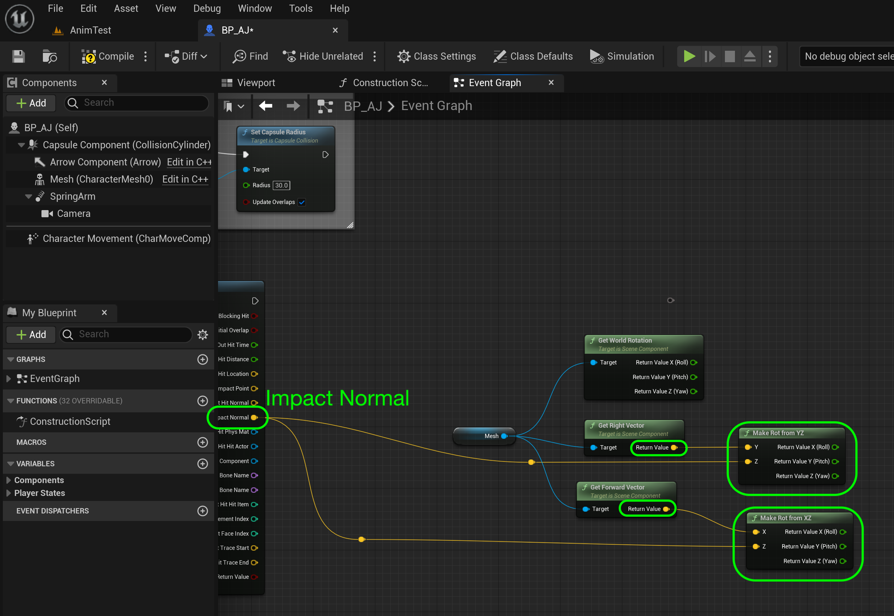
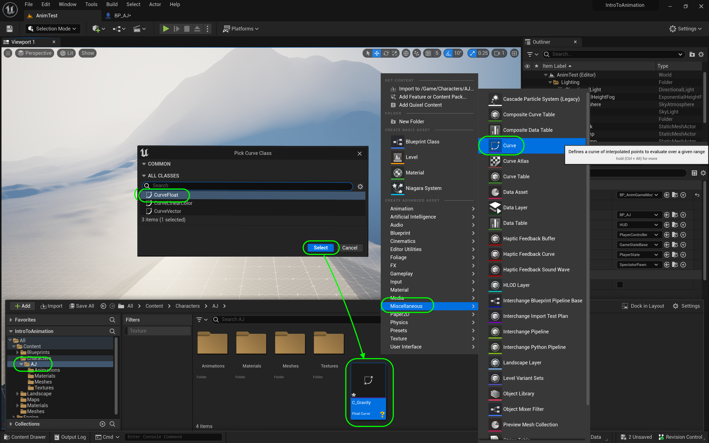
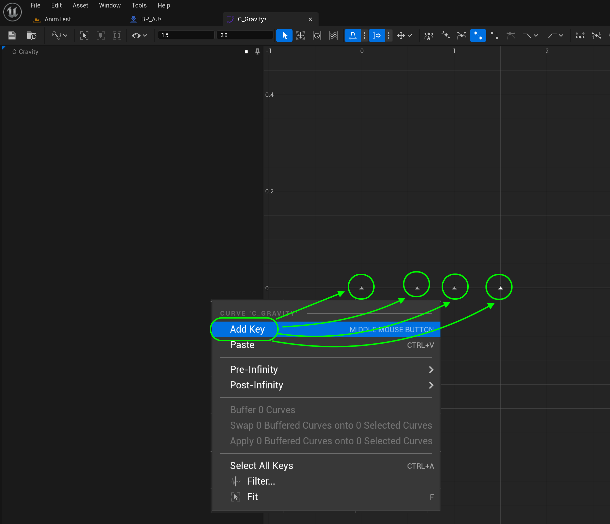

https://github.com/maubanel/UE5-Animations/assets/5504953/b794cae6-0ede-4457-9cd1-06bd132718e4

### Speed Up & Down Ramps

[previous](../double-jump/README.md#user-content-double-jump) • [home](../README.md#user-content-ue4-animations) • [next](../ramps-ii/README.md#user-content-speed-up--down-ramps-ii)

Lets make the player run slower when moving up a ramp and faster when moving down.  Lets also have the player lean into the motion so they are perpendicular to the ground.

---

##### `Step 1.`\|`ITA`|:small_blue_diamond:

Now after playing the last level the wider collision volume allows you to run on air beside the ramp. The larger capsule we selected doesn't make much sense for running up and down ramps.  The player hangs way off the side.  So open **BP_AJ** and select the **Capsule Component** and change the **Capsule Radius** to `30`. We will adjust it when we jump to accomodate the leaning animatoin.

##### `Step 2.`\|`FHIU`|:small_blue_diamond: :small_blue_diamond: 

*Drag* the **Capsule Component** to the graph after setting **Is Jumping** and pull off the pin to add a **Set Capsule Radius** to `90`.  This widens the collision volume when jumping.

##### `Step 3.`\|`ITA`|:small_blue_diamond: :small_blue_diamond: :small_blue_diamond:

We check for ground in the animation blueprint so we don't need to add that check here.  We can right click at the bottom and select a **Custom Event** node and call it `ResetRadius`. Add a reference to the **Capsule Component**. Pull the pin from the **Capsure Component** and select a `Set Capsule Radius` and take it back to `30`.  We will call this when the player is on the ground.  Add a comment box with a title of `Reset Capsule Radius`.

##### `Step 4.`\|`ITA`|:small_blue_diamond: :small_blue_diamond: :small_blue_diamond: :small_blue_diamond:

Open up **ABP_AJ** and go to where we set **bIsJumping** to false when the player is not on the ground.  Add a **bIsDoubleJumping** node just in case the prior delay did not take place yet.  Drag a reference to **Get | BP_AJ** and pull off the pin to call the **Reset Radius** custom event we just created every time we hit the ground.

##### `Step 5.`\|`ITA`| :small_orange_diamond:

*Press* the <kbd>Play</kbd> button and try running up to the wall and jumping by it.  Now we get the larger collision volume to fit the animation when the player is in air but the regular size one when on ground. You can run into the wall close buy you get pushed out when you jump matching the animation.  I am happy with it as is.

https://github.com/maubanel/UE5-Animations/assets/5504953/f6d6d729-a2b6-40de-ae3b-3202d7ed0dfb

##### `Step 6.`\|`ITA`| :small_orange_diamond: :small_blue_diamond:

So first we need to find out the slope of the ground under us. How are we going to do this? We need to cast a line from the player straight downwards to the ground. When it collides we will use that to determine the slope (pitch of the surface normal). 

*Right click* under the debug print we just made on the character blueprint then add a **Line Trace By Channel** node.

##### `Step 7.`\|`ITA`| :small_orange_diamond: :small_blue_diamond: :small_blue_diamond:

Add a **Get Actor Location** node an dconnect the **Return Value** pin to the **Start** of the line trace. Drag a **Capsule Component** onto the graph.  Then *pull off* the pin and select a **Get Up Vector** node.

##### `Step 8.`\|`ITA`| :small_orange_diamond: :small_blue_diamond: :small_blue_diamond: :small_blue_diamond:

The starting point is the middle of the capsule collider.  We need to end at the middle of the feet just at the ground. Drag the **Get Up Vector | Return Value** and multiply it by `-105` (15 cm longer than the half height of my character). This is just enough to reach the ground at odd angles but miss when I am jumping. In **Draw Debug Type** select `For One Frame` as we want to visualize the ray cast to ensure our math is correct. 

##### `Step 9.`\|`ITA`| :small_orange_diamond: :small_blue_diamond: :small_blue_diamond: :small_blue_diamond: :small_blue_diamond:

Now -105 from the up vector will go down 105 cm so we need to add it to the existing position.  *Right click* and put an **Add** node to the chart.  Plug the output of the **X** multiply node and the output of the **Get Actor Location**. Send teh sum to the **Line Trace By Channel | End** node.  Add a **Event Tick** to the chart and feed the execution pin into the **Line Trace by Channel**.

##### `Step 10.`\|`ITA`| :large_blue_diamond:

**Compile** the blueprint and *press* the <kbd>Play</kbd> button.  Now you should see a square target at the buttom of the ray, which means it is reaching and touching the ground.  Make sure you run up and down the slope and make sure it is working on all surfaces. Notice that when the raycast hits the ground there is a square taget on the ground.  We want it to not hit when jumping.  I am pretty happy with it as it is.

https://github.com/maubanel/UE5-Animations/assets/5504953/14dcc80b-11c6-402d-a634-8581155d3e14

##### `Step 11.`\|`ITA`| :large_blue_diamond: :small_blue_diamond: 

Add the **Mesh** component to the right of the **Line Trace by Channel** and pull off the pin to add a **Get World Rotation**, **Get Right Vector** and **Get Forward Vector** node. Split the output pins by right clicking and splitting the struct on the **Return Value** of the **Get World Rotation**.

##### `Step 12.`\|`ITA`| :large_blue_diamond: :small_blue_diamond: :small_blue_diamond: 

*Right click* on **Line Trace by Channel | Out Hit** and select **Split Struct**. *Pull off* of the **Get Right Vector | Return Value** pin and *add* a **Make Rot From YZ** node.  Connect the output of the **Get Right Vector** node to the **Make Rot From YZ | Y** pin. Send the **Out Hit Impact Normal** to the **Make Rot From YZ | Z** pin. *Add* a **Make Rot From XZ** node.  Connect the output of the **Get Forward Vector** node to the **Make Rot From XZ | X** pin and the **Out Hit Impact Normal** to the **Make Rot From XZ | Z** pin. 

##### `Step 13.`\|`ITA`| :large_blue_diamond: :small_blue_diamond: :small_blue_diamond:  :small_blue_diamond: 

Add a **Make Rotator** node.  Pull off the **Get World Rotation | Return Value Z(Yaw)** to the **Make Rotator | Z** node. Split the pins on **Make Rot from YZ** and send the **Y** to the **Make Rotator | Y** input.  Split the pins on the **Make Rot from XZ** and send the **X** to the **Make Rotator | X** pin.

##### `Step 14.`\|`ITA`| :large_blue_diamond: :small_blue_diamond: :small_blue_diamond: :small_blue_diamond:  :small_blue_diamond: 

This will give us the angle that the player should be standing at.  We will not just jump to it but instead LERP to it so we will take the **Return Value** and create a **RInterp To** node.  Plug the **Make Rotator | Return Value** in to the **RInterp To | Target** pin. Set the **Interp Speed** to `5.0`.  Add a **Get World Delta Seconds** pin and fee it into **Delta Time**.

##### `Step 15.`\|`ITA`| :large_blue_diamond: :small_orange_diamond: 

Now back at the **Line Trace by Channel** node we pull off of the execution pin and add a **Branch** node.  We connect the **Initial Overlap** node to the **Branch | Condition** pin.  We then send the execution pin from the **Branch** to the **Set World Rotation** node.

##### `Step 16.`\|`ITA`| :large_blue_diamond: :small_orange_diamond:   :small_blue_diamond: 

*Add* a **Mesh** component node and pull off of the pin and select a **Get World Rotation**. Plug this into the **Current** pin of the **RInterp To** node. Also, send the **Mesh** pin to the **set World Rotation | Target** node.

##### `Step 17.`\|`ITA`| :large_blue_diamond: :small_orange_diamond: :small_blue_diamond: :small_blue_diamond:

Add a comment around all the nodes that titles ``.

##### `Step 18.`\|`ITA`| :large_blue_diamond: :small_orange_diamond: :small_blue_diamond: :small_blue_diamond: :small_blue_diamond:

*Press* the <kbd>Play</kbd> button.  Now the player is orthoganal to the pitch of the curve and it looks a litle more natural (and pretty cool, if I might say so myself).  Now the player runs at the exact same speed when going up and down the slope.  Lets fix that and have him speed up going down and slow down going up.

https://github.com/maubanel/UE5-Animations/assets/5504953/226e7329-8ec4-429f-a626-a6b40a6f10dc

##### `Step 19.`\|`ITA`| :large_blue_diamond: :small_orange_diamond: :small_blue_diamond: :small_blue_diamond: :small_blue_diamond: :small_blue_diamond:

Select the **AJ** folder and right click and select a **Miscellatneous | Curve** data object.  Click on **Curve Float**.  Call it `C_Gravity`. This is where we will store a curve that has different speeds based on the angle of the ground.

##### `Step 20.`\|`ITA`| :large_blue_diamond: :large_blue_diamond:

*Right click* and add 4 keys to the graph.

##### `Step 21.`\|`ITA`| :large_blue_diamond: :large_blue_diamond: :small_blue_diamond:

Now the player can only run up a floor angle that is 45° or less.  A `-45°` is going down a slope and positive `45°` is going up a slope.  So we need a higher max run speed for the going up and a sloer one for going down. So set the first key to **Time** to `-45` (representing degrees) to a **Value** OF `900.0`.  This means when running downhill the player will go at a speed of `900` (a lot faster than the current run speed).  We will not change speeds on small angle differences.  So we will set both a **Time** of `-10` and `10` to `450`. This is the regular run speed so the angle will have to be greater than 10 degrees to make a difference.  Then the final value will be a steep hill so a **Time** set to `45` will have a **Value** of `100` a very slow run speed. To see the entire graph press the **Curve** button and select **Normalized View Mode**.

<!--  -->

| [previous](../double-jump/README.md#user-content-double-jump)| [home](../README.md#user-content-ue4-animations) | [next](../ramps-ii/README.md#user-content-speed-up--down-ramps-ii)|
|---|---|---|
