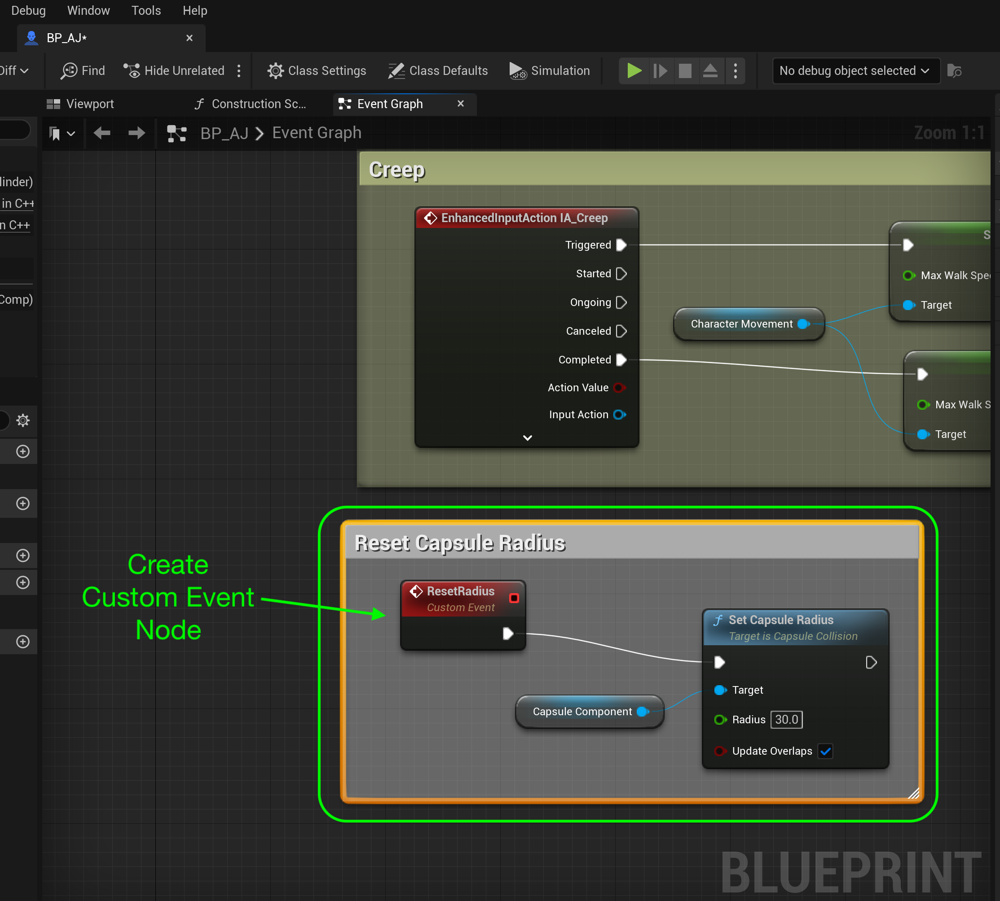

### Speed Up & Down Ramps

[previous](../double-jump-ii/README.md#user-content-double-jump-ii) • [home](../README.md#user-content-ue4-animations) • [next](../ramps-ii/README.md#user-content-speed-up--down-ramps-ii)

Lets make the player run slower when moving up a ramp and faster when moving down.  Lets also have the player lean into the motion so they are perpendicular to the ground.

 

---

##### `Step 1.`\|`ITA`|:small_blue_diamond:

Now the larger capsule we selected doesn't make much sense for running up and down ramps.  The player hangs way off the side.  So open **BP_AJ** and select the **Capsule Component** and change the **Capsule Radius** to `30`.

##### `Step 2.`\|`FHIU`|:small_blue_diamond: :small_blue_diamond: 

*Drag* the **Capsule Component** to the graph after setting **Is Jumping** and pull off the pin to add a **Set Capsule Radius** to `90`.  This widens the collision volume when jumping.

##### `Step 3.`\|`ITA`|:small_blue_diamond: :small_blue_diamond: :small_blue_diamond:

Repeat the process and bring the **Set Capsule Radius** back to `30` when on ground.

##### `Step 4.`\|`ITA`|:small_blue_diamond: :small_blue_diamond: :small_blue_diamond: :small_blue_diamond:

*Press* the <kbd>Play</kbd> button and try running up to the wall and jumping by it.  Now we get the larger collision volume to fit the animation when the player is in air but the regular size one when on ground.

https://user-images.githubusercontent.com/5504953/197369481-2831deb9-184b-481b-9d52-8a21910d873a.mp4

##### `Step 5.`\|`ITA`| :small_orange_diamond:

So first we need to find out the slope of the ground under us. How are we going to do this? We need to cast a line from the player straight downwards to the ground. When it collides we will use that to determine the slope (pitch of the surface normal). 

*Right click* under the debug print we just made on the character blueprint then add a **Line Trace By Channel** node.

##### `Step 6.`\|`ITA`| :small_orange_diamond: :small_blue_diamond:

##### `Step 7.`\|`ITA`| :small_orange_diamond: :small_blue_diamond: :small_blue_diamond:

##### `Step 8.`\|`ITA`| :small_orange_diamond: :small_blue_diamond: :small_blue_diamond: :small_blue_diamond:

##### `Step 9.`\|`ITA`| :small_orange_diamond: :small_blue_diamond: :small_blue_diamond: :small_blue_diamond: :small_blue_diamond:

##### `Step 10.`\|`ITA`| :large_blue_diamond:

##### `Step 11.`\|`ITA`| :large_blue_diamond: :small_blue_diamond: 

##### `Step 12.`\|`ITA`| :large_blue_diamond: :small_blue_diamond: :small_blue_diamond: 

##### `Step 13.`\|`ITA`| :large_blue_diamond: :small_blue_diamond: :small_blue_diamond:  :small_blue_diamond: 

##### `Step 14.`\|`ITA`| :large_blue_diamond: :small_blue_diamond: :small_blue_diamond: :small_blue_diamond:  :small_blue_diamond: 

##### `Step 15.`\|`ITA`| :large_blue_diamond: :small_orange_diamond: 

##### `Step 16.`\|`ITA`| :large_blue_diamond: :small_orange_diamond:   :small_blue_diamond: 

##### `Step 17.`\|`ITA`| :large_blue_diamond: :small_orange_diamond: :small_blue_diamond: :small_blue_diamond:

Make some room to the right of the debug **Print String** nodes and add a **Sequence** node to keep our graph clean.

##### `Step 18.`\|`ITA`| :large_blue_diamond: :small_orange_diamond: :small_blue_diamond: :small_blue_diamond: :small_blue_diamond:

*Attach* the execution pin between **Print String** and **Sequence** nodes and from the **Branch | False** from the branch node in front of the **Print String**.

##### `Step 19.`\|`ITA`| :large_blue_diamond: :small_orange_diamond: :small_blue_diamond: :small_blue_diamond: :small_blue_diamond: :small_blue_diamond:

Now we want to only perform this operation if the player is moving. So *grab* the output of the previous **Vector Length** node and add a **Float > Float** node.

##### `Step 20.`\|`ITA`| :large_blue_diamond: :large_blue_diamond:

Add a **Branch** node after checking in seeing if the **Velocity** is greater than **0**. Attach the output of the **Then 1** execution pin to the input of the **Branch** node.

##### `Step 21.`\|`ITA`| :large_blue_diamond: :large_blue_diamond: :small_blue_diamond:

Now we will start the line trace in the center of the character. *Right click* and select a **Get Actor Location** node. *Send* the output of this to the **Start** pin in the **Line Trace By Channel** node. *Connect* the **Then 0** pin of the **Sequence** node to the **Branch** node then select the **True** execution pin from the **Branch** node to the **Line Trace By Channel** node.

___

<!--  -->

| [previous](../double-jump-ii/README.md#user-content-double-jump-ii)| [home](../README.md#user-content-ue4-animations) | [next](../ramps-ii/README.md#user-content-speed-up--down-ramps-ii)|
|---|---|---|
