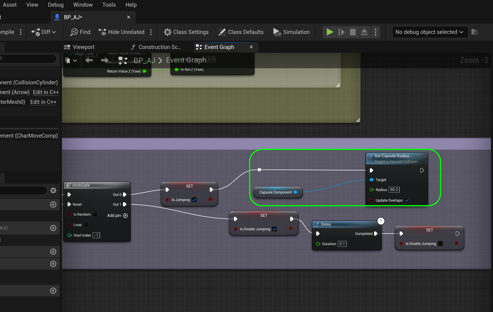
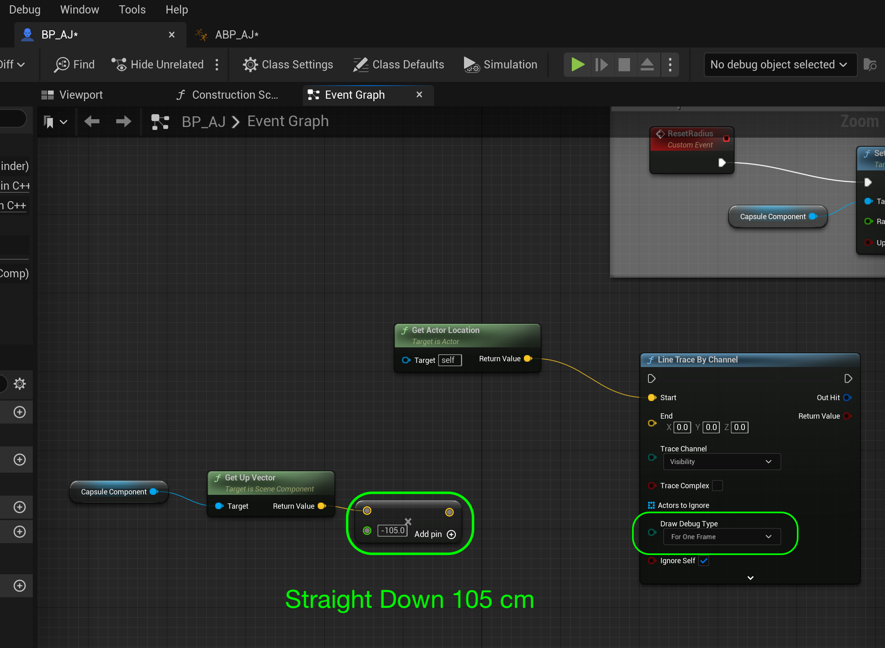
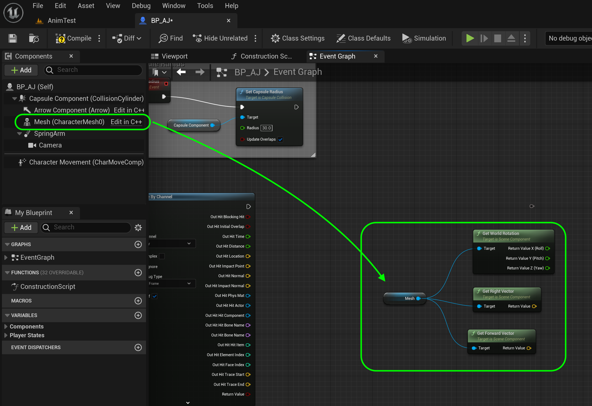
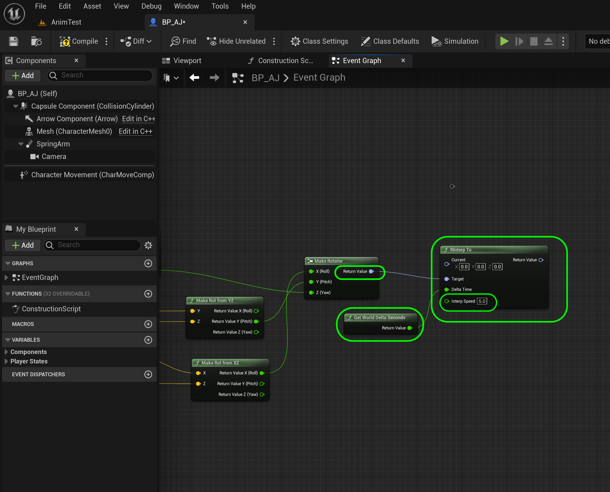

### Speed Up & Down Ramps

[previous](../double-jump-ii/README.md#user-content-double-jump-ii) • [home](../README.md#user-content-ue4-animations) • [next](../ramps-ii/README.md#user-content-speed-up--down-ramps-ii)

Lets make the player run slower when moving up a ramp and faster when moving down.  Lets also have the player lean into the motion so they are perpendicular to the ground.

 

---

##### `Step 1.`\|`ITA`|:small_blue_diamond:

Now the larger capsule we selected doesn't make much sense for running up and down ramps.  The player hangs way off the side.  So open **BP_AJ** and select the **Capsule Component** and change the **Capsule Radius** to `30`.

##### `Step 2.`\|`FHIU`|:small_blue_diamond: :small_blue_diamond: 

*Drag* the **Capsule Component** to the graph after setting **Is Jumping** and pull off the pin to add a **Set Capsule Radius** to `90`.  This widens the collision volume when jumping.

##### `Step 3.`\|`ITA`|:small_blue_diamond: :small_blue_diamond: :small_blue_diamond:

Repeat the process and bring the **Set Capsule Radius** back to `30` when on ground.

##### `Step 4.`\|`ITA`|:small_blue_diamond: :small_blue_diamond: :small_blue_diamond: :small_blue_diamond:

*Press* the <kbd>Play</kbd> button and try running up to the wall and jumping by it.  Now we get the larger collision volume to fit the animation when the player is in air but the regular size one when on ground.

https://user-images.githubusercontent.com/5504953/197369481-2831deb9-184b-481b-9d52-8a21910d873a.mp4

##### `Step 5.`\|`ITA`| :small_orange_diamond:

So first we need to find out the slope of the ground under us. How are we going to do this? We need to cast a line from the player straight downwards to the ground. When it collides we will use that to determine the slope (pitch of the surface normal). 

*Right click* under the debug print we just made on the character blueprint then add a **Line Trace By Channel** node.

##### `Step 6.`\|`ITA`| :small_orange_diamond: :small_blue_diamond:

Connect the second **Set Capsure Radius** (the one that is set to 30 when we are on the ground) to the **Line Trace by Channel**.  Add a **Get Actor Location** node an dconnect the **Return Value** pin to the **Start** of the line trace.

##### `Step 7.`\|`ITA`| :small_orange_diamond: :small_blue_diamond: :small_blue_diamond:

Drag a **Capsule Component** onto the graph.  Then *pull off* the pin and select a **Get Up Vector** node.

##### `Step 8.`\|`ITA`| :small_orange_diamond: :small_blue_diamond: :small_blue_diamond: :small_blue_diamond:

Drag the **Get Up Vector | Return Value** and multiply it by `-105`.  When you add the multiply node you need to right click the bottom pin and select **Convert Pin | Float(single precision)** to change it to a float.  Set it to `-105` so that is goes 105 cm under the player's center of their collision volume. In **Draw Debug Type** select `For One Frame`.

##### `Step 9.`\|`ITA`| :small_orange_diamond: :small_blue_diamond: :small_blue_diamond: :small_blue_diamond: :small_blue_diamond:

**Compile** the blueprint and *press* the <kbd>Play</kbd> button.  Now you should see a square target at the buttom of the ray, which means it is reaching and touching the ground.  Make sure you run up and down the slopd and make sure it is working on all surfaces.

https://user-images.githubusercontent.com/5504953/197370228-76cb2a44-03f4-4b15-88a1-bdb8b2140e18.mp4

##### `Step 10.`\|`ITA`| :large_blue_diamond:

Add a comment on the line trace about rotating the players to match the pitch of the ground.

##### `Step 11.`\|`ITA`| :large_blue_diamond: :small_blue_diamond: 

Add the **Capsule Component** to the right of the **Line Trace by Channel** and pull off the pin to add a **Get World Rotation**, **Get Right Vector** and **Get Forward Vector** node.

##### `Step 12.`\|`ITA`| :large_blue_diamond: :small_blue_diamond: :small_blue_diamond: 

Split the output pins by right clicking and splitting the struct on the **Get World Rotation**.  Add a **Make Rotator** node.  Pull off the **Get World Rotation | Return Value Z(Yaw)** to the **Make Rotator | Z** node.

##### `Step 13.`\|`ITA`| :large_blue_diamond: :small_blue_diamond: :small_blue_diamond:  :small_blue_diamond: 

*Add* a **Make Rot From YZ** node.  Connect the output of the **Get Right Vector** node to the **Make Rot From YZ | Y** pin and the **Out Hit Impact Normal** to the **Make Rot From YZ | Z** pin. Send the output to the the **Make Rotator | Y (Pitch)** pin.

##### `Step 14.`\|`ITA`| :large_blue_diamond: :small_blue_diamond: :small_blue_diamond: :small_blue_diamond:  :small_blue_diamond: 

*Add* a **Make Rot From XZ** node.  Connect the output of the **Get Forward Vector** node to the **Make Rot From XZ | X** pin and the **Out Hit Impact Normal** to the **Make Rot From XZ | Z** pin. Send the output to the the **Make Rotator | X (Roll)** pin.

##### `Step 15.`\|`ITA`| :large_blue_diamond: :small_orange_diamond: 

This will give us the angle that the player should be standing at.  We will not just jump to it but instead LERP to it so we will take the **Return Value** and create a **RInterp To** node.  Plug the reutrn value in to the **Target** pin.

##### `Step 16.`\|`ITA`| :large_blue_diamond: :small_orange_diamond:   :small_blue_diamond: 

*Add* a **Capsule Component** node and pull off of the pin and select a **Get World Rotation**. Plug this into the **Current** pin of the **RInterp To** node.

##### `Step 17.`\|`ITA`| :large_blue_diamond: :small_orange_diamond: :small_blue_diamond: :small_blue_diamond:

Add a **Get World Delta Seconds** node and plug it into the **RInterp To | Delta Time** pin.  Set the **Interp Speed** to `3.0`.

##### `Step 18.`\|`ITA`| :large_blue_diamond: :small_orange_diamond: :small_blue_diamond: :small_blue_diamond: :small_blue_diamond:

OK, now lets actually set the angle of the player.  Pull from the **Capsule Component** and add a **Set World Rotation** node.  Connect the **Execution Pin** to the **Line Trace By Channel** node.

##### `Step 19.`\|`ITA`| :large_blue_diamond: :small_orange_diamond: :small_blue_diamond: :small_blue_diamond: :small_blue_diamond: :small_blue_diamond:

*Press* the <kbd>Play</kbd> button.  Now the player is orthoganal to the pitch of the curve and it looks a litle more natural.  Now the player runs at the exact same speed when going up and down the slope.  Lets fix that.

https://user-images.githubusercontent.com/5504953/197370872-07ef41f8-63cc-4da3-b664-7f790dd78e20.mp4

##### `Step 20.`\|`ITA`| :large_blue_diamond: :large_blue_diamond:

Select the **AJ** folder and right click and select a **Miscellatneous | Curve** data object.  Click on **Curve Float**.  Call it `C_Gravity`. This is where we will store a curve that has different speeds based on the angle of the ground.

##### `Step 21.`\|`ITA`| :large_blue_diamond: :large_blue_diamond: :small_blue_diamond:

*Right click* and add 4 keys to the graph.

##### `Step 22.`\|`ITA`| :large_blue_diamond: :large_blue_diamond: :small_blue_diamond: :small_blue_diamond:

Now the player can only run up a floor angle that is 45° or less.  A `-45°` is going down a slope and positive `45°` is going up a slope.  So we need a higher max run speed for the going up and a sloer one for going down. So set the first key to **Time** to `-45` (representing degrees) to a **Value** OF `900.0`.  This means when running downhill the player will go at a speed of `900` (a lot faster than the current run speed).  We will not change speeds on small angle differences.  So we will set both a **Time** of `-10` and `10` to `450`. This is the regular run speed so the angle will have to be greater than 10 degrees to make a difference.  Then the final value will be a steep hill so a **Time** set to `45` will have a **Value** of `100` a very slow run speed. To see the entire graph press the **Curve** button and select **Normalized View Mode**.

___

<!--  -->

| [previous](../double-jump-ii/README.md#user-content-double-jump-ii)| [home](../README.md#user-content-ue4-animations) | [next](../ramps-ii/README.md#user-content-speed-up--down-ramps-ii)|
|---|---|---|
