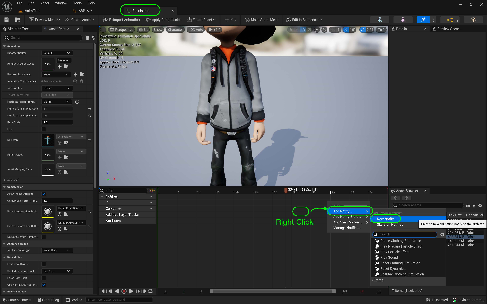

### Time Out for Second Idle II

[previous](../second-idle/README.md#user-content-time-out-for-second-idle) • [home](../README.md#user-content-ue4-animations) • [next](../falling/README.md#user-content-falling-animation)

Second idle continued...

 

---

##### `Step 1.`\|`ITA`|:small_blue_diamond:

Now we are looking for the opposite so we want the **Does Idle Time Out?** to be false. So we pull off the pin and select a **NOT** (Math | NOT Boolean) node which looks to see if it is the opposite of **True** (false).

##### `Step 2.`\|`FHIU`|:small_blue_diamond: :small_blue_diamond: 

*Connect* the output of the **NOT** node to the **Can Enter Transition** pin in the **Result** node.

##### `Step 3.`\|`ITA`|:small_blue_diamond: :small_blue_diamond: :small_blue_diamond:

Go back to the **Basic Locomotion** state tab. Now we have dealt with the transitions but not the actual animation in this new state. *Double click* the **Alternate Idle** node.

##### `Step 4.`\|`ITA`|:small_blue_diamond: :small_blue_diamond: :small_blue_diamond: :small_blue_diamond:

Drag a reference to **SpecialIdle** to the open graph.

##### `Step 5.`\|`ITA`| :small_orange_diamond:

**Connect** the animation pins and then *press* the <kbd>Compile</kbd> button. That should do it for the animation blueprint. Press the <kbd>Compile</kbd> button.

##### `Step 6.`\|`ITA`| :small_orange_diamond: :small_blue_diamond:

Now go into the game. After 5 seconds the player should go to the alternate idle. But he/she never leaves this state. We now want to reset the Does Idle Time Out? variable back to false. 

https://user-images.githubusercontent.com/5504953/197163799-a4aaf480-2701-4d54-ab6d-6fd9d0187dd8.mp4

##### `Step 7.`\|`ITA`| :small_orange_diamond: :small_blue_diamond: :small_blue_diamond:

We need to do this at the end of the alternate animation. We can this using **Notifies**. Open **SpecialIdle** animation.

##### `Step 8.`\|`ITA`| :small_orange_diamond: :small_blue_diamond: :small_blue_diamond: :small_blue_diamond:

Right click on the **Notifies** timeline near the end (on the 1 row) and select **Add Notify | New Notify**.

##### `Step 9.`\|`ITA`| :small_orange_diamond: :small_blue_diamond: :small_blue_diamond: :small_blue_diamond: :small_blue_diamond:

A box will pop up asking you to enter the **Notify** Name. *Enter* `EndAnim` and press the <kbd>Enter</kbd> key.

##### `Step 10.`\|`ITA`| :large_blue_diamond:

Adjust the position after the core movement ends but with room to blend it back to the core idle. I set it at the 80th frame.

##### `Step 11.`\|`ITA`| :large_blue_diamond: :small_blue_diamond: 

Go back to the **AJ_AnimBlueprint | Event Graph** and lets add some logic for when this notify event triggers. *Right clic*k on the open graph and select a **Event AnimNotify_EndAnim** node. It should be red with an execution pin.

##### `Step 12.`\|`ITA`| :large_blue_diamond: :small_blue_diamond: :small_blue_diamond: 

Pull off of the **EndAnim** pin and select a **Set Idle Time Out?** node and set it to `false`. *Pull off* this execution pin and select **Set Idle Timer** and set it to `0.0`.

##### `Step 13.`\|`ITA`| :large_blue_diamond: :small_blue_diamond: :small_blue_diamond:  :small_blue_diamond: 

Now add a **comment** around these nodes that says `Reset Idle Timer`. *Press* the <kbe>Compile</kbd> button.

We have done enough to test our work. Play the game and move the character then let go of the controls. Let the character idle and see if the idle animation plays. Then make sure it goes back to the normal idle. After playing around there is a clear issue with trying to move while in the alternate idle. It is not switching back to our normal blend IdleWalkRun animation when branching from this state.

https://user-images.githubusercontent.com/5504953/132986162-d782c87f-f7fe-4d03-b94b-6197fbd6dd4a.mp4

Now go back to the **aj_AnimBlueprint** to its **Event Graph** tab. Look to see the **Branch** node where we check to see if the **Vector Length** is close to `0.0.` We do not set the **Does Idle Time Out** node back to false. **Add** a **Set Does Idle Time Out?** node to the right of the **Set Idle Timer** node.

##### `Step 14.`\|`ITA`| :large_blue_diamond: :small_blue_diamond: :small_blue_diamond: :small_blue_diamond:  :small_blue_diamond: 

*Connect* the execution pin from **Set Idle Timer** to **Set Does Idle Time Out?** node.

##### `Step 15.`\|`ITA`| :large_blue_diamond: :small_orange_diamond: 

*Play* the game and transition from the alternate idle. It now snaps back to the regular IdleWalkRun blend sequence. This works great. I don't like the snap back to the idle though and it is rough and jerky. We need to add a bit of a blend here.

https://user-images.githubusercontent.com/5504953/132986290-d633e829-b132-4fec-8d5a-01e9423504ea.mp4

##### `Step 16.`\|`ITA`| :large_blue_diamond: :small_orange_diamond:   :small_blue_diamond: 

Open the **IdleWalkRun_BlendSpace** file and go to the **Asset Details** panel to the **Sample Interpolation | Target Weight Interpolation** setting and *adjust* it to `6.0` (you can play with values between 5 and 10 to see what you like). Now it should be much smoother.  Select the **File | Save All** then press the <kbd>Source Control</kbd> button and select **Submit to Source Control...**.  Enter a **Changelist Description** and then press <kbd>Submit</kbd>.  Open up **GitHub Desktop** and select **Push origin** to update the server with the latest changes.

https://user-images.githubusercontent.com/5504953/132986417-fca35ab4-1b28-4bdb-a7e3-5aa31388fd46.mp4

___

<!--  -->

| [previous](../second-idle/README.md#user-content-time-out-for-second-idle)| [home](../README.md#user-content-ue4-animations) | [next](../falling/README.md#user-content-falling-animation)|
|---|---|---|
