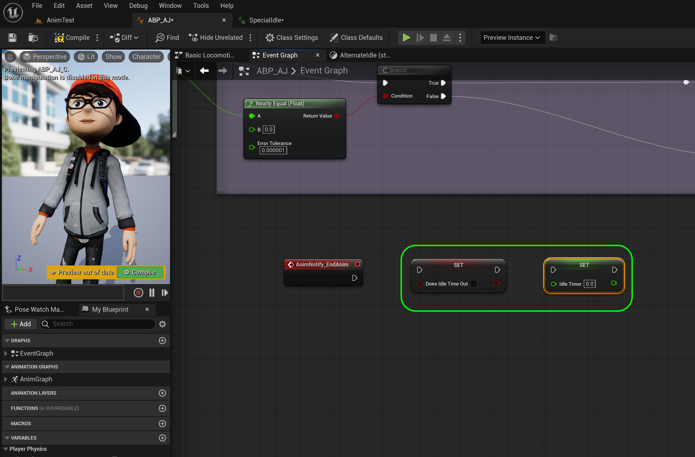
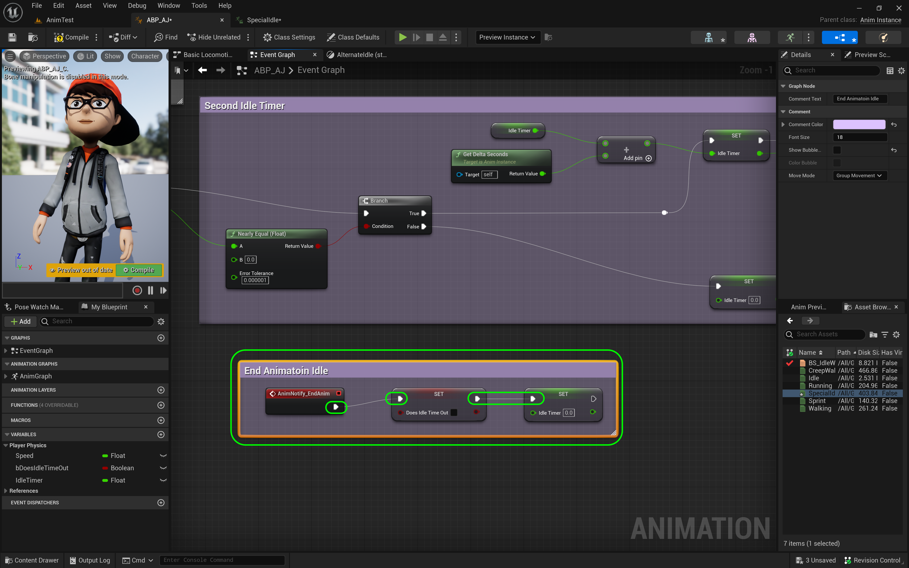
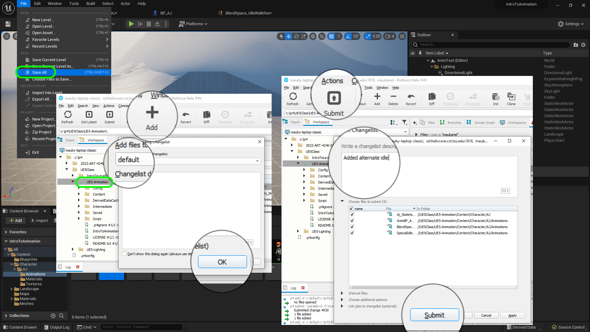
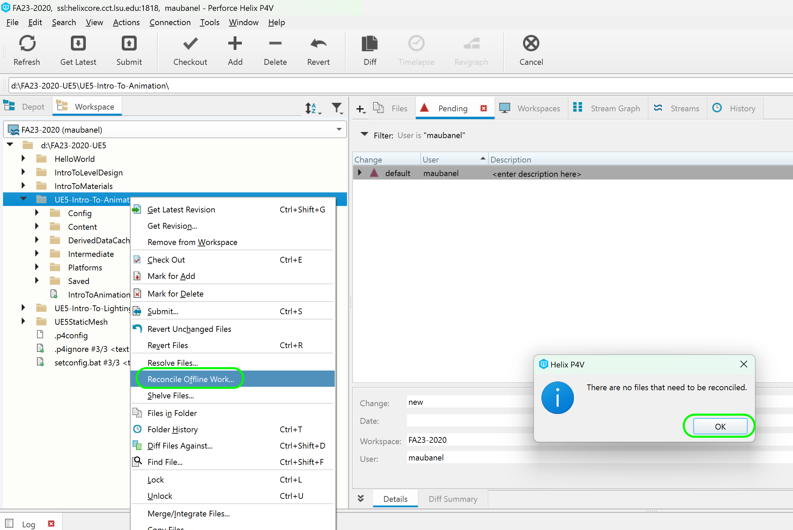

### Time Out for Second Idle II

[previous](../second-idle/README.md#user-content-time-out-for-second-idle) • [home](../README.md#user-content-ue4-animations) • [next](../falling/README.md#user-content-falling-animation)

Second idle continued...

 

---

##### `Step 1.`\|`ITA`|:small_blue_diamond:

We need to do this at the end of the alternate animation. We can this using **Notifies**. Open **SpecialIdle** animation. Right click on the **Notifies** timeline near the end (on the 1 row) and select **Add Notify | New Notify**.

##### `Step 2.`\|`FHIU`|:small_blue_diamond: :small_blue_diamond: 

A box will pop up asking you to enter the **Notify** Name. *Enter* `EndAnim` and press the <kbd>Enter</kbd> key. Adjust the position after the core movement ends but with room to blend it back to the core idle. I set it at the 50th frame.

##### `Step 3.`\|`ITA`|:small_blue_diamond: :small_blue_diamond: :small_blue_diamond:

Go back to the **ABP_AJ | Event Graph** and lets add some logic for when this notify event triggers. *Right clic*k on the open graph and select a **Event AnimNotify_EndAnim** node. It should be red with an execution pin.

##### `Step 4.`\|`ITA`|:small_blue_diamond: :small_blue_diamond: :small_blue_diamond: :small_blue_diamond:

*Add* a **Set Idle Time Out** node and set it to `false`. *Add* a **Set Idle Timer** and set it to `0.0`.

##### `Step 5.`\|`ITA`| :small_orange_diamond:

Connect the execution pins from **EndAnim** to **DoesIdleTimeOut** and then connect to **Idle Timer**. Now add a **comment** around these nodes that says `Ends Alternate Timer`. *Press* the <kbe>Compile</kbd> button.

##### `Step 6.`\|`ITA`| :small_orange_diamond: :small_blue_diamond:

We have done enough to test our work. Play the game and move the character then let go of the controls. Let the character idle and see if the idle animation plays. Then make sure it goes back to the normal idle. After playing around there is a clear issue with trying to move while in the alternate idle. It is not switching back to our normal blend IdleWalkRun animation when branching from this state.

https://github.com/maubanel/UE5-Animations/assets/5504953/09175c7a-e7af-4cc6-a8f0-5c25152712f3

##### `Step 7.`\|`ITA`| :small_orange_diamond: :small_blue_diamond: :small_blue_diamond:

Now go back to the **ABP_AJ** to its **Event Graph** tab. Look to see the **Branch** node where we check to see if the **Speed** is close to `0.0.` We do not set the **Does Idle Time Out** node back to false. So if the player is moving we need to pop out of idle mode by setting **Does Idle Time out** to `false`. **Add** a **Set Does Idle Time Out** node to the right of the **Set Idle Timer** node. *Connect* the execution pin from **Set Idle Timer** to **Set Does Idle Time Out** node.

##### `Step 8.`\|`ITA`| :small_orange_diamond: :small_blue_diamond: :small_blue_diamond: :small_blue_diamond:

*Play* the game and transition from the alternate idle. It now snaps back to the regular IdleWalkRun blend sequence. This works great. I don't like the snap back to the idle though and it is rough and jerky. It can be a bitt jerky. We need to add a bit of a blend here.

https://github.com/maubanel/UE5-Animations/assets/5504953/550b8d84-c882-446d-aef0-17aaf275dd65

##### `Step 9.`\|`ITA`| :small_orange_diamond: :small_blue_diamond: :small_blue_diamond: :small_blue_diamond: :small_blue_diamond:

Open the **IdleWalkRun_BlendSpace** file and go to the **Asset Details** panel to the **Sample Smoothing | Weight Speed** setting and *adjust* it to `6.0` (you can play with values between 5 and 10 to see what you like). Now it should be a much smoother transition.  

##### `Step 10.`\|`ITA`| :large_blue_diamond:

*Press* the <kbd>Play</kbd> button and notice that the blend is much smoother when going out of idle.

##### `Step 11.`\|`ITA`| :large_blue_diamond: :small_blue_diamond: 

Select the **File | Save All** then press the <kbd>Revision Control</kbd> button and select **Submit Content**.  If you are prompted, select **Check Out** for all items that are not checked out of source control. Update the **Changelist Description** message and with the latest changes. Make sure all the files are correct and press the <kbd>Submit</kbd> button. A confirmation will pop up on the bottom right with a message about a changelist was submitted with a commit number. Quit Unreal and make sure your **Pending** tab in **P4V** is empty. **Submit** any work that is still in the editor.

##### `Step 12.`\|`ITA`| :large_blue_diamond: :small_blue_diamond: :small_blue_diamond: 

Sometimes not all files get submitted to Unreal especially for files that don't show up in the editor.  It is good practice one you submit in **Unreal** and quit the game to right click on the top most project folder and select **Reconcile Offline Work...**.

This will either give a message saying ther is nothing to reconcile or bring up a tab.  Make sure that these are **NOT** files in the **Intermediate** and **Saved** folders as these should be ignored from the `.p4ignore`.

If the files are in **Content** or **Configuration** then press the <kbd>Reconcile</kbd> button.  Then submit the changes with a message and press the <kbd>Submit</kbd> button.

<!--  -->

| [previous](../second-idle/README.md#user-content-time-out-for-second-idle)| [home](../README.md#user-content-ue4-animations) | [next](../falling/README.md#user-content-falling-animation)|
|---|---|---|
