### Time Out for Second Idle

[previous](../anim-bp/README.md#user-content-our-first-animation-blueprint) • [home](../README.md#user-content-ue4-animations) • [next](../second-idle-ii/README.md#user-content-time-out-for-second-idle-ii)

Now we are going to add a state change when the idle animation times out. How will we do this? We will keep track of when the Velocity Length is 0 and add a timer. After 5 seconds we will switch to the alternate idle animation. Lets begin.

 

---

##### `Step 1.`\|`ITA`|:small_blue_diamond:

Open the **aj_AnimBlueprint** and go to the **Event Graph**. *Add* a new **Variable** called `bDoesIdleTimeOut` and make it **Variable Type** `Boolean`. *Set* **Private** to `true` and add a **Tooltip** of `Switch to alternate idle when main idle times out`.

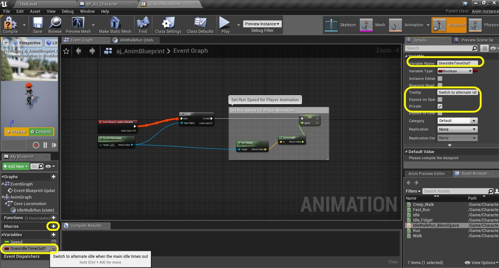

##### `Step 2.`\|`FHIU`|:small_blue_diamond: :small_blue_diamond: 

*Add* a new **Variable** called `IdleTimer` and make it **Variable Type** `Float`. Set **Private** to `true` and add a **Tooltip** of `Calculates time in seconds when velocity length is 0`.

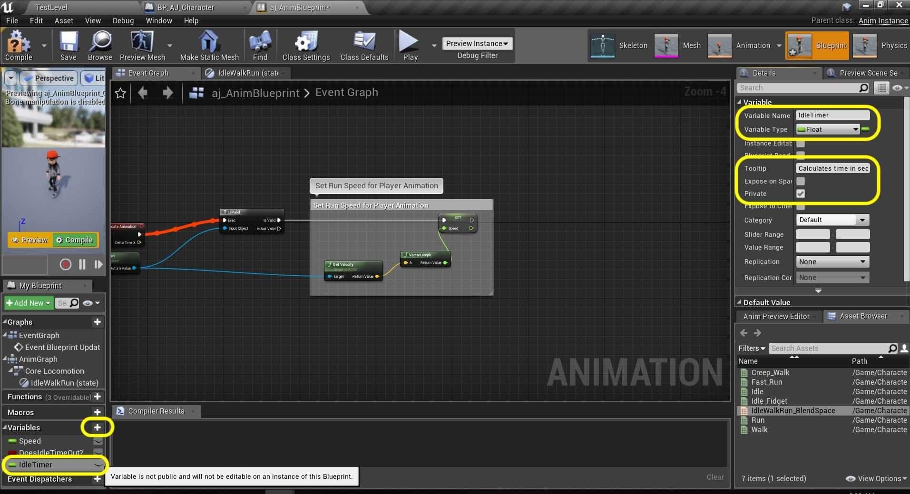

##### `Step 3.`\|`ITA`|:small_blue_diamond: :small_blue_diamond: :small_blue_diamond:

Now we need to check if the Vector Length is 0. Add a **Branch** node to the right of the other nodes.

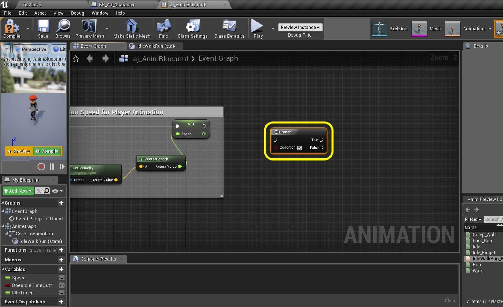

##### `Step 4.`\|`ITA`|:small_blue_diamond: :small_blue_diamond: :small_blue_diamond: :small_blue_diamond:

Now we are going to see if this vector is close enough to zero. *Pull* from the **Return Value** pin on the **Vector Length** node and look for **Nearly Equal (float)** node.

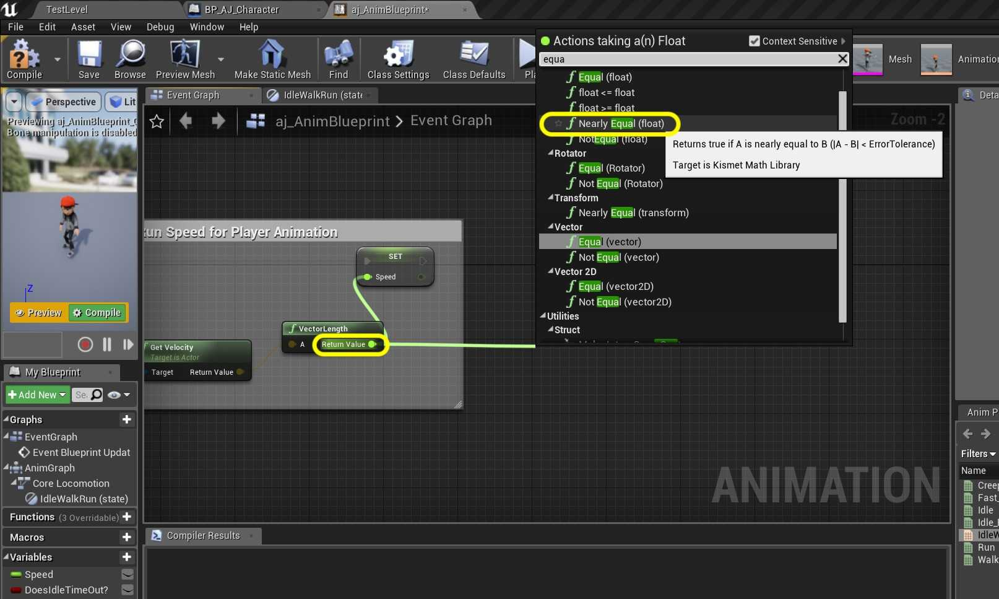

##### `Step 5.`\|`ITA`| :small_orange_diamond:

We will leave the default values alone. We want it to be close to `0.0` and the error tolerance seems fine. *Connect* the execution pin form the **Set Speed** node to the **Branch** node. *Connect* the **Return Value** pin from the **Nearly Equal** node to the **Branch** node. *Connect* **Nearly Equal | Return Value** to the **Branch | Condition** pin.

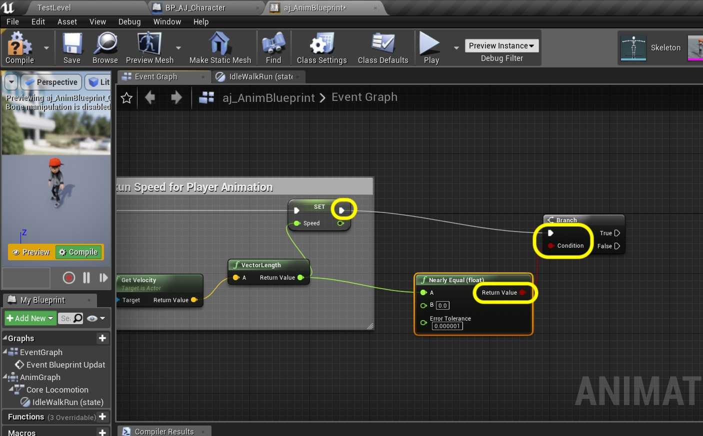

##### `Step 6.`\|`ITA`| :small_orange_diamond: :small_blue_diamond:

*Drag* a **Get Idle Timer** variable to the graph and add a **Get World Delta Seconds** node.

##### `Step 7.`\|`ITA`| :small_orange_diamond: :small_blue_diamond: :small_blue_diamond:

Add two **Set Idle Timer** nodes. *Connect* each to the **True** and **False** execution pins of the **Branch** node.

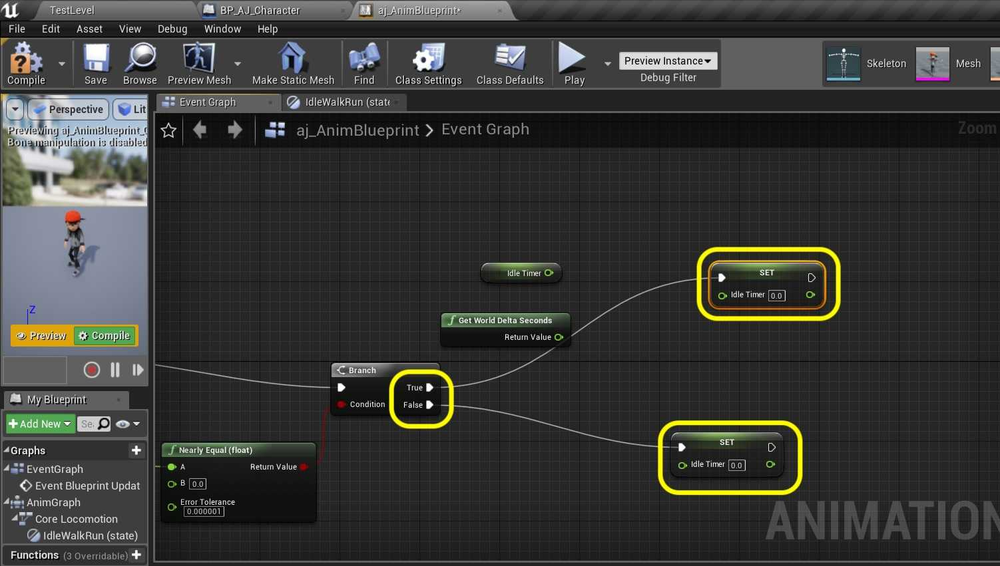

##### `Step 8.`\|`ITA`| :small_orange_diamond: :small_blue_diamond: :small_blue_diamond: :small_blue_diamond:

*Add* a **float + float** node and put it between the **Idle Timer** and **Set Idle Timer** nodes.

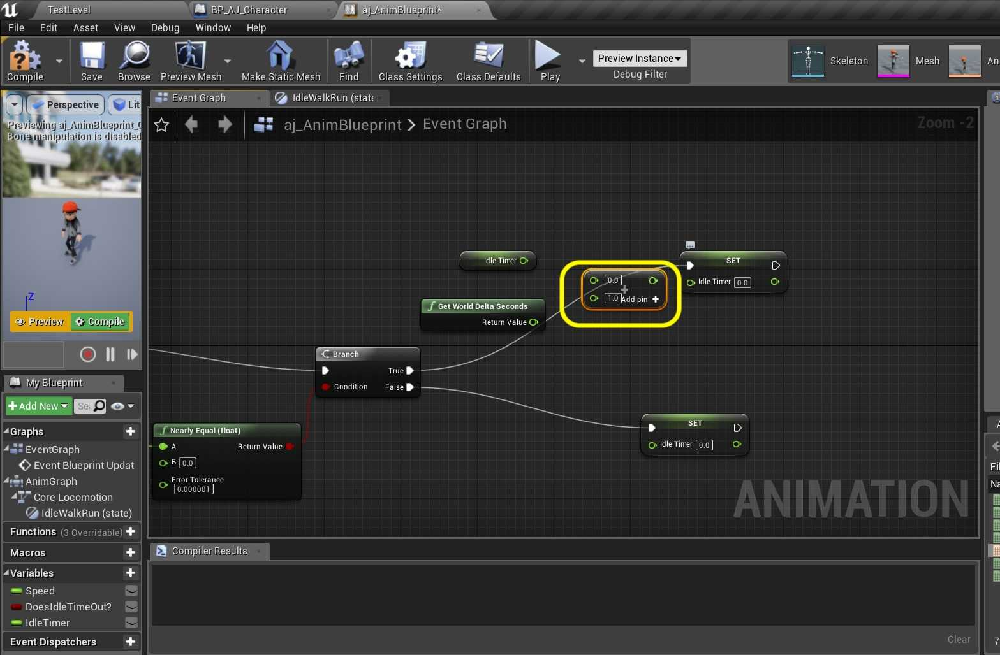

##### `Step 9.`\|`ITA`| :small_orange_diamond: :small_blue_diamond: :small_blue_diamond: :small_blue_diamond: :small_blue_diamond:

*Connect* the outut of **Idle Timer** and **Get World Delta Seconds** nodes to the input pins of the **Addition** node. *Send* the output to the **Set Idle** Timer pin connected to the **Branch | True** execution pin.

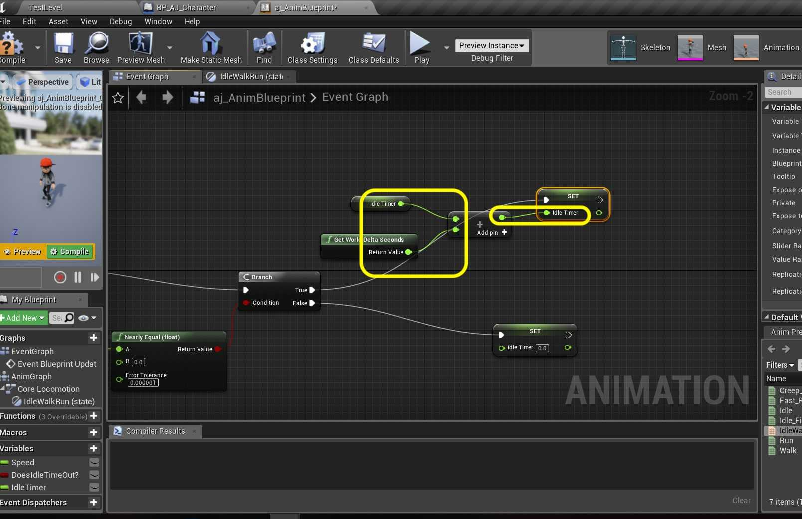

##### `Step 10.`\|`ITA`| :large_blue_diamond:

Now we want to check to see if we have been idling for more than 5 seconds. Add a **Branch** node and a **float >= float** node and set the bottom pin value to `5.0`.

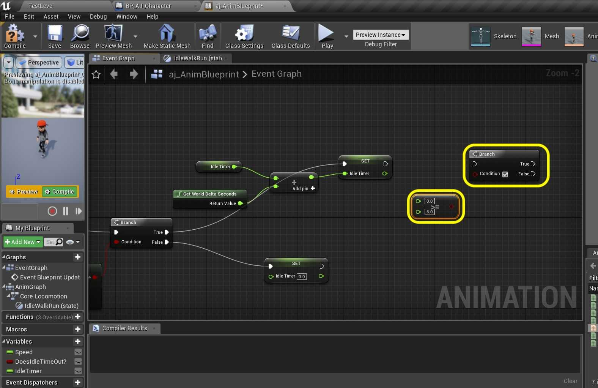

##### `Step 11.`\|`ITA`| :large_blue_diamond: :small_blue_diamond: 

*Connect* the execution pin from **Set Idle Timer** node to the new **Branch** node. *Connect* the output pin of the **Set Idle Timer** to the **>=** node. *Send* the output of the **>=** node to the **Condition** pin of the **Branch** node.

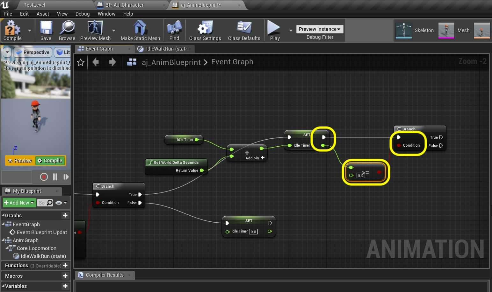

##### `Step 12.`\|`ITA`| :large_blue_diamond: :small_blue_diamond: :small_blue_diamond: 

*Pull off* of the execution pin of the **Branch** node and select a **Set Does Idle Time Out?** node. Set this **boolean** to `true`.

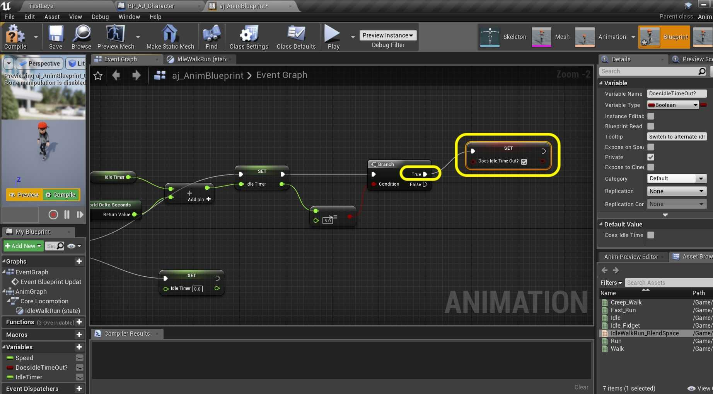

##### `Step 13.`\|`ITA`| :large_blue_diamond: :small_blue_diamond: :small_blue_diamond:  :small_blue_diamond: 

*Pull off* of the **Set Does Idle Timer Time Out?** node and select a **Set Idle Timer** node and set it to `0.0` seconds. *Add* a **comment** around these new nodes and call it `Idle Timer`.

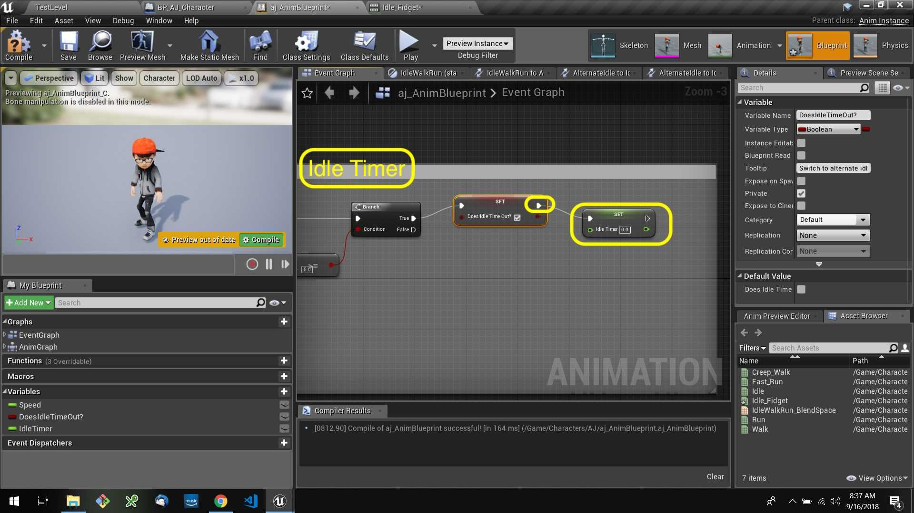

##### `Step 14.`\|`ITA`| :large_blue_diamond: :small_blue_diamond: :small_blue_diamond: :small_blue_diamond:  :small_blue_diamond: 

Go back to the **AJ_AnimBlueprint | Anim Graph** tab and *double click* on the **Core Locomotion** node.

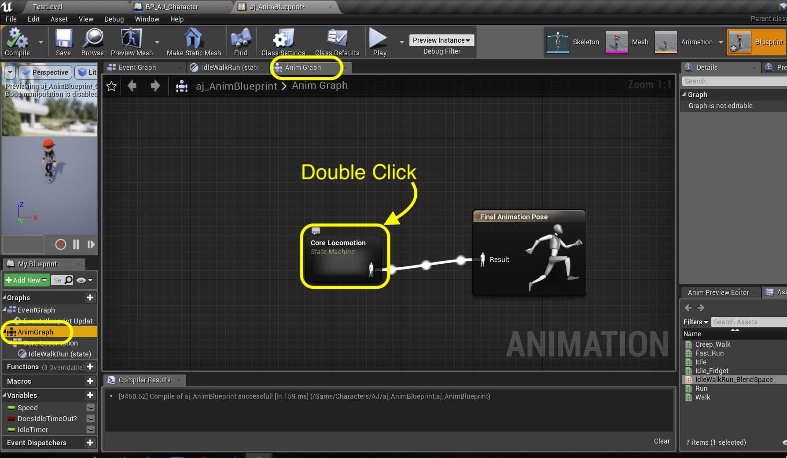

##### `Step 15.`\|`ITA`| :large_blue_diamond: :small_orange_diamond: 

Now you should see our only **IdleWalkRun** state. *Right click* above this on the open graph and select **Add State**.

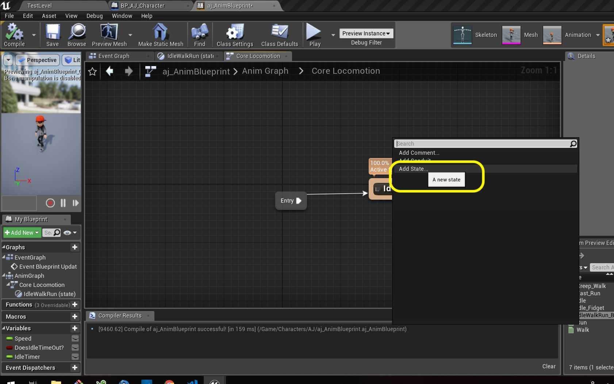

##### `Step 16.`\|`ITA`| :large_blue_diamond: :small_orange_diamond:   :small_blue_diamond: 

*Call* this new state `AlternateIdle`. *Connect* the state from **IdleWalkRun** to **AlternateIdle** states. Look at the two icons next to the arrows. This handles the logic of when we switch to and from these animations.

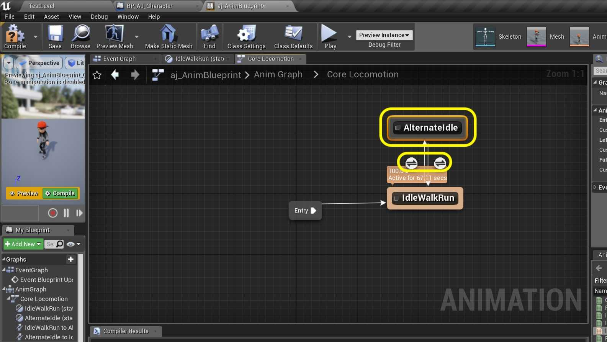

##### `Step 17.`\|`ITA`| :large_blue_diamond: :small_orange_diamond: :small_blue_diamond: :small_blue_diamond:

Double click on the left hand button next to the arrow going from **IdleWalkRun** to **AlternateIdle** to adjust the logic for this transition.

##### `Step 18.`\|`ITA`| :large_blue_diamond: :small_orange_diamond: :small_blue_diamond: :small_blue_diamond: :small_blue_diamond:

The logic is simple. It will transition when the idle time out boolean switches to true. So add a **Get Does Idle Time Out?** node and attach it to the **Result** node so it can enter the transition.

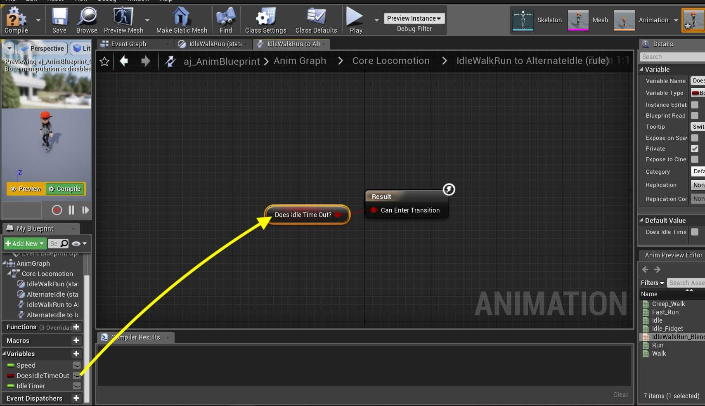

##### `Step 19.`\|`ITA`| :large_blue_diamond: :small_orange_diamond: :small_blue_diamond: :small_blue_diamond: :small_blue_diamond: :small_blue_diamond:

Go back to the **Core Locomotion** state screen. Now *double click* on the right hand transition from **Alternate Idle** back to **IdleWalkRun**.

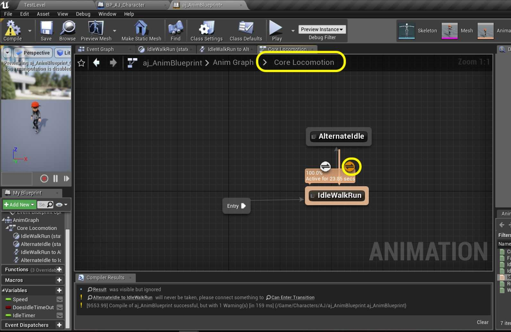

##### `Step 20.`\|`ITA`| :large_blue_diamond: :large_blue_diamond:

Drag a **Get Does Idle Time Out?** variable onto the graph.

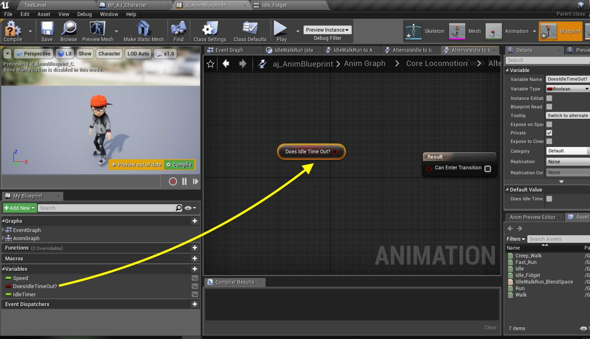

##### `Step 21.`\|`ITA`| :large_blue_diamond: :large_blue_diamond: :small_blue_diamond:

Now we are looking for the opposite so we want the **Does Idle Time Out?** to be false. So we pull off the pin and select a **NOT** node which looks to see if it is the opposite of **True** (false).

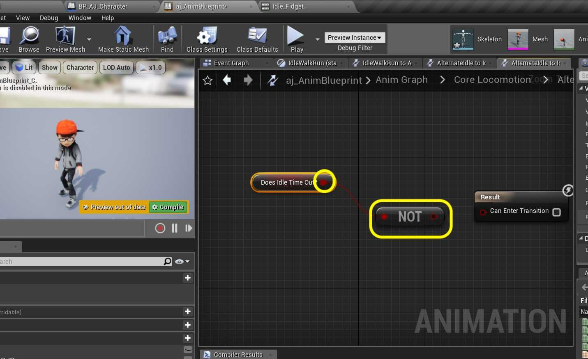

___

| [previous](../anim-bp/README.md#user-content-our-first-animation-blueprint)| [home](../README.md#user-content-ue4-animations) | [next](../second-idle-ii/README.md#user-content-time-out-for-second-idle-ii)|
|---|---|---|
