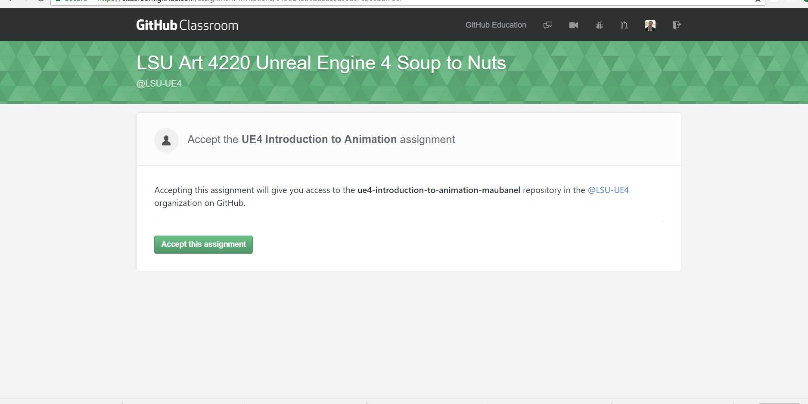
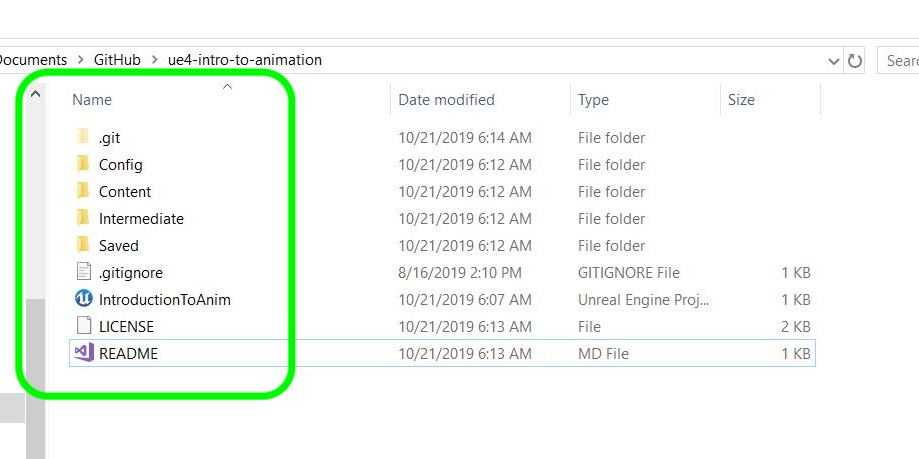

### Setting Up

[home](../README.md#user-content-ue4-animations) • [next](../character-anim/README.md#user-content-download-character--animations)

Lets get set up with the sample project provided and get it ready to start importing animations ASAP.

 

---

| `required.software`\|`UE4 Materials`| 
| :--- |
| :floppy_disk: &nbsp; &nbsp; You will need to install the latest version of _UE4 4.26.x_ by downloading the [Epic Games Launcher](https://www.epicgames.com/store/en-US/download). You will also need a [GitHub](https://github.com/) account which is free to sign up for as we will be using version control. You will also need a mac or PC that is powerful enough to run unreal. If you are on a PC you will have to download and install [git](https://git-scm.com/downloads) (on a mac it may prompt you to install git as well but you can do it through the terminal). We will also install [Github Desktop](https://desktop.github.com) as it provides a GUI interface so you don't have to worry about command line. Once git is installed you will also need to download and install the [Git LFS (Large File System)](https://git-lfs.github.com) as well for both PC and mac.  You will also need access to Maya 2020..\n\nLets make sure you can see hidden folders. On the PC follow these [Windows 10 Turn on Hidden Folders](https://support.microsoft.com/en-us/help/4028316/windows-view-hidden-files-and-folders-in-windows-10) directions. On the Mac it is a bit more involved so go and [turn on hidden folders on Mac](https://ianlunn.co.uk/articles/quickly-showhide-hidden-files-mac-os-x-mavericks). For this walk through you will also need [Substance 3D Sampler](https://store.substance3d.com/students-teachers) which is free for students and has a free 30 day trial for non-students.|

##### `Step 1.`\|`ITA`|:small_blue_diamond:

Make sure you have a GitHub account and that you are logged into it. Click on the GitHub Classroom [UE4-Animations-FA21 Link](https://classroom.github.com/a/mfvlXjdW). Accept the prompt if it asks you go join the class and you should get to a **Accept the Assignment – Materials-FA-21**. Press the <kbd>Accept this assignment</kbd> button. Navigate to **GitHub** and select the <kbd>Code</kbd> button and select `Open with GitHub Desktop`. Clone the project in your folder of choice.

##### `Step 2.`\|`FHIU`|:small_blue_diamond: :small_blue_diamond: 
Navigate to the directory where you installed it. You will have a **Source Files** folder with all the files you need. There is a hidden .git folder that contains the database for all your files. There is a **LICENSE** file that declares the copyright and licensing terms. You can look at this if you like. The **README.md** file has temporary text that you need to keep updated. You also have a **.gitignore** file that keeps binaries and files that are not required out of the git repository. You should fill it in with relevant content as you progress through this walk through. You will only see the .git folder if you have hidden folders turned on.

___

| [home](../README.md#user-content-ue4-animations) | [next](../character-anim/README.md#user-content-download-character--animations)|
|---|---|
